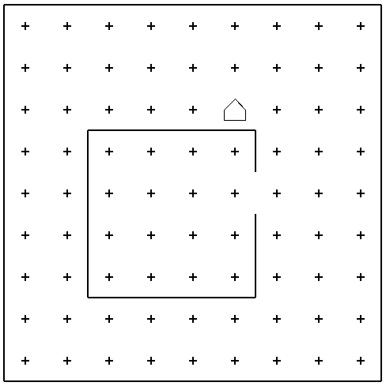
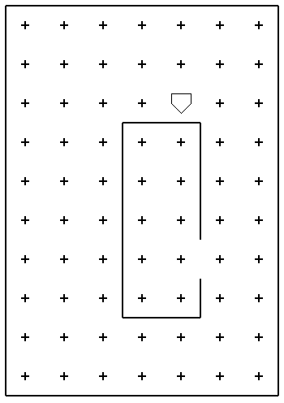
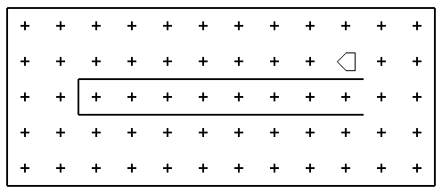

Both questions on this first problem set have template files in the repository. You'll need to grab the assignment from the link below, download, and unzip the contents before proceeding. I would highly suggest opening the _entire folder_ in VSCode, as it will make it very easy to edit different files and helps VSCode find local libraries or files. When you are finished, upload your completed templates back to GitHub. Don't worry about changing any filenames, you want to override the original template files.

```{=html}
<a href='https://classroom.github.com/a/XwM4i-de' target="_blank" class="btn btn-info" style='margin:auto; display: block; width:50%;'>Accept Assignment</a>
```
<br>

# Problem 1
Your first computational task is to solve a simple story-problem in Karel's world. Suppose that Karel has settled into its house, which is the square area in the center of the below image.

```{r, engine='tikz'}
#| echo: false
#| fig-ext: png
#| out-width: 80%
#| fig-cap: "Karel's starting position and house. The goal is to have Karel pick up the 'newspaper' and return to its original position and orientation shown here."
#| label: fig-p1
\begin{tikzpicture}
    \foreach \x in {1,2,...,7} {
        \foreach \y in {1,2,...,5} {
            \node at (\x,\y) {+};
        }
    }
    \foreach \x in {1,2,...,7} \node[font=\small] at (\x,0) {\x};
    \foreach \y in {1,2,...,5} \node[font=\small] at (0,\y) {\y};
    \draw[very thick] (0.5,0.5) rectangle +(7,5);
    \draw[very thick] (5.5,3.5)--++(0,1)--++(-3,0)--++(0,-3)--++(3,0)--++(0,1);
    \draw[fill=gray] (6,3)+(0:.3)--+(90:.3)--+(180:.3)--+(270:.3) -- cycle;
    \draw[fill=white] (3,4)+(-.3,.3)--+(0,.3)--+(.3,0)--+(0,-.3)--+(-.3,-.3) -- cycle;
\end{tikzpicture}
```

Karel starts off in the northwest corner of its house, facing east, as shown in @fig-p1. The problem is to program Karel to collect the newspaper--represented by the beeper--from outside the doorway and then to return to its initial position _and orientation_.

This problem is no more complicated than examples from class, and exists just to get you started and warmed up. You can assume that every part of the world looks just like it does in the above image (@fig-p1). The house is exactly this size, the door is always positioned in the center of the east wall as shown, and the beeper is just outside the "door". Thus, all you have to do is write the sequence of commands necessary to have Karel

1. move to the newspaper,
2. pick up the newspaper,
3. and then return to its original starting point and orientation.

Even though the program only requires a few lines of code, it is still worth getting at least a little practice in decomposition. In your solution, include a helper function for each of the steps listed above, and then use them together to accomplish your goal. You can write all the code in the provided template entitled `Karel_Newspaper.py`.

# Problem 2
In keeping with our story-problems involving Karel and its house, let us now suppose that Karel is wanting to "paint" the outside of its house on the north, west, and south sides. Karel will "paint" by placing beepers along those walls. Karel will always start on the east edge of the north wall, as depicted to the left of @fig-p2.

```{r, engine='tikz'}
#| echo: false
#| fig-ext: png
#| out-width: 90%
#| fig-cap: "On the left is one possible version of Karel's starting position and house. On the right is the completed scenario. Note that only the north, west, and south sides of the house are painted, not the east side. And note that Karel has entered the house."
#| label: fig-p2
\usetikzlibrary{shapes}
			\begin{tikzpicture}[scale=0.8]
				\def\w{7}
				\def\h{7}
				\foreach \x in {1,2,...,\w} {
					\foreach \y in {1,2,...,\h} {
						\node at (\x,\y) {+};
					}
				}
				\foreach \x in {1,2,...,\w} \node[font=\small] at (\x,0) {\x};
				\foreach \y in {1,2,...,\h} \node[font=\small] at (0,\y) {\y};
				\draw[very thick] (0.5,0.5) rectangle +(\w,\h);
				\draw[very thick] (5.5,4.5)--++(0,1)--++(-3,0)--++(0,-3)--++(3,0)--++(0,1);
				\draw[fill=white] (5,6)+(-.3,.3)--+(0,.3)--+(.3,0)--+(0,-.3)--+(-.3,-.3) -- cycle;

				\draw[-latex] (8,4)--+(1,0);

				\begin{scope}[xshift=10cm]
				\foreach \x in {1,2,...,\w} {
					\foreach \y in {1,2,...,\h} {
						\node at (\x,\y) {+};
					}
				}
				\foreach \x in {1,2,...,\w} \node[font=\small] at (\x,0) {\x};
				\foreach \y in {1,2,...,\h} \node[font=\small] at (0,\y) {\y};
				\draw[very thick] (0.5,0.5) rectangle +(\w,\h);
				\draw[very thick] (5.5,4.5)--++(0,1)--++(-3,0)--++(0,-3)--++(3,0)--++(0,1);

				\draw[fill=white, rotate around={180:(5,4)}] (5,4)+(-.3,.3)--+(0,.3)--+(.3,0)--+(0,-.3)--+(-.3,-.3) -- cycle;
				\foreach \x in {3,4,5} \node[diamond,draw, fill=gray] at (\x,6) {};
				\foreach \y in {3,4,5} \node[diamond,draw, fill=gray] at (2,\y) {};
				\foreach \x in {3,4,5} \node[diamond,draw, fill=gray] at (\x,2) {};
				\end{scope}
			\end{tikzpicture}
```

Your goal in this problem is to write a program that paints _only_ the north, west, and south walls, (not the corners) and then moves Karel into the house. The final state would look like the right side of @fig-p2.

This would feel very similar to the first problem, _except_ that we want this program to be robust **no matter what the dimensions** of Karel's house are. In addition, while Karel will always start on the east edge of the north wall, **the direction Karel will initially be facing will not be consistent**, and so you will have to figure out your facing direction probably as a first step. You are safe to assume that:

- Karel has an infinite supply of beepers initially, and so could paint a house of any size without issue.
- The house will always have at least a 2 avenue/street gap between the sides of the house and the boundaries of the map.
- There will always be a door **somewhere** on the east side of the house. But its exact location can vary.

To help you test that your program will correctly complete the task for any general house, there are multiple worlds included in the starting repository that you can load and test your program against. `Karel_Painting.w` is the default, and matches the world sketched in @fig-p2. There are then three different worlds, which have differently sized houses, different directions Karel is initially facing, and different front door locations: `Painting1.w`, `Painting2.w`, and `Painting3.w`. You can see images of the starting situations for these extra worlds below. Note how the house dimensions change, how the location of the door changes, and how Karel's starting orientation changes.

::: {layout-ncol=3 layout-valign="center"}
{group='paint_worlds'}

{group='paint_worlds'}

{group='paint_worlds'}
:::


You can test your program against these worlds by running your program, and then clicking the far left button to open and load in the new world. Then you can press play to test your program against that world. Your same program should successfully work in _all_ of the worlds, without any changes. Proper use of loops and predicate functions will be the key here! A basic template to get you started is in `Karel_Painting.py`.


:::callout-tip
# Hints

- Really think of how you want to decompose this problem. I would argue that you are essentially trying to accomplish the same task 3 different times, so that might guide or inspire how you want to break things down.
- Speaking of that, try to write reusable functions, and then use them multiple times! It saves you work!
- Just because loops will be useful, you don't need to have _all_ your code inside the loop! Frequently you might need a line or two of code outside a loop to "reposition" Karel a bit.
- You have lots of potential predicate functions to choose from to determine where the wall is that you are trying to paint or move along. Many of them can work, but some streamline the code more than others.
:::

# 
:::callout-warning
# Overall Checklist

Before you submit the assignment, make sure that:

- [ ] You have practiced decomposition in both problems: breaking the overall problem up into smaller problems and using helper functions to group up the commands to solve that smaller problem.
- [ ] You have used comments to document your code. At the very least, you should have a docstring explaining what each helper function is responsible for doing.
- [ ] You have filled out the meta-data at the top of each template file. In particular, please make sure you indicate if you worked with anyone (and who if so).

To actually submit the problems, you just need to upload the final versions back to your GitHub repository. Please don't upload the whole folder again, just the files you changed.
:::

