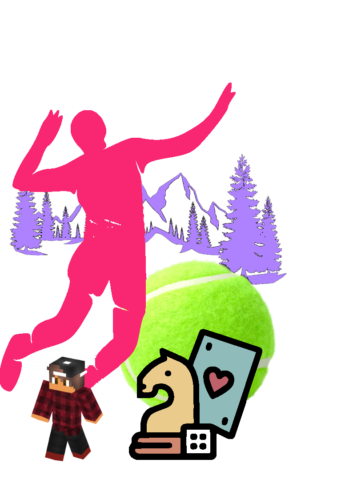
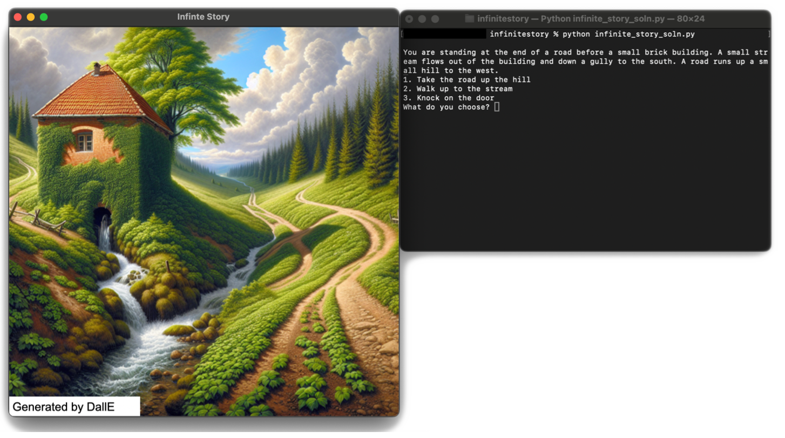
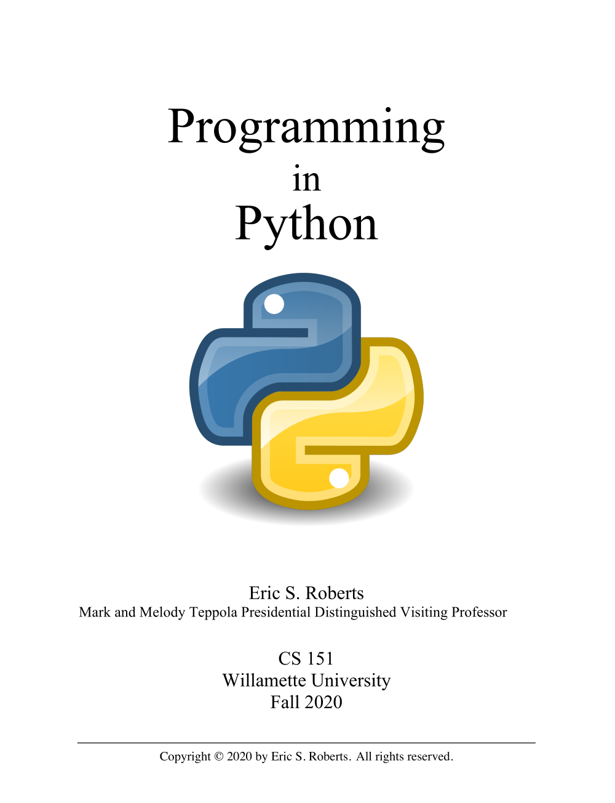

## Announcements
- Welcome to CS-151: Intro to Programming with Python!
- Things to do:
	- Access the course webpage at [here!](https://jrembold.github.io/Website_Backup/classes/cs151/cs151/) (Also linked from Canvas)
	- Read over the full syllabus
	- Join the class Discord server (details in Canvas announcement soon)
	- Fill out the section availability form [here](https://forms.gle/CiDpfEH1a2H5oHxL7)
	- Bring phone or computer for polling/check-in questions in the future
	- Come to one of the laptop setup sessions Tuesday or Thursday at 3pm in Ford 202 or follow online guides and videos
- To-Do:
	- Get yourself set up with the software
	- Visit me in my office for 10 minutes sometime between now and the end of next Tuesday

# Introduction

## My Vitals
::::cols
:::col
Name
: Jed Rembold

Office
: Ford 214

Office Hours
: M, W 4:30-5:30pm
: T, Th 2:00-4:00pm
: Online or anytime I'm around

Email:
: jjrembold at willamette.edu

Office Phone:
: 503-370-6860

:::
:::col
{width=70%}
:::
::::

## Motivations
:::incremental
- The field of computing today is scarcely recognizable compared to the field 50 years ago.
	- Many feel the pace of the field is only accelerating as we move forwards.
	- Studying computing now lets you take part in driving forward not only the field of computing, but of all the modern fields with utilize computing.
		- Which is basically everything!
- Programming is highly creative!
	- Once you have the basics down, the only barriers to what you can create involve your own patience and time
	- Few creative endeavors require less outside resources, or allow you to reuse old content so easily
:::

:::notes
Discuss my own motivations as well!
:::

## What Could You Make?
- Take a moment to pause and think
- Envision yourself at the end of this semester, a capable, if perhaps slow, programmer
- What is one tool or program that you might create that would be useful to you in your every day life?
- Take a few minutes to think, and then introduce yourself to your neighbor and share with them your ideas

## A Growth Mindset
- People enter this course with a variety of initial experiences
	- This course is built for an individual entering with **zero** coding experience!
		- I'm endeavoring to break concepts down into as digestible chunks as possible
	- Coming in with more experience? You are welcome as well!
		- Help others! Nothing solidifies understanding like explaining to someone else.
		- Take advantage of the various extension opportunities and contests
		- Class/section time is not for impressing me or your section leader. Contribute to the learning environment.
- **Everyone** can learn to program. It is all about growing in your understanding.

## Managing the Frustration
- Growing and learning any new skill involves frustration
- You can see where you want to be, but you aren't there yet, and it is **tough**
- You will absolutely become frustrated in this course
	- Code is unforgiving
- Take another moment to think through how you can best manage this frustration, and then introduce and share your ideas with a _different_ neighbor!

## Succeeding in this course
- Don't go it alone!
	- Working with peers is invaluable. Create homework groups. Attend your small section meetings. Visit the QUAD center.
- Budget your time carefully
	- The only way to grow at coding is to **do** coding
	- Programming can often times involve a lot of frustrating troubleshooting or unsuccessful attempts
	- Expect, on average, the full use of WU's 2-3 hours outside class for every hour in class
- If you are stuck for more than 30 minutes, _ask myself or your section leader for help_
	- While it is important to give yourself time to troubleshoot, past a certain point continuing to bang your head against a problem just leads to frustration


## Squad Goals
::: {.block name="Primary Objective"}
To gain the skills, knowledge, and confidence necessary to write, test, and debug Python programs requiring several hundred lines of code.
:::

Doing so will require that you be able to:

- implement simple algorithms using Python control structures,
- apply decomposition and step-wise refinement techniques,
- design data structures to model information,
- execute all phases of the programming process, including design, implementation, testing and debugging,


<!--
## Grading
::::cols
:::col
- Standard 90/80/70 etc. grade cut-offs
	- Top 2% get +'s, bottom 2% get -'s
:::

:::col
------------- ----------
Participation         5%
Problem Sets         20%
Projects             30%
Midterms             20%
Final Exam           25%
------------- ----------

:::
::::
-->

# Class Components 

## Perusall
- 1-2 short content videos posted 2 days before each class
	- Around 10 min each
- The expectation is that you have watched those videos and thought some about that content _before_ arriving to class
	- We are going to be spending class time interacting with and demonstrating the content, not introducing the content
- A Perusall assignment is due before class starts each day, to ensure you have watched and interacted with these content videos
- Get full points by watching them and asking questions or responding to questions or prompts myself or others have left

## Attendance
- Each day when you come in to class, you will fill out a quick poll, which will then place you into a group for the day
- Filling out the poll and participating in your group gets you full points for the day
- Some days will also have a bonus question, which, if your group answers correctly, gets you some extra credit
- Will start officially on Wednesday

---

## Practice
- Falls into two categories:
	- _Problem Sets:_ smaller, more focused assignments
		- Graded on standard, numeric scales
	- _Projects:_ larger, more integrative assignments
		- Graded on a more qualitative scale (next slide)
- All will be due on Mondays at 11:59pm
- Submissions of _both_ will be handled through GitHub Classroom
	- Learning how to do this in class
- 3 cumulative late days over the entire semester without penalty then penalties enacted for each subsequent day late
- Extensions for any reason need to be requested and approved by myself

---

## Project Sneak Peeks!
::: {.r-stack}
{.fragment .current-visible height="800px" loop=True autoplay=True}\

{.fragment .current-visible height="800px" loop=True autoplay=True}\

{.fragment .current-visible height=800 loop=True autoplay=True}\

{.fragment .current-visible height=800 loop=True autoplay=True}\

{.fragment .current-visible height=900 loop=True autoplay=True}\
:::


## Project Scoring

------ -----------------
     A submission so good it leaves me astounded
      Exceeds requirements
     Satisfies all assignment requirements
      Meets most requirements, but some issues
     Some more serious problems evident
      Even worse...
     Barely worth turning in, but I guess it is something
------ -----------------


## Sections
:::incremental
- Everyone will be placed into small sections of 8-10 students, with one section leader
- All section leaders are students who took and excelled in this course
- Will meet as a group with your section leader once a week for an hour to go over and work on problems
	- These meetings will be on Wednesdays or Thursdays
	- Poll out **today** where you can enter in your availability on these days so that we can get people placed into sections
- Section leaders will also serve as a secondary source you can ask for help or guidance from throughout the week
	- This tutoring is part of their job! Don't hesitate to ask them for some extra assistance!
- Planning to start section meetings _next_ week
:::

## Tests
:::{style='font-size:.9em'}
- Tests are necessary to assure retention of material and ensure that some are not getting too much help on the assignments.
- Three this semester:
	- Midterm 1 on February 20
	- Midterm 2 on Apr 3
	- Final on May 8
- Tests will be taken in class and will not allow the use of a computer **to actually run code**
	- This policy has actually been seen to _improve_ student scores, as it prevents you from wasting tons of time obsessing about a small mistake!
	- The computer can otherwise be used to access class resources and submit responses
- Tests _will_ be open note, open book, and open slides, but not open internet
- Several example tests and study materials will be given out a week in advance before each exam.
:::

## Communication
- I have had strong success recently channeling class communication (announcements, questions, answers, etc.) through a class Discord server
	- Invite instructions will be announced on Canvas
	- Totally free to sign up and use
	- If you already use Discord, you _can_ create another account to switch between, or you can use your existing account
- Will be the main online location for announcements and questions and answers.
- Has support for code-blocks when talking about code by surrounding code in triple backticks: 
	- ````text 
	  ```python
	  this is formatted nicely as code
	  ``` 
	  ````


## Working Together and Academic Honesty
- You are always welcome and encouraged to work alongside others enroute to finding a solution to a problem. **But**, your submitted work needs to be your own.
- The most effective way to accomplish this is to:
	1. Not look at solutions or program code that is not your own.
	2. Not share your solution code with other students.
	3. Indicate on your submitted assignment any assistance you received or who you worked alongside.


## Generative AI
::::::cols
::::{.col style='font-size:.85em'}
- You are free in this class to use things like ChatGPT or GitHub Copilot to assist you in writing, understanding, or troubleshooting code
- **However:**
	- LLMs make mistakes, and you need to understand the code to be able to catch them.
	- You will not be able to use these tools on the tests, so ensure that you can do without.
- Assignments will have a field at the top where you can provide a link to the chat transcript if you used one. If you used an AI that doesn't provide a transcript, state as much.
::::

::::col
{width=60%}

::::
::::::

# What is Programming?

## Diving In
:::cols
::::col
- This course is an introduction on _computer science_, and covers more than just programming!
- Python is used to teach the programming portion of the course, but the focus is less on Python itself and more on general computer science principles.
- If you come across situations where you need to know a bit more about specific Python details, there are plenty of resources online, or just ask me!
::::

::::col
<!--<p class="stretch"></p>-->
{width=70%}
::::
:::

## Effective Communication
::: incremental
- To communicate effectively with someone or something, you really need two layers of communication:
	- A shared language or method of conveying information 
		- The English alphabet, for example
		- In our case, Python
	- A joint agreement about what constitutes **meaning**
		- Need ways to limit confusion or misunderstanding
			- Following syntax
			- Following conventions
		- Being able to explain things clearly and unambiguously
:::


<!-- for videos
## Giving Clear Instructions
- We will initially make the language _extremely_ simple so that we can focus on the second layer
- Karel the Robot exists in a very simple 2D world
- Has a very limited set of actions:
	- Can move forward one space
	- Can rotate counter-clockwise (turn left) 90 degrees
	- Can pick up a beeper
	- Can drop off a beeper
- We will be spending the first 1.5 weeks just interested in how we can take these simple instructions and get Karel to solve a wide variety of problems
	- This content is not in your text, but more in-depth descriptions can be found [here](https://willamette.edu/~esroberts/pykarel/reader/01-IntroducingKarel.html)

## The World
::::::cols
::::col
- Karel's world is defined on a grid
	- _avenues_ run north-south
	- _streets_ run east-west
	- The _intersection_ between a street and avenue is called a corner
- Compass directions are as you'd have them on a map, with North pointing upwards
- Walls are impassable
- Beepers are diamonds
- Karel is a house-shaped polygon
::::

::::col
\begin{tikzpicture}%%width=100%
\karelgrid[Green]{3}{3}
\draw[Green, very thick] (3.5,2.5) --+(-1,0);
\karelbeeper[Blue]{3}{1}
\karelmark[Yellow]{2}{3}{90}
\end{tikzpicture}

::::
::::::

## Commands
- As we mentioned before, Karel is a simple robot, and can really only do 4 potential actions

	 Command | Action
	:----|:--------
	`move()` | Moves Karel forward one intersection in whatever direction they are facing
	`turn_left()` | Rotates Karel 90 deg counter-clockwise
	`pick_beeper()` | Picks up a beeper on the ground
	`put_beeper()` | Places a beeper on the ground

- Our programs are just ordered sequences of these actions/commands

## Example
::::::cols
::::col
:::incremental
- Suppose we had the situation to the right and wanted to navigate to the beeper, pick it up, and then drop it at the corner of 1st avenue and 1st street.
- Take a moment to write out your instructions.
	- Remember you can only move, rotate left, and pick up or drop the beeper
- Note that there are multiple ways to do this! Which is better?
:::
::::

::::col
\begin{tikzpicture}%%width=100%
\karelgrid[Green]{3}{3}

\draw[Green, very thick] (3.5,2.5) --+(-1,0) (0.5,1.5) --+ (2,0);
\karelbeeper[Blue]{3}{1}
\karelmark[Yellow]{1}{3}{0}

\end{tikzpicture}

::::
::::::

## One Solution
```{.mypython style='max-height:800px'}
def main():
	move()
	turn_left()
	turn_left()
	turn_left()
	move()
	turn_left()
	move()
	turn_left()
	turn_left()
	turn_left()
	move()
	pick_beeper()
	turn_left()
	turn_left()
	turn_left()
	move()
	move()
	put_beeper()
```
-->

<!--
## GitHub Classroom Demonstration
- There will be instructions on my webpage as well, but I wanted to take a little time to demonstrate how you would usually use GitHub Classroom
-->
