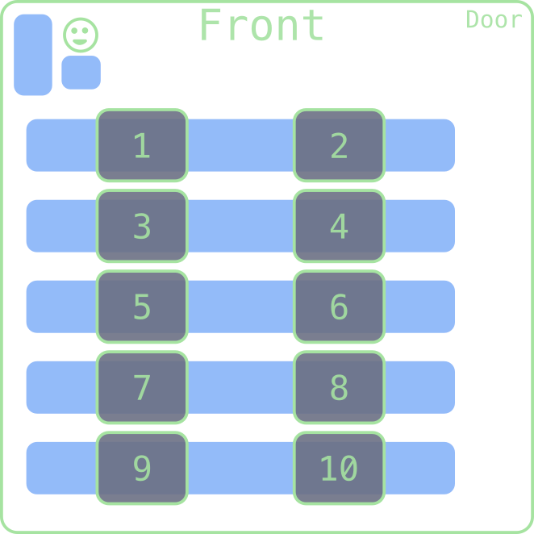

## Welcome!
::::::cols
::::{.col style='font-size:.8em'}
- Scan the QR code or go to [https://classroomtools-production.up.railway.app/daily?code=u594d](https://classroomtools-production.up.railway.app/daily?code=u594d)
- Sign in with your email, initial password is your student ID
- Submit the entrance poll and see your group number
- Sit in the indicated area!
::::

::::col

::::
::::col

::::
::::::
<!-- Comments
- Problem 1: This was solid as an intro to Karel problem
- Problem 2 and 3: These were REALLY good. Maybe just have a better way to get a random letter to each group faster.
- Live Code: Didn't leave myself quite enough time, and had to go a touch faster than I'd have liked. Maybe simplify if wanted to spend the extra time on 2 & 3, which I think is worth
-->


## Quick Announcements
- Ensure you have the tech installed on your system!
	- Then swing by my office during office hours (or when my door is open) to check in with me
- I'll be in the QUAD Center again tomorrow from 3-4 in case folks want help with the software setup
- Sections start next week. If you have not yet filled out your availability, please do that **now** [here](https://docs.google.com/forms/d/e/1FAIpQLSfBzB0F2-loUUf63MU5DglpW2_oMuksVZ0vJkEZ9dUnVvbexA/viewform?usp=dialog)!
- Discord channel invite link will in announce in Canvas before Friday. I just need to get the bot up and running with it still.
- Problem Set 1 will be released on Friday


# Group Problems

## Preliminaries
- Take a quick moment to introduce yourself to your group-mates for the day
	- Name
	- Class year
	- Major?
- Fun question of the day: if you had been in charge of naming Karel, what name would you have gone with?


## Problem 1: Routing
::::::{.cols style='align-items: center'}
::::col
- Suppose we had the situation to the right and wanted to navigate to the beeper, pick it up, and then drop it at the corner of 3rd avenue and 2nd street.
- As a group, write down a series of commands that would accomplish this
	- Remember you can only move, rotate left, and pick up or drop the beeper
- Note that there are multiple ways to do this! Do you think one method is better than another?
::::

::::col
\begin{tikzpicture}%%width=100%
\karelgrid[Green]{3}{3}

\draw[Green, very thick] (3.5,2.5) --+(-1,0) (1.5,2.5) --++(0,-1) --++ (1,0);
\karelbeeper[Blue]{3}{1}
\karelmark[Yellow]{1}{3}{90}

\end{tikzpicture}

::::
::::::

## Problem 2: Letter Encoding
- I am going to go around to each group and give them a secret random letter of the alphabet
- You have a 5x5 world, with Karel starting in the bottom left corner, facing East
- Your task: write out a series of commands that would drop beepers into the shape of the given letter
	- You can choose whether you want a capital or lowercase version of your letter!
- Have one member clearly write out your commands on another sheet of paper, as you are going to share these in a moment!


## Problem 3: Letter Decoding!
- I am going to collect all your commands, shuffle them up, and then deal them back to groups
- Your new task: figure out what the other group's secret letter was!
- I'd recommend not trying to track everything in your head! Use some scratch paper!


## Problem 4: Pesky Potholes
- Suppose we wanted Karel to fill all the "holes" in the below world with a beeper

\begin{tikzpicture}%%width=50%
\karelgrid[Green]{6}{3}


\draw[very thick, Green] (1.5,0.5) --++(0,1) --++(-1,0) 
						  (2.5,0.5) --++(0,1) --++(2,0) --++(0,-1) 
						  (5.5,0.5) --++(0,1) --++(1,0);
\karelmark[fill=Yellow]{1}{2}{0}
\end{tikzpicture}
- Your task: Write a program to accomplish this which utilizes at least 3-4 functions (counting your `main` function)
	- Think about how you might decompose this problem!

# Live-Coding

## Something to Smile About
- Suppose my goal is to have Karel draw out a smiley face with beepers
	- What size of world should we go with?
	- Where should we start Karel?
	- What direction should Karel be facing initially?
- Side goal: showcase strong decomposition and function writing

## A Solution
```{.python style='max-height: 800px'}
import karel

def main():
    """Draws a smiley face!"""
    move_to_leye()
    draw_eye()
    move_to_reye()
    draw_eye()
    move_to_nose()
    draw_nose()
    move_to_mouth()
    draw_mouth()

def move_to_leye():
    """Moves up to place the first eye"""
    move()

def draw_eye():
    """Places a one beeper eyeball"""
    put_beeper()

def move_to_reye():
    """Moves across the top of the world to the right eye location"""
    turn_right()
    move()
    move()
    move()

def move_to_nose():
    """Moves to the right side of the nose"""
    turn_left()
    turn_left()
    move()
    turn_left()
    move()
    turn_right() # reorienting to prep for line of beepers for nose

def draw_nose():
    """Draws a 2 square flat nose starting from the right"""
    put_beeper()
    move()
    put_beeper()

def move_to_mouth():
    """Moves to the left side of the smile"""
    move()
    turn_left()
    move()

def draw_mouth():
    """Draws a smile from the left to the right"""
    put_beeper()
    move()
    turn_left()
    move()
    put_beeper()
    move()
    put_beeper()
    move()
    turn_left()
    move()
    put_beeper()


def turn_right():
    """Turns Karel to the right"""
    turn_left()
    turn_left()
    turn_left()
```

