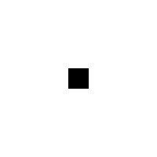
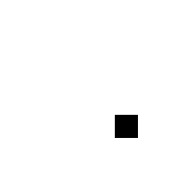
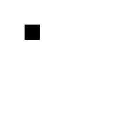
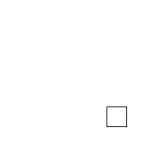
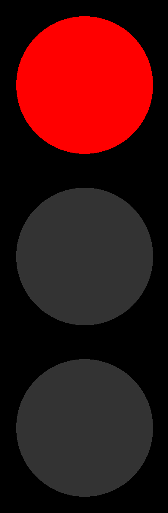
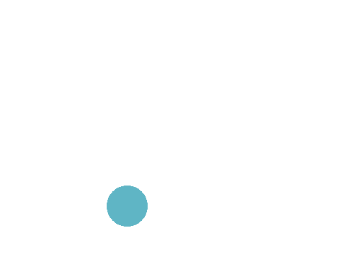

## Halfway through the week!
::::::{.cols style='font-size:.8em'}

::::col
- Scan the QR code or go to [https://tools.jedrembold.prof/daily](https://tools.jedrembold.prof/daily)
- Introduce yourselves! Fun question: What is your favorite animated movie?

{width=50%}
::::
::::col
{width=60%}
::::
::::::

<!-- Comments
-->


## Quick Announcements
:::{style='font-size: .8em'}
- I'm still going to try, but there is probably a 50/50 chance that I am going to need the weekend to get through all the midterms
- I am really sorry that you hadn't gotten Feedback on PS2 and PS3
    - It has now been fixed going forwards
    - That feedback should now be visible to you
- The Python Summary has been updated with all the PGL methods
- PS4 is due on Monday
:::

# Group Problems

## Problem 1: Tracing Understanding
::::::{.cols style='align-items: center'}
::::col
When the function to the right is run, what does the screen look like just after 1 second has passed?

::::::cols
::::col
{width=60%}

{width=60%}
::::

::::col
{width=60%}

{width=60%}

::::
::::::


::::

::::{.col style="flex-grow:1"}
```{.python style="max-height:900px; font-size:0.8em"}
def mystery():
    def enigma():
        rect.move(1, 1)

    def puzzle():
        rect.set_filled(True)

    gw = GWindow(200, 200)
    rect = GRect(0, 0, 25, 25)
    gw.add(rect)
    gw.set_interval(enigma, 20)
    gw.set_timeout(puzzle, 1000)
```

::::
::::::

## Problem 2: The Setup
- This is a coding problem, work in pairs or trios on a single computer
- In `SquareFun.py`, I've drawn an initial box for you
- Your task is cause the square to move horizontally across the screen such that it takes _exactly_ 5 seconds to cross entirely

## Problem 2b: The Growth
- Switch who is typing!
- Now, we want the box to also increase in size as it moves across the screen
- **Until** it reaches a size of 100 pixels, then it stops growing (but keeps moving)

## Problem 2c: Symmetric Growth
- Switch who is typing!
- The box grows from the top left corner atm, which looks weird
- Add logic to also adjust the position of the box so that it seems to grow from the center

## Problem 2d: Target Time!
- Switch who is typing!
- I've provided you a function that "throws a dart" to a specified position
- Add a timeout so that the dart is thrown when it would strike the center of the box

## Problem 2e: Moving the Dart
- Switch who is typing!
- Even if the dart hits the box, the box moves out from under it currently, which looks weird
- Add logic so that the dart is moved along with the box once it hits the board
- This will likely require accessing the same dart object in _multiple_ callback functions, one of which assigns it. How can you manage this?


## Problem 3: Obeying Traffic
::::::cols
::::col
- I have provided the structure of a traffic light for you in `traffic.py`
- Your task is to add the color cycling, using a single `step` callback
- Lights should follow the pattern of:
    - Red for 5 seconds
    - Green for 5 seconds
    - Gold/yellow for 1 second
- The cycle should repeat
::::

::::col
{width=25%}
::::
::::::


# Live Coding

## Growing Circles
- Let's recreate the following:

{width=50%}

