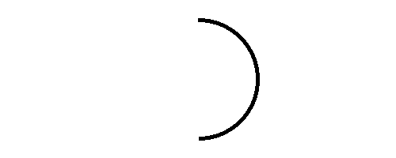

## Halfway through the week!
::::::{.cols style='font-size:.8em'}

::::col
- Scan the QR code or go to [https://tools.jedrembold.prof/daily](https://tools.jedrembold.prof/daily)
- Fun group question: What is the best regular polygon?

{width=50%}
::::
::::col
{width=60%}
::::
::::::

<!-- Comments
-->


## Quick Announcements
:::{style='font-size: .8em'}
- I apologize I couldn't get through all the exam scoring before today. I'll have things ready by Monday
- PS4 is due on Monday
- Make sure you are using the available resources as you need them!
    - Myself
    - Section leaders
    - QUAD Center
- Project 2 is next week! PLan accordingly, especially if Project 1 did not go great
:::

# Group Problems

## Problem 1: Tracing Understanding
::::::cols
::::col
Which of the below blocks of code will create the image to the right? The window measures 500 x 200 pixels and the value of `d` is 150.
::::

::::col
{width=65%}
::::
::::::

::::::cols
::::col

:::{.block name="A"}
```{.python style='font-size:.8em; margin-left:1em;'}
x, y = 250 - d / 2, 100 - d / 2
a1 = GArc(x, y, d, d, 90, -180)
gw.add(a1)
```
:::

:::{.block name="C"}
```{.python style='font-size:.8em; margin-left:1em;'}
x, y = 250 - d, 100 - d
a1 = GArc(x, y, d, d, -180, 90)
gw.add(a1)
```
:::

::::

::::col
:::{.block name="B"}
```{.python style='font-size:.8em; margin-left:1em;'}
x, y = 250 - d / 2, 100 - d / 2
a1 = GArc(x, y, d, d, 90, 180)
gw.add(a1)
```
:::

:::{.block name="D"}
```{.python style='font-size:.8em; margin-left:1em;'}
x, y = 250 - d / 2, 100 - d / 2
a1 = GArc(x, y, d, 180, -90)
gw.add(a1)
```
:::

::::
::::::

## Problem 2: An Arrowhead
- This is a coding problem, work in pairs or trios on a single computer
- In `arrow.py`, I've drawn the initial shaft of an arrow for you (you are welcome)
- Your task is to add an arrow head to the right end of the arrow, which should look as shown below:


## Problem 2b: The Fletchings
- Switch who is typing!
- No arrow will fly straight without its fletchings. Now add two parallelograms on the left end of the arrow.


- Mimic the dimensions and angles as closely as possible!

## Problem 2c: The Flight
- Switch who is typing!
- Up until this point, everything has just been added to the GWindow
- Change that, creating a `GCompound` and add everything to that instead
- Add the `GCompound` to the left edge of the window, and animate it flying to the right
- BONUS: stop the animation when the tip of the arrow hits the right side of the screen

# Live Coding

## Time It!
::::::{.cols style="align-items: center"}
::::{.col style="font-size:.9em; flex-grow: 1.5"}
- Suppose we wanted to make a stopwatch
- Let's aim for a narrow diamond for the hand
- Circle around outside, with red arc between 12 and 2 to indicate "almost done"
- Hand initially points towards current mouse position
- When we click, it instead starts animating, rotating towards 12, where it stops

::::

::::col

::::
::::::


