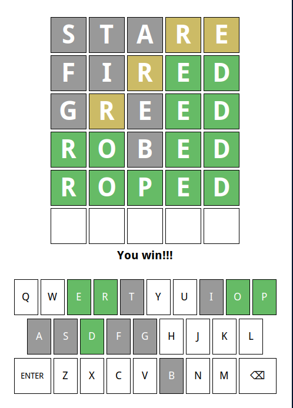

## Happy Friday!!!
::::::{.cols style='font-size:.8em'}

::::col
- Scan the QR code or go to [https://tools.jedrembold.prof/daily](https://tools.jedrembold.prof/daily)
- Introduce yourselves! Fun question: What is your favorite leading question in 20 questions?

{width=50%}
::::
::::col
{width=60%}
::::
::::::

<!-- Comments
-->


## Quick Announcements
- Problem Set 3 is due tonight
	- I'm so sorry, I'm still getting through the PS2 feedback :/
- Project 1 is live!
	- Due next Monday
	- Sections this week will revolve around common tricky bits


# Group Problems

## Problem 1: More Console Boxes
- Here you want to extend the console box problem from last week's section
- You will _prompt_ a user to enter in a width, and then again to enter a height, then use those to create your box
- Then you should still print the resulting box to the screen (in fact, you could still use your old function)
- Too easy? Make it so that if they don't enter an integer, it keeps prompting them until they do.

## Problem 1 Example Output
```text
Please enter a width: 5
Please enter a height: 3
+---+
|   |
+---+
```


## Problem 2: The Right Format
Which of the provided formatted string options below would evaluate to appear as:

<center>
`101,234.98   & 4000`{.text}
</center>

when printed?

:::{.poll}
#. `f"{101234.984:<12,.2f} & {3200//8:<4d}"`
#. `f"{101234.984:>12,.2f} & {32000//8:0>3d}"`
#. `f"{101234.984:<12,f} & {320//8:0>4d}"`
#. `f"{101234.984:<12,.2f} & {32//8:0<4d}"`
:::


## Problem 3: Tabulated Birthdays
- You want a program that prompts a user for 3 pieces of information:
	- Name
	- Birth month name
	- Birth year
- It should do this for each member of your group 
- It should then print off a table with:
	- Columns of Name, Birth month, and Age (approximate)
	- Each members information below, nicely aligned

## Problem 3 Example Output
```text
Enter your name: Jed
Enter your birth month: April
Enter your birth year: 1985

Enter your name: Rick
Enter your birth month: June
Enter your birth year: 1952

Name   Birth Month  Age
Jed    April        41
Rick   June         74
```


# Project 1: Wordle

## Introduction to Wordle
::::::cols
::::col
- Our first project is recreating Wordle
- Guide is posted now and available!
- Due next Monday (Feb 16)
- Section questions will relate to common Wordle issues this week
- Aiming to be done with Milestone 3 by end-of-day Friday would be a good target
::::

::::col

::::
::::::

## Your Responsibilities
- We provide you with a custom data type that handles all the graphics and user interaction
	- Don't worry, you'll have a chance to implement your own GUIs later in the semester!
- Your responsibilities will include:
	- Displaying and reading letters from boxes
	- Evaluating whether a word is valid
	- Determining what color each letter of a word should be
    - Selecting a secret five letter word for guessing
	- Determining when victory or defeat occurs
    - Coloring the keys according to the guesses so far

## Interacting with the Window
- The `WordleGWindow` object contains its own information about what is happening in the window at any given point
- You **must** interact with it to:
	- Get information you need
	- Update information in the window
- A general algorithm/pattern that will be frequently used is to:
	- Get some information from the window
	- Use that information in your program to make a decision about something
	- Update the new information back to the window

## Your Toolbox
- Utilize the special functions/methods provided by the graphics data type: `WordleGWindow`
	- These are documented in the guide, and include, but are not limited to, things like
		- Getting or setting a letter in a particular box
		- Getting or changing the color of a given box
		- Changing which row is used when characters are typed in
- Variables and functions
- Control statements
	- Good use of loops and if statements will be very useful
- String functions and operations


## An Approach to Success
- Each project is accompanied by a highly detailed guide: **read it!**
	- Explains background ideas so that you can understand the big picture of what you are needing to do
	- Also included a breakdown of individual _milestones_
		- A _milestone_ is a discrete checkpoint that you should ensure is working (and that you understand!) before moving on
        - Whenever you complete a milestone, **you should upload your current code to GitHub.**
- Projects are all about managing complexity. If you start trying to implement milestones out of order, you are asking for disaster
- Don't let yourself get overwhelmed by scale. Focus on one particular milestone at a time, which should involve focusing only on a small part of your overall code

## A Few Other Hints
- Despite there being multiple files in the starting repository, you only need to edit one yourself: `wordle.py`
- You will have an easier time here if you define all your helper functions _inside_ the main `wordle` function that is defined in the starting template
- TEST TEST TEST!
	- Beyond just not doing something that the guide requests, the most common reason student's lose points is because they didn't test their code well
- If you want the possibility of a 100%, then you need to do at least one extension. But do not start **any** extensions until you are confident you have achieved everything the guide required, and have TESTED IT
