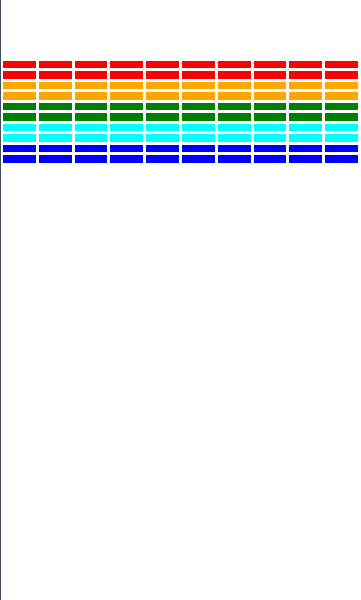
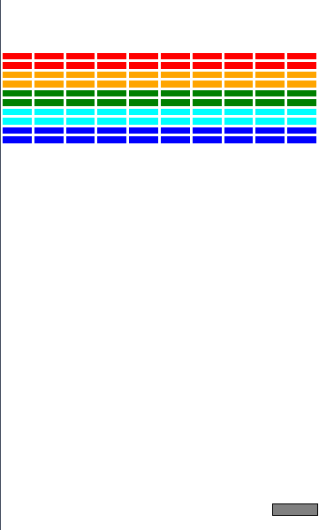
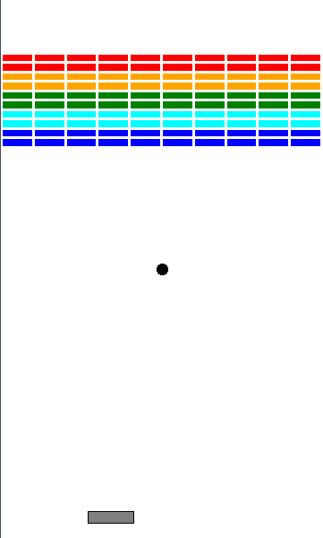
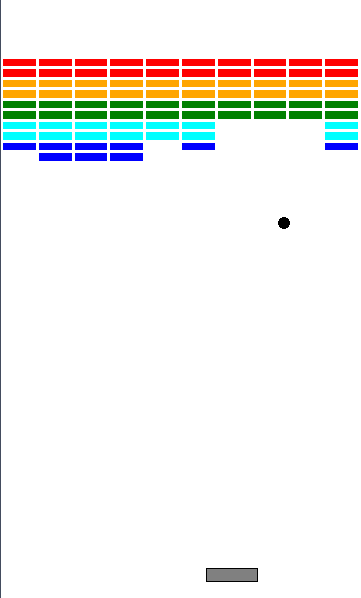

## Happy Monday!
::::::{.cols style='font-size:.8em'}

::::col
- Scan the QR code or go to [https://tools.jedrembold.prof/daily](https://tools.jedrembold.prof/daily)
- Fun group question: What do you most common use-case for a list?

{width=50%}
::::
::::col
{width=60%}
::::
::::::

<!-- Comments
-->


## Quick Announcements
:::{style='font-size: .8em'}
- Exam scoring is done! We'll talk more about it in just a moment
- PS4 is due tonight
- Project 2 goes live today! Guide will be up before the end of the day.
    - You have everything you need to complete it already!
:::

## Midterm 1 Debrief
::::::{.cols style='align-items:center'}
::::{.col style='flex-grow:1.5'}
\begin{tikzpicture}%%width=100%
  \begin{axis}[
      width=8cm,
      xlabel= Percent,
      ylabel= Number of Students,
      yticklabels={,,},
      ymajorticks=false,
      ylabel near ticks,
      color=white,
      ]
      \addplot [hist={density, bins=6, data min=20, data max=100}, fill=Orange] table[y=perc, col sep=comma] {../../data/Midterm1_Results_S2026.csv};
  \end{axis}
\end{tikzpicture}

::::

::::col
- Final breakdown:
    - Average: 78.4%
    - Median: 80.7%
    - St Dev: 15.6%

::::
::::::

# Group Problems

## Problem 1: Tracing Understanding
What would the below expression evaluate to? Or would it error out?
```{.python .inlinecode}
['One', 2, True][-1:1:-1][0]
```

## Problem 2: Airline Boarding
- This is a coding problem, work in pairs or trios on a single computer
- In `manifest.py`, I've created a list of passenger information for an airline
- The list has passenger information in a "name", "age", "seat" ordering
- So, for example, the first few passengers look like:
  ```python
  MANIFEST = [
    "Anthony Hutchinson", 77, "24A",
    "Carol Turner", 37, "8F",
    ...etc...
  ]
  ```

## Problem 2b: Seat Taken?
- In `Prob2.py`, you can add your code
- Imagine a passenger would like to switch seats. It would be nice to have an easy function to check a potential seat assignment and determine if it is available
- Complete the function `is_seat_available` to check to see if a particular seat is available (not currently assigned)
- BONUS: Sometimes robots will ride the plane with names like '2F'. Make sure your function still would work properly in that case

## Problem 2c: New Family
- Switch who is typing!
- A new family purchased tickets late! Add their information to the manifest.
    - Bill Yu, age 43, in seat 15C
    - Jackie Yu, age 39, in seat 15B
    - Hayden Yu, age 12, in seat 15A
- Then, complete the function `avg_age_window_seats`, which returns the average age of all passengers riding in a window seat ("A" and "F" seats)


# Breakout

## Project 2: Breakout!

::::::{.cols style='align-items:center'}
::::col
- Project 2 is recreating the classic arcade game Breakout!
- Guide is posted now, due next Monday
- Get an early start! Finish up PS4 tonight as needed, but start Breakout tomorrow!
::::

::::col

<iframe width='100%' height='400vh' src="https://www.youtube.com/embed/UhAEjDKEHgk" title="Data Driven Gamer: Breakout (Atari, 1976 arcade, 60fps)" frameborder="0" allow="accelerometer; autoplay; clipboard-write; encrypted-media; gyroscope; picture-in-picture" allowfullscreen></iframe>
<iframe width="100%" height="400vh" src="https://www.youtube.com/embed/QrlIqaN4ltM?t=25s" title="DX Ball 2 gameplay (PC Game, 1999)" frameborder="0" allow="accelerometer; autoplay; clipboard-write; encrypted-media; gyroscope; picture-in-picture" allowfullscreen></iframe>
::::
::::::

## Breakout History
:::{.incremental style='font-size:.9em'}
- The popular Breakout arcade game was released by Atari in 1976
- Atari founder Nolan Bushnell wanted a new game that would build on the success of the earlier game Pong. He assigned Steve Jobs to develop the game, promising a bonus if the game required a small number of chips.
- As Wikipedia tells the story, "Jobs had little specialized knowledge of circuit board design but knew [his friend Steve] Wozniak was capable of producing chip efficient designs. He convinced Wozniak to work with him, promising to split the fee evenly between them."
- Wozniak completed the game design in four days, but Jobs never told him about the bonus offer. Jobs was paid $\$5,000$, but Wozniak received only $\$350$.
- Jobs and Wozniak co-founded Apple Computer the following year, which has grown to be the largest corporation in the world by market capitalization.
:::

## Breakout Basics
::::::{.cols style='align-items: center'}
::::{.col style='font-size:.9em'}
- Breakout is a game in which the player attempts to break all the colored bricks by causing a bouncing ball to collide with them
- The player controls a paddle at the bottom of the screen which the ball will bounce off
    - The paddle can only move left and right
- If the ball makes it past the paddle to the bottom of the screen, the player loses a life
    - Lose 3 lives and it is game over!
::::

::::col

{width=50%}

::::
::::::

## Breakout Milestones
- Breakout is broken up over 5 milestones
- You have already seen or written pieces of similar code to many of the milestones!
    - Milestone 0: PS4 brick pyramid
    - Milestone 1: Section stamping problem (last week)
    - Milestone 2: Section bouncy Pacman problem (this week)
    - Milestone 3: Section Hungry Pacman problem (this week)


## Milestone 0
::::::{.cols style='align-items:center'}
::::col
- Goals is to lay out all the bricks
- Choose a brick color as a function of row number
- Play with the provided constants to make sure your program reacts!
::::

::::col

::::
::::::


## Milestone 1
::::::{.cols style='align-items:center'}
::::col
- Display paddle near bottom of screen
- Add mouse event listener for whenever the mouse moves
- Update x-position of paddle to stay centered on mouse
- Don't let any part of the paddle move beyond the edges of the screen
::::

::::col

::::
::::::


## Milestone 2
::::::{.cols style='align-items:center'}
::::col


::::

::::col
- Add ball to center of screen
- Make it start moving when clicking the mouse
- Ball bounces off walls, ignores all bricks and paddle

::::
::::::


## Milestone 3
::::::{.cols style='align-items:center'}
::::col
- Time to get things colliding!
- Check for collisions
    - If collision with paddle, bounce ball upwards
    - If collision with brick, bounce ball and remove brick
::::

::::col

::::
::::::


## Milestone 4
- Lose a life when going off the bottom of the world
- Track lives, and reset ball after losing a life
- Check for win condition
- Test, test, test!

## General Recommendations
- As always, **do not go on to the next milestone until 100% sure your current milestone is perfect**
- Get an early start, and chip away at a milestone or so each day
- Section problems mostly deal with milestones 2 and 3
- **Reach out for help** if you are struggling
    - Remember: stuck for more than 30 minutes on a single problem. Put it away and reach out to someone. 

