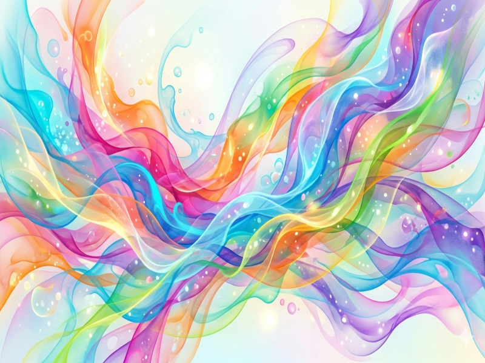

## Happy Spring Forward Monday...Yawn
::::::{.cols style='font-size:.8em'}

::::col
- Scan the QR code or go to [https://tools.jedrembold.prof/daily](https://tools.jedrembold.prof/daily)
- Fun group question: What is your favorite game or activity that happens on a grid?

{width=50%}
::::
::::col
{width=60%}
::::
::::::

<!-- Comments
-->

## Quick Announcements
:::{style='font-size: .8em'}
- Breakout due tonight!
  - I have windows from 2-2:40 and 5:30-6:30 today
- Last problem set up by end of today
	- You'll already have everything you need to complete it
- Grade reports status?
:::

## Daily LO's
- Selecting from multidimensional arrays
- Creating pixel arrays from images
- Modifying pixel arrays

# Group Problems

## Problem 1: Comprehension Inception
Suppose I construct the below 2D array using list comprehension:

`A = [[i+j for i in range(3)] for j in range(4)]`{.inlinecode .python}

What would be the output of:

`print([A[i][2] for i in range(len(A))])`{.inlinecode .python}

 

:::{.poll}
#. `[0,1,2]`
#. `[2,3,4]`
#. `[2,3,4,5]`
#. `[2,2,2,2]`
:::

## Problem 2a: That's No Moon (jk, it is)
- This is a coding problem. Work in pairs or trios on a single computer
	- Discuss your algorithm **BEFORE YOU WRITE ANY CODE**. Make sure everyone understands.
- You are working in `Prob2.py`
- Initial tasks:
	- Add a dark blue background rectangle to the window
	- Add a `GImage` of the `moon.png` image centered in the window

## Problem 2b: Odd Pixels
- Swap who is typing!
- Extract the pixel array from the moon image
- This moon image is a grayscale image, so the Red, Green, and Blue components are always equal
- Looping over all the pixels, how many pixels are darker than a value of 30?

:::notes
Should be 65760
:::

## Problem 2c: Thresholding
- Swap who is typing!
- Modify your last code to actually update the pixels in the array
	- If they are darker than 30, set them to a perfectly black pixel
	- Otherwise, set them to a perfectly white pixel
- Pass the updated pixel array into `GImage(pix_array)` and add the result to the window
- Play around with the thresholds to see different effects
- Since you are adding it on top of the original, you can also play around with giving the pixels some transparency (or making them different colors!)

# Demo

## Warhol Patterns
::::::{.cols style='align-items: center'}
::::col
- Suppose we start with a colorful image of swirls.
- Our goal is to visualize each of the 4 channels in isolation, and visualize them in a 2x2 grid on the GWindow

::::

::::col

::::
::::::

