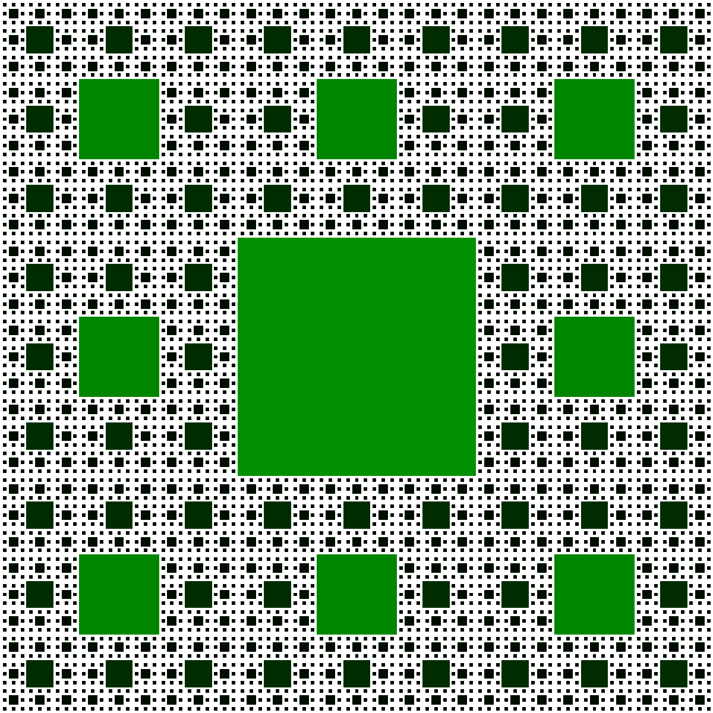

## Happy Penultimate Wednesday!!
::::::{.cols style='font-size:.7em'}

::::col
- Scan the QR code or go to [https://tools.jedrembold.prof/daily](https://tools.jedrembold.prof/daily)
- Fun group question: Can you think of an instance of naturally occuring recursion that you've seen?

{width=40%}
::::
::::{.col style='flex-grow:.5'}
{width=100%}
::::
::::::

<!-- Comments
-->

## Quick Announcements
:::{style='font-size: .8em'}
- Grade reports actually went out!
- Midterm 2 corrections are live
- Infinite Adventure due on Monday
- Sections today or tomorrow!
- Get your tickets for luau on Saturday if you want to see your Ford faculty dance!
:::

## Daily LO's
- What is recursion and what does it look like in code?
- Can we trace through recursive calls?
- What are some drawbacks of recursion?
- How can be use recursion graphically?

# Group Problems

## Problem 1: A Bit of Fibonacci
- The Fibonacci sequence is a classic sequence whose $n^{th}$ number can be defined recursively:
  $$F(n) = \begin{cases} 1 & \text{if } n \leq 1 \\ F(n-1) + F(n-2) & \text{otherwise}\end{cases} $$
- In partners or trios, define a function `fib` that returns the nth Fibonacci number

## Problem 1b: Fibonacci Calls
- Switch who is typing!
- It can be interesting to track how many times the function is called with each $n$ value
- Define a global dictionary which will have different values of n as the keys, and a counter associated with each
- Whenever your `fib` function is called, increment (or initialize) the correct count in your dictionary.
- When you call `fib(5)`, how many times is `fib(1)` called?
  - You can just print it your counts after running `fib(5)`
- What about with `fib(25)`?

## Problem 2: A-mazing Recursion
- We looked at one maze-solving algorithm earlier this semester
- Recursion can be another approach!
- The `maze_solver.py` program demonstrates one recursive approach, which also tracks the final path
- Running the program initially will just give you an interactive window with the maze
- Your task is to trace through the recursive algorithm by hand
- Keep in mind that each function call checks 4 directions! It can be useful to track which have been used so far

## Problem 2b: A-mazing Solutions
- Add code to the bottom of the program to actually call the recursive solver and print out the found path
  - You know that the start point is always in the upper left corner
- Try it with larger mazes! Would our earlier approach worked with these mazes?

# Demo
## Sierpinski Carpet
::::::{.cols style='align-items: center'}
::::col
- You likely have seen the Sierpinski Sponge in the middle of the second floor of Ford
- Let's try to create a 2D version in PGL using recursion
::::

::::col
{width=80%}

::::
::::::

