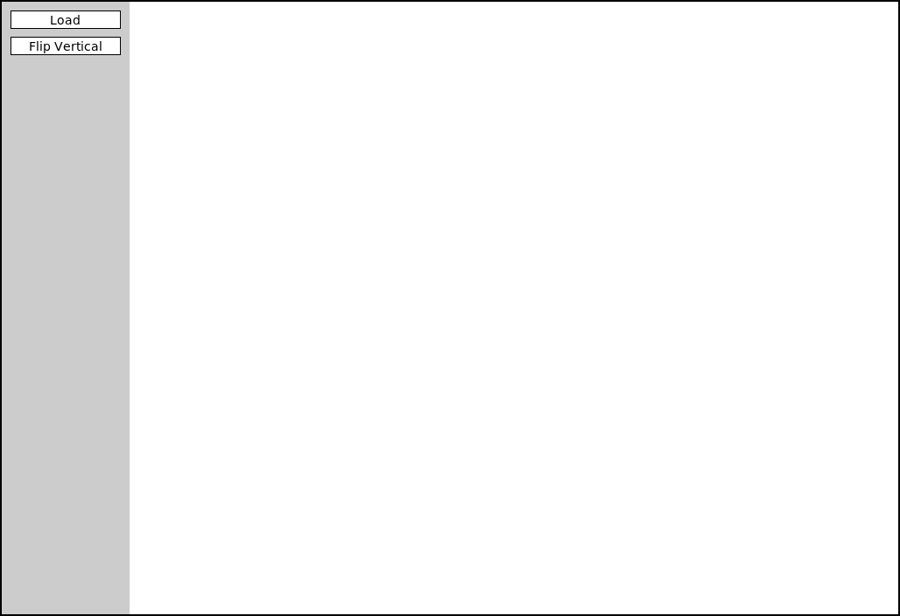

## Last Monday before Spring Break!
::::::{.cols style='font-size:.8em'}

::::col
- Scan the QR code or go to [https://tools.jedrembold.prof/daily](https://tools.jedrembold.prof/daily)
- Fun group question: What piece of technology do you use every single day that you have zero idea how it works internally? How does this relate to the abstraction boundary?

{width=40%}
::::
::::{.col style='flex-grow:.5'}
{width=100%}
::::
::::::

<!-- Comments
-->


## Quick Announcements
:::{style='font-size: .8em'}
- Problem Set 5 due tonight!
- ImageShop is this week! Introducing later today
- Office hours from 2-2:40 today, or after 5:30pm
:::

## Perusall Guidelines
:::{style='font-size:.9em'}
- Perusall determines scores for an assignment based on a combination of factors:
	- What percentage of the video did you want?
	- How much active engagement time did you spend with the video?
	- How much did you interact with any of the community commentary?
		- Asking questions?
		- Answering others questions?
		- Upvoting questions or answers?
- These all sum to over 100% of the 3 possible points, so there is room for some flexibility
- Most common improvements for most students: don't watch on increased speeds and engage more in the comments
:::

## Daily LO's
- Why would we create a custom data type?
- What is the abstraction boundary, and why do we care?
- How do we create a basic class?
- How can we add attributes to a class in a constructor method?

# Group Problems

## Problem 1: Tracing Cars
::::::cols
::::col
What is printed out on the final line of code to the right?

:::{.poll}
#. `Honda red 2006`{.no-highlight}
#. `Honda blue 2006`{.no-highlight}
#. `Toyota blue 2008`{.no-highlight}
#. `Honda red 2008`{.no-highlight}
:::

::::

::::{.col style='flex-grow:2'}
```{.python style='max-height:800px'}
class Car:
	def __init__(self, color, year):
		self.color = color
		self.year = year
		self.make = 'Toyota'

A = Car('blue', 2008)
A.make = 'Honda'
B = Car('red', 2006)
A.year = B.year
print(A.make, A.color, A.year)
```
::::
::::::


## Problem 2a: A Classy Song
- This is a coding problem. Work in pairs or trios on a single computer, and discuss your algorithm **BEFORE YOU WRITE ANY CODE**. 
- Your task:
	- You want to define a class to hold information about a single song
	- You desire to store several attributes: `title`, `artist`, and `duration_sec`
	- Define the class and write the necessary constructor

## Problem 2b: Genres
- Swap who is typing!
- Suppose you realized you also want to track `genres` in your class, and so add as an attribute
- What data-type will the value be that is assigned to the `genres` attribute? You get to choose, but have a reason for why you chose what you did!
- Implement this new attribute into your class


## Problem 2b: Personal Taste
- Swap who is typing!
- For each member in your group, get at _least_ two of their favorite songs
- Create a song object for each song (look up values online as needed) and add them to a list called `playlist`


## Problem 2d: Play Time
- Swap who is typing!
- Write a function that loops through each song in the playlist, and then prints the total playlist duration to the screen.
- Bonus: Also print out all the different genres covered within the playlist

# ImageShop
## Starting
::::::cols
::::col

::::

::::col
- ImageShop initially has only two buttons
	- "Load" will bring up a file selection box where you can choose what image to display
		- Internally, this is handled by a function that returns the chosen file path
	- "Flip Vertical" is the example feature button that flips an image vertically
::::
::::::

## Big Picture
- Each milestone in ImageShop boils down to:
	- Adding a button to the window to handle a new feature
	- Writing a simple callback function that sets the new image to be equal to the output of a new function you'll write
	- Writing that function, which will generally return a `GImage` type object
- You are always free to write whatever other helper functions you might like!

## So Many Files!
- ImageShop is the first project to start leveraging multi-file layouts:
	- Some functions will already be provided in `GrayscaleImage.py` that you can import into your main program
	- You are encouraged to write the necessary functions for Milestone 4 in their own file and import them in accordingly
	- I've ***seen*** you all scrolling madly around trying to find the code you want. This helps with that!
- Just make sure you save a file after editing!
	- See a circle in the tab for a file in VSCode? That file **has not been saved!**


## GButtons
- To help facilitate working with buttons, ImageShop introduces a new type called `GButton`
- There is nothing magical about these! They are just pre-bundling PGL concepts that you already know like labels and mouse click events
- Each `GButton` gets a label and a callback function name that determines what function is called when that button is clicked
- ImageShop will come with a pre-defined `add_button` function which will take care of adding a new button to the correct part of the screen.
	- You'll just need to provide it a label and function name to callback to


## The Current Image
- ImageShop holds the `GImage` currently displayed on the window in a variable (really an attribute) called `gw.current_image`
- The variable is specifically added as an attribute to `gw` so that you will have access to it in any callback function you write
- This will generally be the input to your various image manipulation functions, since most of those functions work with whatever image was currently displayed on the screen
- Your callback function should run `set_image` on the output of your manipulation function, which will take care of updating the value of `gw.current_image` and displaying the new image in the window

## Milestone 0
- Milestone 0 has you adding a "Flip Horizontal" button
	- Add the button
	- Add the action callback function
	- Write a function to manipulate the pixels to flip the image horizontally
- Slightly more complicated than the example function, but not much


## Milestone 1
::::::{.cols style='align-items: center'}
::::col
- Here you will add buttons to rotate the image left or right (or CW or CCW if you prefer)
- Most of the difficulty comes in keeping track of of rows and columns
	- Need to create a new list of lists of the correct dimensions
	- Need to copy over the pixels from the original to the needed location in the new list
::::

::::col
\begin{tikzpicture}%%width=100%
	\foreach[evaluate={\c=int(60-12*\x)}] \x in {0,1,...,5} {
		\foreach \y in {0,1,2} {
			\node[minimum size=10mm, draw, fill=Blue!\c, font=\tt\scriptsize](A\x\y) at (1.1*\x,-1.1*\y) {[\y][\x]};
		}
	}
	\foreach \x in {0,1,2} {
		\foreach[evaluate={\c=int(12*\y)}] \y in {0,1,...,5} {
			\node[minimum size=10mm, draw, fill=Blue!\c, font=\tt\scriptsize](B\x\y) at (10+1.1*\x,-1.1*\y) {[\y][\x]};
		}
	}
	\foreach[evaluate={\y=int(5-\x)}] \x in {0,1,...,5} {
		\draw[ultra thick, -stealth, Red] ($(A\y0.center)-(0,.2)$) -- (B0\x);
	}
\end{tikzpicture}

::::
::::::

## Milestone 2
- Here you'll add a button to convert an image to grayscale
- If you understand the other library files that have been given to you as part of the project, this milestone should be the simplest!
- **Don't copy. Import!**


## Milestone 3
- Here you get to enable a green screen effect!
- Unlike other buttons, when this one is clicked, you should use the file chooser library to prompt the user to select _another_ image
	- This is the image that will be overlaid on whatever image is currently shown on the screen
- You will want to start with an "empty" pixel array with the same dimensions as the background
- This will closely mimic our in-class example from Friday, where depending on how "green" a pixel is, you will choose between different choices
	- If green enough, you will copy the pixel from the _background_ image to your new pixel array
	- If not green enough, you will copy the pixel from the _foreground_ image to your new pixel array


## Milestone 4
- Here you'll implement one algorithm for increasing dynamic contrast across an image!
- Doing so requires several steps and different functions. It can be convenient to place these in their own file and import them into `ImageShop.py` as needed.
	- Compute all the pixel luminosities
	- Construct a histogram of these luminosity counts
		- Your histogram should have 256 elements, one for each possible luminosity
	- Construct a cumulative histogram using your histogram
	- Use the cumulative histogram to adjust the luminosity of each pixel in the pixel array
- You don't need to display the visual histograms! But they can be a great way to check that you are doing the other parts correctly.
	- Related to Problem 1 on PSet 5


## Extensions
- Give yourself time for extensions on this project!
- They are **easy**! Just come up with interesting or cool graphical effects and add a button for them!
- You'll look at several this week in your section meetings
	- Adding these in your project is encouraged and will be regarded as "sub-extensions", but come up with your own as well!
- Accidentally make a mistake but think it looks cool? Save it! Make it a feature!!
