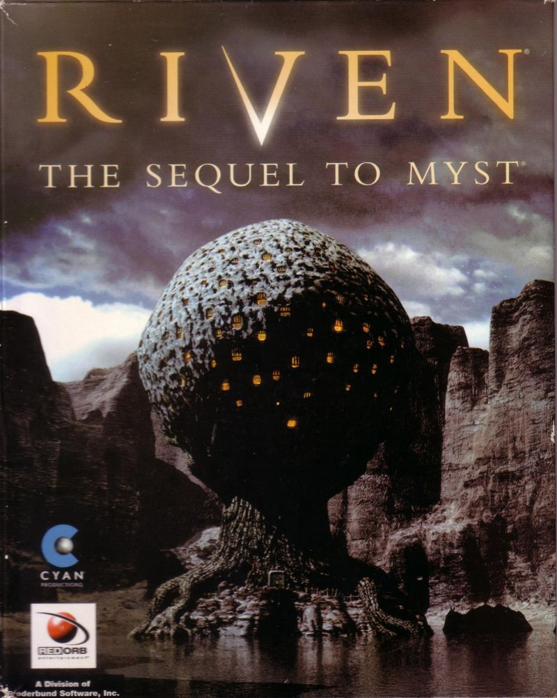
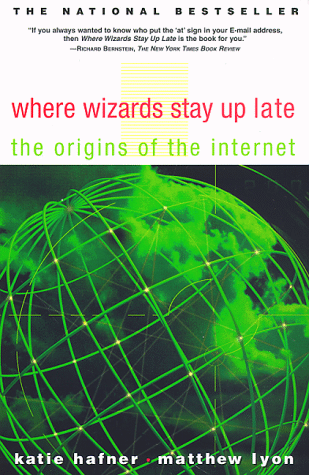
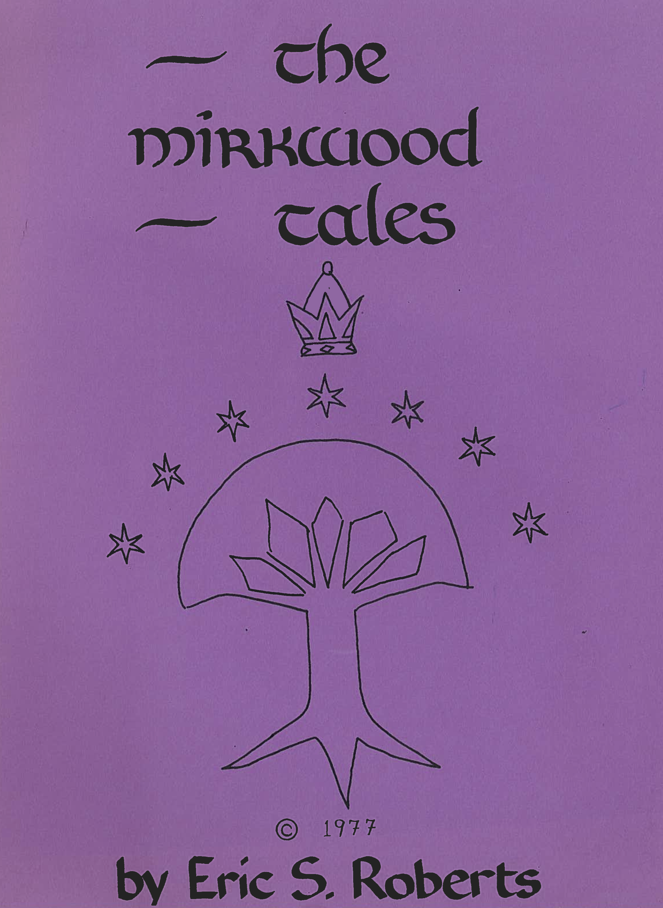

## Welcome to Monday
::::::{.cols style='font-size:.7em'}

::::col
- Scan the QR code or go to [https://tools.jedrembold.prof/daily](https://tools.jedrembold.prof/daily)
- Fun group question: Have you played any adventure games before? What is your favorite?

{width=40%}
::::
::::{.col style='flex-grow:.5'}
{width=100%}
::::
::::::

<!-- Comments
-->


# Adventure Time
## Beginning the Adventure
- One of the first computer games I ever played was Riven: The Sequel to Myst
- This was but the latest addition in an already long line of adventure type games

::::::{.cols style='align-items: center'}
::::col
{width=50%}
::::

::::col
<video width='100%' controls src="../video/RivenOpening.webm"></video>
::::
::::::

## Life among Wizards
- The history of the early internet has been told in several books. One relates the following story:

::::::cols

::::col

<figure class='r-stack'>
</img>
</img>
</figure>

::::

::::{.col style='font-size:.7em; flex-grow:2.5'}

> A small circle of friends at BBN had gotten hooked on Dungeons and Dragons, an elaborate fantasy role-playing game in which one player invents a setting and populates it with monsters and puzzles, and the other players then make their way through that setting. The game exists only in the minds of the players.
>
> Dave Walden got his introduction to the game one night when Eric Roberts, a student from a class he was teaching at Harvard, took him to a D&D session. Walden immediately rounded up a group of friends from the ARPANET team for continued sessions. Roberts created the Mirkwood Tales.
>
> One of the regulars was Will Crowther.

::::
::::::

<!--
## The Team
{width=60%}
-->

## Willie Crowther's Adventure Game
<video class='stretch' data-autoplay loop src="../video/Adventure_Intro.webm"></video>

## A Brief History of Adventure
- Eric Roberts begins the Mirkwood Tales in early 1975
	- Will Crowther creates Adventure later that year
- Stanford graduate student Don Woods released an expanded version of Adventure in early 1977
- Dave Lebling and others from MIT release the first version of Zork in 1977
- Adventure is ported to wide variety of platforms by 1980
- Eric Roberts creates an expanded version in 1984 and uses it as the basis for his first Adventure Project at Wellesley
- The Adventure Project begins at Willamette University in 2022
- The Adventure Project becomes infinite in 2025!


## Why Infinite?
:::incremental
- Older versions of Adventure were always limited in what options a player could choose to do
- Many possibilities, but still always possible to try to do something reasonable that was denied by the game
- What if we could change that?
- With the advent of Large Language Models (LLMs), computers are now shockingly good at producing new content given a prompt
- So in the Infinite Adventure, when a player tries to do something or go somewhere the game designer didn't plan, it does **not** error or prevent them from doing so
	- Instead, the program uses an LLM to generate a new scene description on the fly
:::

## Building Blocks


## The Story Structure


## The Story JSON
<script src="https://pfau-software.de/json-viewer/dist/iife/index.js"></script>

<andypf-json-viewer class='column-page'
    show-toolbar="false"
    show-copy="false"
    show-data-types="false"
	theme="seti"
	indent=4
	style="font-size:.7em"
    data="https://gist.githubusercontent.com/jrembold/c7d419edbbed0b4b7944b2ed8f33e3ec/raw/a0f94ff6271b138f020f2b2f1db478ba31597452/original_small.json"
>
</andypf-json-viewer>

# Milestones
## MS 0: Understanding
- Milestone 0 is completed in the `warmup.py` file
- Focuses in on reading in the JSON data and then:
	- Looping over all the scenes
	- Looping over all the choices for each scene
	- Looking at the resulting `scene_key`
	- Comparing that key back to all the available keys in the scenes dictionary
	- Printing out "dead-end" scene keys
- The idea here is to ensure you understand the compound data structure and can work productively with it


## MS 1: Printing a Room
- Whenever the player "enters" a room or scene, a description needs to be printed to the terminal
	- Begins with the scene description text
	- Followed by a numbered list of all the possible choices
- Formatting is important here, to keep things clean and readable!
- Constantly printing room descriptions, so makes sense to package up in a helper function

## MS2: Getting a Valid Choice
- Writing a helper function to prompt the user to enter in their choice
- Not all choices are valid!
	- Enter in something besides a number? Try again.
	- Enter in a number that isn't a choice? Try again.
- Need to keep prompting the player until they make a valid choice, then return that choice
- If no characters are entered, should return `None`


## MS3: Connecting the Flow
- Now you have all the parts to connect things together!
- Track what scene the player is currently in 
- Repeatedly:
	- Print out the current scene
	- Prompt the player for their valid choice
	- Look up the corresponding next scene_key for that choice
	- Update the current scene to the next scene_key
- Should continue infinitely until `None` is returned by your valid choice function
- Will error when encountering a dead-end room! _This is expected!_


## MS4: Generating New Scenes
- Here is where you'll get to write a function to use ChatGPT to make a new scene!
- First need to construct the **prompt**
	- A template is provided for you! You'll just need to substitute in the correct bits for any new scene. Things like:
		- This scene's scene_key _(need to be able to set it properly in the output)_
		- An example of how we format a scene _(LLM's do much better with examples)_
		- The overall plot of the story _(Need to know what the general theme is)_
		- What choice a user selected to arrive here _(Helps keep generated content topical)_
		- What the previous scene key was _(because we want to be able to to return)_
	- f-strings will be very useful here!

## MS4: The API Call
- Once you have your prompt, you need to package it up and send it off to ChatGPT
- Example code provided for how to do this
- You'll need to provide your NotOpenAI api key at the top of the program
- After a moment, you'll get back a **string** of JSON information
	- Use `json.loads(|||your string response|||)` to convert this to nested data structures
- Then you can print it off like usual, and _add it to the scenes dictionary_!


## NotOpenAI
- In general, while simpler models do not cost much, they still cost something to access through OpenAI's API
- We didn't want you to have to pay anything though, so instead you connect through our custom **NotOpenAI** library
	- Acts as a sort of "middle-man", receiving your request and then forwarding that request on to ChatGPT, but using **our** API key (which we are paying for)
	- The way you make a request to ChatGPT with the NotOpenAI library is _identical_ to how you would do so with the official OpenAI library
	- Your NotOpenAI keys are allocated around 1.5 million tokens of usage, which should correspond to somewhere between 750 to 1500 generated scenes, which is a LOT! But it isn't infinite, so don't abuse it.

## Components of a NotOpenAI Call
```{.python style='max-height:900px; font-size: .8em'}
CLIENT = NotOpenAI(api_key="yourapikey") # Create the client

chat_completion = CLIENT.chat.completions.create(
	messages=[
		|||Dictionary with payload|||
	],
	model=|||model to use|||,
	response_format={"type": "json_object"} # if json requested
)
response_str = chat_completion.choices[0].message.content
|||Convert json content to Python data structures|||
```

## The Pieces
- The Payload dictionary:
	- **Must** have keys of `"role"` and `"content"`
	- `"role"` is always set to `"user"`
	- `"content"` is assigned the text of your prompt
- The model:
	- Lots of different models available from OpenAI
	- NotOpenAI only is supporting `"gpt-4o-mini"`

## Demo
- Suppose we wanted to get all the capital cities of Europe and dump them into a file.
- How can we utilize the NotOpenAI library to accomplish this?

## Your Turn
- Use the NotOpenAPI to a get a JSON structure that contains information on the top 5 most influential adventure games of all time. Your structure should include:
	- Game name
	- The creator
	- The publishing year
	- A one sentence description of why it was influential
- Save the returned JSON to a file.
- Inspect that file to see the structure of the JSON and the keys.
- Read the JSON back into Python to print out only the names of the graphical adventure games to the terminal.

## MS5: Visualizing
- Text descriptions are nice, but images can really bring a story to life
- For all the pre-generated rooms, I have also generated a corresponding image using DallE
- All images follow the naming pattern of `img/|||scene_key|||.jpg`
- When you display the text of a room, you also want to display the corresponding image **if it exists**
	- Display a black box if it does not exist
- This is just using existing PGL functionality that you are already familiar with


## MS6: Reflecting
- When we use generative AI, we are, by design, giving up some control to the AI
- How do we evaluate or measure if the AI is making "good choices"?
- This milestone asks you to generate a handful of scenes from a new story: `engineer_story`
- You want to pay particular attention to the names of your coworkers, and then answer several questions about if "good" decisions are being made.
- These questions will be answered in `infinite_ethics.txt` and uploaded along with your code


# Final Thoughts

## Second Time!
- This is only the second time this project has been done at Willamette!
- All the section leaders are very familiar with the content
- Other tutors will likely be less familiar, though they have had access to the materials
	- Be patient with them if it takes them a bit longer to get up to speed
	- You can always direct questions to me!
- I'm very excited to see what fun extensions you can come up with and what your general feelings on the project are!


## LLM Problems
:::{style='font-size:.9em'}
- Generative AI is very provocative atm, for good reason. It can do some amazing things, but at some real cost
- I personally have strong concerns with both the environmental impacts of generative AI training and the seemingly wanton disregard for intellectual property, copyright, and attribution that big tech has shown in training most models.
- But usage of and discussion around generative AI has become the norm in especially many tech fields
- I don't think this is something we can improve or help guide or regulate without engaging with the technology on more than a surface level
- Please keep both the benefits, but also the costs in mind as you engage with the technology on this project
:::
