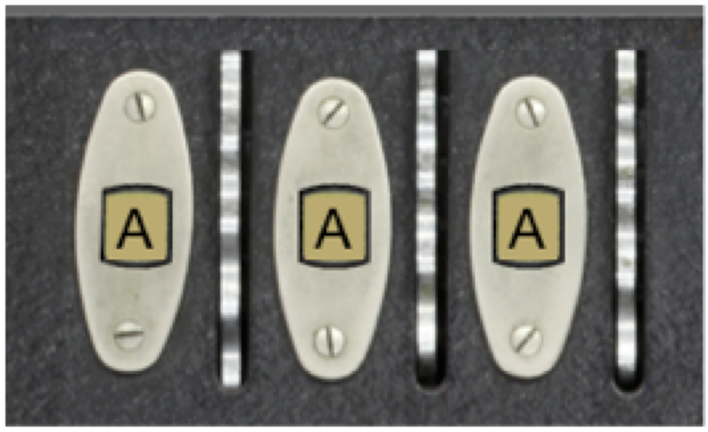

The encryption rotors for the machine are positioned underneath the top of the Enigma panel. The only part of the rotor that you can see is the single letter that appears in the window at the top of the Enigma image. For example, in the diagram shown in [the introduction](../introduction/existing_code.qmd#fig-StartScreen), you see the letters

{width=50%}

at the top of the window. The letters visible through the windows are printed along the side of the rotor and mounted underneath the panel so that only one letter is visible at a time for each rotor. When a rotor turns one notch, the next letter in the alphabet appears in the window. The act of moving a rotor into its next position is called _advancing_ the rotor and is discussed in more detail in the description of Milestone 5.


For this milestone, your job is to design a data structure that maintains the state of the rotors. There are three rotors in the standard Enigma machine. As described previously, the rotor on the right advances on each keystroke and is called the _fast rotor_. Each of the other rotors advances only when the rotor to its right has made a complete revolution. The middle rotor therefore advances only once ever 26 keystrokes, and is called the _medium rotor_. The rotor on the left is the _slow rotor_, and advances only once in 676 ($26 \times 26$) keystrokes.

The fact that there are three rotors in a linear arrangement suggests that an appropriate data structure would be a list in which the rotor number serves as an index. But what are the values of each of those list elements? One possible strategy is simply to store the letter that appears in the rotor window, because that is the value that changes as the rotors turn. Although it would be possible to implement the Enigma simulator using that approach, doing so fails to take advantage of the power of object-oriented programming.

The Enigma rotor has several characteristics that suggest that each rotor should be modeled as an object. For one thing, rotors have multiple components in their state. In addition to the letter that appears in the window, each rotor encrypts letters using a different wiring configuration. Moreover, as you will discover in Milestone 4, each rotor in fact implements two wiring offsets, one for when the signal is moving across the rotors from right to left and another for when the signal is moving from left to right. Since these wiring offsets are part of each rotor's state, it makes sense to include them as part of the object. In addition to this state information, rotors exhibit behavior. Rotors _advance_. Using an custom class to represent a rotor makes it possible to encapsulate that behavior together with the data.

Your job is Milestone 2 is therefore to define an `EnigmaRotor` class that combines the information about a rotor into a single object. Each rotor stores its list of wiring offsets and an indication of how far it has advanced from its initial position (in which the letter `A` appears in the rotor window). This value is easiest to store as an integer, which is called the rotor's _progress_. The definition of `EnigmaRotor` therefore needs to export the following methods:

- A constructor that takes the rotor wiring offsets, represented as a 26-element list. Owing to the mutability of lists, it is probably best to make a copy and assign that to the attribute. The constructor should initialize the rotor progress to 0.
- A `get_progress` method that returns the current value of the progress.
- An `advance` method that adds one to the progress, cycling back to 0 when the rotor has made a full revolution. For Milestone 5, you will have to make a small adjustment to this method to handle the process of propagating the advance operation to the next rotor after a complete revolution, but you can ignore that detail for now. In addition incrementing the `progress` attribute, advance should take care of advancing the wiring offsets one position: taking the front wiring offset value and moving it to the end of the list. This simulates the rotation of the rotor moving different wiring pairs into contact with new inputs and outputs.


Once you have defined the `EnigmaRotor` class, you need to create the rotors when you initialize the `EnigmaModel` class. The wiring offsets for each of the three rotors--which in fact correspond to rotors in the real World War II Enigma machine--are supplied in the `EnigmaConstants.py` file in the form of the following array:
```python
S_ROTOR_WIRING = [ 4,9,10,2,7,1,23,9,13,16,3,8,2,9,10,18,7,3,0,22,6,13,5,20,4,10 ]
M_ROTOR_WIRING = [ 0,8,1,7,14,3,11,13,15,18,1,22,10,6,24,13,0,15,7,20,21,3,9,24,16,5 ]
F_ROTOR_WIRING = [ 1,2,3,4,5,6,22,8,9,10,13,10,13,0,10,15,18,5,14,7,16,17,24,21,18,15 ]

ROTOR_WIRING = [
    S_ROTOR_WIRING,
    M_ROTOR_WIRING,
    F_ROTOR_WIRING,
]
```
The wiring offsets for the slow rotor, for example, are `[ 4,9,10,2,7,1,23,9,13,16,3,8,2,9,10,18,7,3,0,22,6,13,5,20,4,10 ]`, which correspond to the below connections. It is easy to see that the first contact on the right connects to the 5th contact on the left, resulting in the ``offset'' of 4 that is seen in the wiring offset list.

```{r engine='tikz'}
#| echo: false
#| fig-align: center
#| fig-ext: svg
#| out-width: 100%
\begin{tikzpicture}
    \node[font=\huge] at (12.5, 4) {Right Connections};
    \node[font=\huge] at (12.5, -1) {Left Connections};
    \foreach \x in {0, 1, 2, ..., 25} {
        \draw[fill=gray] (\x, 3) circle (2mm);
        \draw[fill=gray] (\x, 0) circle (2mm);
    }
    \foreach \o [count=\i from 0] in {4,9,10,2,7,1,23,9,13,16,3,8,2,9,10,18,7,3,0,22,6,13,5,20,4,10} {
        \pgfmathsetmacro{\out}{mod(\i+\o, 26)};
        \draw[very thick] (\i, 3) -- (\out, 0);
    }
    \pgfmathsetmacro{\out}{mod(4, 26)};
    \draw[line width=4pt, red!50!black] (0, 3) -- (\out, 0);
\end{tikzpicture}
```


At the moment, you do not need to do anything further with these wiring offsets: you will have a chance to do that in Milestone 3. All you need to do here is store the wiring offsets for each rotor as part of the Python object that defines the rotor. For example, if you are creating the slow rotor, you have to store the corresponding wiring offset list as a new attribute in the `EnigmaRotor` object.

To complete this milestone, you need to make two additional changes in `EnigmaModel.py`:

- Change the definition of `get_rotor_letter` so that it determines the letter in the rotor window by asking the `EnigmaRotor` object for its `progress` and then translating that progress to one of the 26 letters in the alphabet.
- Update the definition of `rotor_clicked` so that it calls the `advance` method of the specified rotor. You don't need to think about implementing the process of carrying to the next rotor position until Milestone 5.
