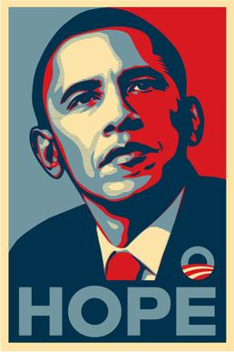
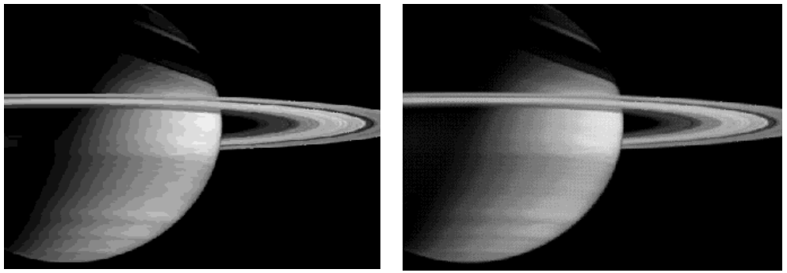

This project offers essentially unlimited possibilities for extensions. All you need to do is implement features from your favorite image editor! Here are a few ideas though:

- _Implement a "posterize" button._ Shepard Fairey's iconic design of the campaign poster for President Obama's 2008 campaign was widely adapted for other drawings. In this image, all pixels are converted to the closest equivalent color chosen from a restricted list of colors. The image below, for example, contains only red, an off-white ivory tone, and three shades of blue. Your extension could, for example, replace all intermediate colors with the closest match in Java's predefined color palette or use some other strategy you find by searching around the web or thinking up on your own!

  

- _Implement an averaging filter._ When using low-resolution cameras, images can look rather blotchy. The rightmost image below, for example, shows an image of Saturn taken by the Cassini probe. You can create an image like the one on the right, which looks much smoother, by replacing each pixel with a weighted average of its own luminance and that of its nearest neighbors. You could add a button to your ImageShop program that performs this sort of average.

  

- _Add a touch-up tool._ If you need to edit an image, it is particularly useful to have a pencil-like tool that allows you to drop a new color on any pixel in the image. The usual strategy is to allow the user to pick a color first and then change individual pixels to that color by clicking on them with the mouse.
- _Implement a crop box._ In the basic assignment, the mouse is used only for buttons, but you could also use it to draw a rectangle on the screen and then limit the functions of the other operators to the region inside the rectangle. It could also make sense to add a **Crop** button that eliminates all pixels outside the crop box.
- _Whatever else you want!_ Go wild! Lots of room for some potential ++ scores on this assignment.

