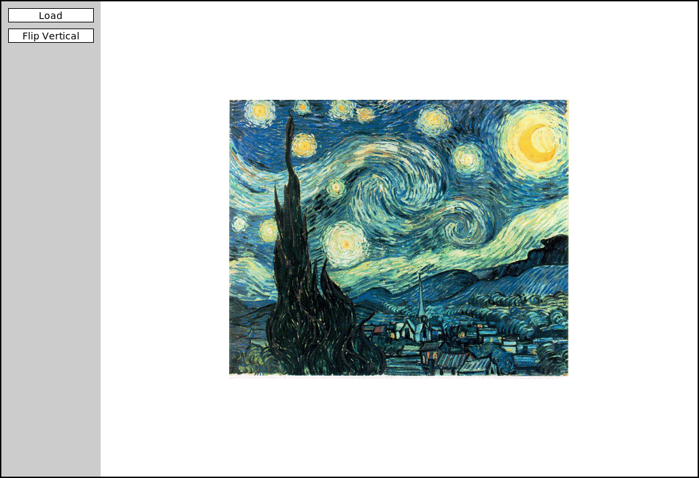
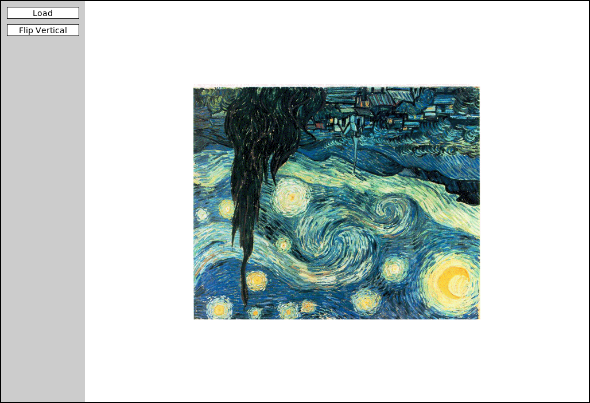

This repository contains a skeleton version of `ImageShop.py`, which is the main module that you will need to modify (although you will have to create one other).
There are a few other useful library files you will need for this project as well included, so take the time to browse over what resources are available to you.
Running the `ImageShop.py` code in the repository will initially create the screen image shown in @fig-StartScreen, which includes a button area to the left of the screen with **Load** and **Flip Vertical** buttons and then a blank area to the right where the image will be displayed.

Clicking **Load** brings up a file chooser that lets you select an image.
A directory of sample images has been included in the repository, so if you navigate to the `images` folder you will see a list of the image files included in this project.
If you select `VanGogh-StarryNight.png`, ImageShop will load that file and center it in the image area, as shown in @fig-VanGogh. If you then click the **Flip Vertical** button, you will get the picture shown in @fig-VanGoghFlip, with the inverted image.
Clicking the **Flip Vertical** button again restores the original image.

::: {#fig-startrun layout-ncol=3}
{#fig-StartScreen}

{#fig-VanGogh}

{#fig-VanGoghFlip}

Running the program and then loading and manipulating the `VanGogh-StarryNight.png` image in the supplied `images` folder in the repository.
:::

