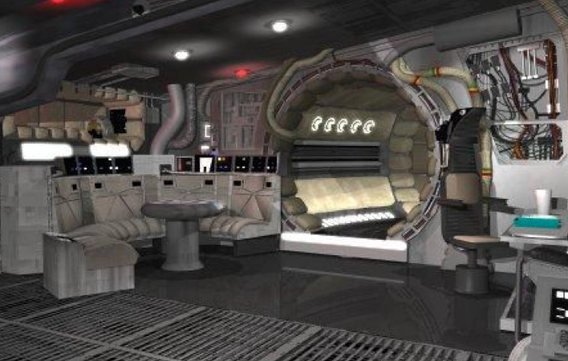
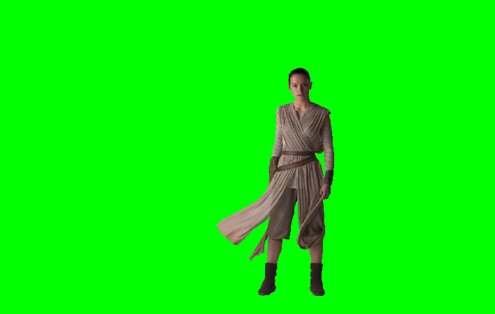

The **Green Screen** button implements an operation that is used all the time in movies to merge actors into a background scene. 
The basic technique is called _chroma keying_, in which a particular range of colors is used to represent a background that can later be made transparent using a computational process. 
The most common colors used in chroma keying are green and blue (which give rise to the more specific names green screen and blue screen) because those colors are most easily differentiated from flesh tones.

When the studios use the green screen technique, for example, the actors are filmed in front of a green background. 
The digital images are then processed so that green pixels are made transparent, so that the background shows through when the partially transparent image is overlaid on top of the background image.

To illustrate this process, suppose that you are making _Star Wars: The Force Awakens_ and that you want to superimpose an image of Daisy Ridley's character Rey on top of a shot of the interior of the Millennium Falcon shown in @fig-MFalcon.
You then shoot an image of Rey in front of a green screen like that shown in @fig-Rey.

:::{#fig-greencomps layout-ncol=2}
{#fig-MFalcon}

{#fig-Rey}

The two necessary component images for a composite green screen image.
:::

If you skip the green pixels in @fig-Rey and copy all the others on top of @fig-MFalcon, you get the composite image shown in @fig-Rey_N_Falcon.

{#fig-Rey_N_Falcon}

The user should always first load the desired background image as per usual using **Load**. Then, when the user clicks the **Green Screen** button, the first thing your program has to do is read in a new image using the `choose_input_file` function in the `filechooser` module in much the same way as the `load_action` function does in the supplied starter code.
Once you have the new `GImage`, you need to go through each pixel in both the old image and the new image and replace the old pixel value with the new one, unless the new pixel is green (at least by some definition).

It is unlikely though that the pixels that appear in the portion of the green screen image will have a color value exactly equal to the color `"Green"`. 
Instead, they will have pixel values that lie in a range of colors that appear to be "mostly green". 
For this part of the assignment, **you should treat a pixel as green if its green component is at least twice as large as the largest of its red and blue components.**

It is not necessary for the old image and the new image to have the same size.
Your program should assume that the upper left corners of the two images are at the same place, and update only those pixels whose coordinates exist in both images.
The final image, however, should be the same size as the original, and not the overlay.
If the images are the same size, as they are for the `Millenniumfalcon.png` and `ReyGreenScreen.png` in the images folder, then the overlay operation will include every pixel in the image.
Make sure you test overlaying Rey atop _other_ images to ensure that your function behaves properly for differently sized images!

:::callout-warning
The most common reason students lose points on this milestone is by not ensuring that their code works with all sorts of image sizes. **Test your code!** Overlay Rey atop every single other image in the image folder. You should never get any index out-of-bounds errors!
:::
