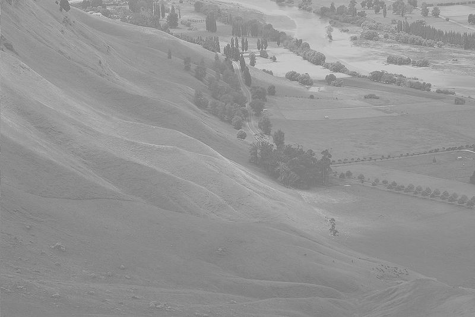
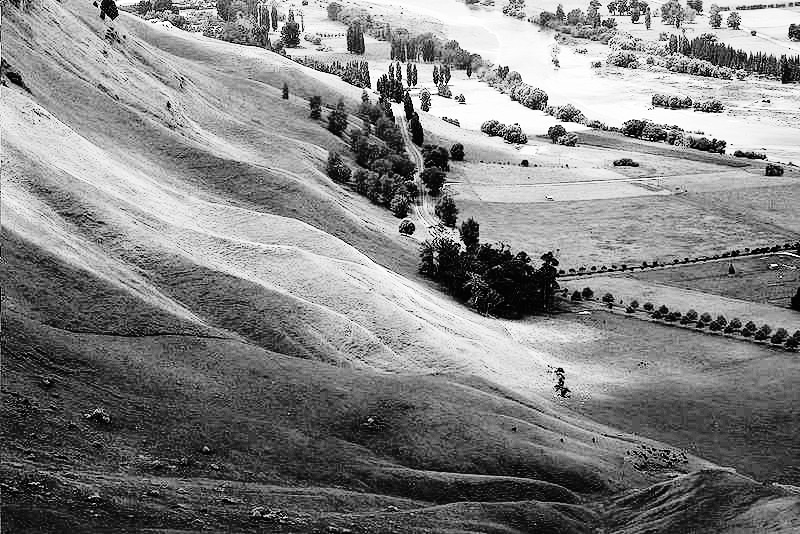
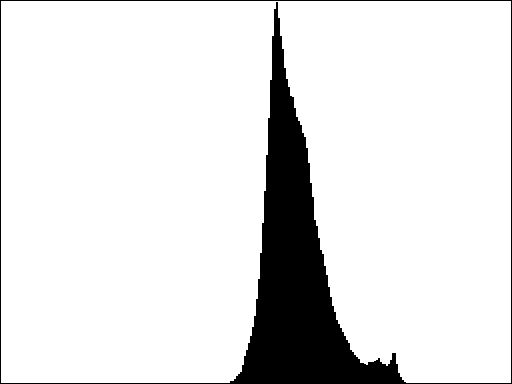
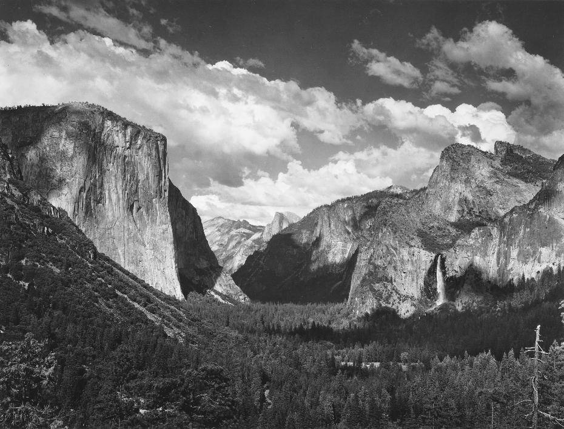
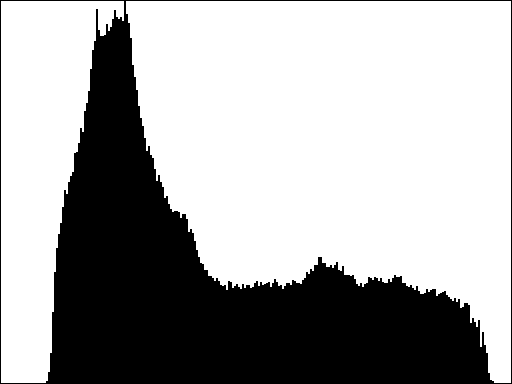
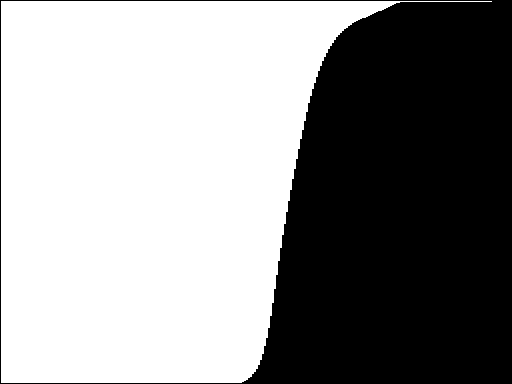
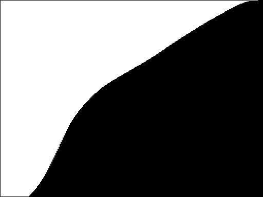

Digital processing can do an amazing job of enhancing a photograph.
Consider, for example, the countryside image on the left in @fig-enhance.
Particularly when you compare it to the enhanced version on the right, the picture on the left seems hazy.
The enhanced version is the result of applying an algorithm called _histogram equalization_, which spreads out the intensities shown in the picture to increase its effective contrast and make it easier to identify individual features.

:::{#fig-enhance layout-ncol=2}




Before and after images illustrating the histogram equalization algorithm results. Left image from [Wikipedia](http://en.wikipedia.org/wiki/File:Unequalized_Hawkes_Bay_NZ.jpg).
:::

As described in Section 8.7 of the PDF reader (and [in class](https://jrembold.github.io/Website_Backup/class_files/cs151/Slides/slides/Ch7_4.html#/pixel-contents)), the individual pixels in an image are represented using four single-byte values, one for the transparency of the image and three representing the intensity of the red, green, and blue components of the color. 
The human eye perceives some colors as brighter than others, much in the same way that it perceives audible tones of certain frequencies as louder than others. 
The color green, for example, appears brighter than either red or blue, and if our eyes were more sensitive to violet hues, the sky would appear more purple instead of the blue we currently see!

### Understanding Luminance

This concept of brightness can be quantified using the idea of _luminance_, as described on page 262 in the PDF reader.
That idea is implemented as a `luminance` function, which is defined in the `GrayscaleImage` module in the repository.
The value returned by `luminance` is an integer between 0 and 255, just like the intensity values for red, green, and blue. A luminance of 0 indicates black, a luminance of 255 indicates white, and any other color falls somewhere in between.

The histogram-equalization algorithm you need to write for this assignment uses luminosities rather than colors and therefore produces a grayscale image, much as you did when you implemented the **Grayscale** button.

The entire histogram-equalization process requires several steps, each of which is best coded as a helper function. Because all of these functions will be related to the same idea, it is recommended to write them all in their **own file**, perhaps called `equalization.py`, and then import what you need into `ImageShop.py`. The various pieces (and functions) that you'll want to write are described in the follow sub-milestones.

### Calculating the image histogram

Given an image, there may be multiple pixels that all have the same luminance.
In fact, there almost certainly are!
After all, there are only 256 possible luminance values, and most images will have thousands of individual pixels.
An _image histogram_ is a representation of the distribution of the luminance throughout the image.
Specifically, the histogram is an array of 256 integers--one for each possible luminance--where each entry in the array represents the number of pixels in the image with that luminance.
For example, the entry at index 0 of the array represents the number of pixels in the image with a luminance of 0 (or pure black).
The entry an index 1 represents the number of pixels in the image with luminance of 1 (almost pure black), and so on and so forth. Your task in this sub-milestone is to write a function to generate an image histogram of the luminosities of a provided image or pixel array.

Looking at an image's histogram tells you a lot about the distribution of brightness throughout the image.
The images at the top of @fig-contrastcompare, for example, shows the original low-contrast picture of the countryside, along with its image histogram.
The bottom row shows an image and histogram for a high-contrast image.
Images with low contrast tend to have histograms more tightly clustered around a small number of values, while images with higher contrasts tend to have histograms that are more spread out over the full possible range of values.

:::{#fig-contrastcompare layout-ncol=2 layout-nrow=2 layout-valign="center"}








Comparison of histograms for a low contrast image (top) and a high contrast image (bottom). Higher contrast images result in a much broader spread of the image luminosities in the histogram. Bottom left image from [Ansel Adams Gallery](https://www.sfmoma.org/artwork/57.941/).
:::

The point of making this an intermediate sub-milestone is to emphasize that you need to test it, even if it isn't easy to see the result. The histogram array will have 256 elements. You can either print the histogram on the console or use the graphical histogram functions from the most recent problem set to check whether your distribution matches the above graphs.

### Calculating the cumulative histogram

Related to the image histogram is the _cumulative histogram_, which shows not simply how many pixels have a particular luminance, but rather how many pixels have a particular luminance **or lower**.
Like the image histogram, the cumulative histogram is an array of 256 values: one for each possible value of the luminance.
You can compute the cumulative histogram purely from the image histogram.
Each entry in the cumulative histogram is the sum of all the entries in the image histogram up to and including that index position.
As an example, if the first six entries in the image histogram are:
```.python
[1, 3, 5, 7, 9, 11]
```
then the corresponding entries in the cumulative histogram are calculated as:
```.python
[1, 1+3, 1+3+5, 1+3+5+7, 1+3+5+7+9, 1+3+5+7+9+11]
```
or, in other words:
```.python
[1, 4, 9, 16, 25, 36]
```
In @fig-cumhists we can see the cumulative histograms for the two images from @fig-contrastcompare.
Notice how the low-contrast image has a sharp transition in its cumulative histogram, while the higher-contrast image tends to have a smoother increase over time.

:::{#fig-cumhists layout-ncol=2 layout-nrow=2 layout-valign="center"}
{width=100% height=100%}

{width=100% height=100%}




Comparison of cumulative histograms for a low contrast image (top) and a high contrast image (bottom). Lower contrast images tend to create a much sharper "wall" in the cumulative histogram, versus the more gradual increase in higher contrast images.
:::

After creating these cumulative histograms, you could still test them using the same visualization tools you used for the normal histograms! Make sure things are looking correct before continuing!


###  The histogram-equalization algorithm

The cumulative histogram provides just what you need for the histogram-equalization algorithm.
To get a sense to how it works, it helps to start with an example.
Suppose that you have a pixel in the original image whose luminance is 106.
Since the maximum possible luminance for a pixel is 255, this means that the "relative" luminance of this pixel is $106 / 255 \approx 41.5$ percent, which means that the pixel's luminance is roughly 41.5 percent of the maximum possible.
If you were to assume that all the intensities were distributed evenly across the image (as would be the case in a high contrast image), you would expect this particular pixel to have a brightness greater than 41.5 percent of the other pixels in the image.

Similarly, suppose you have another pixel in the original image whose luminance is 222.
The relative luminance of this pixel is $222/255 \approx 87.1$ percent, so we would expect that, should the intensities be evenly distributed, this pixel would be brighter than 87.1 percent of the pixels in the image.

The histogram equalization algorithm works by trying to change the intensities of the pixels in the original image as follows: if a pixel is supposed to be brighter than $X$ percent of the pixels in the image, then the algorithm attempts to map it to a luminance that will make it brighter than as close to $X$ percent of the total pixels as possible. In doing so, the algorithm attempts to more evenly distribute the luminosities across the total available options. Implementing this process turns out to be much easier than it might seem, especially if you have the cumulative histogram for an image.

The key idea is as follows.
Suppose that an original pixel in the image has luminance $L$.
If you look up the $L^{th}$ entry in the cumulative histogram for the image, you will get back the total number of pixels in the image that have luminance of $L$ or less (that is literally what the cumulative histogram tells you).
You could then convert this value into the fraction of pixels in the image with luminance $L$ or less by dividing by the total number of pixels in the image.
Once you have the fraction of pixels with intensities less than or equal to the current luminance $L$, you can scale this number (which is currently between 0 and 1) so that it is between 0 and 255, which produces a valid luminance.
The histogram equalization therefore consists of the following steps:

1. Compute the image histogram from the original image
2. Compute the cumulative histogram from the image histogram
3. Replace each luminance value (L) in the original image using the formula:
    $$\text{new luminance} = \frac{255 \times \text{ cumulative histogram[L]}}{\text{ total number of pixels }} $$

As a reminder, your task in this part of the assignment will be considerably easier if you decompose the problem into several helper functions and test each function independently as you go.
The algorithm for performing histogram equalization is sufficiently complex that it would make sense to code it as a separate module by itself and import the necessary functions into `ImageShop.py`.
