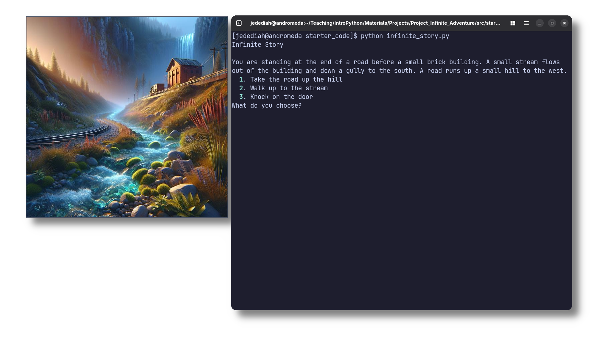
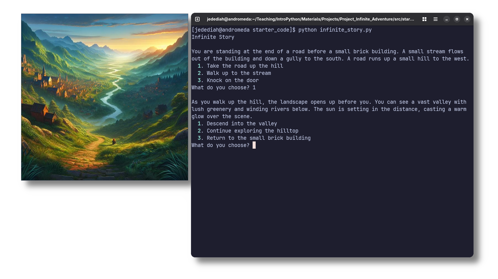
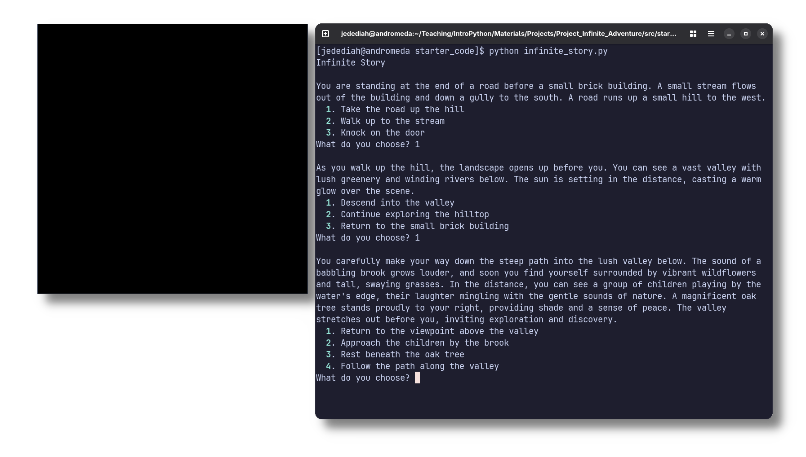

You are exploring a new world. Initially, almost every scene seems normal, but if the player continues to explore enough, they will slowly start to uncover some mysterious parts...

In this assignment, you will write a choose-your-own-adventure game that harnesses the power of generative AI. You will get to apply the knowledge you have learned about dictionaries and lists and combine that with making requests to ChatGPT to ultimately help guide you user through a mystical adventure. In the end, you will have a chance to reflect on some of the ethical implications underlying the use of generative AI in storytelling applications.

Once completed, when the user starts the program it will look something like this:

The user can then choose what action to take next. Here they chose option 1, to take the road up the hill, resulting in this next scene:

Up to this point, it seems like a standard storytelling program. The magic happens when the user gets to a scene that hasn't been written yet. Instead of crashing the program, or just preventing the user from continuing, the program will make a request to ChatGPT to generate the next scene. The story continues!

One of the goals of this assignment is to get you continued practice decomposing your programs. In the milestones you'll be given suggestions for helpful functions. However, the flow of the program is ultimately in your capable hands.

That said, there are multiple files initially in the starting template. So next we'll cover how things are organized and where you need to be writing what.
