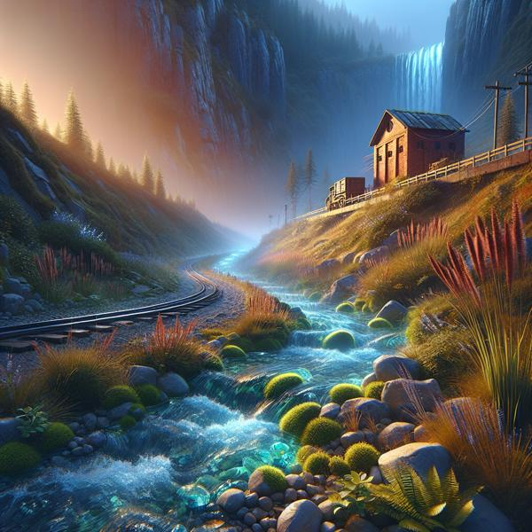

Perhaps you were travelling in a lush valley along a winding river, passing by quaint and charming brick cottages. Or maybe, once dusk has come upon us, you continue following this glowing, luminous stream to encounter a mysterious building with light pouring out of it. These visuals bring magic to the entire assignment--it is up to you to display them now to enhance the user's experience! For all of the scenes in `adventure.json` and `starter.json`, we have utilized Dall-E to generate a corresponding image. They are all saved in the `img` folder, as described earlier in this guide [here](../introduction/starting_template.qmd).

:::callout-important
While there are images for the vast majority of scenes, some scenes may be missing an image. This is especially true once you start having ChatGPT generate new scenes! If an image for the current scene does not exist, you should simply display a black rectangle on the canvas (or feel free to spice things up and display something else of your choice as an extension!). You do **not** need to be generating images yourself, and it is not currently a featured part of the NotOpenAI library owing to the increased cost of generating images.
:::

If you look within the `img` folder, you will see that all images are stored with a `.jpg` extension, and each has a filename identical to the scene_key which it is supposed to visualize. So, for example, the starting scene of "start" has the "img/start.jpg" image that looks like:

The path of an image is a string that tells you how you can get from a starting directory (in this case, the current folder where your `infinite_adventure.py` file lives) to the end destination (the desired image). We separate folders (directories) with slashes (`'/'`) to indicate what directories must be "clicked through" to get to our destination. Hence why the path to the image above is `"img/start.jpg"`.

So, whenever we enter a new scene, in addition to printing out the scene to the console, we want to check to see if the corresponding image exists, and, if it does, display it! We can use the PGL library to handle all of this, where you can create the window at the very beginning and then create a `GImage` for each new file to add to the window. Recall that if no image exists you want to instead display a black screen. Some hopefully helpful tips for when working on this milestone would include:

- Create the initial GWindow at the start of your program. Since all of the images are 600x600 pixels, it is probably the easiest and reasonable to just have the GWindow be the same size
- You can use your knowledge of concatenating strings to craft the needed path strings!
- The easiest way to check if an image exists or not is to use a feature from the `os` library (standing for operating system). You can use `os.path.exists(some path)` to check if a given path is valid. This is a predicate function, so it will return `True` if the image path exists, or `False` if no images exist at the given path.
- You'll need to create and add a new `GImage` for each scene, so clean up after yourself as you go and remove the old content. You could either do this with the `gw.remove(your image)`, or you could use `gw.clear()` to remove everything from the screen in one fell swoop.
- When the program is exited, your window will not automatically close. As such, you should use `gw.close()` to automatically close it in the case where a player doesn't enter in any prompt.

An optional suggestion is to write text on top of every image (maybe in the bottom left) that says "Generated by Dall-E". Otherwise, users might not know that these images are AI generated.

When you finish with this milestone, CONGRATULATIONS! Look at (and play) your program! What magic! You just implemented your first nested dictionaries, and your first generative AI project! We are so proud of you! ❤
