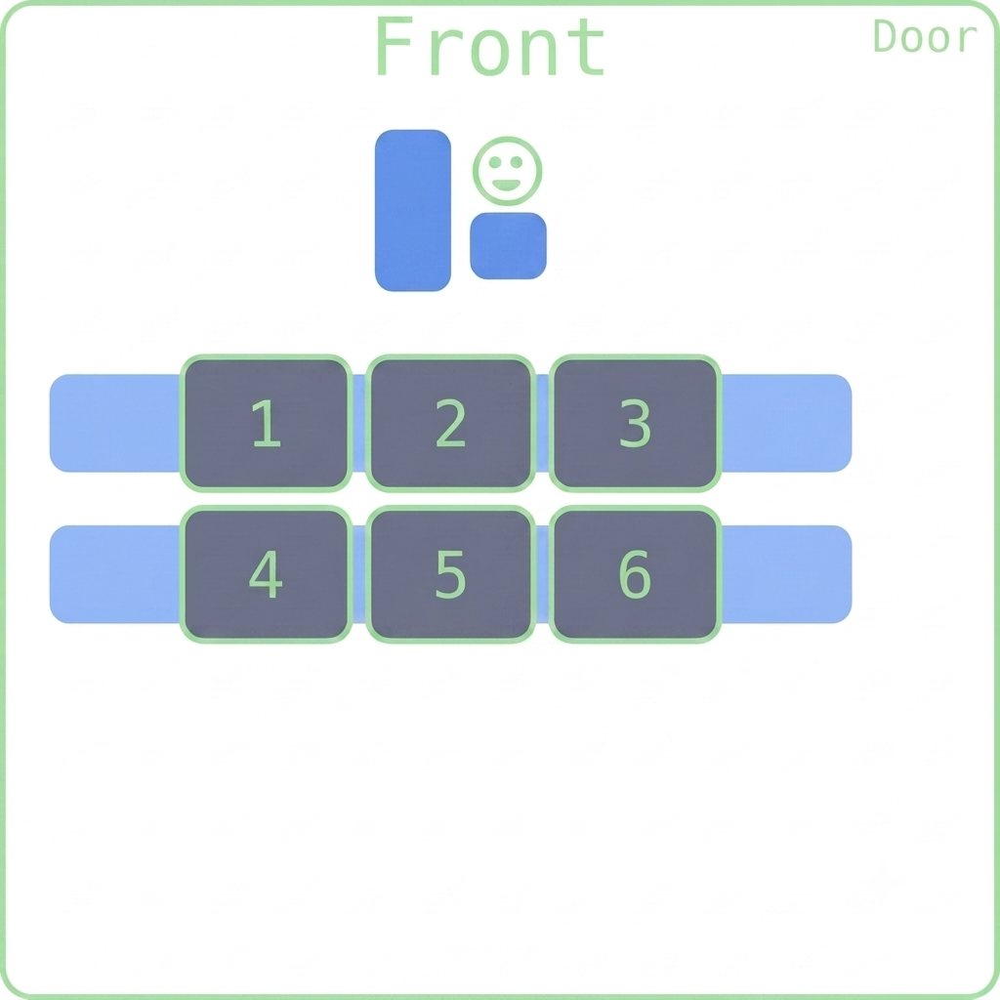

## Happy Friday!!
::::{style='font-size:.8em'}
- Today's Grouping: Scan the QR code or go to [https://tools.jedrembold.prof/daily](https://tools.jedrembold.prof/daily)
- Class code is `2FvLMX`
- Introduce yourselves! Fun question: If you had a magic box that consumed one type of object and output another, what would the inputs and outputs be?
::::
::::::cols

::::col
{width=60%}
::::
::::col
{width=60%}
::::
::::::

---

## Quick Announcements
- Feedback from the section meeting this week?
  - Attendance is mandatory
- Reminder to watch the videos and read the text. They help in better understanding and gives room for class activities
- Problem Set 1 is due on Monday night!
  - ***Monday September 7 is Labor Day - NO CLASS***
- Problem Set 2 will be posted on Monday 
  - __Due the following Monday, September 14th__

---

# Group Problems
---
<!-- ## Problem 1: The Assembly Line
- Each group has been handed a set of functions, one of which should be given to each individual. If you have fewer people, one person can double up.
- The blank slips of paper should be distributed amongst everyone
- Clustering around may be easier than being stretched out in a line
- Your overall goal is to determine the final printed number.

 ## Problem 1: How it works
- The individual with the `person_D` function starts things off
- Whenever a function is _called_ in your code, you must write any inputs to that function on a slip of paper, and then hand that paper to whichever individual is in charge of the function that you are calling.
- You then **must continue to hold out your hand** until that function/person returns a slip of paper to you. Then you can continue with your program.
- If your function ever _prints_ something, you need to say that value **out loud** whenever you hit that line of code. -->


## Problem 1: The Bureau of Standards
::::::{.cols style='align-items: center'}
::::{.col style='font-size:.9em'}
- Your group is tasked with creating a simple library of conversion functions
- Each individual should choose one of the conversions to the right, and write **two** functions: one that converts one direction, and one that converts the other
- Collect all of these functions together into a single file called `conversions.py`. It may be useful to use something like a shared Google Doc for quick sharing, or you can just dictate/copy from each other.
::::

::::col
- Feet to Kilometers
- Pounds to Grams
- Fahrenheit to Celsius
- Cups to Liters

::::
::::::

## Problem 2: Calling BS
- Now, in a separate file, write a program to solve the following word problem, importing in what functions you need.

> Johnny needs his 2000 lb car to travel 2000 feet down the road. He knows that it normally takes 1 cup of gas to move 5000 grams 0.5 kilometers down the road, when the temperature is 20 degrees Celsius. But for each degree Celsius above that, it takes an addition 0.5 liter of gas to move the 5000 grams 0.5 kilometers down the road. It is 83 degrees F outside. How many liters of gas does Johnny need?

:::notes
I think the answer is 973.9 liters?
:::


## Problem 3: The Error Doctor
- In the materials for today there are three problems named
  - `Error1.py`
  - `Error2.py`
  - `Error3.py`
- Each contains a function and a comment that explains the expected output. But something is wrong.
- Identify what is wrong in each case and how you could easily fix it.

<!-- Didn't get to
# Live-Coding

## Tis Quadratic
- Most people have seen or had to memorize the quadratic formula at some point in time. As a reminder, the equation
$$a\cdot x^2 + b\cdot x + c = 0$$
can be solved for $x$ according to
$$x = \frac{-b \pm \sqrt{b^2 - 4ac}}{2a} $$
- Define a function `quad` which takes 3 arguments `a,b,c` and returns the greater of the two solutions (by absolute value)

## A Solution
```{.python style='max-height: 800px; font-size:.8em;'}
# Added once completed!
``` -->

