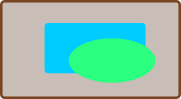
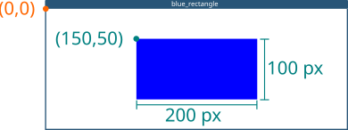

## Happy Wednesday!
::::{style='font-size:.8em'}
- Class grouping today: Scan the QR code or go to [https://tools.jedrembold.prof/daily](https://tools.jedrembold.prof/daily)
- Class code is `FJ9RC0`
- Introduce yourselves! What is your favorite shape?
::::

::::::cols

::::col
{width=60%}
::::
::::col
{width=60%}
::::
::::::

---

## Quick Announcements
- Project 1 ***Wordle*** is due on **Monday next week at 10pm**
	- Avoid late submission in order to have your work graded by the section leaders 
- Please attend your section (Today and tomorrow)! Attendance counts for participation and grades
	- Missing up to 3 attendance will remove 5% from your total grade
	- Majority of what you need for the project is learned in the section 
- Use the __Run_Journal__ and describe the run log properly; it counts towards the grades.
- Heads up about our first exam: it's a week from Friday!
	- Study materials will come out on or before Monday next week
	- Sections next week will be for reviewing and studying

---

## Wordle Tidbits
- Two useful ideas for Wordle:
	- You can check if an individual element is in a particular sequence of elements using the `in` keyword
	  
	  ```python
	  "1" in "12345"
	  ```
	  - Always returns a boolean (True/False)
	- You can change the case of all letters in a string using `upper()` or `lower()` methods
	  
	  ```python
	  lowered = "ABCDEF".lower()
	  uppered = "abcDEF".upper()
	  ```
	  - The method returns a **new** string, so make sure you assign it to something

---

## Nondeterministic Programming
- For Wordle, the game is only interesting if the secret word is not the same every time!
- Let's look at the built-in `random` library, which lets us simulate random processes
- Programs that involve random processes that cannot be predicted in advance are said to be _nondeterministic_
- Nondeterministic behavior is essential to many applications. 
	- Many games would not be enjoyable if they behaved the exact same way every playthrough
	- Important practical uses in simulations, computer security, and algorithm research

---

## Important Functions in `random`

:::{style='font-size: 80%'}

- Random Integers

|                          |                                                             |
| :---                     | :------                                                     |
| `randint(minv, maxv)`    | Returns an integer between minv and maxv, inclusive         |
| `randrange(limit)`       | Returns an integer from 0 up to but not including limit     |
| `randrange(start,limit)` | Returns an integer from start up to but not including limit |
| `random()`            | Returns a random float between 0 and 1       |
| `uniform(minv, maxv)` | Returns a random float between minv and maxv |
| `choice(a_list)`    | Returns a random element from `a_list`       |
| `sample(a_list, k)` | Returns a list of `k` elements from `a_list` |
| `shuffle(a_list)`   | Randomly reorders the elements of `a_list`   |

:::

---

## Random Examples
```{.python style='max-height:900px'}
import random

def random_redblue():
	if random.random() > 0.5:
		return "red"
	else:
		return "blue"

def random_color():
	color_string = "#"
	for i in range(6):
		color_string += random.choice("0123456789ABCDEF")
	return color
```

---

## Chapter 4: The Worth of a Picture
:::{style='font-size:.9em'}
- There comes a time when reading and entering text on a terminal doesn't cut it
	- Maybe you need more complicated input
	- Maybe you need a more complicated interface that pure text can manage
	- Maybe you have output that can not be shown as text
- Standard Python really only deals with the terminal interface
- Lots of outside libraries give Python more visual input/output
	- Turtle
	- Matplotlib
	- Tkinter <span class='fragment'>← PGL</span>
	- PyGame
	- Arcade
:::

---

## The Portable Graphics Library
- Built atop Tkinter
- The library (`pgl.py`) is available on the Canvas website 
	- Put it in the same folder as your code, and then you can import it
- Operates on the idea of a collage or cork-board



- Note that newer objects can obscure older objects. This layering arrangement is called the _stacking order_.

---

## The Pieces
- At its simplest then, we have two main parts:
	- The window (or felt-board/cork-board)
		- Created with the `GWindow` function
		- Takes two arguments: a width and a height in pixels
	- The contents
		- A wide assortment of shapes and lines that can be added to the scene
		- Control over where they are placed, how large they are, what color they are, etc

---

## Blue Rectangle!
```{.python data-line-numbers="1|3,4|6|7|8|9|10|11"}
from pgl import GWindow, GRect

GW_WIDTH = 500
GW_HEIGHT = 200

gw = GWindow(GW_WIDTH, GW_HEIGHT)
rect = GRect(150, 50 ,200, 100)
rect.set_color("Blue")
rect.set_filled(True)
gw.add(rect)
```

---

## The Coordinate System


- Positions and distances on the screen are measured in terms of pixels
- The location of the origin and orientation of the y-axis are **different from math**!
	- Origin is in the upper left instead of lower left
	- Y-values increase as you move downwards

---

# Group Problems
- Download the starter codes from the class Discord Channel

---

## Problem 1: 5d100s
- Every week before we start playing, each person in my D&D group rolls 5 (virtual) 100-sided dice
	- A 100-sided dice has numbers 1-100 on its faces
- We like to use the _sum_ of the 5 dice to predict how lucky or unlucky we'll be that night
- But what would be exceptional?
- Your group's task: Roll 5 100-sided dice 10,000 times. What is the maximum value you got?

---

## Problem 2: Olympic Flags
- With the Olympics going on, you've probably seen way more international flags than usual
- Let's recreate some in PGL!
- Each member of your group should choose a different flag. Your task is to recreate it as exactly as possible.
- A list of countries with flags that would be very approachable with our current shapes follows on the next slide
	- You'll need to search for the flag itself to see what you need to replicate (Wikipedia is great for this)

---

## Country Flag Options
::::::cols
::::col
- Italy
- Japan
- Laos
- Germany
::::

::::col
- Thailand
- Latvia
- Switzerland
- France

::::
::::::

---

## Problem 3: The Drunken Robot
- Determine the middle of your window and save the `x` and `y` coordinates. This is your robots current location.
- Draw a 25x25 square at that location (doesn't need to be centered, but could be!)
	- Make it filled with a fill color of your choice
- Now, for 50 iterations:
	- Determine the next direction (North, South, East or West) randomly
	- Update the robot's location variables accordingly, assuming they moved exactly 25 pixels in that direction
	- Draw a **new** square at the robot's new location (with a different fill color than your starting color)
- Admire your robot's little drunken walk! Play around with more iterations!

---

# Live Coding

## Estimating Pi
- One of the ways that the value of $\pi$ can be estimated is by looking at the number of random points that strike a circle vs a surrounding box
- Our task here is to both estimate they value of $\pi$ using random numbers in this fashion, but to also visualize it!

---

## A Solution
- TO BE PASTED!!!

<!-- ```{.python style='max-height: 800px; font-size: .8em'}
from pgl import GWindow, GRect, GOval
import random

WIDTH = 800
HEIGHT = 800

SIZE = 700
DART_SIZE = 10

gw = GWindow(WIDTH, HEIGHT)

background = GRect(
    WIDTH / 2 - SIZE / 2,
    HEIGHT / 2 - SIZE / 2,
    SIZE,
    SIZE
)
background.set_filled(True)
background.set_color('gray')
gw.add(background)

target = GOval(
    WIDTH / 2 - SIZE / 2,
    HEIGHT / 2 - SIZE / 2,
    SIZE,
    SIZE
)
target.set_filled(True)
target.set_color('darkgray')
gw.add(target)

attempts = 1000
successful_strikes = 0
for i in range(attempts):
    x = random.uniform(WIDTH / 2 - SIZE / 2, WIDTH / 2 + SIZE / 2)
    y = random.uniform(HEIGHT / 2 - SIZE / 2, HEIGHT / 2 + SIZE / 2)
    dart = GOval(
        x - DART_SIZE / 2,
        y - DART_SIZE / 2,
        DART_SIZE,
        DART_SIZE
    )
    dart.set_filled(True)
    distance_to_center = (
        (x - WIDTH / 2)**2 + (y - HEIGHT / 2)**2
    ) ** (1/2)
    if distance_to_center < SIZE / 2:
        dart.set_fill_color('red')
        successful_strikes += 1
    else:
        dart.set_fill_color('blue')
    gw.add(dart)

print(successful_strikes / attempts * 4 )
``` -->
