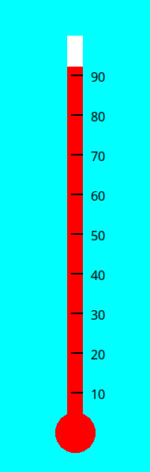
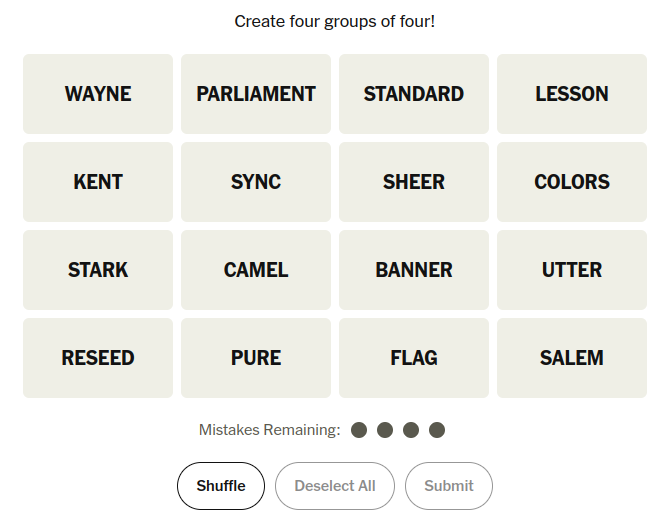

## Happy FRIDAY!
::::{style='font-size:.8em'}
- Class grouping today: Scan the QR code or go to [https://tools.jedrembold.prof/daily](https://tools.jedrembold.prof/daily)
- Class code is `bR9RLT`
- Introduce yourselves! What is your favorite shape?
::::

::::::cols

::::col
{width=60%}
::::
::::col
{width=60%}
::::
::::::

---

## Quick Announcements
- Project 1 ***Wordle*** is due on **Monday next week at 10pm**
	- Hopefully, people are making significant progress with the milestones
- Heads up: Our first __Midterm exam__ is a week from now!
	- Study materials will come out on or before Monday next week
	- Sections next week will be for reviewing and studying
	- More info about the midterm on Monday
- Need accommodations? Book a spot with Testing center by emailing them, and be sure to copy me 

---

# Wednesdays left off
- Supposed live coding

---

## Estimating Pi
- One of the ways that the value of $\pi$ can be estimated is by looking at the number of random points that strike a circle vs a surrounding box
- Our task here is to both estimate they value of $\pi$ using random numbers in this fashion, but to also visualize it!

---

## A Solution

```{.python style='max-height: 800px; font-size: .8em'}
from pgl import GWindow, GRect, GOval
import random

WIDTH = 800
HEIGHT = 800

SIZE = 700
DART_SIZE = 10

gw = GWindow(WIDTH, HEIGHT)

background = GRect(
    WIDTH / 2 - SIZE / 2,
    HEIGHT / 2 - SIZE / 2,
    SIZE,
    SIZE
)
background.set_filled(True)
background.set_color('gray')
gw.add(background)

target = GOval(
    WIDTH / 2 - SIZE / 2,
    HEIGHT / 2 - SIZE / 2,
    SIZE,
    SIZE
)
target.set_filled(True)
target.set_color('darkgray')
gw.add(target)

attempts = 1000
successful_strikes = 0
for i in range(attempts):
    x = random.uniform(WIDTH / 2 - SIZE / 2, WIDTH / 2 + SIZE / 2)
    y = random.uniform(HEIGHT / 2 - SIZE / 2, HEIGHT / 2 + SIZE / 2)
    dart = GOval(
        x - DART_SIZE / 2,
        y - DART_SIZE / 2,
        DART_SIZE,
        DART_SIZE
    )
    dart.set_filled(True)
    distance_to_center = (
        (x - WIDTH / 2)**2 + (y - HEIGHT / 2)**2
    ) ** (1/2)
    if distance_to_center < SIZE / 2:
        dart.set_fill_color('red')
        successful_strikes += 1
    else:
        dart.set_fill_color('blue')
    gw.add(dart)

print(successful_strikes / attempts * 4 )
```

---

# Group Problems

---

## Problem 1: The Big Dipper
- You are provided with a file already with a night scene of the Big Dipper
- Your task is to draw in the lines connecting the proper stars
- No copy/pasting numbers here! Use methods to grab the needed coordinates from the star ovals

---

## Problem 2: Label Bounder
- Write a program that:
	- Chooses a random English word and sets it to a GLabel
		- You can place the word starting on the left of the screen, roughly halfway down
	- Sets the font of that GLabel to a random size between 20 and 100pt, serif
	- Draws a rectangle immediately around the GLabel, such that its top is at the ascent distance and bottom at the descent distance.

---

## Example Solution
```python
from pgl import GWindow, GLabel, GRect
import random
from english import ENGLISH_WORDS

WIDTH = 500
HEIGHT = 200

gw = GWindow(WIDTH, HEIGHT)

word = random.choice(ENGLISH_WORDS).capitalize()
size = random.randint(20, 100)

label = GLabel(word, 0, HEIGHT / 2)
label.set_font(f"{size}pt serif")
gw.add(label)

box = GRect(
    label.get_x(),
    label.get_y() - label.get_ascent(),
    label.get_width(),
    label.get_ascent() + label.get_descent()
)
box.set_color('red')
gw.add(box)

```

---

## Problem 3: What's the Temp?
::::::cols
::::{.col style='flex-grow: 2'}
- I've already created the basic thermometer to the right with a randomly set temperature
- Your job is to add the line markers and temperature labels, getting as close as possible to the image
- There are some constants defined in the starter file to help!
::::

::::col


::::
::::::

---

## Example Solution
```python
# Just continuing from the starting template...

temp = 10
for i in range(MARKER_START_Y, BASE - THERM_HEIGHT, -MARKER_STEP):
    line = GLine(
        WIDTH / 2 + THERM_WIDTH / 2,
        i,
        WIDTH / 2 - THERM_WIDTH / 4,
        i
    )
    line.set_line_width(2)
    gw.add(line)

    lab = GLabel(f"{temp}", WIDTH / 2 + THERM_WIDTH, i)
    gw.add(
        lab,
        WIDTH / 2 + THERM_WIDTH,
        i + lab.get_ascent() / 2
    )
    temp += 10
```

---

# Live Coding

---

## Recreating Connections
::::::cols
::::col
- Suppose we want to recreate the starting layout of the NYT's Connections game
- The puzzle for today looks like the image to the right
::::

::::col

::::
::::::

---

## Code 

- Sample solution to come!!!
<!-- ```{.python style='font-size:.8em'}
from pgl import GWindow, GRect, GLabel

"""
Algorithm:
    Make a bunch of box with text in them
    Assign each box a location, and add it
"""

def make_and_place_box(word, x, y):
    """Make a box with the desired word centered in it

    Algorithm:
        Make a box of the desired dimensions
        Make a label with the text
        Center that label in the box
        Add everything to the window
    """
    box = GRect(x, y, BOX_WIDTH, BOX_HEIGHT)
    label = GLabel(word.upper())
    label.set_font("bold 20pt sans-serif")
    new_x = x + BOX_WIDTH / 2 - label.get_width() / 2
    new_y = y + BOX_HEIGHT / 2 + label.get_ascent() / 2

    gw.add(box)
    gw.add(label, new_x, new_y)

BOX_WIDTH = 200
BOX_HEIGHT = 100
BOX_SEP = 10

WIDTH = 4 * (BOX_WIDTH + BOX_SEP)
HEIGHT = 4 * (BOX_HEIGHT + BOX_SEP)

gw = GWindow(WIDTH, HEIGHT)

# Row 1
make_and_place_box('wayne', 
                    BOX_SEP / 2,
                    BOX_SEP / 2)
make_and_place_box('parliament', 
                    BOX_SEP / 2 + (BOX_WIDTH + BOX_SEP),
                    BOX_SEP / 2)
make_and_place_box('standard', 
                    BOX_SEP / 2 + 2 * (BOX_WIDTH + BOX_SEP),
                    BOX_SEP / 2)
make_and_place_box('lesson', 
                    BOX_SEP / 2 + 3 * (BOX_WIDTH + BOX_SEP),
                    BOX_SEP / 2)

# Row 2
make_and_place_box('kent', 
                    BOX_SEP / 2, 
                    BOX_SEP / 2 + (BOX_HEIGHT + BOX_SEP))
make_and_place_box('sync',
                    BOX_SEP / 2 + (BOX_WIDTH + BOX_SEP), 
                    BOX_SEP / 2 + (BOX_HEIGHT + BOX_SEP))
make_and_place_box('sheer', 
                    BOX_SEP / 2 + 2 * (BOX_WIDTH + BOX_SEP),
                    BOX_SEP / 2 + (BOX_HEIGHT + BOX_SEP))
make_and_place_box('colors', 
                    BOX_SEP / 2 + 3 * (BOX_WIDTH + BOX_SEP), 
                    BOX_SEP / 2 + (BOX_HEIGHT + BOX_SEP))

# Row 3
make_and_place_box('stark', 
                    BOX_SEP / 2, 
                    BOX_SEP / 2 + 2 * (BOX_HEIGHT + BOX_SEP))
make_and_place_box('camel', 
                    BOX_SEP / 2 + 1 * (BOX_WIDTH + BOX_SEP), 
                    BOX_SEP / 2 + 2 * (BOX_HEIGHT + BOX_SEP))
make_and_place_box('banner', 
                    BOX_SEP / 2 + 2 * (BOX_WIDTH + BOX_SEP), 
                    BOX_SEP / 2 + 2 * (BOX_HEIGHT + BOX_SEP))
make_and_place_box('utter', 
                    BOX_SEP / 2 + 3 * (BOX_WIDTH + BOX_SEP), 
                    BOX_SEP / 2 + 2 * (BOX_HEIGHT + BOX_SEP))

# Row 4
make_and_place_box('reseed', 
                    BOX_SEP / 2, 
                    BOX_SEP / 2 + 3 * (BOX_HEIGHT + BOX_SEP))
make_and_place_box('pure', 
                    BOX_SEP / 2 + 1 * (BOX_WIDTH + BOX_SEP), 
                    BOX_SEP / 2 + 3 * (BOX_HEIGHT + BOX_SEP))
make_and_place_box('flag', 
                    BOX_SEP / 2 + 2 * (BOX_WIDTH + BOX_SEP), 
                    BOX_SEP / 2 + 3 * (BOX_HEIGHT + BOX_SEP))
make_and_place_box('salem', 
                    BOX_SEP / 2 + 3 * (BOX_WIDTH + BOX_SEP), 
                    BOX_SEP / 2 + 3 * (BOX_HEIGHT + BOX_SEP))
``` -->
