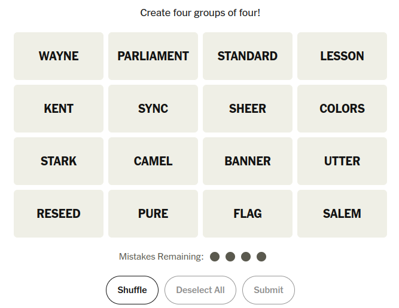

## Happy New Week 6!
::::{style='font-size:.8em'}
- Class grouping today: Scan the QR code or go to [https://tools.jedrembold.prof/daily](https://tools.jedrembold.prof/daily)
- Class code is `bR9Zoo`
- Introduce yourselves! What is your favorite Python function?
::::

::::::cols

::::col
{width=60%}
::::
::::col
{width=60%}
::::
::::::

---

## Quick Announcements
- Project Wordle is ***due today at 10 pm***.
- Problem set 3 grading is ongoing
- No project or problem set this week. Only prep for the midterm exam
- Section meeting this week will be dedicated to midterm exam prep

---

## Heads up About Midterm Exam
- Remember the __1st midterm exam is this Friday__ in this hall
- The exam will be on Canvas and will be timed, exactly 1 hour (class time)
    - Those with accommodations will have their approved additional time added up.
- The exam is partially OPENED; you will have access to course materials BUT:
    - You CANNOT have your code editor opened.
    - You CANNOT Google, use any AI, LLM, or search tools
- Practice question 1 was posted. My version of solution will be out today
- One more practice question will be posted this evening followed with my version of its solution on Wednesday. 
    - I hope the practice questions helps
<!-- - Those with accommodations with **Testing Center** should make arrangement NOW!  and cc me in the email -->

---

## Heads up About Midterm Exam: Testing
- Because you are allowed to access a wide variety of digital materials on the exam, which is good,
    - it is difficult for me to verify the integrity of the exam, which is less good
    - Thus, I'll try out a virtual proctor tool design by Jed, which takes periodic snapshots of your screen during an exam
    - We will test this and other practical things on Wednesday during class

---

## Recall the Recreating Connections Problem:
::::::cols
::::col
- Suppose we want to recreate the starting layout of the NYT's Connections game
- The puzzle for today looks like the image to the right
::::

::::col

::::
::::::

---

## A Walkthrough Code 

- Sample solution!!!
```{.python style='font-size:.8em'}
from pgl import GWindow, GRect, GLabel

"""
Algorithm:
    Make a bunch of box with text in them
    Assign each box a location, and add it
"""

def make_and_place_box(word, x, y):
    """Make a box with the desired word centered in it

    Algorithm:
        Make a box of the desired dimensions
        Make a label with the text
        Center that label in the box
        Add everything to the window
    """
    box = GRect(x, y, BOX_WIDTH, BOX_HEIGHT)
    label = GLabel(word.upper())
    label.set_font("bold 20pt sans-serif")
    new_x = x + BOX_WIDTH / 2 - label.get_width() / 2
    new_y = y + BOX_HEIGHT / 2 + label.get_ascent() / 2

    gw.add(box)
    gw.add(label, new_x, new_y)

BOX_WIDTH = 200
BOX_HEIGHT = 100
BOX_SEP = 10

WIDTH = 4 * (BOX_WIDTH + BOX_SEP)
HEIGHT = 4 * (BOX_HEIGHT + BOX_SEP)

gw = GWindow(WIDTH, HEIGHT)

# Row 1
make_and_place_box('wayne', 
                    BOX_SEP / 2,
                    BOX_SEP / 2)
make_and_place_box('parliament', 
                    BOX_SEP / 2 + (BOX_WIDTH + BOX_SEP),
                    BOX_SEP / 2)
make_and_place_box('standard', 
                    BOX_SEP / 2 + 2 * (BOX_WIDTH + BOX_SEP),
                    BOX_SEP / 2)
make_and_place_box('lesson', 
                    BOX_SEP / 2 + 3 * (BOX_WIDTH + BOX_SEP),
                    BOX_SEP / 2)

# Row 2
make_and_place_box('kent', 
                    BOX_SEP / 2, 
                    BOX_SEP / 2 + (BOX_HEIGHT + BOX_SEP))
make_and_place_box('sync',
                    BOX_SEP / 2 + (BOX_WIDTH + BOX_SEP), 
                    BOX_SEP / 2 + (BOX_HEIGHT + BOX_SEP))
make_and_place_box('sheer', 
                    BOX_SEP / 2 + 2 * (BOX_WIDTH + BOX_SEP),
                    BOX_SEP / 2 + (BOX_HEIGHT + BOX_SEP))
make_and_place_box('colors', 
                    BOX_SEP / 2 + 3 * (BOX_WIDTH + BOX_SEP), 
                    BOX_SEP / 2 + (BOX_HEIGHT + BOX_SEP))

# Row 3
make_and_place_box('stark', 
                    BOX_SEP / 2, 
                    BOX_SEP / 2 + 2 * (BOX_HEIGHT + BOX_SEP))
make_and_place_box('camel', 
                    BOX_SEP / 2 + 1 * (BOX_WIDTH + BOX_SEP), 
                    BOX_SEP / 2 + 2 * (BOX_HEIGHT + BOX_SEP))
make_and_place_box('banner', 
                    BOX_SEP / 2 + 2 * (BOX_WIDTH + BOX_SEP), 
                    BOX_SEP / 2 + 2 * (BOX_HEIGHT + BOX_SEP))
make_and_place_box('utter', 
                    BOX_SEP / 2 + 3 * (BOX_WIDTH + BOX_SEP), 
                    BOX_SEP / 2 + 2 * (BOX_HEIGHT + BOX_SEP))

# Row 4
make_and_place_box('reseed', 
                    BOX_SEP / 2, 
                    BOX_SEP / 2 + 3 * (BOX_HEIGHT + BOX_SEP))
make_and_place_box('pure', 
                    BOX_SEP / 2 + 1 * (BOX_WIDTH + BOX_SEP), 
                    BOX_SEP / 2 + 3 * (BOX_HEIGHT + BOX_SEP))
make_and_place_box('flag', 
                    BOX_SEP / 2 + 2 * (BOX_WIDTH + BOX_SEP), 
                    BOX_SEP / 2 + 3 * (BOX_HEIGHT + BOX_SEP))
make_and_place_box('salem', 
                    BOX_SEP / 2 + 3 * (BOX_WIDTH + BOX_SEP), 
                    BOX_SEP / 2 + 3 * (BOX_HEIGHT + BOX_SEP))
```

---


# Group Problems
- Download the starter codes from the Discord 

---

## Problem 1: Predicate Refactoring
- `Prob1.py` in today's contents contains four different poorly constructed predicate functions
- Your task is to clean them up!
    - Add docstrings as necessary
    - Reduce each function to a 1-liner (2 with the function header) using boolean operations
    - The literals `True` and `False` should not show up in the function _anywhere_

---

## Problem 2: Sandwich Making
- `Prob2.py` contains a basic function definition to create and print a sandwich to the screen
- At the bottom you can specify the arguments to craft a particular sandwich. Enter arguments to create a:
    - Non-toasted turkey sandwich on sourdough with mustard and swiss. Cut in two.

---

## Problem 2: Sandwich Defaults
- You may have made a mistake entering in the ingredients, or just lamented how much you had to type
- Let's provide some good defaults.
- Decide with your group what a reasonable default would be for each of the initial parameters, and adjust the `make_sandwich` function header to create those defaults

---

## Problem 2: More Sandwiches
- Create and print the following sandwiches, typing as little into the function call as possible (use your defaults where you can!)
    - A beef sandwich on white bread with swiss cheese and mustard. Toasted and cut.
    - A bologna sandwich on rye with cheddar cheese and mustard. Untoasted and uncut.
    - A ham sandwich on white bread with cheddar cheese and mayo. Untoasted and cut.

---

## Problem 3: Utility Functions
- Write one function that could become part of a PGL utility library
- It should create a GObject, position it, customize it, and return it
- Should include many parameters (with sane defaults) to customize, detailed on next slide

---

## Problem 3: Parameters to Include
::::::cols
::::col
- If a GRect or GOval, should be able to customize:
    - Center position
    - Dimensions
    - Coloring
    - If filled
    - If a black border should be visible
::::

::::col
- If a GLabel, should be able to customize:
    - Center position
    - Text
    - Font
    - Coloring
    - If text should be converted to uppercase
::::
::::::


<!-- 
# Live Coding

## Growing Trees
::::::cols
::::col
- I'd like to write a utility function to draw a pine tree directly to the canvas
- I'll specify the bottom location of the tree, the height, and whether it should have snow on its branches
::::

::::col
::::
:::::: -->


