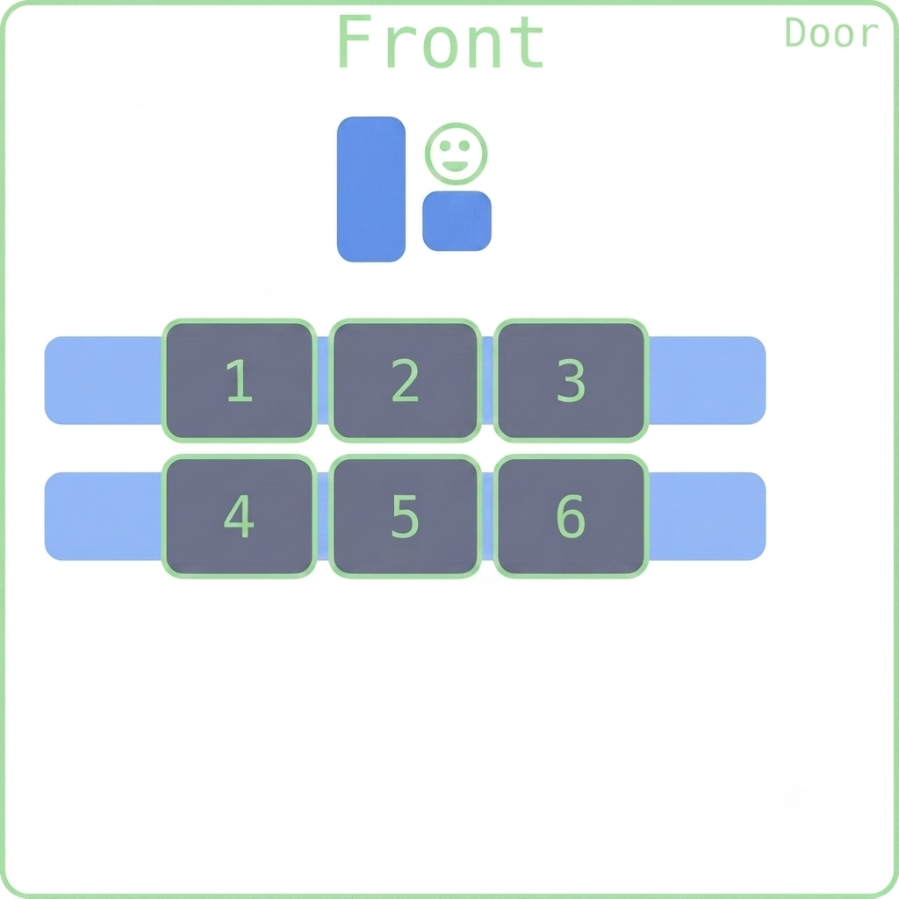

## Happy New Week 7!
::::{style='font-size:.8em'}
- Class grouping today: Scan the QR code or go to [https://tools.jedrembold.prof/daily](https://tools.jedrembold.prof/daily)
- Class code is `HdT47`
- Introduce yourselves! What is your favorite color?
::::

::::::cols

::::col
{width=60%}
::::
::::col
{width=60%}
::::
::::::

---

## Quick Announcements
- Nothing is due today.
- Midterm exam grading is still ongoing
- Problem Set 4 was published and __due next week Monday at 10 pm__ 
    - Problem 1 & 2 should be something you could handle after today's class
    - You should also have the tools to complete problem 3 by Wednesday
- We are in Ch6 of the text this week, which is interactive graphics

---

# Live Coding
- Recall the pine tree coding exercise from last week?

---

## Growing Trees
::::::cols
::::col
- I'd like to write a utility function to draw a pine tree directly to the canvas
- I'll specify the bottom location of the tree, the height, and whether it should have snow on its branches
::::

::::col
::::
::::::

---

# Recap of the Lecture Video
- I'll run through the contents of this lecture video and demo a few things.

---

## The Python Event Model
- Graphical applications usually make it possible for the user to control the action of a program by using an input device such a mouse.
	- Programs supporting this type of control are called _interactive programs_.
- User actions such as clicking the mouse are called _events_.
- Programs that respond to events are said to be _event driven_.
- User input does not generally occur at predictable times. As the events are not controlled by the program, they are said to be _asynchronous_.
- In Python, you write a function that acts as a _listener_ for a particular event type. When the event happens, the listener is called.

---

## First Class Functions
- Functions in Python are treated as data values just like anything else!
	- We will need to take advantage of this to write listener functions.
- You can assign a function to a variable, pass it as a parameter, return it as a result, etc
- Functions treated like any other data value are called _first-class functions_
- To work with a function itself, you leave off the `()`. Including the parentheses is how you _call_ the function!

---

## A First Class Example
```{.python style='max-height:900px'}
import math

def evaluate_numbers(func):
	print(func)
	print(func(0))
	print(func(2))
	print(func(10))

A = evaluate_numbers

A(math.sqrt)
A(math.exp)
```

---

## Closures
::::cols
:::col
Consider the code to the right. 

::::: incremental
- Why does the line 12 not error?
    - Nothing named `a` should still exist when it is called!
- [Python Tutor](http://www.pythontutor.com/visualize.html#code=b%20%3D%201%0Adef%20f1%28a%29%3A%0A%20%20%20%20print%28a%29%0A%20%20%20%20print%28b%29%0A%20%20%20%20def%20f2%28%29%3A%0A%20%20%20%20%20%20%20%20c%20%3D%20a%20%2B%20b%0A%20%20%20%20%20%20%20%20return%20c%20*%203%0A%20%20%20%20return%20f2%20%0Af2%20%3D%20f1%2810%29%0Ac%20%3D%20f2%28%29&cumulative=false&curInstr=0&heapPrimitives=false&mode=display&origin=opt-frontend.js&py=3&rawInputLstJSON=%5B%5D&textReferences=false)
- `f2` must also keep track of any local variables!
- The local variables that are included as part of a function are called its _closure_
:::::

:::
:::col
```{.python style='max-height:800px' data-line-numbers=''}
b = 1
def f1(a):
    print(a)
	print(b)

	def f2():
		c = a + b
		return c * 3
	return f2 

f2 = f1(10) 
c = f2()
```
:::
::::

---

## Our First Interactive Example
:::{style='font-size:.9em'}
- Consider the simple program below, where we've imported the basics and some of our helper functions
  ```python
  def draw_dots():
      def click_action(event):
          c = create_filled_rect(
              event.get_x(), event.get_y(), 
              10,10, random_color())
          gw.add(c)
  
      gw = GWindow(500, 500)
      gw.add_event_listener("click", click_action)
  ```
- The `click_action` function specifies what to do when the mouse is clicked
	- Note that it has access to the `gw` variable since it is in the enclosing function and thus in the closure.
:::

---

## Registering a Listener
- The last line of our example function:

	```python
	gw.add_event_listener("click", click_action)
	```
	tells the graphics window (`gw`) to call the `click_action` function whenever a mouse "click" occurs within the window.
- When the user clicks the mouse, the graphics window, in essense, calls the client back to let them know that a click has occured. Thus, functions such as `click_action` are known as _callback functions_.
- The parameter `event` given to the callback function is a special data structure called a _mouse event_, which contains details about the specifics of the event that triggered the action.


---

## Mouse Events
- We have a fairly comprehensive list of mouse-events that we can trigger callbacks on:

| Name | Description
---:|:-----
`"click"` | The user clicks the mouse in the window
`"dblclick"` | The user double-clicks the mouse in the window
`"mousedown"` | The user presses the mouse button down
`"mouseup"` | The user releases the mouse button
`"mousemove"` | The user moves the mouse
`"drag"` | The user moves the mouse with the button down

---

## Event Details
- Certain actions can trigger more than one event
	- Clicking generates a "mousedown", "mouseup", and then "click" event, in that order
- Events trigger no action unless the window is listening for that event
	- If I drag my mouse in the `draw_dots()` function, you'll notice that nothing happens
- You can setup however many listeners you feel you need in order to make your program behave as desired
```python
gw.add_event_listener("click", click_action)
gw.add_event_listener("dblclick", dblclk_action)
```

---

# Group Problems
- Work in group on one computer

---

## Problem 1: PGL Listeners
- Here you have a coding task. Work in pairs or trios on a single computer.
- Your task is to:
    - Add a black filled background rectangle to the window the same size as the window
    - Add a while filled circle somewhere near the middle (no need to be exact)
    - Add a listener so that when the mouse is clicked, the background rectangle changes to a new random color
    - Add a listener so that when the mouse is double clicked, the circle moves down the screen one diameter's distance


<!-- ## Line Art
- Suppose we want to make a basic drawing program
- When the user presses the mouse down, we start drawing a line
- As the user drags the mouse around, we actively update the placement of that line to end at the users cursor
- When the user releases the mouse button, we lock that line onto the screen
- Now a new click starts drawing a new line -->


