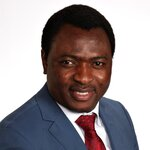

<!-- 

# CS 481W/482: Senior Capstone Project I & II -->

**Computer Science Capstone Course**

---

## Welcome

Welcome to the Senior Capstone Project sequence! This two-semester course represents the culmination of your computer science education, where you'll design, develop, and deploy a significant software project from concept to completion.

## Course Overview

This capstone experience provides an opportunity to demonstrate your mastery of software engineering principles through the creation of a substantial application. You'll engage in all phases of the software development lifecycle, applying industry-standard practices including requirements analysis, system design, implementation, testing, and deployment.

Throughout this journey, you'll work independently on your chosen project while receiving guidance through regular consultations and peer collaboration. The course emphasizes not only technical excellence but also professional skills including project management, documentation, and effective communication of complex technical concepts.

## Quick Links

- [Course Syllabus](syllabi.md)
- [Schedule an Appointment (Individual Sprint Review)](https://calendar.app.google/QMJ1TL3GWyFNkK5eA)

## Instructor

**Professor Fred Agbo, PhD**  
Assistant Professor of Computer Science  
**Office:** Ford Hall 209  
**Email:** fjagbo@willamette.edu

[Willamette Profile](https://my.willamette.edu/people/fjagbo) | [Website](https://fredagbo.com/) | [Google Scholar](https://scholar.google.com/citations?hl=en&user=mSqmwdgAAAAJ)

## Key Information

- **Duration:** Two semesters (Fall 2025 - Spring 2026)
- **Credits:** 8 total (4 per semester)
- **Format:** Individual project with weekly meetings

## Course Goals

By the end of this sequence, you will have:

- Completed a full-stack application from initial concept through deployment
- Demonstrated proficiency in modern software development practices
- Created comprehensive technical documentation
- Presented your work to technical and general audiences
- Built a portfolio piece showcasing your capabilities

---

**Get Started:** Review the [complete syllabus](syllabi.md) to understand course requirements, grading criteria, and semester timelines.
