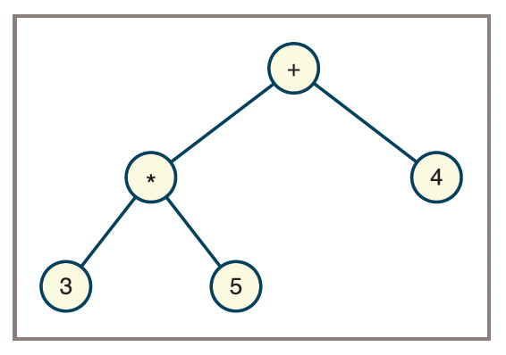

\vspace{-2cm}

## Write the full name of all collaborators inside this box
\fbox{\makebox[\linewidth][l]{\rule{0pt}{2cm}\hspace{0.99\linewidth}}}

\vspace{.5cm}

## Discuss these questions and write your answers in the space provided below it.

1. What is the difference between a perfectly balanced binary tree and a complete binary tree?

\vspace{2cm}

2. What is the difference between a complete binary tree and a full binary tree?

\vspace{2cm}

3. A full binary tree has a height of 5. How many nodes does it contain?

Max nide = 2^(5+1)-1 = 63 nodes

4. A complete binary tree contains 125 nodes. What is its height?

To find the height of a complete binary tree with 125 nodes:

For a complete binary tree with n nodes, the height h (defined as the number of edges from root to the deepest node) is:

h = ⌊log₂(n)⌋

For n = 125:

log₂(125) ≈ 6.97
⌊6.97⌋ = 6
We can verify this:

Levels 0-5 completely filled: 2⁰ + 2¹ + 2² + 2³ + 2⁴ + 2⁵ = 63 nodes
Level 6 (the last level): 125 - 63 = 62 nodes
Since 62 ≤ 2⁶ = 64, level 6 is partially filled (as expected for a complete binary tree)
The height is 6.

5. How many nodes are on a given level L in a full binary tree? Express your answer in terms of L.

 *ANS* 2^L

 Proof:
 For a full binary tree with height h, the total number of nodes is:

n = 2^(h+1) - 1

With height = 5:

n = 2^(5+1) - 1
n = 2^6 - 1
n = 64 - 1
n = 63 nodes
We can verify by counting nodes at each level:

Level 0: 2^0 = 1 node
Level 1: 2^1 = 2 nodes
Level 2: 2^2 = 4 nodes
Level 3: 2^3 = 8 nodes
Level 4: 2^4 = 16 nodes
Level 5: 2^5 = 32 nodes
Total: 1 + 2 + 4 + 8 + 16 + 32 = 63 nodes

6. What is the heap property for a min-heap?

\vspace{2cm}

7. How is a binary search tree different from a binary tree?

\vspace{2cm}

8. Write the expression represented by the following expression tree in `infix`, `prefix`, and `postfix` notations. (__Hint__: Use the `inorder`, `preorder`, and `postorder` traversals discussed in the last class to obtain your answers.)

{style="width:60%;"}

a) `infix`:
b) `prefix`:
c) `postfix`:

\vspace{0.2cm}

9. Draw diagrams of the expression trees for the following expressions:

a. 3 * 5 + 6
\vspace{3cm}

b. 3 + 5 * 6
\vspace{3cm}

c. 3 * 5 ** 6