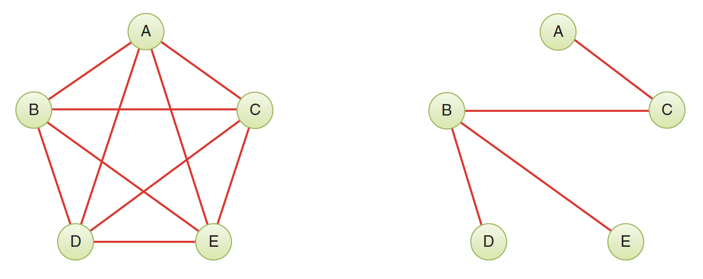
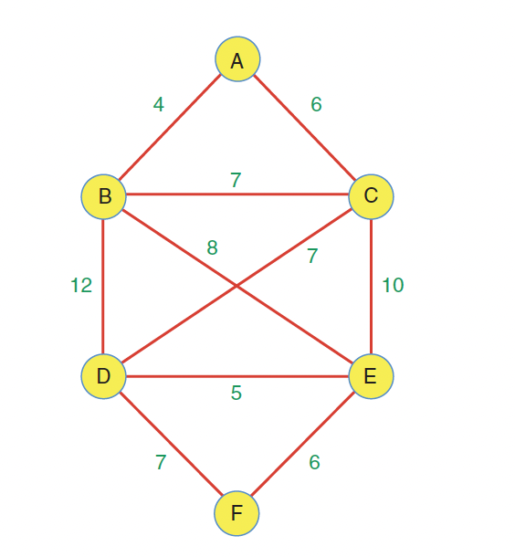
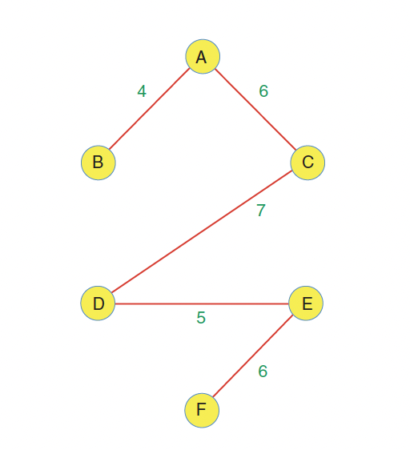
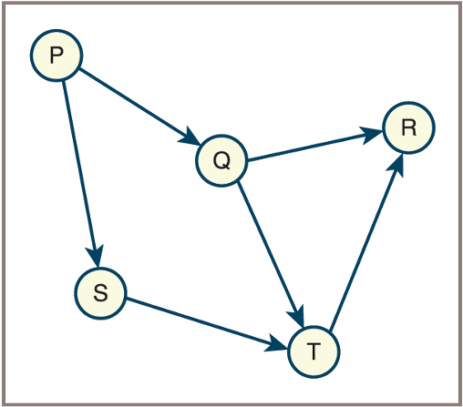
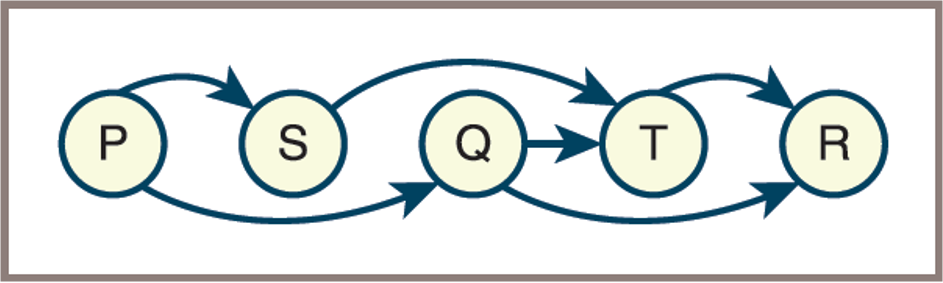
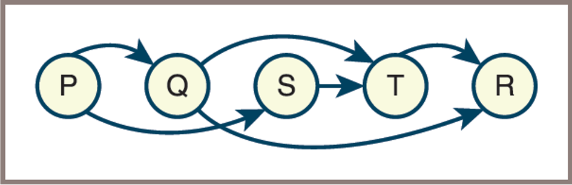

## Announcements
- Welcome to week 14! 
    - `Be encouraged despite the challenges!`
- Mini Project #3 due date is extended to ***next week Monday April 20 at 10 pm***.
- Grading of PS4 and PS5 are published.
- No class this Wednesday April 15. `It is SSRD Day!`

## Trees within Graphs
:::{.incremental style="font-size: 34px;"}
- Recall the function `traverseFromVertex` shown in the Psedocode, it implicitly yields a tree rooted at the vertex from which the traversal starts and includes all the vertices reached during the traversal
- Suppose  `dfs`  has just been called using vertex  `v`:
    - If a recursive call using vertex  `w`  now occurs, you can consider  `w`  to be a child of  `v` 
    The edge `(v , w)` corresponds to the parent-child relationship, or edge, between  `v`  and  `w` 
    - The starting vertex is the root of this tree
    - The tree is called a `depth-first search tree`

:::

## Spanning Trees
:::{.incremental style="font-size: 30px;"}
- A **spanning tree** of a connected, undirected graph is a subgraph that includes all the vertices of the graph and is a tree.
- Every connected graph has at least one spanning tree.
- Spanning trees are useful for minimizing the number of edges while maintaining connectivity.
- **Minimum Spanning Tree (MST):**
    <!-- - A spanning tree with the smallest possible total edge weight.
    - Common algorithms for finding MSTs include Kruskal’s and Prim’s algorithms.-->
<!-- - Applications include network design, clustering, and approximation algorithms.  -->
:::

## Minimum Spanning Tree

:::{.incremental style="font-size: 30px;"}
- A **Minimum Spanning Tree (MST)** is a spanning tree of a weighted, connected, undirected graph with the smallest possible total edge weight.
- MSTs are used in network design, clustering, and other optimization problems. 
- Common algorithms for finding MSTs include Kruskal’s and Prim’s algorithms.-

:::

## Minimum Spanning Tree
:::{.incremental style="font-size: 26px;"}
- {style="width:80%;"}
- The graph on the left has the maximum number of edges, `10`, for a five-vertex graph.
- The graph on the right has the same five vertices but with the minimum number of edges necessary to connect them, `4`.
- This constitutes a `minimum spanning tree (MST)` for the graph.
:::

:::{.notes}
- DO YOU SEE ANY ALTERNATE PATH?
- There are many possible minimum spanning trees (MSTs) for a given graph.
- For example, the MST of the Figure above could include edges AC, BC, BD, and BE, or alternatively AC, CE, ED, and DB.
- The number of edges in a minimum spanning tree is always one fewer than the number of vertices.
- Removing any edge from a minimum spanning tree would create multiple connected components.

:::

## Minimum Spanning Tree Algorithms
:::{.incremental style="font-size: 30px;"}
- **Kruskal’s Algorithm:**
    - Sort all edges by weight.
    - Add edges one by one to the tree, skipping those that would form a cycle, until all vertices are connected.
- **Prim’s Algorithm:**
    - Start from any vertex.
    - Grow the tree by repeatedly adding the smallest edge that connects a vertex in the tree to a vertex outside.
- Both algorithms run in $O(E \log V)$ time, where $E$ is the number of edges and $V$ is the number of vertices.
:::

## Minimum Spanning Tree
- Robert C. Prim’s `algorithm` for finding a minimum spanning tree

```python
minimumSpanningTree(graph):
    mark all vertices and edges as unvisited
    mark some vertex, say v, as visited
    for all the vertices:
        find the least weight edge from a visited vertex to an
        unvisited vertex, say w
        mark the edge and w as visited

```


## Minimum Spanning Tree
:::{.incremental style="font-size: 26px;"}
- Here is a weighted graph with six vertices. Each edge has a weight, shown by a number alongside the edge.

- {style="width:40%;"}
- How can you pick a subgraph that minimizes the cost of connecting vertices into a network?

:::
## Minimum Spanning Tree
- The answer is to calculate a minimum spanning tree. 
- It will have five edges (one fewer than the number of vertices), it will connect all six vertices
- It will minimize the total cost of the links. 

## Recall Minimum Spanning Tree

:::{.incremental style="font-size: 26px;"}
- The MST for the graph above

- {style="width:36%;"}

- The minimum spanning tree consists of the edges `AB`, `AC`, `CD`, `DE`, and `EF`, for a total edge weight of `28`
- The order in which the edges are specified is unimportant.

:::

## Topological Sort 
:::{.incremental style="font-size: 28px;"}
- A topological sort of a directed acyclic graph (DAG) is a linear ordering of its vertices such that for every directed edge u → v, vertex u comes before v in the ordering.
- Topological sorting is useful for scheduling tasks, resolving dependencies, and organizing data with precedence constraints.
- **Example Scenario:**  
    - Imagine a university course catalog where each course may have prerequisites.
    - Each course is a vertex, and a directed edge from course A to course B means "A is a prerequisite for B."
    - For example:
        - `Math 101 → Math 201` (Math 101 is a prerequisite for Math 201)
        - `CS 101 → CS 201` (CS 101 is a prerequisite for CS 201)
        - `CS 201 → CS 301`
        - `Math 201 → CS 301`
- Only DAGs have valid topological orders; graphs with cycles do not.
:::

## Topological Sort 


- {style="width:50%;"}

:::{.incremental style="font-size: 25px;"}
- The first topological ordering of the graph

- {style="width:35%;"}

- The second topological ordering of the graph

- {style="width:35%;"}

:::


# Class Worksheet Activity:

## Activity 1: Spanning Tree Basics
:::{.incremental style="font-size: 28px;"}
**Question 1:** A connected graph has 8 vertices. How many edges must its spanning tree have? Why?

**Question 2:** True or False? A graph can have multiple different spanning trees. If true, provide an example scenario.

**Question 3:** Can a disconnected graph have a spanning tree? Explain your reasoning.
:::

:::{.notes}
**Answer 1:** 7 edges. A spanning tree for n vertices must have exactly n-1 edges. This is because a tree is a connected acyclic graph, and the minimum number of edges to connect n vertices without cycles is n-1.

**Answer 2:** True. Most graphs have multiple spanning trees. Example: A triangle graph (3 vertices, 3 edges) has 3 different spanning trees - each one excludes a different edge. In the graph with vertices {A,B,C} and edges {AB, BC, AC}, you could have spanning trees: {AB, BC}, {AB, AC}, or {BC, AC}.

**Answer 3:** No. A disconnected graph cannot have a spanning tree because a spanning tree must connect ALL vertices, and by definition, a disconnected graph has at least two components that cannot be reached from each other. However, each connected component can have its own spanning tree, forming a "spanning forest."
:::

## Activity 2: Minimum Spanning Tree - Prim's Algorithm 
:::{.incremental style="font-size: 26px;"}
Given the following weighted graph, apply **Prim's Algorithm** starting from vertex A:

```
    A ---5--- B
    |    \    |
    |     \   |
    3      7  6
    |       \ |
    C ---4--- D ---2--- E
         |             |
         8             1
         |             |
         F -----2------G
```

**Tasks:**
1. List the order in which edges are added to the MST
2. What is the total weight of the MST?
3. Draw the resulting MST
:::

:::{.notes}
**Answer:**
Starting from vertex A, Prim's algorithm selects edges as follows:

1. **Edge A-C (weight 3)** - cheapest edge from A
2. **Edge C-D (weight 4)** - cheapest edge from {A,C} to unvisited vertices
3. **Edge D-E (weight 2)** - cheapest edge from {A,C,D} to unvisited vertices
4. **Edge E-F (weight 1)** - cheapest edge from {A,C,D,E} to unvisited vertices
5. **Edge A-B (weight 5)** - only remaining vertex to connect

**Total MST weight:** 3 + 4 + 2 + 1 + 5 = **15**

**MST edges:** {A-C, C-D, D-E, E-F, A-B}
:::

## Activity 3: MST Algorithm Comparison 
:::{.incremental style="font-size: 28px;"}
**Question 1:** What is the key difference between Kruskal's and Prim's algorithm approaches?

**Question 2:** Both algorithms have the same time complexity. What is it, and what do E and V represent?

**Question 3:** When would you prefer Kruskal's over Prim's algorithm (or vice versa)?
:::

:::{.notes}
**Answer 1:** 
- **Kruskal's Algorithm:** Considers all edges globally, sorting them by weight and adding the cheapest edges that don't create cycles (edge-based approach).
- **Prim's Algorithm:** Grows the MST from a starting vertex, repeatedly adding the cheapest edge that connects a vertex in the tree to a vertex outside (vertex-based approach).

**Answer 2:** **O(E log V)** where:
- **E** = number of edges in the graph
- **V** = number of vertices in the graph
- The log V factor comes from heap/priority queue operations or union-find operations

**Answer 3:**
- **Prefer Kruskal's when:** The graph is sparse (few edges) or when edges are already sorted. Kruskal's works well with edge lists and doesn't require a specific starting vertex.
- **Prefer Prim's when:** The graph is dense (many edges) or stored as an adjacency matrix. Prim's is often more efficient with dense graphs and works better with adjacency list representations.
:::

## Activity 4: Topological Sort
:::{.incremental style="font-size: 26px;"}
Given the following course prerequisite graph:

- CS 101 is a prerequisite for CS 201 and CS 202
- CS 201 is a prerequisite for CS 301
- CS 202 is a prerequisite for CS 301 and CS 302
- Math 101 is a prerequisite for CS 201
- Math 101 is a prerequisite for Math 201
- Math 201 is a prerequisite for CS 301

**Tasks:**
1. Draw the directed graph representing these dependencies
2. Provide at least TWO valid topological orderings
3. Explain why CS 301 cannot come before CS 201 in any valid ordering
:::

:::{.notes}
**Answer 1: Graph Structure**
```
Math 101 → Math 201
    ↓           ↓
  CS 201 → CS 301
    ↑           ↑
CS 101 → CS 202 → CS 302
```

**Answer 2: Valid Topological Orderings:**
1. **Math 101, CS 101, Math 201, CS 201, CS 202, CS 301, CS 302**
2. **CS 101, Math 101, CS 202, Math 201, CS 201, CS 301, CS 302**
3. **Math 101, CS 101, CS 202, Math 201, CS 201, CS 302, CS 301**

(Many other valid orderings exist)

**Answer 3:** CS 301 cannot come before CS 201 because there is a directed path from CS 201 to CS 301, meaning CS 201 is a prerequisite (either directly or indirectly) for CS 301. In a valid topological ordering, all prerequisites must appear before the courses that depend on them. Specifically, CS 201 → CS 301 is a direct edge, so CS 201 MUST appear before CS 301.
:::

## Activity 5: Cycle Detection
:::{.incremental style="font-size: 30px;"}
**Question 1:** Can a graph with a cycle have a valid topological sort? Why or why not?

**Question 2:** Consider these course dependencies:
- Course A requires Course B
- Course B requires Course C  
- Course C requires Course A

What problem exists here? How would you detect this programmatically?
:::

:::{.notes}
**Answer 1:** No, a graph with a cycle cannot have a valid topological sort. A topological ordering requires that for every directed edge u → v, vertex u must come before v. In a cycle, you would have vertices like A → B → C → A, which means A must come before B, B before C, and C before A - creating an impossible contradiction. Only Directed Acyclic Graphs (DAGs) can have topological orderings.

**Answer 2:** 
**Problem:** This is a **circular dependency** (or cycle). Course A requires B, B requires C, and C requires A, forming a cycle A → B → C → A. This makes it impossible to determine which course to take first - you can never satisfy the prerequisites!

**Detection Methods:**
1. **DFS with colors:** Use three states (white/unvisited, gray/visiting, black/visited). If you encounter a gray vertex during DFS, you've found a back edge indicating a cycle.
2. **Topological sort attempt:** Try to perform a topological sort using Kahn's algorithm. If you can't process all vertices (some remain with non-zero in-degree), a cycle exists.
3. **Recursion stack:** During DFS, maintain a recursion stack. If you visit a vertex already in the current recursion stack, there's a cycle.
:::

## Activity 6: Application Problem
:::{.incremental style="font-size: 26px;"}
**Scenario:** You are designing a network to connect 5 cities with fiber optic cables. The cost (in millions) to connect each pair of cities is:

- City A to B: $4M, A to C: $3M, A to D: $7M
- City B to C: $2M, B to E: $5M
- City C to D: $4M, C to E: $6M  
- City D to E: $3M

**Tasks:**
1. Which algorithm would you use to minimize total cost? Why?
2. Find the minimum cost to connect all cities
3. Which connections should be built?
4. What is the total cost of your solution?
:::

:::{.notes}
**Answer:**

**1. Algorithm Choice:** Use either **Kruskal's or Prim's algorithm** to find the Minimum Spanning Tree. Either will give the same result. Kruskal's might be slightly easier to trace manually since we can just sort edges by cost.

**2-4. Solution using Kruskal's Algorithm:**

First, list all edges sorted by cost:
1. B-C: $2M
2. A-C: $3M  
3. D-E: $3M
4. A-B: $4M
5. C-D: $4M
6. B-E: $5M
7. C-E: $6M
8. A-D: $7M

Add edges that don't create cycles:
- ✓ Add B-C ($2M) - connects B and C
- ✓ Add A-C ($3M) - connects A to {B,C}
- ✓ Add D-E ($3M) - connects D and E
- ✗ Skip A-B ($4M) - would create cycle A-C-B-A
- ✓ Add C-D ($4M) - connects {A,B,C} to {D,E}

Now all 5 cities are connected with 4 edges (n-1).

**3. Connections to build:** B-C, A-C, D-E, C-D

**4. Total cost:** $2M + $3M + $3M + $4M = **$12 million**
:::

## Bonus Challenge: DFS Tree 
:::{.incremental style="font-size: 28px;"}
Given an undirected graph with vertices {A, B, C, D, E, F} and edges:
- A-B, A-C, B-D, B-E, C-F, D-E, E-F

**Question:** If you perform DFS starting from vertex A and always visit neighbors in alphabetical order, draw the resulting DFS tree. Which edges from the original graph are NOT in the DFS tree?
:::

:::{.notes}
**Answer:**

**DFS Traversal Process (visiting neighbors alphabetically):**
1. Start at A (mark visited)
2. Visit A's neighbor B (mark visited)
3. Visit B's neighbor D (C is A's neighbor but we explore B fully first)
4. Visit D's neighbor E (mark visited)
5. Visit E's neighbor F (mark visited)
6. Backtrack to E, then D, then B, then A
7. Visit A's neighbor C (mark visited)
8. No unvisited neighbors from C

**DFS Tree edges:** 
- A-B (A to B)
- B-D (B to D)  
- D-E (D to E)
- E-F (E to F)
- A-C (A to C)

**Tree structure:**
```
      A
     / \
    B   C
    |
    D
    |
    E
    |
    F
```

**Edges NOT in the DFS tree (non-tree edges/back edges):**
- B-E (E was already visited via D when we explored from B)
- C-F (F was already visited when we got to C)
- D-E is in the tree, so the non-tree edges are: **B-E and C-F**
:::

<!-- 
## Next Week Reading:
- FDS - Lambert 
    - Chapter 12
- DS&A - John et al.
    - Chapter 14 -->