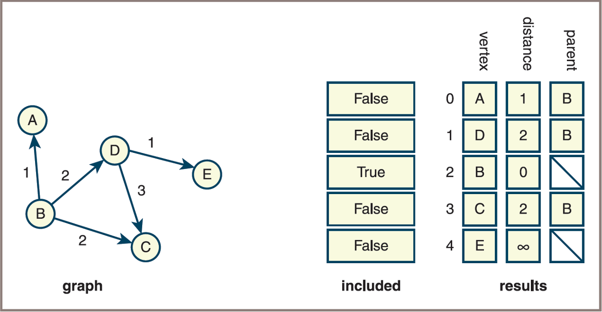
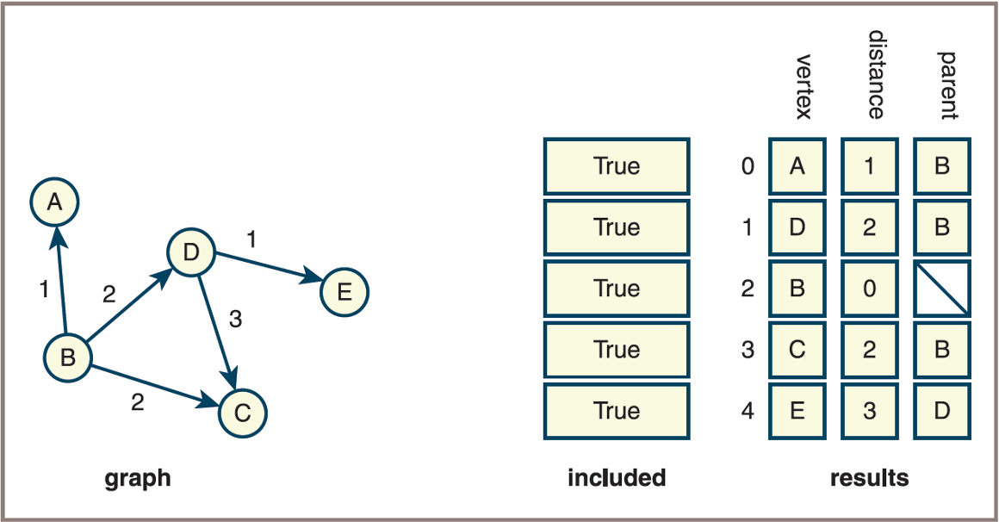
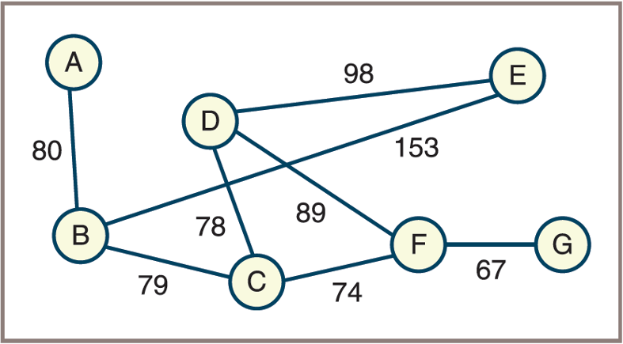
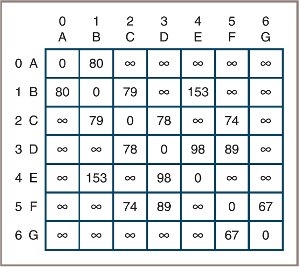
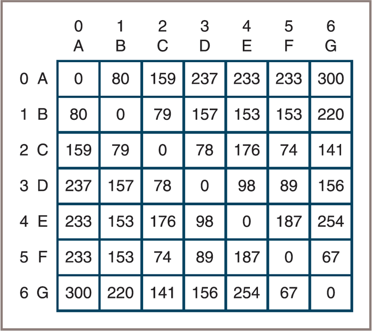
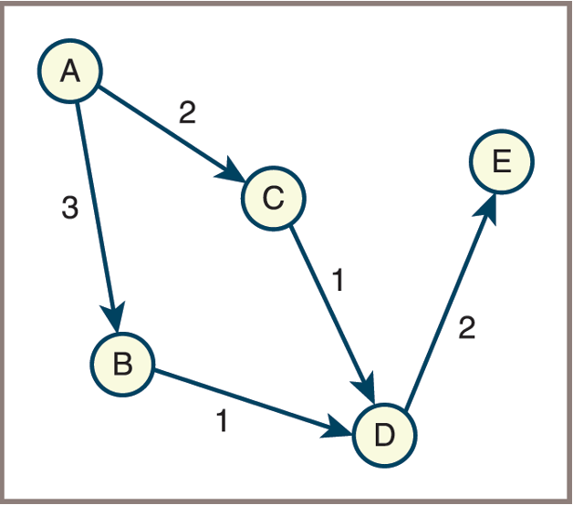

## Announcements
:::{.incremental style="font-size: 30px;"}
- Welcome to week 15!
- Mini Project #3 is due today.
- Grading of HashTable assignment was published. 
    - Any questions or concerns, let me know or meet Sam in QUAD Center!
- Last day in class will be Wednesday April 29 **NOT April 27th**
    - Next week is dedicated to reviews of materials
- Check for your date for final exam:
    - Session: MW 10:20am – 11:50am: Tue., May 5th, from 8:00 a.m. - 11:00 a.m. 
    - Session: MW 8:40am – 10:10am: Wed., May 6th, from 8:00 a.m. - 11:00 a.m.
    - Those with accommodation and writing the exam in testing center should communicate them and cc me to book a spot ASAP.
- Checkout the `Course Evaluation Menu/link on your Canvas`
:::

# Pathfinding Algorithms

## The Shortest-Path Problem
:::{.incremental style="font-size: 33px;"}
- It is often useful to determine the shortest path between two vertices in a graph
- Consider an airline map, represented as a weighted directed graph whose weights represent miles between airports. 
    - The shortest path between two airports is the path that has the smallest sum of edge weights.
- The `single-source shortest path problem` asks for a solution that contains the shortest paths from a given vertex to all other vertices:
    - Solution by Dijkstra: $O(N^2)$

- Another problem, `all-pairs shortest path problem`, asks for the set of all the shortest paths in a graph:
    - Solution by Floyd: $O(N^3)$
:::

## Dijkstra’s Algorithm 
:::{.incremental style="font-size: 30px;"}
- Dijkstra’s algorithm finds the shortest paths from a single source vertex to all other vertices in a weighted graph with non-negative edge weights.
- The algorithm maintains a set of visited vertices and a distance stored in `results` as 2D array.
- At each step, it selects the unvisited vertex with the smallest known distance, updates the distances to its neighbors, and marks it as visited.
- The algorithm uses a temporary list, `included`, of N Booleans
    - To track whether or not a given vertex has been included in the set of vertices for which you already have determined the shortest path
- The algorithm consists of two major steps: 
    - An initialization step
    - A computation step

:::

## Dijkstra’s Algorithm: Initialization Step 
:::{.small style="font-size: 35px;"}
- Initialize all the columns in the results grid and all the cells in the included list according to the following algorithm:

```{.python}
for each vertex in the graph
    Store vertex in the current row of the results grid
    If vertex = source vertex
        Set the row’s distance cell to 0
        Set the row’s parent cell to undefined
        Set included[row] to True
    Else if there is an edge from source vertex to vertex
        Set the row’s distance cell to the edge’s weight
        Set the row’s parent cell to source vertex
        Set included[row] to False
    Else
        Set the row’s distance cell to infinity
        Set the row’s parent cell to undefined
        Set included[row] to False
    Go to the next row in the results grid

```
:::


## Dijkstra’s Algorithm: Initialization Step 
- A graph and the initial state of the data structures used to compute the shortest paths from a given vertex

- {style="width:70%;"}


## Dijkstra’s Algorithm: Computation Step 
:::{.small style="font-size: 35px;"}
- Dijkstra’s algorithm finds the shortest path from the source to a vertex, marks this vertex’s cell in the  included  list, and continues this process until all these cells are marked:

<!-- **Pseudocode:**
1. While there are unvisited vertices:
    a. Select the unvisited vertex with the smallest distance value.
    b. Mark this vertex as visited (included).
    c. For each neighbor of this vertex:
        i. If the neighbor is not visited and the path through the current vertex is shorter:
            - Update the neighbor’s distance value.
            - Update the neighbor’s parent to the current vertex.

## Dijkstra’s Algorithm: Computation Step  -->
```{.python}
Do
    Find the vertex F that is not yet included and has the minimal distance in the results grid
    Mark F as included
    For each other vertex T not included
        If there is an edge from F to T
            Set new distance to F’s distance + edge’s weight
            If new distance < T’s distance in the results grid
                Set T’s distance to new distance
                Set T’s parent in the results grid to F
While at least one vertex is not included

```

:::


## Dijkstra’s Algorithm: Computation Step 
- A graph and the final state of the data structures used to compute the shortest paths from a given vertex
- {style="width:70%;"}


## Representing & Working with Infinity

:::{.incremental style="font-size: 30px;"}
- Many textbooks represent infinity as a very large integer (e.g., the maximum integer value supported by the language).
- This approach is inaccurate and unnecessary in Python.
- In Python, you can represent infinity as a nonnumeric value, as long as you only use addition and comparisons.
- In this implementation, define a constant `INFINITY` as the string value `"-"`, which prints nicely.
- Arithmetic and comparison operations are handled by specialized functions.
:::


## Dijkstra’s Algorithm: Analysis
:::{.incremental style="font-size: 35px;"}
- The initialization step must process every vertex
    - So it is `O(n)`
- The outer loop of the computation step also iterates through every vertex
- The inner loop of this step iterates through every vertex not included thus far
- The overall behavior of the computation step resembles that of other $O(N^2)$ algorithms, so Dijkstra’s algorithm is $O(N^2)$

:::

## Floyd’s Algorithm
:::{.incremental style="font-size: 35px;"}
- Floyd’s algorithm (Floyd-Warshall) solves the all-pairs shortest path problem for a weighted graph.
- It works for both directed and undirected graphs, and can handle negative edge weights (but not negative cycles).
- The algorithm uses a 2D matrix to store shortest distances between every pair of vertices.
- It repeatedly updates the matrix by considering each vertex as an intermediate point.
:::

## Floyd’s Algorithm
:::{.incremental style="font-size: 35px;"}
- For each vertex v in a graph, the algorithm finds the shortest path from vertex v to any other vertex w that is reachable from v
- Consider the weighted graph in this Figure 

- {style="width:70%;"}
:::

## Floyd’s Algorithm: In a preprocessing step
:::{.incremental style="font-size: 35px;"}
- Using the figure above, you will build an initial distance matrix whose cells contain the weights on the edges that connect each vertex with its neighbors 

- {style="width:40%;"}

:::

## Floyd’s Algorithm: Computational step

- Using the figure above, here is the modified distance matrix: 

- {style="width:45%;"}


## Floyd’s Algorithm

**Pseudocode:**
```{.python}
for i from 0 to n - 1
    for r from 0 to n - 1
        for c from 0 to n - 1
            matrix[r][c] = min(matrix[r][c],
                              matrix[r][i] + matrix[i][c])

```

## Floyd’s Algorithm: Analysis

- The initialization step to create the distance matrix from the graph is $O(N^2)$
    - This matrix is actually the same as an adjacency matrix representation of the given graph
- Because Floyd’s algorithm includes three nested loops over N vertices, the algorithm itself is $O(N^3)$
- The overall running time of the process is bounded by $O(N^3)$

# Graph Implementation 

## Developing a Graph Collection 

:::{.incremental style="font-size: 32px;"}
- **To develop a graph collection, consider the following:**
    - The requirements of users
    - The mathematical nature of graphs
    - The commonly used representations, adjacency matrix, and adjacency list

- **Users should be able to**
    - Insert and remove vertices
    - Insert or remove an edge
    - Retrieve all the vertices and edges
    - Choose between directed and undirected graphs and between an adjacency matrix representation and an adjacency list representation

:::


## Example Use of the Graph Collection 
::: {.columns}
:::: {.column style="font-size: 28px; width: 50%;"}
- Consider constructing this weighted graph:
- {style="width:80%;"}
::::

:::: {.column style="font-size: 28px; width: 50%"}
- Code
```{.python}
from graph import LinkedDirectedGraph

g = LinkedDirectedGraph()
# Insert vertices
g.addVertex("A")
g.addVertex("B")
g.addVertex("C")
g.addVertex("D")
g.addVertex("E")
 
# Insert weighted edges
g.addEdge("A", "B", 3)
g.addEdge("A", "C", 2)
g.addEdge("B", "D", 1)
g.addEdge("C", "D", 1)
g.addEdge("D", "E", 2)
 
print(g)

```
::::

:::
:::{.incremental style="font-size: 25px;"}
- Output:
    - `5 Vertices:	A C B E D`
    - `5 Edges:	A>B:3 A>C:2 B>D:1 C>D:1 D>E:2`
:::


## Example Use of the Graph Collection 

::: {.small style="font-size: 28px;"}
- The next code segment displays the neighboring vertices and the incident edges of the vertex labeled `A` in this example graph:

-   Neighboring vertices of `A`
```{.python}
print("Neighboring vertices of A:")
for vertex in g.neighboringVertices("A"):
    print(vertex)

# Output:

Neighboring vertices of A:
    B
    C
```
- Incident edges of the vertex labeled `A`
```{.python}
print("Incident edges of A:")
for edge in g.incidentEdges("A"):
    print(edge)

# Output:

Incident edges of A:
    A>B:3
    A>C:2
```

:::


## Graph Implementation
:::{.incremental style="font-size: 28px;"}
- **Paths of least resistance in the graph implementation**
    - You make a graph class a subclass of  `AbstractCollection`
    - You make a graph’s size equal to its number of vertices
    - The  `add`  method adds a vertex with the given label to a graph
    - You allow a graph’s iterator to visit its vertices
- **Consequences**
    - The  `len`  function returns the number of the graph’s vertices
    - The graph constructor’s source collection contains the labels of the new graph’s vertices
    - The  `for`  loop visits the graph’s vertices
    - The `in`  operator returns  `True`  if the graph contains a given vertex
    - The `==` operator compares vertices in the two graph operands
    - The `+` operator creates a new graph that contains the vertices of its two operands
:::


## Graph Implementation: Classess & Methods
:::{.incremental style="font-size: 30px;"}
- The graph implementation described here uses a **linked structure**.
    - Each vertex and edge is represented as an object (node) that contains references (links) to other vertices and edges.
    - This approach allows efficient traversal and modification of the graph, as each vertex maintains links to its adjacent edges and vertices.
- **Three Classes to model**
    - Class `LinkedDirectedGraph`
    - Class `LinkedVertex`
    - Class `LinkedEdge`
:::

##  Class `LinkedDirectedGraph`(1/2)
:::{.small style="font-size: 20px;"}
The `LinkedDirectedGraph` class typically provides the following methods:

| Method | What It Does |
|--------|--------------|
| **Graph Creation** |  |
| `g = LinkedDirectedGraph(sourceCollection=None)` | Creates a new directed graph using an adjacency list. Optionally adds vertices from a collection of labels. |
| **Clearing, Size, and String Representation** |  |
| `g.clear()` | Removes all vertices from the graph. |
| `g.clearEdgeMarks()` | Clears all edge marks. |
| `g.clearVertexMarks()` | Clears all vertex marks. |
| `g.isEmpty()` | Returns `True` if the graph contains no vertices. |
| `g.sizeEdges()` | Returns the number of edges in the graph. |
| `g.sizeVertices()` | Returns the number of vertices in the graph. |
| `g.__str__()` | Returns a string representation of the graph. |
| **Vertex-Related Methods** |  |
| `g.containsVertex(label)` | Returns `True` if the graph contains a vertex with the specified label. |
| `g.addVertex(label)` | Adds a vertex with the specified label. |
| `g.getVertex(label)` | Returns the vertex with the specified label, or `None` if not found. |
| `g.removeVertex(label)` | Removes and returns the vertex with the specified label, or `None` if not found. |
:::

---

## Class `LinkedDirectedGraph` (2/2)
:::{.small style="font-size: 22px;"}
| Method | What It Does |
|--------|--------------|
| **Edge-Related Methods** |  |
| `g.containsEdge(fromLabel, toLabel)` | Returns `True` if an edge exists from `fromLabel` to `toLabel`. |
| `g.addEdge(fromLabel, toLabel, weight=None)` | Adds an edge with the specified weight between the given vertices. |
| `g.getEdge(fromLabel, toLabel)` | Returns the edge between the specified vertices, or `None` if not found. |
| `g.removeEdge(fromLabel, toLabel)` | Removes the edge and returns `True` if successful, else `False`. |
| **Iterators** |  |
| `g.edges()` | Returns an iterator over the edges in the graph. |
| `g.getVertices()` | Returns an iterator over the vertices in the graph. |
| `g.incidentEdges(label)` | Returns an iterator over the incident edges of the vertex with the given label. |
| `g.neighboringVertices(label)` | Returns an iterator over the neighboring vertices of the given vertex. |
:::

<!-- - `__init__()`: Initializes an empty directed graph.
- `addVertex(label)`: Adds a vertex with the given label.
- `removeVertex(label)`: Removes the vertex and all its incident edges.
- `addEdge(source, target, weight=1)`: Adds a directed edge from `source` to `target` with an optional weight.
- `removeEdge(source, target)`: Removes the directed edge from `source` to `target`.
- `getVertex(label)`: Returns the vertex object with the given label.
- `neighboringVertices(label)`: Returns an iterable of labels for vertices adjacent to the given vertex.
- `incidentEdges(label)`: Returns an iterable of edges incident from the given vertex.
- `vertices()`: Returns an iterable of all vertex labels.
- `edges()`: Returns an iterable of all edges in the graph.
- `__contains__(label)`: Checks if a vertex with the given label exists.
- `__len__()`: Returns the number of vertices.
- `__iter__()`: Iterates over the vertex labels.
- `__str__()`: Returns a string representation of the graph.

These methods allow for flexible construction, modification, and traversal of directed graphs. -->

## The Class `LinkedDirectedGraph` ADT
- The implementation of `LinkedDirectedGraph` maintains a `dictionary` whose keys are `labels` and whose values are the corresponding `vertices`

- Code for the class header and constructor:

```{.python}
class LinkedDirectedGraph(AbstractCollection):
 
    def __init__(self, sourceCollection = None):
        self.edgeCount = 0
        self.vertices = dict()	 # Dictionary of vertices {}
        AbstractCollection.__init__(self, sourceCollection)

```
- Notice that the `LinkedDirectedGraph` class is inheriting `AbstractCollection` class


## The Class `LinkedDirectedGraph` 
:::{.small style="font-size: 30px;"}
- **Methods** 
    - Code for adding, accessing, and removing an edge:

```{.python}
def addEdge(self, fromLabel, toLabel, weight):
    """Connects the vertices with an edge with the given weight."""
    fromVertex = self.getVertex(fromLabel)
    toVertex = self.getVertex(toLabel)
    fromVertex.addEdgeTo(toVertex, weight)
    self.edgeCount += 1
 
def getEdge(self, fromLabel, toLabel):
    """Returns the edge connecting the two vertices, or None if
    no edge exists."""
    fromVertex = self.getVertex(fromLabel)
    toVertex = self.getVertex(toLabel)
    return fromVertex.getEdgeTo(toVertex)
 
def removeEdge(self, fromLabel, toLabel):
    """Returns True if the edge was removed, or False otherwise."""
    fromVertex = self.getVertex(fromLabel)
    toVertex = self.getVertex(toLabel)
    edgeRemovedFlg = fromVertex.removeEdgeTo(toVertex)
    if edgeRemovedFlg:
        self.edgeCount -= 1
    return edgeRemovedFlg

```
:::

## The Class LinkedVertex 
:::{.small style="font-size: 22px;"}
- The methods in the class `LinkedVertex`

| Method | What It Does |
|--------|--------------|
| `LinkedVertex(label)` | Creates a vertex with the specified label. The vertex is initially unmarked. |
| `clearMark()` | Unmarks the vertex. |
| `setMark()` | Marks the vertex. |
| `isMarked()` | Returns `True` if the vertex is marked, or `False` otherwise. |
| `getLabel()` | Returns the label of the vertex. |
| `setLabel(label, g)` | Changes the label of the vertex in graph `g` to `label`. |
| `addEdgeTo(toVertex, weight)` | Adds an edge with the given weight from this vertex to `toVertex`. |
| `getEdgeTo(toVertex)` | Returns the edge from this vertex to `toVertex`, or `None` if the edge does not exist. |
| `incidentEdges()` | Returns an iterator over the incident edges of the vertex. |
| `neighboringVertices()` | Returns an iterator over the neighboring vertices of the vertex. |
| `__str__()` | Returns a string representation of the vertex. |
| `__eq__(anyObject)` | Returns `True` if `anyObject` is a vertex and the two labels are the same. |

:::

## The Class LinkedVertex: Structure 
:::{.small style="font-size: 35px;"}
- Code segment here shows the constructor and the method setLabel:

```{.python}
class LinkedVertex(object):
 
    def __init__(self, label):
        self.label = label
        self.edgeList = list()
        self.mark = False
     
    def setLabel(self, label, g):
        """Sets the vertex’s label to label."""
        g.vertices.pop(self.label, None)
        g.vertices[label] = self
        self.label = label


```
:::


## The Class LinkedEdge 
:::{.small style="font-size: 25px;"}
- The methods in the class `LinkedEdge`

| Method | What It Does |
|--------|--------------|
| `LinkedEdge(fromVertex, toVertex, weight=None)` | Creates an edge with the specified vertices and weight. It is initially unmarked. |
| `clearMark()` | Unmarks the edge. |
| `setMark()` | Marks the edge. |
| `isMarked()` | Returns `True` if the edge is marked, or `False` otherwise. |
| `getWeight()` | Returns the weight of the edge. |
| `setWeight(weight)` | Sets the edge’s weight to the specified weight. |
| `getOtherVertex(vertex)` | Returns the edge’s other vertex. |
| `getToVertex()` | Returns the edge’s destination vertex. |
| `__str__()` | Returns the string representation of the edge. |
| `__eq__(anyObject)` | Returns `True` if `anyObject` is an edge and the two edges are connected to the same vertices and have the same weight. |
|

:::

## The Class LinkedEdge 
- An edge maintains references to its two vertices, its weight, and a mark
- Although the weight can be any object labeling the edge,
    - The weight is often a number or some other comparable value
- Two edges are considered equal if they have the same vertices and weight


## The Class LinkedEdge: Structure 
- Code for the constructor and the `_eq_` method:

```{.python}
class LinkedEdge(object):
 
    def __init__(self, fromVertex, toVertex, weight = None):
        self.vertex1 = fromVertex
        self.vertex2 = toVertex
        self.weight = weight
        self.mark = False
 
    def __eq__(self, other):
        """Two edges are equal if they connect
        the same vertices."""
        if self is other: return True
        if type(self) != type(other): return False
        return self.vertex1 == other.vertex1 and \
               self.vertex2 == other.vertex2 and \
               self.weight == other.weight

```
# PS6: Homework
- Case Study: Testing Graph Algorithms
    - In Foundamentals of Python Data Structures (2nd Ed.)  by Lambert 
        - Chapter 12
        - Pages 391 to 397
- Download starter code [here](https://github.com/Agbo-CS152/ps6/archive/refs/tags/PS6_new.zip)

## Instructions
:::{.small style="font-size: 31px;"}
- This case study develops a data model and user interface that allow the programmer to create graphs and use them to test graph algorithms.
- Use the ADT of graph implementation discussed in the class today plus other modules provided in the case study to:
    - Write a program that allows the user to test some graph-processing algorithms (see the case study for detailed implementation strategies including starter codes)

**Tasks**

1. Complete the classes in the case study and test the operations to input a graph and display it.

2. Complete the function `spanTree` in the case study and test it thoroughly.

3. Complete the function `shortestPaths` in the case study and test it thoroughly

:::

## Homework Submission
- This home work will be discussed in the class on Monday December 1
    - Each student will take turn to `show-&-tell` by demonstrating their solution


<!-- 
## Next Week Reading:
- FDS - Lambert 
    - Chapter 12
- DS&A - John et al.
    - Chapter 14 -->