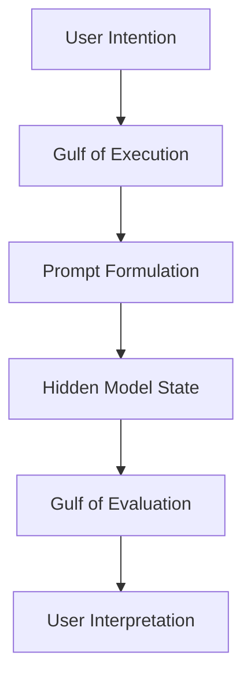
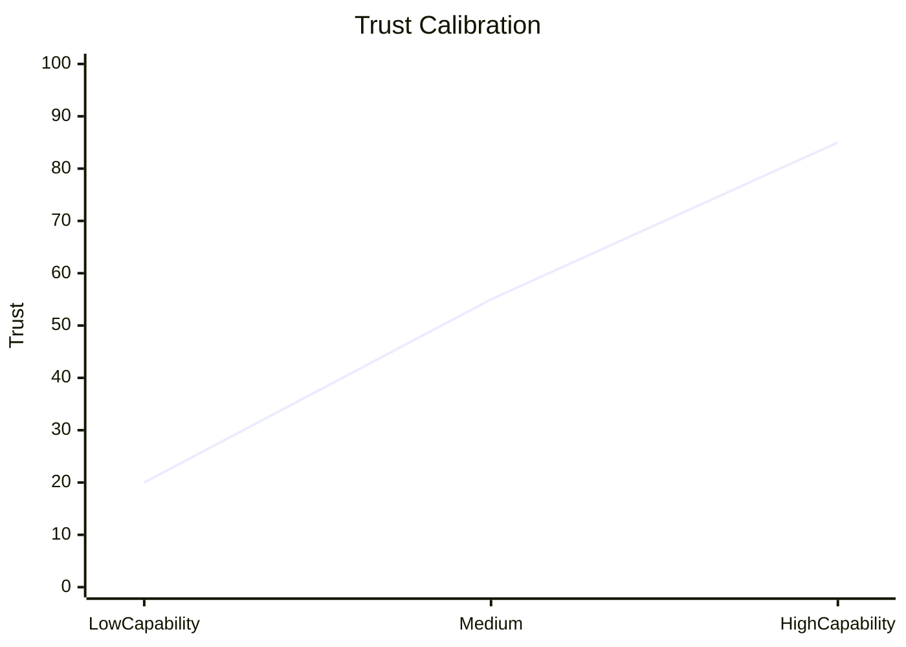
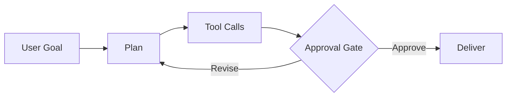

## 👋 Welcome 

### Conversational AI & Human-AI Interaction

- **Duration:** 14 Weeks · 28 Classes · 90 mins/class  
- **Format per class:** 50 min lecture + 30 min activity + 10 min synthesis  
- **Pedagogy:** Human-centered design, critique, studio labs, peer review  

---

## Course Outcomes

By the end of this course, students will be able to:

1. Design conversational and agentic interfaces using HCI principles.
2. Evaluate trust, usability, safety, and fairness in Human-AI systems.
3. Build structured prompting and mixed-initiative workflows.
4. Apply privacy, transparency, and governance practices in deployment.
5. Communicate design rationale using evidence-based methods.

---

## Course Arc (14 Weeks)

---

## Week 1 — Foundational Paradigms in HCI & AI

### Class 1: Evolution of Interactive Systems
- CLI/GUI (deterministic) → NUI/LLMs (probabilistic)
- Augmentation vs automation in design philosophy
- Control, speed, and ambiguity trade-offs

**Activity (30 min):** GUI vs conversational task mapping (meeting scheduling) with control-loss/speed matrix.

**Reading:**
- Amershi et al. (2019), *Guidelines for Human-AI Interaction* (CHI).

### Class 2: AI as Interaction Partner
- Opacity, stochasticity, concept drift
- Levels of automation for copilots/agents
- Micro-loops: suggest → inspect → accept/edit

**Activity:** Automation-level audit of GitHub Copilot-like assistant.

**Reading:**
- Google PAIR (2024), *People + AI Guidebook* (User Autonomy).

---

## Week 2 — Mental Models & Expectation Setting

### Class 3: Mental Models of Probabilistic AI
- Norman’s gulfs in LLM interaction
- ELIZA effect, brittle model assumptions
- Prompt ambiguity and evaluation difficulty

**Activity:** Gulfs analysis using ambiguous image-generation prompts.

**Reading:**
- Zamfirescu-Pereira et al. (2023), *Why Johnny Can’t Prompt* (CHI).

### Class 4: Setting & Managing Expectations
- Capability and boundary disclosure
- Onboarding patterns: templates, examples, guardrails
- Anthropomorphism risks in high-stakes UX

**Activity:** Redesign deceptive medical chatbot onboarding.

**Reading:**
- Weisz et al. (2021), *Perfection Not Required* (IUI).

---

## Week 3 — Conversational Architectures & Pragmatics

### Class 5: Gricean Maxims in AI Responses
- Quantity, Quality, Relation, Manner in generated text
- Hallucination as Quality failure
- Turn-taking, interruption, repair design

**Activity:** Maxim-violation audit and prompt constraints rewrite.

**Reading:**
- Bender et al. (2021), *On the Dangers of Stochastic Parrots* (FAccT).

### Class 6: Dialogue Management & Multimodal UX
- FSM/intents vs context-window orchestration
- Voice, text, cards, and hybrid controls
- Reducing slot-filling burden with visual components

**Activity:** Convert voice-only booking flow into multimodal wireframe.

**Reading:**
- Liao et al. (2024), *Question-Driven Design for GenAI UX* (updated practice resources).

---

## Week 4 — Human-AI Interaction Guidelines

### Class 7: Initial + In-Interaction Guidelines
- Microsoft HAI: G1–G6 application
- Context relevance, social norms, bias mitigation
- Heuristic walkthrough for live AI products

**Activity:** Score Notion AI/Canva Magic Write with G1–G6 rubric.

**Reading:**
- Amershi et al. (2019), CHI.

### Class 8: Error Recovery + Long-Term Adaptation
- Correction loops, dismissibility, confidence signaling
- Memory, personalization, and model update notices
- Recovery UX for transcription/translation errors

**Activity:** Error-correction interface lab with confidence highlights.

**Reading:**
- Yang et al. (2020), *Re-examining AI Design Challenges* (CHI).

---

## Week 5 — Trust, Calibration, and Error Handling

### Class 9: Trust Dynamics
- Calibration vs overtrust/distrust
- Reliance shaping through UI signals
- Confidence communication without panic

**Activity:** Case study of AI legal hallucination failure.

**Reading:**
- Buçinca et al. (2021), *To Trust or To Think* (CHI).

### Class 10: Designing for Erroneous Outputs
- Error taxonomy: hallucination, OOD, bias, misintent
- Graceful degradation and fallback trees
- Escalation to human support as designed feature

**Activity:** Fallback state machine for hostile/unanswerable queries.

**Reading:**
- Mozannar et al. (2024), *Who Should Decide?* (arXiv, human-AI delegation).

---

## Week 6 — Explainability & Transparency (XAI)

### Class 11: XAI Frameworks
- Global vs local explanations
- Stakeholder-specific explanations (user, auditor, regulator)
- SHAP/LIME/counterfactuals in interaction design

**Activity:** Dual explanation mockups for loan decisioning.

**Reading:**
- Liao et al. (2020), *Question-Driven XAI UX* (CHI).

### Class 12: Human-Centered XAI
- Progressive disclosure to manage cognitive load
- Evidence links, uncertainty badges, traceability
- Explanation quality vs actionability

**Activity:** 3-tier disclosure UI for medical triage assistant.

**Reading:**
- Ehsan et al. (2021), *Expanding Explanability* (IUI/CHI workshops and follow-up work).

---

## Week 7 — Prompt Engineering as Interface Design

### Class 13: Prompts as Natural-Language UI
- Prompt sensitivity and output variance
- Zero-shot vs few-shot vs structured reasoning prompts
- Prompting for reliability, not only creativity

**Activity:** JSON extraction benchmark across prompting strategies.

**Reading:**
- White et al. (2023), *A Prompt Pattern Catalog* (arXiv).

### Class 14: Scaffolding & Structured Wrappers
- Escaping blank-canvas paralysis
- Form controls that compile into hidden meta-prompts
- Role constraints and output schema enforcement

**Activity:** GUI-to-prompt wrapper studio (tone, format, constraints).

**Reading:**
- Weisz et al. (2021), IUI.

---

## Week 8 — Mixed-Initiative Systems & Agency

### Class 15: Mixed-Initiative Principles
- Shared control and interruption economics
- Utility-based action timing and confirmation gates
- Initiative handoff patterns in productivity tools

**Activity:** Audit proactive writing assistant interruptions.

**Reading:**
- Yang et al. (2024), *Design Patterns for Human-AI Collaboration* (industry/academic synthesis).

### Class 16: HITL, HOTL, HOOTL Workflows
- Control spectrum and override latency
- Out-of-the-loop familiarity loss
- Intervention dashboards and escalation criteria

**Activity:** Refund-agent handoff interface design.

**Reading:**
- Kaur et al. (2020), *Interpreting Interpretability* (CHI).

---

## Week 9 — Evaluation Methodologies for HAI

### Class 17: AI Usability Testing
- Why deterministic test scripts fail for generative systems
- Metrics: trust, workload, correction distance, latency tolerance
- Protocol design for repeatability under stochastic outputs

**Activity:** Build complete usability protocol for AI slide generator.

**Reading:**
- Cheng et al. (2024), *How to Evaluate GenAI UX* (emerging HCI practice papers).

### Class 18: Benchmarks vs UX Reality
- Accuracy/F1/BLEU vs lived interaction quality
- Longitudinal adoption and failure clustering
- Bridging ML and UX evaluation pipelines

**Activity:** Analyze high-accuracy/low-adoption deployment case.

**Reading:**
- Google PAIR (2024), *Data & Model Alignment*.

---

## Week 10 — Bias, Fairness, Inclusivity

### Class 19: Sources of Bias in Interactive AI
- Bias pipeline across data, objective, interface, feedback loop
- Dialect, accessibility, and representational harms
- Auditing outputs with controlled prompt suites

**Activity:** Bias audit of voice/image generator.

**Reading:**
- Shelby et al. (2023), *Sociotechnical Harms in Foundation Models* (FAccT).

### Class 20: Inclusive & Value-Sensitive Design
- Stakeholder mapping and values conflicts
- Accessibility-first interaction strategies
- Governance points where automation should be constrained

**Activity:** VSD redesign of AI recruiting interface.

**Reading:**
- Madaio et al. (2022), *Co-Designing Checklists for Responsible AI* (FAccT).

---

## Week 11 — Privacy, Security, Personalization

### Class 21: Data Privacy & Informed Consent
- Prompt/document/voice retention paths
- Privacy labels and deletion controls
- Enterprise deployment risk communication

**Activity:** Design “AI Privacy Nutrition Label.”

**Reading:**
- NIST AI RMF 1.0 (2023), Governance + Transparency sections.

### Class 22: Personalization vs Dark Patterns
- Helpful adaptation vs manipulative retention
- Emotional dependency and over-reliance risks
- Boundary-preserving personalization controls

**Activity:** Deconstruct and redesign an AI companion flow.

**Reading:**
- Mathur et al. (2019, maintained dataset updates), *Dark Patterns at Scale*.

---

## Week 12 — Agentic Interfaces & Autonomous Workflows

### Class 23: From Chatbots to Agents
- Planning, tool use, memory, checkpointing
- Visibility of plan and execution trace
- High-stakes approvals and rollback patterns

**Activity:** Travel-booking agent timeline and authorization design.

**Reading:**
- OpenAI (2024), *Model Spec* (agent behavior/safety guidance).

### Class 24: Proactive & Multi-Agent Orchestration
- Multi-agent coordination UX and conflict resolution
- Alert fatigue and summarization hierarchies
- Supervisory dashboards for orchestration

**Activity:** Multi-agent marketing control center wireframe.

**Reading:**
- Park et al. (2023), *Generative Agents* (UI implications for agent societies).

---

## Week 13 — Specialized Domains

### Class 25: High-Stakes Domains (Clinical/Legal)
- Verification-first workflows and liability-aware UX
- Citation integrity and evidence grounding
- Mandatory sign-off patterns

**Activity:** Oncology decision-support dashboard mockup.

**Reading:**
- Singhal et al. (2023), *Towards Expert-Level Medical QA with Gemini*.

### Class 26: Co-Creativity & AI-Augmented Programming
- Divergent generation, convergent verification loop
- Code copilots: speed gains vs review burden
- Prompting/specification as new programming skill

**Activity:** Interaction-log mapping for coding copilot sessions.

**Reading:**
- Barke et al. (2023), *Grounded Copilot* (OOPSLA).

---

## Week 14 — Future Frontiers & Synthesis

### Class 27: Spatial, Embodied, and Ambient AI
- XR and embodied interaction constraints
- Agency, autonomy, and physical safety in real environments
- New failure modes beyond screens

**Activity:** Scenario planning for AR assistant or home robot.

**Reading:**
- Yang et al. (2024), *AI in the Loop for Embodied Interaction* (recent HRI/HCI literature).

### Class 28: Final Synthesis & Demos
- Integrate trust, transparency, fairness, privacy, and control
- Final team demos with structured peer critique
- Reflection on deployment readiness and governance

**Activity:** Live showcase + rubric-based feedback.

**Reading:**
- Consolidated review of all core readings and design rubrics.

---

## Weekly Syllabus Matrix (for Course Outline)

| Week | Class | Topic | Core Focus | Milestone |
|---|---|---|---|---|
| 1 | C1 | Evolution of Interactive Systems | Deterministic vs probabilistic interfaces | Course orientation |
| 1 | C2 | AI Characteristics & Automation | Opacity, drift, automation levels | Assignment 1 issued |
| 2 | C3 | User Mental Models | Norman’s gulfs, expectation gaps |  |
| 2 | C4 | Expectation Management | Onboarding, boundaries, calibration | Assignment 1 due |
| 3 | C5 | Conversational Pragmatics | Maxims, turn-taking, repair | Assignment 2 issued |
| 3 | C6 | Dialogue Architectures | FSM/intents/LLM + multimodality |  |
| 4 | C7 | HAI Guidelines I | G1–G6 heuristic evaluation |  |
| 4 | C8 | HAI Guidelines II | Error recovery, adaptation | Assignment 2 due |
| 5 | C9 | Trust Calibration | Overtrust/distrust dynamics | Project proposal issued |
| 5 | C10 | Designing for Errors | Fallback logic, escalation |  |
| 6 | C11 | XAI Frameworks | Local/global explanations | Project proposal due |
| 6 | C12 | Human-Centered XAI | Progressive disclosure |  |
| 7 | C13 | Prompting as UI | Sensitivity, reliability prompting | Assignment 3 issued |
| 7 | C14 | Structured Scaffolds | Wrappers, templates, schema outputs |  |
| 8 | C15 | Mixed Initiative | Initiative timing, interruption cost | Assignment 3 due |
| 8 | C16 | HITL/HOTL/HOOTL | Handoffs, override design | Milestone 1 prototype |
| 9 | C17 | AI Usability Methods | Metrics, protocol design |  |
| 9 | C18 | Benchmarks vs UX | Offline-online metric gap | Milestone 1 due |
| 10 | C19 | Bias in Interactive AI | Data/objective/interface bias | Assignment 4 issued |
| 10 | C20 | Inclusive/VSD Design | Accessibility, stakeholder values |  |
| 11 | C21 | Privacy & Consent | Logging transparency, controls | Assignment 4 due |
| 11 | C22 | Personalization Ethics | Dark patterns, autonomy boundaries |  |
| 12 | C23 | Agentic Interfaces | Planning, tool use, checkpoints | Milestone 2 evaluation |
| 12 | C24 | Multi-Agent UX | Orchestration, dashboard control |  |
| 13 | C25 | High-Stakes AI UX | Clinical/legal safeguards | Milestone 2 due |
| 13 | C26 | Co-Creativity & Coding | Divergent/convergent loops |  |
| 14 | C27 | Future Frontiers | XR, embodied, ambient AI | Final refinement |
| 14 | C28 | Synthesis & Showcase | Demo, critique, wrap-up | Final project + paper |

---

## Visual/Infographic Generation Workflow (Recommended)

Use this `.qmd` as source and import into one of:

1. **Canva (Docs to Decks + Magic Design)**
2. **Gamma**
3. **Tome**
4. **Beautiful.ai**

For best output, prompt with:

> “Create a high-contrast academic theme, icon-driven layouts, one visual per slide, consistent color coding by week, and add process diagrams for trust calibration, agent checkpoints, and bias pipeline.”

---

## Reference Integrity Note

- Priority given to **recent, widely cited, and traceable** sources (2019–2024+).
- Foundational classics retained only where conceptually necessary.
- Before syllabus release, run a final DOI/URL verification pass in Zotero/Scopus/Google Scholar.

