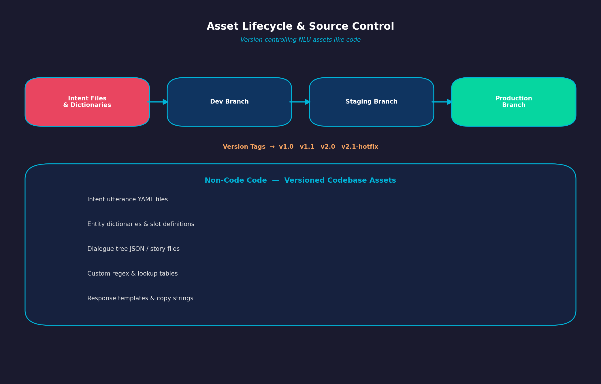
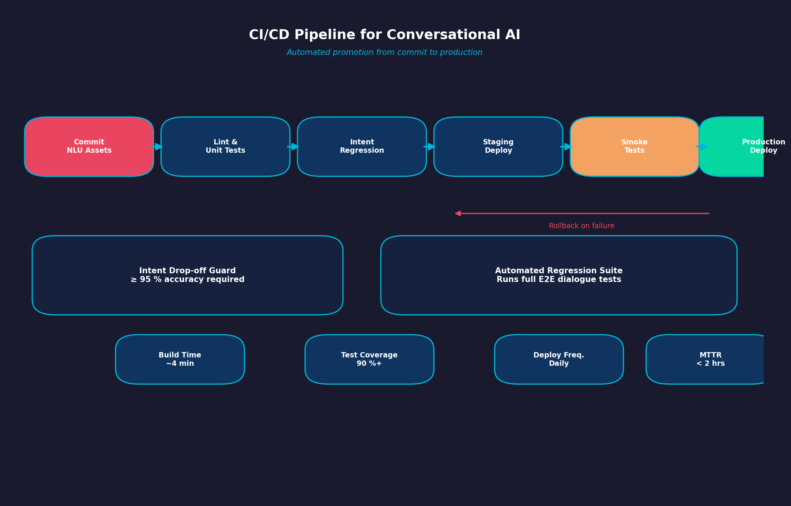
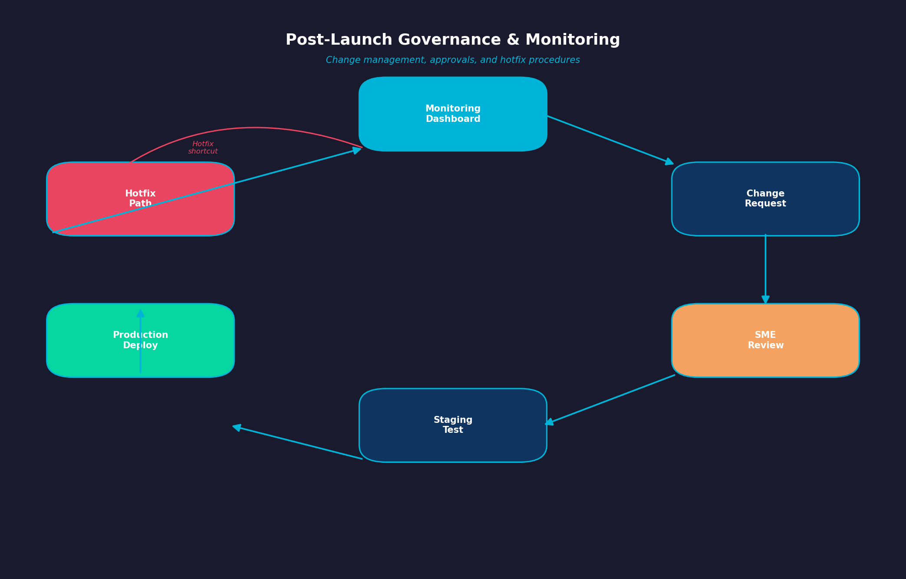
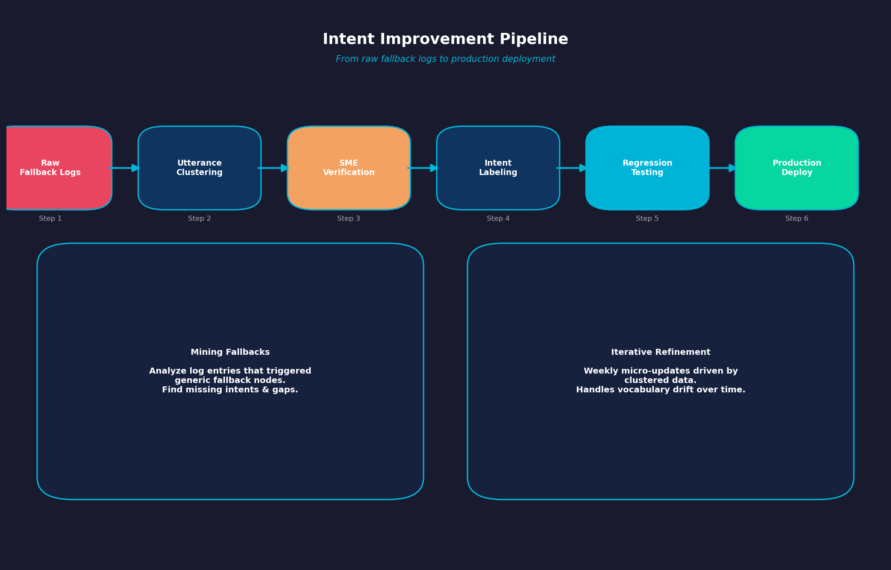
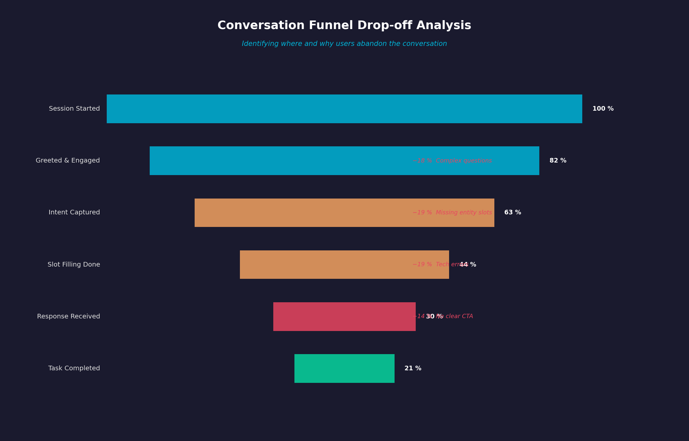
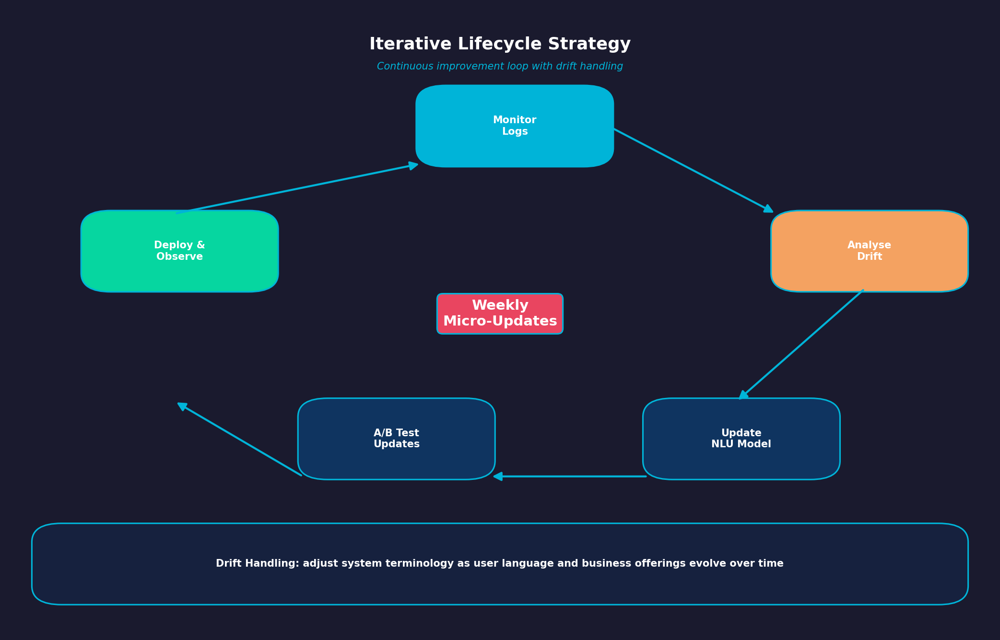

## 👋 Welcome Conversational AI (Part 4)

## PART 4: MAINTENANCE

## Week 9: Deployment and Management (Chapter 9)

### Slide 1: Asset Lifecycle & Source Control

{fig-alt="Asset lifecycle, branching, and version control for conversational AI assets" width="80%"}

- **Non-Code Code**: Treating intent files, entity dictionaries, and JSON dialogue trees as versioned codebase assets.
- **Branching Strategy**: Separating development, staging, and production versions of conversation models.

### Slide 2: Continuous Integration & Deployment (CI/CD)

{fig-alt="Automated CI/CD pipeline with testing and deployment stages" width="80%"}

- **Promotion Pipeline**: Moving changes through automated unit testing, regression testing, and production deployment.
- **Automated Regression Suite**: Running test suites before deployment to catch intent drop-offs or broken dialogue nodes.

### Slide 3: Post-Launch Governance

{fig-alt="Governance process with approvals, monitoring, and hotfix workflows" width="80%"}

- **Change Management Process**: Reviewing NLU updates before deploying to production.
- **Hotfix Procedures**: Emergency patches for critical bugs or unexpected breaking failures.

## Week 10: Improving Your Assistant (Chapter 10)

### Slide 1: Intent Improvement Pipeline

{fig-alt="Pipeline showing fallback mining, clustering, labeling, testing, and deployment" width="80%"}

```text
Raw Unhandled Logs ➔ Clustering ➔ SMEs Verification ➔ Labeling ➔ Regression Testing ➔ Deployment
```

- **Mining Fallbacks**: Analyzing log entries that triggered generic fallback nodes to find missing intents.
- **Utterance Clustering**: Grouping unassigned inputs to identify new user needs.

### Slide 2: Funnel Drop-off & Conversation Analysis

{fig-alt="Conversation funnel chart highlighting user drop-off points and causes" width="80%"}

- **Drop-off Point**: Identifying specific dialogue turns where users systematically abandon the conversation.
- **Root Cause Analysis**: Diagnosing drop-offs caused by overly complex questions, missing options, or technical errors.

### Slide 3: Iterative Lifecycle Strategy

{fig-alt="Continuous improvement loop showing weekly updates and drift handling" width="80%"}

- **Continuous Refinement**: Shifting from major initial releases to weekly data-driven NLU micro-updates.
- **Handling Drift**: Adjusting system terminology as user language and business offerings change over time.

      