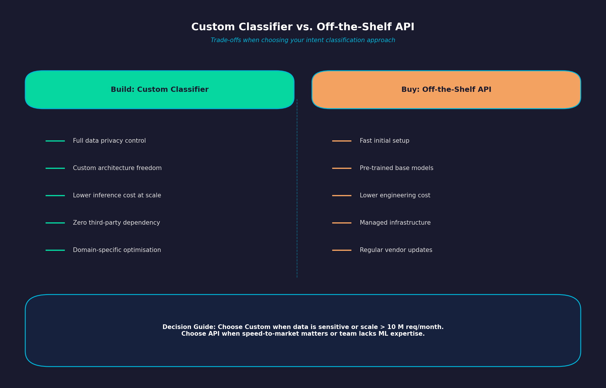
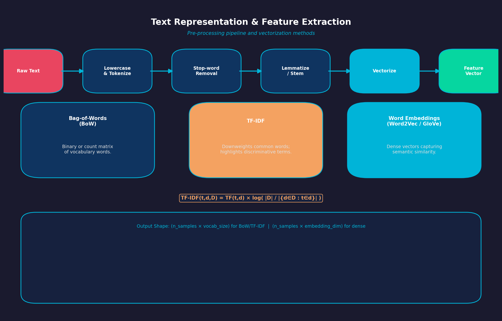
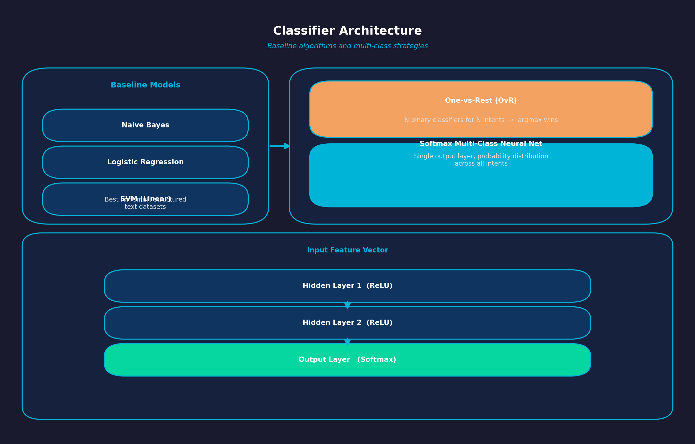
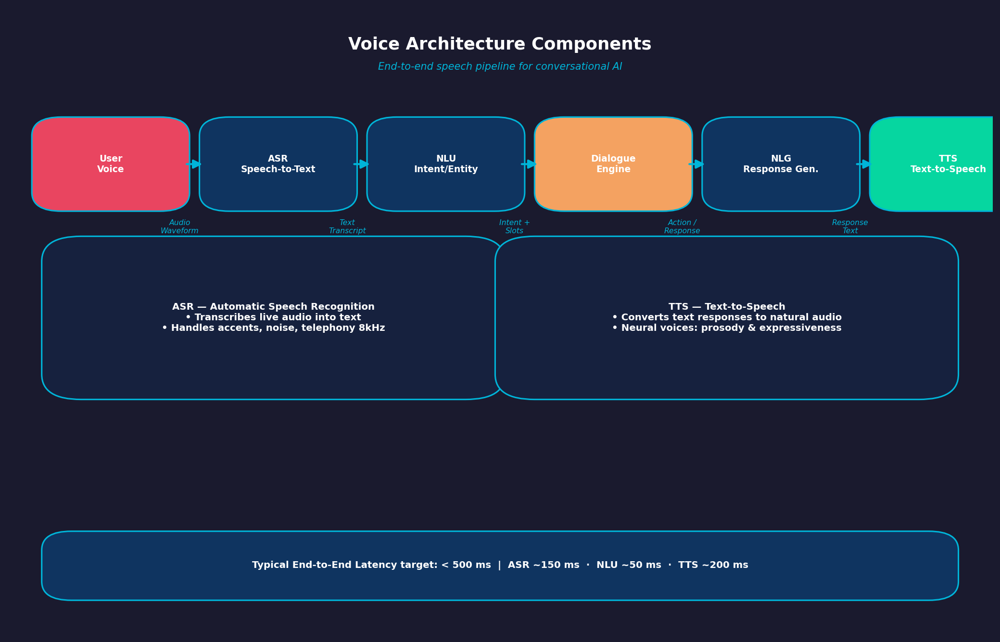
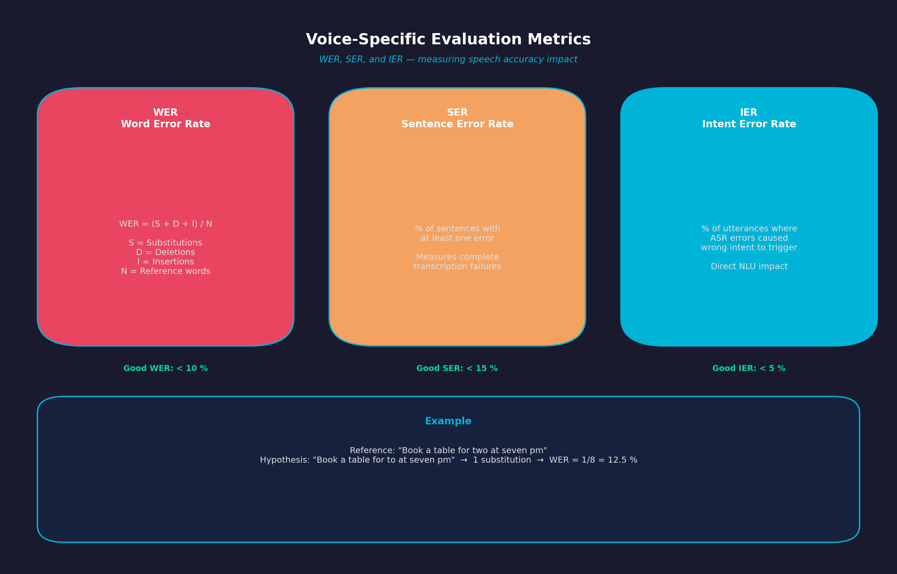
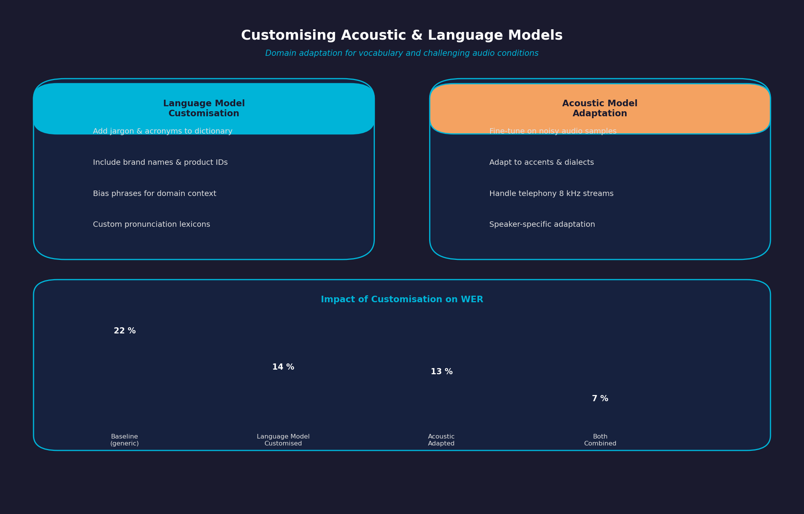

## 👋 Welcome Conversational AI (Part 5)

## PART 5: ADVANCED TOPICS

### Week 11: Building Your Own Classifier (Chapter 11)

### Slide 1: Custom Classifiers vs. Off-the-Shelf APIs

{fig-alt="Custom classifier vs off-the-shelf API comparison" width="42%"}

- **Build Benefits**: Full control over privacy, custom model architecture, lower inference costs at scale, zero third-party dependencies.
- **Buy Benefits**: Fast setup, pre-trained base models, lower initial engineering costs.

---

### Slide 2: Text Representation and Feature Extraction

{fig-alt="Text preprocessing and vectorization methods" width="42%"}

- **Pre-processing Pipeline**: Lowercasing, tokenization, stop-word removal, and lemmatization/stemming.
- **Vectorization Methods**: Bag-of-Words (BoW), Term Frequency-Inverse Document Frequency (TF-IDF), and dense Word Embeddings.

$$
	ext{TF-IDF}(t,d,D)=\text{TF}(t,d)\times\log\left(\frac{|D|}{|\{d\in D:t\in d\}|}\right)
$$

---

### Slide 3: Classifier Architecture

{fig-alt="Classifier architecture with OvR and softmax options" width="42%"}

- **Naive Bayes / Logistic Regression / SVM**: Lightweight baselines for small, structured text datasets.
- **Multi-Class Strategy**:
  - *One-vs-Rest (OvR)*: N separate binary classifiers for N intents.
  - *Softmax Multi-Class Neural Network*: Single output vector giving probability distributions across all intents.

---

### Week 12: Speech Recognition & Voice Training (Chapter 12)

### Slide 1: Voice Architecture Components

{fig-alt="Speech pipeline from user voice through ASR, NLU, dialogue, and TTS" width="46%"}

```text
User Voice ➔ Automatic Speech Recognition (ASR) ➔ Text ➔ NLU ➔ Dialogue Engine ➔ Text ➔ Text-to-Speech (TTS) ➔ Audio Output
```

- **ASR (Speech-to-Text)**: Translates live audio into text transcripts.
- **NLU & Dialogue**: Processes text and generates a response.
- **TTS (Text-to-Speech)**: Converts the system's text response back into natural-sounding audio.

---

### Slide 2: Voice-Specific Evaluation Metrics

{fig-alt="Voice evaluation metrics including WER, SER, and IER" width="42%"}

- **Word Error Rate (WER)**: Key accuracy metric for speech recognition:

$$
	ext{WER}=\frac{S+D+I}{N}
$$

- S = Substitutions, D = Deletions, I = Insertions, N = Total words in reference transcript.
- **Sentence Error Rate (SER)**: Percentage of complete sentences transcribed with at least one error.
- **Intent Error Rate (IER)**: Percentage of utterances where speech transcription errors caused the wrong intent to trigger.

---

### Slide 3: Customizing Acoustic & Language Models

{fig-alt="Custom speech model adaptation for vocabulary and noisy audio" width="42%"}

- **Custom Vocabularies**: Adding industry-specific jargon, acronyms, and brand names to speech recognition dictionaries.
- **Acoustic Adaptation**: Training speech models to handle background noise, accents, and telephony audio formats (e.g., 8kHz audio streams).

