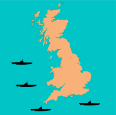
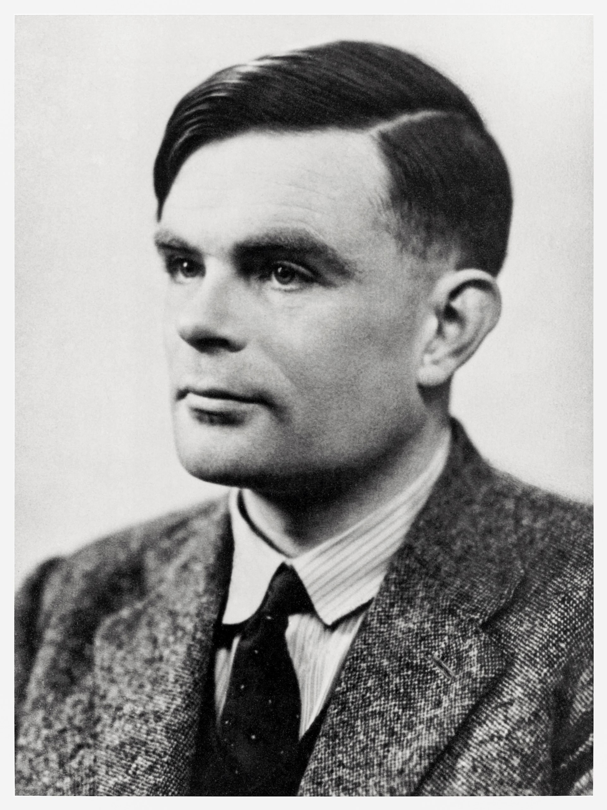

## Announcements
- Problem Set 6 due on _Saturday_ night
	- I'm just finishing typing up the last question. Will be posted by later this afternoon. Sorry for the delay.
	- Just two questions! Both of which you have everything you need already to do!
- Project 4 Guidelines will be posted by the end of tomorrow
- Viewing of "Breaking the Code" tomorrow night!
	- 7:30pm in this room
	- One of the better portrayals of both Alan Turing and the operation and breaking of the Enigma code
- Polling: [rembold-class.ddns.net](http://rembold-class.ddns.net)

## Review Question {data-notes="Solution: [125,167,204]"}
What is the printed value of the below code?
```python
A = [
	{'name': 'Jill',  'weight':125, 'height':62},
	{'name': 'Sam',   'height':68},
	{'name': 'Bobby', 'height':72},
]
A.append({'weight':204, 'height':70, 'name':'Jim'})
B = A[1]
B['weight'] = 167
A.append(B)
print([d['weight'] for d in A if 'weight' in d])
```


<div class='cols'>
<div class='col poll'>
<ol>
	<li>`[125,70,167]`</li>
	<li>`[125,167,204,167]` </li>
	</ol>
</div>
<div class='col poll'>
<ol style='counter-reset: li 2'>
	<li> `[125,204,167]` </li>
	<li>This would error</li>
</ol>
</div>
</div>

## Cryptography
- The science of encoding messages to keep their contents secret--and the symmetric problem of decoding those messages--is called _cryptography_.
- First recorded cryptographic algorithm attributed to Julius Caesar. The Roman historian Suitonius writes that:

> If [Caesar] had anything confidential to say, he wrote it in cipher, that is, by so changing the order of the letters of the alphabet, that not a word could be made out.

- In a _Caesar Cipher_, each letter is advanced a fixed distance in the alphabet, wrapping around to the start if necessary
	- A +3 Caesar cipher would make the following mappings

\begin{tikzpicture}%%width=80%
[
every node/.style={font = \Large\bf, color = MGreen}
]
\foreach[count = \i] \A/\B in {A/D, B/E, C/F, D/G, E/H, F/I, G/J, H/K, I/L, J/M, K/N, L/O, M/P, N/Q, O/R, P/S, Q/T, R/U, S/V, T/W, U/X, V/Y, W/Z, X/A, Y/B, Z/C} {
	\node (s) at (\i,0) {\A};
	\draw[MBlue,-stealth, very thick] (s) -- +(0,-.75) node[below] {\B};
	}
\end{tikzpicture}

## Letter Substitution Ciphers
- A _letter-substitution cipher_ (informally called a _cryptogram_) is a code in which each letter in the original text is replaced with some other letter.
	- The substitution pattern remains the same throughout the message
	- Any letter can be mapped to any other unused letter, no order is necessary
- One of the more famous cryptograms was written by Edgar Allen Poe in his short story "The Gold Bug"
	- Described in his story how the message could be decoded by mapping the most common letters in the message to the most commonly used letters in the English language


## World War II

<!--
## Writing Text Files
- You can write text files using almost the same syntax as reading:
  ```python
  with open(filename, mode) as file_handle:
  	# Code to write the file using file_handle
  ```
- Note the `mode` parameter to `open` here! Mode is a string which is either
	- `"w"` to **write** a new file (or overwrite an existing file)
	- `"a"` to **append** new contents to the end of an existing file
- The file handler supports the methods:
	- `.write(some_string)` to write a string to the file
	- `.writelines(iterable_of_strings)` to write each iterable element to the file

## Writing ASCII SINE
- Suppose I wanted to try my hand at some ASCII art and fill a text file with a vertical oscillating sine wave
- A sine wave generally looks like:
	$$ A \sin\left(\frac{2\pi}{T}x\right)$$
  where $A$ is the amplitude of the wave and $T$ the period of the wave, or how quickly it repeats
- How can we put this together?


## Review Question
::::::cols
::::{.col style='flex-grow:1'}
```{.python style='max-height:800px; font-size:.75em'}
class Symbol(GCompound):
  def __init__(self, col1, col2):
	GCompound.__init__(self)
	A = GOval(-10,-10,20,20)
	A.set_filled(True)
	A.set_color(col1)
	B = GRect(-10,-10,20,20)
	B.set_filled(True)
	B.set_color(col2)

gw = GWindow(100,100)
gw.add(Symbol("red", "blue"))
```

What would be output to the window when the above code is run? You can assume all necessary imports were made initially.
::::

::::col

:::{.hpoll}
#. {width=250px}
#. {width=250px}
#. {width=250px}
#. {width=250px}
:::

::::
::::::


## Review Question
::::::cols
::::col
What expression below would best fill in the gap in the code to the right?

:::{.poll}
#. `self.wage = wage`
#. `TechJob.__init__(self, wage)`
#. `TechJob.__init__(wage)`
#. `Job.__init__(wage)`
:::

::::

::::{.col style='flex-grow:1'}
```{.python style='max-height:900px; font-size:0.8em;'}
class Job:
	def __init__(self, wage):
		self.wage = wage

class TechJob(Job):
	def __init__(self, wage):
		self.wage = wage
		self.codes = True

class SeniorDev(TechJob):
	def __init__(self, wage, exp):
		# What goes here?
		self.exp = exp
```

::::
::::::
-->


## Alan Turing
::::::{.cols style='align-items: center'}
::::{.col style='flex-grow: 2;'}
- One of the most important contributors to computer science is Alan Turing, who made critical contributions in the theory of computation, hardware design, and artificial intelligence
- During WW2, Turing headed the mathematics division at Bletchley Park in England, which broke the German Enigma code
- Tragically, Turing committed suicide in 1954 after being convicted on a charge of "gross indecency" as a homosexual
	- Prime Minister Gordon Brown issued a public apology in 2009
::::

::::col
{width=500px}
::::
::::::


## {data-background-video="../video/Breaking_the_Code_clip.webm"}

## The Enigma Machine
::::::cols
::::{.col style='flex-grow:.6'}
{width=100%}
::::

::::col
{width=100%}
::::
::::::

## Enigma Rotors {data-state="RotorDemo"}
<div id="RotorDemo">
<canvas contenteditable="true" width="1485" height="810" style="border: none; overflow: hidden; outline-width: 0px; width: 1485px; height: 810px;"></canvas>
</div>
<td style="text-align:center;">
    <table class="CTControlStrip">
        <tbody style="border:none;">
            <tr>
                <td>
                    
                </td>
                <td>
                    
                </td>
            </tr>
        </tbody>
    </table>
</td>

## The Enigma Internals
{width=80%}

<!--
## The Enigma Rotors
{width=80%}
-->

## Operation of the Enigma Machine
- Whenever a letter is typed, the following happens:
	#. The force of the key press advances the fast rotor one position. If the rotor wraps from Z to A, this advances the next rotor by one increment as well.
	#. An electric signal is fed into the wire corresponding to the key, which then flows through seven letter-substitution steps
		- Through the fast rotor from right to left
		- Through the medium rotor from right to left
		- Through the slow rotor from right to left
		- Through the reflector, which turns the signal around
		- Through the slow rotor from left to right
		- Through the medium rotor from left to right
		- Through the fast rotor from left to right and on to the lamp

## Encoding "A" {data-transition="slide-in fade-out"}
{width=80%}

## Encoding "A" Again{data-transition="fade-in slide-out"}
{width=80%}

## Project 4 Milestones

:::{style="font-size:.9em;"}

- Project 4 has slightly more milestones than past projects, but each is still meant to give you a testable aspect of the program that you can bite off one piece at a time
	- Milestone 1: Activate the keyboard when pressed
	- Milestone 2: Connect the keys directly to the lamps
	- Milestone 3: Design and implement rotors
	- Milestone 4: Implement one stage in the encryption
	- Milestone 5: Implement the full encryption path
	- Milestone 6: Make the rotors advance properly each key press
- Web examples exist for helping you test each step of the process, linked [here](https://willamette.edu/~esroberts/roberts-enigma/Milestones/) and in the guide.

:::

## {data-background-iframe="https://willamette.edu/~esroberts/roberts-enigma/Milestones/"}

## Model-Controller-View
::::cols
:::col
- The Enigma project is designed using the common _model, controller, view_ paradigm
- Breaks an interactive program up into 3 pieces:
	- The controller: the piece that deals with user input
	- The view: the piece that handles graphical output
	- The model: the piece that controls what should be happening at any given time
:::
:::col
\begin{tikzpicture}%%width=100%
[
every node/.style={circle, draw, minimum size=2cm, ultra thick, MGreen},
]
\node (model) at (0,0) {Model};
\node[below right = of model](view) {View};
\node[below left = of model](cont) {Controller};
\path[latex-latex, ultra thick, MBlue] (model) edge (view)
				   (model) edge (cont)
				   (view) edge (cont);
\end{tikzpicture}
:::
::::

## Modeling
- In the Enigma project, the view and the controller are handled for you
	- Both are actually handled in the same module
	- Both export various methods that you can use to get input or interact with them from within the model
- You are responsible for writing the code that comprises the model
- There is also a constants module, where all of the various constants that you may need are stored

<!--
## Virtual Enigma Machine Pieces
\begin{tikzpicture}%%width=80%
[
box/.style={draw, MBlue, very thick, rounded corners, inner sep = 10pt, font=\tt\Large},
class/.style={box, fill=MBlue, text=black},
func/.style={box, MGreen, fill=MGreen, text=black},
]
\node[class] (em) at (0,0) {EnigmaMachine};
\node[class, right=of em](ek) {EnigmaKey};
\node[class, right=of ek](el) {EnigmaLamp};
\node[class, right=of el](er) {EnigmaRotor};
\node[class, above=of el](gc) {GCompound};
\draw[line width=5pt, -stealth, MGreen] (ek.north) |- (gc.west);
\draw[line width=5pt, -stealth, MGreen] (el.north) -- (gc.south);
\draw[line width=5pt, -stealth, MGreen] (er.north) |- (gc.east);
\node[func, below=1.5cm of em] (e) {Enigma};
\node[func, right=of e] (ec) {EnigmaConstants};
\end{tikzpicture}

## Who talks to Whom?
- It will be important to maintain an effective separation between the parts of the program responsible for storing state information and parts of the program responsible for updating the graphics window.
	- Failing to maintain this separation is a good way to find yourself in a convoluted mess real quick!
- The `EnigmaMachine` class is the brain of the operation and stores the model for the Enigma machine, serving as a relay point for information flow.
	- The `EnigmaKey` class should not communicate directly with `EnigmaLamp` or `EnigmaRotor`, but instead contact `EnigmaMachine`.
	- `EnigmaMachine` stores the relevant information and then passes on a message to the appropriate `EnigmaLamp` or `EnigmaRotor` object.
-->
