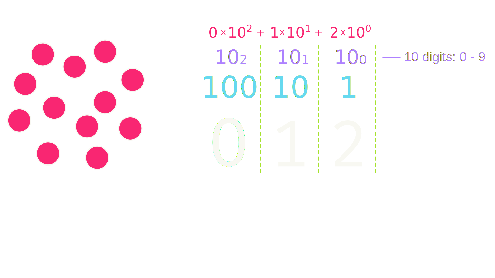

## Announcements
- Midterm on Friday!
	- Second practice exam posted (actually the exam from last semester)
	- Test is open book, open note, but no computer
	- I will provide the Python summary page posted on the website for you!
- Breakout guide should be posted by tomorrow whenever you want to start looking at it
- Graphics contest will be going live by the end of the week
	- Entries due at the end of the month
	- Winner gets a free 100% on any assignment, project, or exam of their choosing
	- All credible entries entered for a drawing for a 10% boost to any graded submission
- Polling: [rembold-class.ddns.net](http://rembold-class.ddns.net)

## Representations
- Focusing today on how a computer can internally store more complex and abstract information
- Initially will look at numbers
- Then we'll segue to strings

## Bit Power
- The fundamental unit of memory inside a computer is called a _bit_
	- Coined from a contraction of the words binary and digit
- An individual bit exists in one of two states, usually denoted as **0** or **1**.
- More complex data can be represented by combining larger numbers of bits:
	- Two bits can represent 4 ($2\times 2$) values
	- Three bits can represent 8 ($2\times2\times2$) values
	- Four bits can represent 16 ($2\times2\times2\times2$ or $2^4$) values, etc
- My laptop here has 16GB of system memory, and can therefore keep track of approximately $2^{16,000,000,000}$ states!

## An old code, but it checks out
::::::cols
::::col
- Binary notation is an old idea
	- Described by German mathematician Leibniz back in 1703
- Leibniz describes his use of binary notation in an easy-to-follow style
- Leibniz's paper notes that the Chinese had discovered binary arithmetic 2000 years earlier, as illustrated by the patterns of lines in the _I Ching_!
::::

::::col
{width=70%}
::::
::::::

## Back to Grade school
:::center

:::

## Now in Binary
:::center

:::

## Representing Integers
- The number of symbols available to count with determines the _base_ of a number system
	- Decimal is base 10, as we have 10 symbols (0-9) to count with
		- Each new number counts for 10 times as much as the previous
	- Binary is base 2, as we only have 2 symbols (0 and 1) to count with
		- Each new number counts for twice as much as the previous
- Can always determine what number a representation corresponds to by adding up the individual contributions

 
\begin{tikzpicture}%%width=50%
[
every node/.style={draw, thick, MGreen, font=\Large}
]
\node(1) at (0,0) {0};
\node[right=0cm of 1](1) {0};
\node[right=0cm of 1](1) {1};
\node[right=0cm of 1](1) {0};
\node[right=0cm of 1](1) {1};
\node[right=0cm of 1](1) {0};
\node[right=0cm of 1](1) {1};
\node[right=0cm of 1](1) {0};
\end{tikzpicture}

## Specifying Bases
- So the binary number 00101010 is equivalent to the decimal number 42
- We distinguish by subsetting the bases:
	$$ 00101010_2 = 42_{10}$$
- **The number itself still is the same! All that changes is how we represent that number.**
	- Numbers do not have bases -- representations of numbers have bases

## Understanding Check
:::::cols
::::col
How could you represent the number of items shown to the right in a binary representation?

:::poll
#. 1011
#. 10110
#. 10010
#. 11010
:::

::::

::::col
\begin{tikzpicture}%%width=80%
\foreach \c in {0,1,...,17} {
	\pgfmathparse{floor(\c/4)}
	\def\y{\pgfmathresult}
	\pgfmathparse{Mod(\c,5)}
	\def\x{\pgfmathresult}
	\node[circle, draw=white, thick, fill=MRed, minimum size=0.75cm] at ({Mod(\c,5)}, {floor(\c/5)}) {};
}
\end{tikzpicture}
::::
:::::

## Binary Clocks {data-background-iframe="https://clock.sasaya.me/" data-background-interactive=true}

## Other Bases
- Binary is not a particularly compact representation to write out, so computer scientists will often use more compact representations as well
	- _Octal_ (base 8) uses the digits 0 to 7
	- _Hexadecimal_ (base 16) uses the digits 0 to 9 and then the letters A through F
 

::::::cols
::::col
\begin{tikzpicture}%%width=30%
[ boxed/.style={draw, very thick, MOrange, font=\Large, minimum size=1cm}]
\node[boxed] (1) at (0,0) {5};
\node[boxed, right=0cm of 1] (1) {2};
\node[MOrange,font=\scriptsize, above=1mm of 1.north west] {Octal};
\end{tikzpicture}
::::

::::col
\begin{tikzpicture}%%width=30%
[ boxed/.style={draw, very thick, MBlue, font=\Large, minimum size=1cm}]
\node[boxed] (1) at (0,0) {2};
\node[boxed, right=0cm of 1] (1) {A};
\node[MBlue,font=\scriptsize, above=1mm of 1.north west] {Hexadecimal};
\end{tikzpicture}

::::
::::::
 

:::incremental
- Why octal or hexadecimal over our trusty old decimal system?
	- Both are powers of 2, so it makes it easy to convert back to decimal
		- 1 octal digit = 3 binary digit, 1 hex digit = 4 binary digit
:::

## Base(ic) Practice
- The Java compiler has a fun quirk where every binary file is produces begins with
  

\begin{tikzpicture}%%width=70%
[
every node/.style={draw, thick, MGreen, font=\Large}
]
\node(1) at (0,0) {1};
\node[right=0cm of 1](1) {1};
\node[right=0cm of 1](1) {0};
\node[right=0cm of 1](1) {0};
\node[right=0cm of 1](1) {1};
\node[right=0cm of 1](1) {0};
\node[right=0cm of 1](1) {1};
\node[right=0cm of 1](1) {0};
\node[right=0cm of 1](1) {1};
\node[right=0cm of 1](1) {1};
\node[right=0cm of 1](1) {1};
\node[right=0cm of 1](1) {1};
\node[right=0cm of 1](1) {1};
\node[right=0cm of 1](1) {1};
\node[right=0cm of 1](1) {1};
\node[right=0cm of 1](1) {0};
\end{tikzpicture}

 

- What is this in decimal? octal? hexadecimal?

## Representation
- Sequences of bits have no intrinsic meaning!
	- Just the representations we assign to them by convention or by building certain operations into hardware
	- A 32-bit sequence represents an integer only because we have designed hardware to manipulate those sequences arithmetically: applying operations like addition, subtraction, etc
- By choosing an appropriate representation, you can use bits to represent any value you could imagine!
	- Characters represented by numeric character codes
	- Floating-point representations to support real numbers
	- Two-dimensional arrays of bits representing images
- To be useful though, everyone needs to agree on a representation!

## Representation Pitfalls
- How we choose to represent values has consequences!
- Python represents floating point (fractional) numbers using two integers
	- One to represent the significant digits
	- One to represent the exponent (where the decimal place is)
- $1\frac{1}{4}$ Example
	- In decimal:
		$\quad\displaystyle 1\frac{1}{4} = \frac{1}{1} + \frac{2}{10} + \frac{5}{100} = 1.25 = (125, -2)$
	- In binary:
		$\quad\displaystyle 1\frac{1}{4} = \frac{1}{1} + \frac{0}{2} + \frac{1}{4} = 1.01 = (101, -10)$

## Floating Binary
:::incremental
- Say we wanted to convert the value $\tfrac{7}{8}$ to a binary floating point representation:
	$$\frac{7}{8} = \frac{0}{1} + \frac{1}{2} + \frac{1}{4} + \frac{1}{8} = 0.111 = (111, -11)$$
- Now how would we convert $\frac{1}{10}$ to binary??
	- We run into a problem! An infinitely repeating sequence!
	$$\frac{1}{10} = \frac{0}{1} + \frac{0}{2} + \frac{0}{8} + \frac{1}{16} + \frac{1}{32} + \frac{0}{64} + \frac{0}{128} + \frac{1}{256} +  \cdots = 0.0001100110011\ldots$$ 
	- Have to stop the sequence somewhere and approximate it:
		$$\frac{3}{32} = 0.09375\quad\text{or}\quad\frac{25}{256} = 0.09765625$$
:::

## Consequences
- The best we can do within the range of normal integers
	$$\frac{3602879701896397}{2^{55}} = 0.10000000000000000555111512312578270$$
- When doing operations on these numbers, extra decimals will sometimes get rounded off, suddenly making the number look precise, but you might always have a tiny bit of this rounding error showing up in floating point values.
- So be _careful_ using `==` for numeric comparisons! Rounding might result in unexpected falsehoods
	- `0.1 + 0.1 + 0.1 != 0.3`
	- Far better to check if two numbers are within a small margin of one another, or greater or less than the other

## Representing Characters
- Use numeric encodings to represent character data inside the machine, where each character is assigned an integer value.
- Character codes are not very useful unless standardized though!
	- Competing encodings in the early years made it difficult to share data across machines
- First widely adopted character encoding was ASCII (American Standard Code for Information Interchange)
- With only 256 possible characters, ASCII proved inadequate in the international world, and has therefore been superseded by Unicode.

## ASCII

{width=100%}
