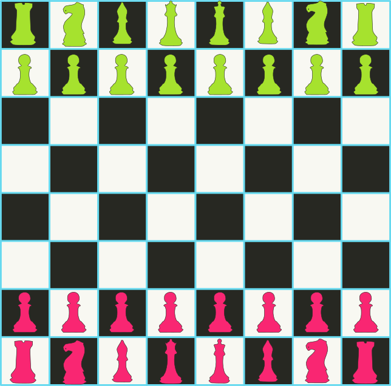
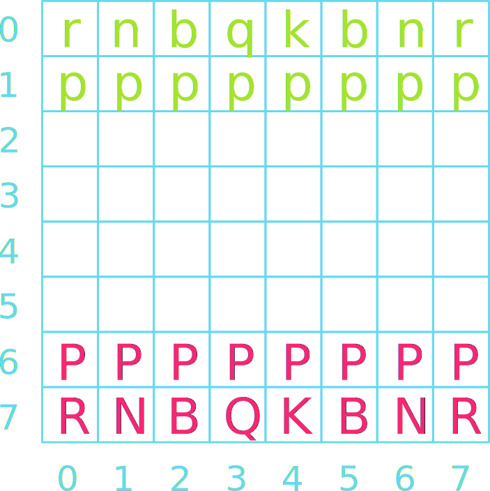

## Announcements
- Project 2: Breakout is due **next week Tuesday at noon!**
- Problem Set 4 grading was released. Check and let me know if you have questions
- Project 1 feedback to be ready soon
- Next week, we will return to **Ford Hall**
- Polling continues today! Remember to use this link [https://www.polleverywhere.com/agbofred203](https://www.polleverywhere.com/agbofred203) when it becomes **active**


<!--
## Review! {data-notes="Solution: None of the above, as it errors"}
What would the below expression evaluate to?

<center>
<code>['One', 2, True][-1:1:-1][1]</code>
</center>

:::{.poll}
#. `['One']`
#. `2`
#. `True`
#. None of the above, or this will error
:::


## A Tutorial on Lists
::::::cols
::::col
- Thinking about mutable objects requires a shift in how we visualize our code interacting with the objects in memory
- [Link here](https://pythontutor.com/render.html#code=cool%20%3D%20%5B'blue',%20'violet'%5D%0Awarm%20%3D%20%5B'red',%20'orange'%5D%0A%0Acolors%20%3D%20%5Bcool,%20warm%5D%0Aother_colors%20%3D%20%5B%5B'blue',%20'violet'%5D,%0A%20%20%20%20%20%20%20%20%20%20%20%20%20%20%20%20%5B'red',%20'orange'%5D%5D%0A%0Aprint%28colors%20%3D%3D%20other_colors%29%0Aprint%28colors%20is%20other_colors%29%0A%0Acool%5B0%5D%20%3D%20'indigo'%0Awarm%20%3D%20%5B'orange',%20'yellow'%5D%0A%0Aprint%28colors%29%0Aprint%28other_colors%29&cumulative=false&curInstr=0&heapPrimitives=false&mode=display&origin=opt-frontend.js&py=3&rawInputLstJSON=%5B%5D&textReferences=false)
::::

::::{.col style="flex-grow:2;"}
```{.python style='max-height:900px; font-size:0.8em;'}
cool = ['blue', 'violet']
warm = ['red', 'orange']

colors = [cool, warm]
other_colors = [['blue', 'violet'],
				['red', 'orange']]

print(colors == other_colors)
print(colors is other_colors)

cool[0] = 'indigo'
warm = ['orange', 'yellow']

print(colors)
print(other_colors)
```
::::
::::::

## For Reference
- When working with mutable objects, it is better to think of the variable as holding a _reference_ to the object, rather than the actual contents of the object
- I find it useful to think of a reference as the "address" in memory where that object's contents can be found
- This undeniably complicates things, as referencing a mutable object lets you change it, which will immediately be reflected in anything _else_ that referenced that object
- Mutable objects can be terrific to work with, as their mutability makes them very flexible, but be wary of unexpected behavior
-->

## Lists as Arguments
- When you pass a list as an argument to a function or return a list as a result, only the **reference** to the list is actually passed back and forth
- This means that the elements of the list are effectively shared between the function and the caller
	- Changes that the function makes to the elements **will** persist after the function returns
- Example of reversing a list in PythonTutor: [here](http://www.pythontutor.com/visualize.html#code=def%20reverse_in_place%28array%29%3A%0A%20%20%20%20for%20lh%20in%20range%28len%28array%29//2%29%3A%0A%20%20%20%20%20%20%20%20rh%20%3D%20len%28array%29%20-%20lh%20-%201%0A%20%20%20%20%20%20%20%20array%5Blh%5D,%20array%5Brh%5D%20%3D%20array%5Brh%5D,%20array%5Blh%5D%0A%0Aarray%20%3D%20%5B0,%201,%202,%203,%204,%205,%206,%207,%208,%209%5D%0Aprint%28f%22Forward%3A%20%7Barray%7D%22%29%0Areverse_in_place%28array%29%0Aprint%28f%22Reverse%3A%20%7Barray%7D%22%29&cumulative=false&curInstr=0&heapPrimitives=false&mode=display&origin=opt-frontend.js&py=3&rawInputLstJSON=%5B%5D&textReferences=false)


## Sneaky Mutability
- List's mutability can frequently be very nice to work with, but as with lists as arguments to functions, you need to be careful in some instances to ensure you understand how Python is treating the list
- One could encounter a few other problems where it can be easy to mess up:
	- Initializing a list to look like another list, wanting to make changes and then compare it to the original
		- [Example](http://www.pythontutor.com/visualize.html#code=A%20%3D%20%5B'Aardvark',%20'Butterfly',%20'Centipede'%5D%0AB%20%3D%20A%0A%0AB.append%28'Deer'%29%0AB.remove%28'Butterfly'%29%0A%0Aprint%28A%29%0Aprint%28B%29&cumulative=false&curInstr=0&heapPrimitives=false&mode=display&origin=opt-frontend.js&py=3&rawInputLstJSON=%5B%5D&textReferences=false)
	- Looping over a mutating list
		- [Example](http://www.pythontutor.com/visualize.html#code=A%20%3D%20%5B1,2,3,4,5,6,7,8,9%5D%0A%0Afor%20i%20in%20range%28len%28A%29%29%3A%0A%20%20%20%20print%28'Current%20index%3A%20%7B%7D,%20Current%20value%3A%20%7B%7D'.format%28i,A%5Bi%5D%29%29%0A%20%20%20%20if%203%20%3C%20A%5Bi%5D%20%3C%206%3A%0A%20%20%20%20%20%20%20%20A.remove%28A%5Bi%5D%29%0A%20%20%20%0Aprint%28A%29&cumulative=false&curInstr=0&heapPrimitives=false&mode=display&origin=opt-frontend.js&py=3&rawInputLstJSON=%5B%5D&textReferences=false)


## Cloning
- What can we do in these sorts of instances to not let mutability trip us up?
- _Clone_ the list instead of just assigning a reference
	- Creates a **new** object in memory
- Several ways you can make a shallow clone (in code)
	- Using the `.copy()` list method
	- Any slice always returns a new object
	- Using the `list()` function will return a new object


## Common Useful List Methods

Method | Description
---- | ------
`list.copy()` | Returns a new list whose elements are the same as the original
`list.append(value)` | Adds `value` to the end of the list
`list.insert(idx, val)` | Inserts `val` before the specified `idx`
`list.remove(value)` | Removes the first instance of `value` from the list, or errors
`list.reverse()` | Reverses the order of the elements in the list
`list.sort()` | Sorts the elements of the list. Can take an optional argument `key` to specify how to sort

## Functions on Iterators
- The `.sort` and `.reverse` methods reorder the list **in place** and do not return anything
- Commonly, you might want to loop through a list in a particular order, but not change the original list
- Python gives you two matching functions to do this, which return a **new** ordered version of the list, without changing the original
	- The `reversed()` function creates a new iterable object that returns its elements in the opposite order
	- The `sorted()` function creates a new iterable object that returns its elements in ascending order


## Understanding Check{data-notes="Solution: ['Fox', 'Hippo', 'Iguana']"}
::::::cols
::::col
Given the code to the right, what would be the final printed value of `A`?


:::{.poll}
#. `['Fox', 'Giraffe', 'Hippo', 'Iguana']`
#. `['Fox', 'Hippo', 'Iguana']`
#. `['Iguana', 'Fox']`
#. `['Fox', 'Iguana']`
:::

::::

::::col
```{.python style="max-height:900px"}
A = [
	 'Fox',
	 'Giraffe', 
	 'Hippo'
	]
A.append('Iguana')
A[:].reverse()
B = A
for anim in B:
	if anim[1] == 'i':
		B.remove(anim)
print(A)
```

::::
::::::


## List building with loops
- Commonly will make lists with a simple:

	```python
	even_digits = [ 2, 4, 6, 8 ]
	```
- But in many cases, it is easier to specify the elements of a list using a sequence of values generated by a `for` loop. For instance

	```python
	even_digits = [ ]
	for i in range(0, 10, 2):
		even_digits.append(i)
	```
- Python gives us a shorthand notation to achieve this:

	```python
	even_digits = [ i for i in range(0, 10, 2) ]
	```
	- Called _list comprehension_


## Comprehending Lists
- The simplest list comprehension syntax is:
	
	```python
	[ expression iterator ]
	```
	where `expression` is any Python expression and `iterator` is a `for` loop header
- The iterator component can be followed by any number of additional modifiers
	- More `for` loop headers for nested loops
	- or `if` statements to select specific values
- Example: all even numbers to 20 not also visible by 3

	```python
	[i for i in range(0,20,2) if i % 3 != 0]
	```

## Where Strings and Lists Meet
- There are a handful of methods that transition between strings and lists

Method | Description
--- | ------
`str.split()` | Splits a string into a list of its components using whitespace as a separator
`str.split(sep)` | Splits a string into a list using the specified separator `sep`
`str.splitlines()` | Splits a string into of list of strings at the newline character
`str.join(list)` | Joins the elements of the `list` into a string, using `str` as the separator

<!--
## Reading
- Programs often need to work with lists that are too large to reasonable exist typed all out in the code
	- Easier to read in the values of a list from some external data file
- A _file_ is the generic name for any named collection of data maintained on some permanent storage media attached to a computer
- Files can contain information of many different types and encodings
	- Most common is the _text file_
	- Contains character data like you'd fine in a string


## Strings vs Text Files
- While strings and text files both store characters, there are some important differences:
	- **The longevity of the data stored**
		- The value of a string variable lasts only as long as the string exists, is not overridden, or is not thrown out when a function completes
		- Information in a text file exists until the file is deleted
	- **How data is read in**
		- You have access to all the characters in a string variable pretty much immediately
		- Data from text files is generally read in sequentially, starting from the beginning and proceeding until the end of the file is reached
-->

## Tabulation
- Arrays can also be useful when you have a set of values and you need to count how many values fall into a different ranges
	- Process is called _tabulation_
- The idea is that for each piece of data we encounter, we figure out a corresponding index in our tabular array and then increment the value of that element
- Your book shows this for seeing how many times each letter of the alphabet appears in a text sequence
- Let's instead look at an example of determining how many students got different letters grades on a final


## Multidimensional Arrays
- We know that elements of a list can be lists in and of themselves. If the lengths of all the lists making up the elements of a list remain fixed, then the list of lists is called a _multidimensional array_
- In Python, we can create multidimensional arrays just by creating lists of constant length as the elements to another list
  ```python
  magic = [ [2, 9, 4], [7, 5, 3], [6, 1, 8] ]
  ```
- We can always get the individual element of one of the inner lists by using **2** indices.
	- `magic[1][1] = 5`
	- `magic[-1][0] = 6`


## Picturing Multidimensional Arrays
- Multidimensional arrays are commonly pictured as each inner list being stacked beneath the previous
- In such a representation, the outermost/first elements/indices represent the row, and the inner/second elements/indices represent the column

`[ [2, 9, 4], [7, 5, 3], [6, 1, 8] ]`{style="display: block; margin: auto; text-align: center;"}

<br>

\begin{tikzpicture}%%width=80%
[
block/.style = {draw, MGreen, outer sep=0pt, font=\Large, minimum size=1cm},
]
\node[block](00) at (0,0) {2};
\node[block,below=0 of 00](10) {7};
\node[block,below=0 of 10](20) {6};

\node[block,right=0 of 00](01) {9};
\node[block,right=0 of 10](11) {5};
\node[block,right=0 of 20](21) {1};

\node[block,right=0 of 01](02) {4};
\node[block,right=0 of 11](12) {3};
\node[block,right=0 of 21](22) {8};


\node[block,color=MBlue,font=\tt,](00) at (5,0) {magic[0][0]};
\node[block,color=MBlue,font=\tt,below=0 of 00](10) {magic[1][0]};
\node[block,color=MBlue,font=\tt,below=0 of 10](20) {magic[2][0]};

\node[block,color=MBlue,font=\tt,right=0 of 00](01) {magic[0][1]};
\node[block,color=MBlue,font=\tt,right=0 of 10](11) {magic[1][1]};
\node[block,color=MBlue,font=\tt,right=0 of 20](21) {magic[2][1]};

\node[block,color=MBlue,font=\tt,right=0 of 01](02) {magic[0][2]};
\node[block,color=MBlue,font=\tt,right=0 of 11](12) {magic[1][2]};
\node[block,color=MBlue,font=\tt,right=0 of 21](22) {magic[2][2]};
\end{tikzpicture}
<!--

## Initialize a Chessboard {data-transition="slide-in fade-out" data-transition-speed="slow"}
{data-id="test" data-auto-animate-easing=ease-out}

## Initialize a Chessboard{data-transition="fade-in fade-out" data-transition-speed="slow"}
{data-id="test"}

## Initialize a Chessboard{data-transition="fade-in slide-out" data-transition-speed="slow"}
{data-id="test"}


## The `GImage` Class
- You can display an image from a file in PGL using the `GImage` class.
`GImage(filename, x, y)`{.inlinecode}
	- `filename` is the string containing the name of the file which contains the image
	- `x` and `y` are the coordinates of the upper left corner of the image
- Best to use one of the common image formats
	- Graphical Interchange Format (GIF): `fish.gif`
	- Joint Photographic Experts Group (JPEG): `fish.jpg`
	- Portable Network Graphics (PNG): `fish.png`


## Images and Copyrights
- Most images that you might find on the web are protected by copyright under international law.
- Ensure you have the necessary permissions before using an image
	- On the web, the image hosting site will often specify what rules apply to that image
		- Example: Images from `www.nasa.gov` can be freely used as long as you add an attribution line
	- Non-commercial use of an image can sometimes fall under "fair use" doctrine, but academic integrity and common courtesy both demand you cite or acknowledge any material you have obtained from others.


## Example: VLA Moonset
```{.python style='max-height: 800px; font-size:.7em;'}
from pgl import GImage, GWindow, GLabel

def image_example():
	gw = GWindow(800, 550)
	image = GImage("VLA_Moonset.jpg")
	image.scale(gw.get_width() / image.get_width())
	gw.add(image)

	citation = GLabel("Image Credit: Jeff Hellermann, NRAO / AUI / NSF")
	citation.set_font("15px 'Sans-Serif'")
	x = gw.get_width() - citation.get_width() - 10
	y = image.get_height() + citation.get_ascent()
	gw.add(citation, x, y)
```
-->