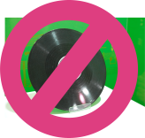
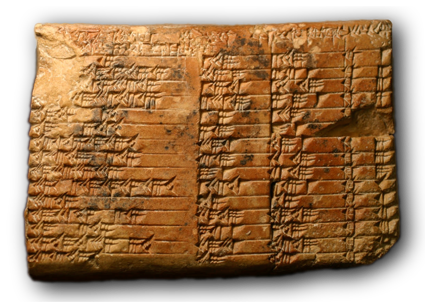
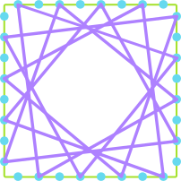
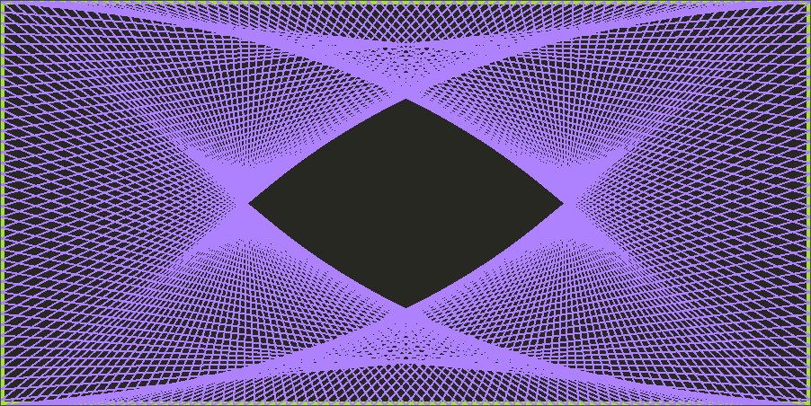

## Announcements
- Problem Set 5 due tonight!
- ImageShop guide posted!
- I'll be around this afternoon, but have a few meetings at 1:30 and then at 3
- Stuck on something over break? Feel free to email me or send a message on Discord! I won't reply as fast as I usually would, but I'll be around a computer and should be able to get back to you
	- Reminder: unless you are behind, I don't expect you to work on anything over break!
- Polling: [rembold-class.ddns.net](http://rembold-class.ddns.net)

## Introspection Question
Starting today off with a bit of introspection (all correct answers).
<br><br>

Of the debugging strategies presented on Wednesday, for which of the following strategies do you see the most room for improvement in your own debugging?

:::poll
#. Strategy #1 or Strategy #2
#. Strategy #3 or Strategy #4
#. Strategy #5
#. Strategy #6 or Strategy #7
:::

Once you've submitted your answer, share and justify with a neighbor why you chose the option you did, and some specific steps you'll take to improve.

## Did you Listen?
What strategy was your neighbor looking to improve?

:::poll
#. Strategy #1 or Strategy #2
#. Strategy #3 or Strategy #4
#. Strategy #5
#. Strategy #6 or Strategy #7
:::


## Its a Record!
::::::{.cols style='align-items: center'}
::::col
- A record is a collection of related fields treated as a single unit
	- Imagine a row in a spreadsheet or database
	- Or a single observation
- A record stores what the state of something was, and thus generally doesn't change

::::

::::col

::::
::::::


## Old Records
- Records are a very old idea, dating back to the 19th century BCE
- In 2017, researchers established that the below tablet, called the Plimpton 322 tablet, records Pythagorean triples!

{width=50%}


## Recording Dickens
- Suppose we had some records from the two-employee firm Scrooge and Marley
- Each contains the employee name, their title, and their salary

\begin{tikzpicture}%%width=70%
[record/.style={draw, minimum width=4cm, font=\tt},
lab/.style={font=\tt\small, anchor=south west},
]
\node[record, MGreen](n) at (0,0) {"Ebenezer Scrooge"};
\node[lab, MGreen](nl) at (n.north west) {name};
\node[record, MGreen, below=.75cm of n](t){"founder"};
\node[lab, MGreen] at (t.north west) {title};
\node[record, MGreen, below=.75cm of t](s) {1000};
\node[lab, MGreen] at (s.north west) {salary};
\node[fit=(nl)(s), draw, very thick, MGreen] {};

\node[record, MBlue](n) at (5,0) {"Bob Cratchit"};
\node[lab, MBlue](nl) at (n.north west) {name};
\node[record, MBlue, below=.75cm of n](t) {"clerk"};
\node[lab, MBlue] at (t.north west) {title};
\node[record, MBlue, below=.75cm of t](s) {15};
\node[lab, MBlue] at (s.north west) {salary};
\node[fit=(nl)(s), draw, very thick, MBlue] {};

\end{tikzpicture}

## Tuple Time
- In Python, the simplest strategy for representing a record uses the built-in type _tuple_
	- Comes from terms like _quintuple_ or _sextuple_, that denote fixed-size collections
- An ordered, **immutable** sequence of values
- Feel similar to lists, except immutable, and thus used very differently
	- Think of tuples as records 
- Created by enclosing a collection of elements in parentheses
`employee = ("Bob Cratchit", "clerk", 15)`{.inlinecode}
- Stored internally similarly to a list, so each element has a corresponding index

## Tuple Usage
- Can largely envision tuples as sitting between strings and lists
	- Immutable, like strings
	- Elements can be _anything_, like lists
- Common operations mimic that of strings
	- Can concatenate with addition
	- Can duplicate by multiplying by an integer
	- Can index and slice them
	- Can loop over them directly or via index
- A tuple of a single value **needs** a comma at the end in order to be a tuple


## Tuple Selection
- You can select or slice elements from a tuple just like you can with lists
	- Unfortunately, records are not usually ordered in a particular way. Rather, it is the field name that is usually important
- If using tuples, you can make programs more readable by using a _destructuring assignment_, which breaks a tuple into named components:

  ```python
  name, title, salary = employee
  ```

- While modern versions of Python have such thing as a _named tuple_, we will not look at them here.
	- The more general strategy is to define a new data type (class) to better represent the objects in question


## Pointy Tuples!
::::::{.cols style='align-items:center'}
::::col
- One of the most simple examples of tuple usage would be storing location information in 2d space
- By storing both $x$ and $y$ coordinates in a tuple, it makes that information easier to store and pass around your program
- When you need to use the points, best to destructure:
  ```python
  x,y = pt
  ```
::::

::::col

\begin{tikzpicture}%%width=80%
\draw[very thick, MGreen] (0,0) rectangle + (5,5);
\node[circle, fill=MRed, label={[MRed]below right: ($x_1$,$y_1$)}, minimum size=5pt, inner sep=0pt] at (3,4) {};
\node[circle, fill=MBlue, label={[MBlue]below right: ($x_2$,$y_2$)}, minimum size=5pt, inner sep=0pt] at (2,1) {};
\end{tikzpicture}

::::
::::::

## Yarn Tuples
::::::cols
::::col
- Points often show up in graphical applications, where you may want to store a host of locations in a list
- A pretty example of points involves making some yarn art, where we:
	- Place a set of "pegs" at regular intervals around a border
	- Tie a piece of "yarn" around one peg
	- Loop the yarn around the peg a distance `DELTA` ahead
	- Continue until we return to where we started
::::

::::col

::::
::::::

## Expanding...

{width=100%}


## In Code
```{.python style='max-height:800px; font-size:.8em; width:100%; margin: auto;'}
from pgl import GWindow, GLine, GRect

PEG_SEP = 3
PEG_ACROSS = 300
PEG_DOWN = 150
DELTA = 332

GWIDTH = PEG_ACROSS * PEG_SEP
GHEIGHT = PEG_DOWN * PEG_SEP

def place_pegs():
    """ Returns a list of points, where the points are tuples. """
    list_pts = []
    for i in range(PEG_ACROSS):
        list_pts.append((i * PEG_SEP, 0))
    for i in range(PEG_DOWN):
        list_pts.append((GWIDTH, i * PEG_SEP))
    for i in range(PEG_ACROSS):
        list_pts.append((GWIDTH - i * PEG_SEP, GHEIGHT))
    for i in range(PEG_DOWN):
        list_pts.append((0, GHEIGHT - i * PEG_SEP))
    return list_pts

def draw_pattern(list_pts, color='black'):
	""" Creates a window and draws in the necessary yarn. """
    gw = GWindow(GWIDTH, GHEIGHT)
    current_i = 0
    finished = False
    while not finished:
        next_i = (current_i + DELTA) % len(list_pts)
        x1, y1 = list_pts[current_i]
        x2, y2 = list_pts[next_i]
        line = GLine(x1, y1, x2, y2)
        line.set_line_width(2)
        line.set_color(color)
        gw.add(line)
        current_i = next_i
        if current_i == 0:
            finished = True

if __name__ == '__main__':
    pegs = place_pegs()
    draw_pattern(pegs, 'green')
```

## Returning Tuples
- Tuples give us a convenient way to return multiple objects from a function
  - `return x, y` is the same as `return (x,y)`
- Several Python built-in functions return tuples, of which a few are particularly useful
	- `enumerate`
	- `zip`

## Enumerating
- We have multiple ways to iterate through a string or list:
	- By element:
	
	  ```python
	  for ch in string:
		  # body of loop using ch
	  ```

	- By index:
	
	  ```python
	  for i in range(len(string)):
		  # body of loop using i
	  ```
- Using `enumerate` lets us get both!
  ```python
  for i, ch in enumerate(string):
      # body of loop using both ch and i
  ```

## Zipping
- Sometimes you have multiple lists that you want to loop over in a "synced" fashion
- The `zip` function iterates through tuples of pairs of elements
- For example
  ```python
  zip([1,2,3], ["one", "two", "three"])
  ```
  would yield `(1, "one")`, then `(2, "two")`, and then `(3, "three")`
- Can unpack or destructure as part of a `for` loop:
  ```python
  for x,y in zip([1,2,3],[4,5,6]):
	  # body of loop using paired x and y
  ```


<!--
## An Object's Purpose
- Python uses the concepts of objects and classes to achieve at least three different goals:
	- __Aggregation__. Objects make it possible to represent collections of independent data as a single unit. Such collections are traditionally called _records_.
	- __Encapsulation__. Classes make it possible to store data together with the operations that manipulate that data.
		- In Python the data values are called _attributes_ and the operations are called _methods_
	- __Inheritance__. Class hierarchies make it possible for a class that shares some attributes and methods with a previously defined class to _inherit_ those definitions without rewriting them all
- We'll introduce many of these concepts in this course, but for more exposure and practice you'll want to take CS 152 (Data Structures)

## Classes vs Objects
- When we introduced PGL early in the semester, we stressed the difference between types/classes and objects
	- A _class_ is the pattern or template that defines the structure and behavior of values with that particular type (the species of ant)
	- An _object_ is an individual value that belongs to a class (an individual ant)
		- A single class can be used to create any number of objects, each of which is said to be an _instance_ of that class
- PGL defines the `GRect` class.
	- In Breakout, you used that class to create **many** different rectangles, each of which was an instance of the `GRect` class


## Thinking about Objects


## Classes as Templates
- Since they share the same attributes, it is natural to regard the two employees at Scrooge and Marley as two instances of the same class
- Could view the class as a template or empty form:
\begin{tikzpicture}%%width=40%
[record/.style={draw, minimum width=4cm, font=\tt},
lab/.style={font=\tt\small, anchor=south west},
]
\node[record, MBlue](n) at (0,0) {};
\node[lab, MBlue](nl) at (n.north west) {name};
\node[record, MBlue, below=.75cm of n](t){};
\node[lab, MBlue] at (t.north west) {title};
\node[record, MBlue, below=.75cm of t](s) {};
\node[lab, MBlue] at (s.north west) {salary};
\node[fit=(nl)(s), draw, very thick, MBlue] {};
\end{tikzpicture}

- Can help initially to just start with an empty template and then fill in the necessary fields

## Starting Empty
- Class definitions in Python start with a header line consisting of the keyword `class` and then the class name
- The body of the class will later contain definitions, but initially can just leave blank
	- Almost. Python does not allow an empty body, so need to include a docstring or use the `pass` keyword
  ```python
  class Employee:
  	"""This class is currently empty!"""
  ```
- Once the class is defined, you can create an object of this class type by calling the class as if it were a function:
  ```python
  clerk = Employee()
  ```

## More References
- Instances of custom Python classes are mutable
- Thus custom class instances are stored as _references_ to that information in memory
- Any code with access to this reference can manipulate the object
	- Can get or set the contents of any attributes or create new ones
<br><br>


## Selecting Object Attributes
- You can select an attribute from an object by writing out the object name, followed by a dot and then the attribute name.
	- As an example

		```python
		clerk.name
		```
		would select the `name` attribute for the `clerk` object
- Attributes are assignable, so

	```python
	clerk.salary *= 2
	```
	would double the clerk's current salary

- You can create a new attribute in Python by simply assigning a name and a value, just like you'd define a new variable


## Assigning Clerk Attributes
- We could, for instance, create a `clerk` in the following fashion:
  ```python
  def create_clerk():
  	clerk = Employee()
  	clerk.name = "Bob Cratchit"
  	clerk.title = "clerk"
  	clerk.salary = 15
  ```
- Note that none of these assigned attributes affect the `Employee` class in any way

-->
