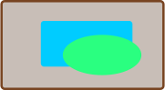
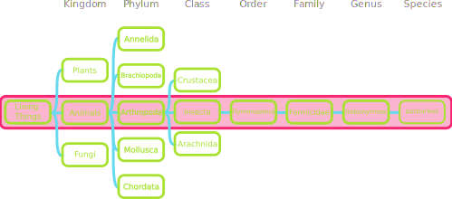
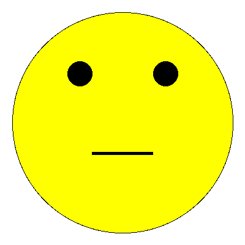
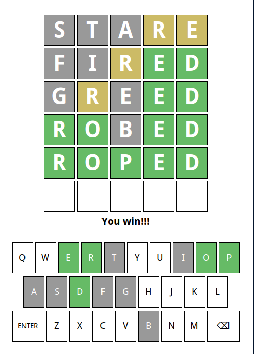

## Announcements
- Grades for problem Set 2 is returned.
	- See me if you have any question regarding it. ***Generally looks good***
- Project #1 will be posted and it is **due on Monday next week at 10pm**
- We are starting chapter 4 today **Graphics**
- Polling continues [https://www.polleverywhere.com/agbofred203](https://www.polleverywhere.com/agbofred203)

<!--
## Review Question {data-notes="Answer is B, as it would not print the 0"}
Which of the below blocks of code would print something different than the others?

::::: cols

:::: col
:::{.block name=A}
```python
for n in range(10):
	if n % 2 == 0:
		print(n)
```
:::
:::{.block name=B}
```python
for i in range(0,10,2):
	if i > 0:
		print(i)
```
:::
::::

:::: col
:::{.block name=C}
```python
for j in range(0,20,4):
	L = j // 2
	print(L)

```
:::
:::{.block name=D}
```python
for k in range(0,10):
	if not k % 2 > 0:
		print(k)
```
:::
::::
:::::

-->

## Understanding Check! {data-notes="The 32//8 option"}
Which of the provided formatted string options below would evaluate to appear as:

<center>
`101,234.98   & 4000`
</center>

when printed?

:::{.poll}
#. `f"{101234.984:<12,.2f} & {3200//8:<4d}"`
#. `f"{101234.984:>12,.2f} & {32000//8:0>3d}"`
#. `f"{101234.984:<12,f} & {320//8:0>4d}"`
#. `f"{101234.984:<12,.2f} & {32//8:0<4d}"`
:::


## Nondeterministic Programming
- For Wordle, the game is only interesting if the secret word is not the same every time!
- Let's look at the built-in `random` library, which lets us simulate random processes
- Programs that involve random processes that cannot be predicted in advance are said to be _nondeterministic_
- Nondeterministic behavior is essential to many applications. 
	- Many games would not be enjoyable if they behaved the exact same way every playthrough
	- Important practical uses in simulations, computer security, and algorithm research


## Important Functions in `random`

:::{style='font-size: 80%'}

- Random Integers

|                          |                                                             |
| :---                     | :------                                                     |
| `randint(minv, maxv)`    | Returns an integer between minv and maxv, inclusive         |
| `randrange(limit)`       | Returns an integer from 0 up to but not including limit     |
| `randrange(start,limit)` | Returns an integer from start up to but not including limit |
| `random()`            | Returns a random float between 0 and 1       |
| `uniform(minv, maxv)` | Returns a random float between minv and maxv |
| `choice(a_list)`    | Returns a random element from `a_list`       |
| `sample(a_list, k)` | Returns a list of `k` elements from `a_list` |
| `shuffle(a_list)`   | Randomly reorders the elements of `a_list`   |

:::

## Random Examples
```{.python style='max-height:900px'}
import random

def random_redblue():
	if random.random() > 0.5:
		return "red"
	else:
		return "blue"

def random_color():
	color_string = "#"
	for i in range(6):
		color_string += random.choice("0123456789ABCDEF")
	return color
```

## The Worth of a Picture
:::{style='font-size:.9em'}
- There comes a time when reading and entering text on a terminal doesn't cut it
	- Maybe you need more complicated input
	- Maybe you need a more complicated interface that pure text can manage
	- Maybe you have output that can not be shown as text
- Standard Python really only deals with the terminal interface
- Lots of outside libraries give Python more visual input/output
	- Turtle
	- Matplotlib
	- Tkinter <span class='fragment'>← PGL</span>
	- PyGame
	- Arcade
:::


## The Portable Graphics Library
- Built atop Tkinter
- The library (`pgl.py`) is available on the Canvas website [here](https://willamette.instructure.com/courses/3703/modules/items/160252)
	- Put it in the same folder as your code, and then you can import it
- Operates on the idea of a collage or cork-board



- Note that newer objects can obscure older objects. This layering arrangement is called the _stacking order_.


## The Pieces
- At its simplest then, we have two main parts:
	- The window (or felt-board/cork-board)
		- Created with the `GWindow` function
		- Takes two arguments: a width and a height in pixels
	- The contents
		- A wide assortment of shapes and lines that can be added to the scene
		- Control over where they are placed, how large they are, what color they are, etc


## Blue Rectangle!
```{.python data-line-numbers="1|3,4|6|7|8|9|10|11"}
from pgl import GWindow, GRect

GW_WIDTH = 500
GW_HEIGHT = 200

gw = GWindow(GW_WIDTH, GW_HEIGHT)
rect = GRect(150, 50 ,200, 100)
rect.set_color("Blue")
rect.set_filled(True)
gw.add(rect)
```


## The Coordinate System


- Positions and distances on the screen are measured in terms of pixels
- The location of the origin and orientation of the y-axis are **different from math**!
	- Origin is in the upper left instead of lower left
	- Y-values increase as you move downwards

<!--
## Other Simple Objects
Functions to create simple geometric objects:
<br>

- Rectangles!
	- `GRect( x, y, width, height )`
	- Creates a rectangle whose upper left corner is at (x,y) of the specified size
- Circles/Ovals!
	- `GOval( x, y, width, height )`
	- Creates an oval that fits inside the rectangle with the same dimensions
	- Placement based on the upper left corner of that enclosing rectangle
- Lines!
	- `GLine( x1, y1, x2, y2 )`
	- Creates a line extending from (x1, y1) to (x2, y2)

## Understanding Check
Which of the below images would be produced by the following code?
```python
gw = GWindow(200,200)
for c in range(0,10):
    for r in range(0,10):
        rect = GRect(20*c,20*r,20,20)
        if (r+c) % 2 != 0:
            rect.set_filled(True)
    gw.add(rect)
```

:::cols

::::col
{width=80%}
::::
::::col
{width=80%}
::::
::::col
{width=80%}
::::
::::col
{width=80%}
::::

:::


## Classification
::::cols
:::col
- In the mid-18th century, Scandinavian botanist Carl Linnaeus revolutionized the field of biology by developing a new system for classifying plants and animals in a way that revealed their structural relationships.
- Recognized that organisms fit into a hierarchy in which the placement of individual species reflects their anatomical similarities.
- Paved the way for Darwin's theory of evolution a century later
:::
:::col
{width=70%}
:::
::::


## Biological Hierarchy



## Instance vs Pattern
- Important to distinguish between a class of object and a specific instance of that class
	- Iridomyrmex purpureus is a class of ant, not an individual ant
	- There can be many individual ants, all sharing the same class
- Each ant is said to be an _instance_ of a particular class
- An individual ant belongs to a species class of purpureus, family of Formicidae, Phylum of Arthropoda, etc


## The `GObject` Hierarchy
- The types of graphical objects form a hierarchy:


- The `GObject` class represents the collection of all graphical objects
- The `GFillableObject` class represents those that have a fillable interior


## Interacting with the `GWindow`
- We've already shown creation:

```python
gw = GWindow(width, height)
```
- You have several more operations that you can apply to the `GWindow` object:

-------------------------------------- -------------------------------------
       `gw.add(object)`{.no-highlight} Adds an object to the window
 `gw.add(object, x, y)`{.no-highlight} Adds an object to the window after moving it to (x,y)
    `gw.remove(object)`{.no-highlight} Removes an object from the window
       `gw.get_width()`{.no-highlight} Returns the width of the graphics window in pixels
      `gw.get_height()`{.no-highlight} Returns the height of the graphics window in pixels
-------------------------------------- -------------------------------------


## Interacting with `GObject`s
- The following operations apply to all GObjects,  where `object`{.no-highlight} is the name of any specific instance.

---------------------------------------- ----------------------------
         `object.get_x()`{.no-highlight} Returns the x coordinate of this object
         `object.get_y()`{.no-highlight} Returns the y coordinate of this object
     `object.get_width()`{.no-highlight} Returns the width of this object
    `object.get_height()`{.no-highlight} Returns the height of this object
`object.set_color(color)`{.no-highlight} Sets the color of the object to the specified color
---------------------------------------- ----------------------------

- All coordinates and distances are measured in pixels


## Interacting with `GFillableObject`s
- Fillable GObjects have a smaller subset of commands that also apply to them.
- Initially the only fillable objects available to you are rectangles and ovals

--------------------------------------------- ----------------------------
     `object.set_filled(bool)`{.no-highlight} Sets the fill state of the object
`object.set_fill_color(color)`{.no-highlight} Sets the color to be used to fill the interior, otherwise same as the outer line
     `object.get_fill_color()`{.no-highlight} Gets the current color used to display the object interior
          `object.is_filled()`{.no-highlight} Returns True or False depending on whether the object is currently filled
--------------------------------------------- ----------------------------

## Smile!
::::cols
:::{.col style="flex-grow:1.5"}

```python
gw = GWindow(400, 400)

head = GOval(20, 20, 360, 360)
head.set_fill_color("yellow")
head.set_filled(True)
gw.add(head)

reye = GOval(110, 100, 40, 40)
reye.set_filled(True)
gw.add(reye)

leye = GOval(250, 100, 40, 40)
leye.set_filled(True)
gw.add(leye)

mouth = GLine(150, 250, 250, 250)
mouth.set_line_width(5)
gw.add(mouth)
```
:::
:::col

{width=80%}

:::
::::

## Label It!
- Sometimes you need to add some text to the window
- Can display any string using `GLabel` using the following format:

```python
msg = GLabel(string_to_add, x_location, y_location)
```
- Here `string_to_add` is the text you want to display, and `x_location` and `y_location` are the (x,y) coordinates of where you want to place the string


## Label Geometry
- The `GLabel` class relies on some geometrical concepts that are derived from classical typesetting
	- The _baseline_ is the imaginary line on which the characters rest
	- The _origin_ is the point on the baseline at which the text begins
	- The _width_ is the horizontal distance from the origin to the end of the text
	- The _height_ of the font is the distance between adjacent baselines
	- The _ascent_ is the distance the characters rise above the baseline
	- The _descent_ is the distance the characters drop below the baseline
<br><br>


## Interacting with Labels
- A `GLabel` has several special methods that you can use to interact with it
	- You can use: `get_width()`, `get_height()`, `get_ascent()`, and `get_descent()` methods to obtain the geometric properties
	- You can set a special font for the label using
	
	```python
	labelname.set_font(font)
	```
	- The font is a string comprised of the following elements:
		- The _font style_, which is usually blank or `italic`
		- The _font weight_, which is usually blank or `bold`
		- The _font size_, which is a number followed by the units (typically `pt`, `px`, or `em`)
		- The _font family_, which is the name of the font. Because what fonts are available can differ from machine to machine, the family is usually a sequence of fonts separated by commas
		- The font family sequence usually ends with a standard family (`serif`, `sans-serif`, or `monospace`) to ensure that the label can display

## Label Example
```python
gw = GWindow(500, 200)
msg = GLabel("hello world!", 50, 100)
msg.set_font("italic bold 80px 'times new roman'")
gw.add(msg)
```
<br><br>

{width=50%}


## Centering a `GLabel`
- Frequently useful to center within the window or some shape
- To center properly, you need to know the label dimensions, but you can't determine the dimensions until after you've created the label!
- The main idea then is to:
	- Create a `GLabel` without setting its location
	- Call the `.set_font()` method to set the desired font (which could change the size)
	- Determine the horizontal position of the origin by subtracting half the width from the desired location x
	- Determine the vertical position of the baseline by adding half the ascent to the desired location y
	- Add the `GLabel` at the newly calculated position


## Centering Example
```python
gw = GWindow(500, 200)
msg = GLabel("hello world!")
msg.set_font("italic bold 20px 'times new roman'")
x = 250 - msg.get_width() / 2
y = 100 + msg.get_ascent() / 2
gw.add(msg, x, y)
```
-->

## Introduction to Wordle
::::::cols
::::col
- Our first project will be Wordle
- Milestone guide will be posted today
- Not due until February 19
- Check out Wordle game on this [link](https://willamette.edu/~esroberts/NiftyAssignments-2022/demos/Wordle.html) 
::::

::::col

::::
::::::

## Your Responsibilities
- We will provide you with a custom data type that will handle all the graphics and user interaction
	- Don't worry, you'll have a chance to implement your own GUIs later in the semester!
- Your responsibilities will include:
	- Displaying and reading letters from boxes
	- Evaluating whether a word is valid
	- Determining what color each letter of a word should be
	- Determining when victory or defeat occurs


## Your Toolbox
- Special functions provided by the provided graphics data type: `WordleGWindow`
	- These will be well documented, and include, but are not limited to, things like
		- Getting or setting a letter in a particular box
		- Getting or changing the color of a given box
		- Changing which row is used when characters are entered
- Variables and functions
- Control statements
	- Good use of loops and if statements will be very useful
- Basic string functions

## Receiver Syntax
:::{style='font-size:.9em'}
- So far, all operations between or on objects have used symbols to indicate the operation
	- The `+` sign, for instance
- Going forward, we will begin to see more examples of operations on objects that use _receiver syntax_
- In receiver syntax, we specify the object to act on, followed by a dot and then a predefined function (called a _method_ here) name

  ```python
  obj.method_name()
  ```
  - This is like you are running this special function on the object, so you **need** the `()` at the end
  - Some methods also allow arguments, to influence exactly how the operation will proceed
:::

## An Approach to Success
- Each project is accompanied by a highly detailed guide: **read it!**
	- Explains background ideas so that you can understand the big picture of what you are needing to do
	- Also included a breakdown of individual _milestones_
		- A _milestone_ is a discrete checkpoint that you should ensure is working (and that you understand!) before moving on
- Projects are all about managing complexity. If you start trying to implement milestones out of order, you are asking for disaster
- Don't let yourself get overwhelmed by scale. Focus on one particular milestone at a time, which should involve focusing only on a small part of your overall code