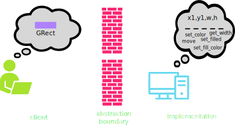

## Announcements
- Project 5 is due ***today***. 
- Final exam is next week **Monday 6th/Tuesday 7th May** ***at 2pm - 5pm***
    - Venue is this same hall
    - For those concerned, arrange with testing center ASAP & cc me
    - Arrange to take the exam within that same week of May 6th
- __Course Evaluation__, thanks to those that filled it out already
	- If not yet, kindly seearch your email box for a message from Kelley Strawn ***kstrawn@willamette.edu***
- On the exam day, we’ll have a class picture 
    - So, please wait behind after completing your exams 
    - Those taking exams elsewhere at different time could also show up!
- No Poll, no attendance! 
   
## Final Exam Arrengement
- Final exam last for 2 hours 
    - Will be partially open exam. Same rules as midterm 1 exams
    - Basically covers 
        - functions (program Reading/tracing)
        - expressions and data representations
        - data structures: strings, lists, dictionary, tuple, reading and writing files
		- Asymptotic time complexity of algorithms
        - simple functions for interactive graphics. 
    - Go over the PS and Class Notes, Practice questions 

## Final Exam Arrengement
- Practice questions are posted on Canvas week 16 (did not cover all the topics)
- strongly recommend that you attend the session this week and ask questions where you're confused 
- Do well to carefully ***read and follow all instruction***. 

## CH-10: Tuple
- In Python, the simplest strategy for representing a record uses the built-in type _tuple_
	- Comes from terms like _quintuple_ or _sextuple_, that denote fixed-size collections
- An ordered, **immutable** sequence of values
- Feel similar to lists, except immutable, and thus used very differently
	- Think of tuples as records 
- Created by enclosing a collection of elements in parentheses
`employee = ("Bob Cratchit", "clerk", 15)`{.inlinecode}
- Stored internally similarly to a list, so each element has a corresponding index

## Tuple Usage
- Can largely envision tuples as sitting between strings and lists
	- Immutable, like strings
	- Elements can be _anything_, like lists
- Common operations mimic that of strings
	- Can concatenate with addition
	- Can duplicate by multiplying by an integer
	- Can index and slice them
	- Can loop over them directly or via index
- A tuple of a single value **needs** a comma at the end in order to be a tuple
- Be sure you are concatenating objects of the same type (Tuble `+` Tuble)


## Tuple Selection
- You can select or slice elements from a tuple just like you can with lists
	- Unfortunately, records are not usually ordered in a particular way. Rather, it is the field name that is usually important
- If using tuples, you can make programs more readable by using a _destructuring assignment_, which breaks a tuple into named components:

  ```python
  employee = ("Bob Cratchit", "clerk", 15)
  name, title, salary = employee
  ```


## Pointy Tuples!
::::::{.cols style='align-items:center'}
::::col
- One of the most simple examples of tuple usage would be storing location information in 2d space
- By storing both $x$ and $y$ coordinates in a tuple, it makes that information easier to store and pass around your program
- When you need to use the points, best to destructure:
  ```python
  x,y = pt
  ```
::::

::::col

\begin{tikzpicture}%%width=80%
\draw[very thick, MGreen] (0,0) rectangle + (5,5);
\node[circle, fill=MRed, label={[MRed]below right: ($x_1$,$y_1$)}, minimum size=5pt, inner sep=0pt] at (3,4) {};
\node[circle, fill=MBlue, label={[MBlue]below right: ($x_2$,$y_2$)}, minimum size=5pt, inner sep=0pt] at (2,1) {};
\end{tikzpicture}

::::
::::::

## Returning Tuples
- Tuples give us a convenient way to return multiple objects from a function
  - `return x, y` is the same as `return (x,y)`
- Several Python built-in functions return tuples, of which a few are particularly useful
	- `enumerate`
	- `zip`

## Enumerating
- We have multiple ways to iterate through a string or list:
	- By element:
	
	  ```python
	  for ch in string:
		  # body of loop using ch
	  ```

	- By index:
	
	  ```python
	  for i in range(len(string)):
		  # body of loop using i
	  ```
- Using `enumerate` lets us get both!
  ```python
  for i, ch in enumerate(string):
      # body of loop using both ch and i
  ```

## Zipping
- Sometimes you have multiple lists that you want to loop over in a "synced" fashion
- The `zip` function iterates through tuples of pairs of elements
- For example
  ```python
  zip([1,2,3], ["one", "two", "three"])
  ```
  would yield `(1, "one")`, then `(2, "two")`, and then `(3, "three")`
- Can unpack or destructure as part of a `for` loop:
  ```python
  for x,y in zip([1,2,3],[4,5,6]):
	  # body of loop using paired x and y
  ```
## Classes vs Objects
- When we introduced PGL early in the semester, we stressed the difference between types/classes and objects
	- A _class_ is the pattern or template that defines the structure and behavior of values with that particular type (the species of ant)
	- An _object_ is an individual value that belongs to a class (an individual ant)
		- A single class can be used to create any number of objects, each of which is said to be an _instance_ of that class
- PGL defines the `GRect` class.
	- In Breakout, you used that class to create **many** different rectangles, each of which was an instance of the `GRect` class


## Thinking about Objects


## An Object's Purpose
- Python uses the concepts of objects and classes to achieve at least three different goals:
	- __Aggregation__. Objects make it possible to represent collections of independent data as a single unit. Such collections are traditionally called _records_.
	- __Encapsulation__. Classes make it possible to store data together with the operations that manipulate that data.
		- In Python the data values are called _attributes_ and the operations are called _methods_
	- __Inheritance__. Class hierarchies make it possible for a class that shares some attributes and methods with a previously defined class to _inherit_ those definitions without rewriting them all
- We'll introduce many of these concepts in this course, but for more exposure and practice you'll want to take CS 152 (Data Structures)

## Classes as Templates
- Since they share the same attributes, it is natural to regard the two employees at Scrooge and Marley as two instances of the same class
- Could view the class as a template or empty form:
\begin{tikzpicture}%%width=40%
[record/.style={draw, minimum width=4cm, font=\tt},
lab/.style={font=\tt\small, anchor=south west},
]
\node[record, MBlue](n) at (0,0) {};
\node[lab, MBlue](nl) at (n.north west) {name};
\node[record, MBlue, below=.75cm of n](t){};
\node[lab, MBlue] at (t.north west) {title};
\node[record, MBlue, below=.75cm of t](s) {};
\node[lab, MBlue] at (s.north west) {salary};
\node[fit=(nl)(s), draw, very thick, MBlue] {};
\end{tikzpicture}

- Can help initially to just start with an empty template and then fill in the necessary fields

## Starting Empty
- Class definitions in Python start with a header line consisting of the keyword `class` and then the class name
- The body of the class will later contain definitions, but initially can just leave blank
	- Almost. Python does not allow an empty body, so need to include a docstring or use the `pass` keyword
  ```python
  class Employee:
  	"""This class is currently empty!"""
  ```
- Once the class is defined, you can create an object of this class type by calling the class as if it were a function:
  ```python
  clerk = Employee()
  ```

## More References
- Instances of custom Python classes are mutable
- Thus custom class instances are stored as _references_ to that information in memory
- Any code with access to this reference can manipulate the object
	- Can get or set the contents of any attributes or create new ones
<br><br>


## Selecting Object Attributes
- You can select an attribute from an object by writing out the object name, followed by a dot and then the attribute name.
	- As an example

		```python
		clerk.name
		```
		would select the `name` attribute for the `clerk` object
- Attributes are assignable, so

	```python
	clerk.salary *= 2
	```
	would double the clerk's current salary

- You can create a new attribute in Python by simply assigning a name and a value, just like you'd define a new variable


## Constructors
- While the previous method works, it is not ideal
	- Forces the client to tinker with the internal workings of the Employee
	- Details of the data structure are the property of the implementation, not the client
- Better to add a method to the `Employee` class called a _constructor_, which is responsible for initializing attributes to a newly created object
	- In Python, a constructor is created by defining a special function named `__init__`
	- The constructor function is called automatically whenever a new object of that type is created


## Know Thy `self`
:::incremental
- Moving the function into the Employee class has a problem:
	- When we set attributes, they are specific to a given object
	- The class itself though is just a template, and not linked to a specific object
- We need a general way within the class to refer to whatever object is being created
	- The overwhelming convention in Python is to call this variable `self`
	- Whenever a new object is created, you could imagine that, for that object, Python replaces all of the `self`s in the class with that object's name
		- This isn't quite the order of what is happening, but it can help envision what `self` is doing
- `self` is always the first parameter to the `__init__` constructor
	- Any other arguments provided are passed in as additional parameters afterwards
:::

## An Employee Constructor
```python
class Employee:
	def __init__(self, name, title, salary):
		self.name = name
		self.title = title
		self.salary = salary


clerk = Employee('Bob Cratchit', 'clerk', 15)
```
- Note that you do not need to provide an argument for `self` when creating the object, Python supplies this reference automatically
- Viewing in PythonTutor can be helpful, as is shown [here](https://pythontutor.com/render.html#code=class%20Employee%3A%0A%20%20%20%20def%20__init__%28self,%20name,%20title,%20salary%29%3A%0A%20%20%20%20%20%20%20%20self.name%20%3D%20name%0A%20%20%20%20%20%20%20%20self.title%20%3D%20title%0A%20%20%20%20%20%20%20%20self.salary%20%3D%20salary%0A%0A%0Aclerk%20%3D%20Employee%28'Bob%20Cratchit',%20'clerk',%2015%29&cumulative=false&curInstr=0&heapPrimitives=nevernest&mode=display&origin=opt-frontend.js&py=3&rawInputLstJSON=%5B%5D&textReferences=false)


## Methods
- Most classes define additional functions called methods to allow clients to read or update attributes or manipulate the object
- Methods look like a normal function definition but will **always** declare the parameter `self` at the beginning of the parameter list
	- This is true even if the method has no other parameters
- Methods are defined in the body of the class and would thus look something like:
  ```python
  def method_name (self, other_parameters):
  	...body of the method...
  ```
- For example
  ```python
  def give_raise(self, amount):
  	self.salary += amount
  ```

## Accessing and Using Methods
- After definition, there are two mains ways you can access and use the method:
	- **Dot Notation (Conventional)**
		- Python sets `self` to be a reference to the _receiver_, which is the object to which the method is applied

		  ```python
		  clerk = Employee('Bob', 'clerk', 15)
		  clerk.give_raise(15)
		  ```

	- **Function Notation**
		- You retrieve the method from the class itself, and then provide self manually

		  ```python
		  clerk = Employee('Bob', 'clerk', 15)
		  Employee.give_raise(clerk, 15)
		  ```

## Getters and Setters
- In the object-oriented model, the client is not supposed to muck-about with the object internals
- The implementation should therefore provide methods to retrieve desired attributes (called _getters_) or to make changes to desired attributes (called _setters_)
- Setting up getters and setters for the attribute `salary` might look like:
  ```python
  def get_salary(self):
  	return self.salary
  
  def set_salary(self, new_salary):
  	self.salary = new_salary
  ```
- Getters are far more common than setters, as you don't always want the client to have the freedom to change attributes on a whim


## Maps and Dictionaries
- A common form of information associates pairs of data values
	- Commonly called a _map_ in computer science
	- Python calls such a structure a _dictionary_
- A dictionary associates two different values:
	- A simple value called the _key_, which is often a string but doesn't need to be
	- A larger and more complex object called the _value_
- This idea of associating pairs of values is exhibited all over in the real world
	- Actual dictionaries! The words are the keys, the definitions the values.
	- Web addresses! Keys are the urls, the values are the webpage contents.

## Creating Dictionaries
- Python dictionaries use squiggly brackets `{}` to enclose their contents
- Can create an empty dictionary by providing no key-value pairs:
  ```python
  empty_dict = {}
  ```
- If creating a dictionary with key-value pairs
	- Keys are separated from values with a colon `:`
	- Pairs are separated by a comma `,`
  ```python
  generic_dict = {'Bob': 21, 0: False, 13: 'Thirteen'}
  ```

## Keys and Values
- The value of a key-value pair can be **any** Python object, mutable or immutable
	- This include other dictionaries!
- The key is more restricted:
	- Must be immutable
		- So dictionaries or lists can **not** work as a key
		- Tuples can though!
	- Must be unique per dictionary


## Selection
- The fundamental operation on dictionaries is selection, which is still indicated with square brackets: `[]`
- Dictionaries though are **unordered**, so it is not a numeric index that goes inside the `[ ]`
- You instead use the key directly to select corresponding values:
  ```python-repl
  >>> A = {'Jack': 12, 'Jill': 17}['Jack']
  >>> print(A)
  12
  >>> B = {True: 13, 0: 'Why?'}[0]
  >>> print(B)
  Why?
  ```

## Losing your keys
- If you attempt to index out a key that doesn't exist:
  ```{.python .badcode}
  A = {'Jack': 12, 'Jill': 13}
  print(A['Jil'])
  ```
  you will get an error!
- If in doubt, check for the presence of a key with the `in` operator:
  ```python
  if 'Jil' in A:
	  print(A['Jil'])
  ```

## Rewriting the Dictionary
- Dictionaries are _mutable_!
	- We can add new key-value pairs
	- We can change the value of corresponding keys
```python-repl
>>> d = {}
>>> d['A'] = 10
>>> d['B'] = 12
>>> print(d)
{'A':10, 'B':12}
>>> d['A'] = d['B']
>>> print(d)
{'A':12, 'B':12}
```


## Iterating through a Dictionary
- Frequently we might want to iterate through a dictionary, checking either its values or its keys
- Python supports iteration with the `for` statement, which has the form of:
  ```python
  for key in dictionary:
  	  value = dictionary[key]
  	  code to work with that key and value
  ```
- You can also use the `.items` method to grab both key and values together:
	- Returns a tuple with both the key and corresponding pair
  ```python
  for key, value in dictionary.items():
  	  code to work with that key and value
  ```

## Common Dictionary Methods

Method call | Description
---|-----
`len(dict)`{.python} | Returns the number of key-value pairs in the dictionary
`dict.get(key, value)`{.python} | Returns the value associated with the `key` in the dictionary. If the key is not found, returns the specified value, which is `None` by default
`dict.pop(key)`{.python} | Removes the key-value pair corresponding to `key` and returns the associated value. Will raise an error if the key is not found.
`dict.clear()`{.python} | Removes all key-value pairs from the dictionary, leaving it empty.
`dict.items()`{.python} | Returns an iterable object that cycles through the successive tuples consisting of a key-value pair.


## Dictionary Records
- While most commonly used to indicate mappings, dictionaries have seen increased use of late as structures to store records
- Looks surprisingly close to our original template of:
  ```python
  boss = {
	  'name': 'Scrooge',
	  'title': 'founder',
	  'salary': 1000
	  }
  ```
- Allows easy access of attributes without worrying about ordering
  ```python
  print(boss['name'])
  ```

## Compound Structure Storage
- Structures representing complicated data can often be large enough that you don't want to store them within your program itself
- We can put them in their own file, but reading them in with our current tools would be complicated
	- Current methods read in text, so we would need to _parse_ the text to identify what data structures we needed to create and what elements we needed to add
	- This is certainly possible, but potentially more overhead than what we would like for some structures
- Useful then to store the data structure in file in such a format that it can be easily read into Python

## File I/O
- A variety of ways this can be done
	- XML, YAML, JSON
- JSON is particularly interesting to us, because its syntax almost exactly matches Python's (even though it was made for Javascript)
- Python has a built-in library to read and write JSON files, just called `json`
	- `json.load(file_handle)`
		- Loads the JSON data structure from the specified file into its Python equivalent
	- `json.dump(data_object, file_handle)`
		- Writes a JSON text representation of the data object to the given file
	- Both methods are used inside our normal `with open() as fhandle:` syntax

## Using JSON
- To read a JSON file into a variable `data`:
  ```python
  import json
  with open('file.json') as fh:
	  data = json.load(fh)
  ```
- To write a variable with complex structure out to a JSON file:
  ```python
  import json
  with open('file.json', 'w') as fh:
  	  json.dump(data, fh)
  ```


## The Power of JSON
- One very nice aspect of JSON is that it is often the defacto way that information is passed around the internet
- This means it can be easy to find data providers where you can access or download information already in a JSON format
- DND Fireball Spell info [here](https://www.dnd5eapi.co/api/spells/fireball)
- We could download this information to a file, which we could then read in and use within our Python program
- Later we'll also look at how we could process the information straight from the internet as well


## JSON Gotchas
- If you are writing JSON files from within Python or using files gotten elsewhere, they should already be properly formatted
- If you need/want to edit a JSON file directly though, you should be aware of a few "gotchas" where the JSON syntax varies _slightly_ from Python's syntax
	- You can **not** have trailing commas at the end of a JSON structure
		- Something like `[1, 2, 3,]` is perfectly fine in Python, but illegal in JSON
	- JSON strings require double quotes
		- In Python you can use either double or single quotes, but JSON requires double
	- Booleans are all lowercase in JSON
		- Vs starting with a capital letter in Python

## Data-Driven Programs
- In most programming languages, data structures are easier to manipulate than the code itself
- Often useful then to push as much of the program behavior as possible into data structures rather than methods and functions
	- Programs working in this fashion are said to be _data driven_
- In a data-driven model, the actual program (commonly called the _driver_) is generally very small and simply manages:
	- Reading in data from a file into a suitable internal structure
	- Using the data structure to control the flow of the program

## The Teaching Machine
- Suppose you wanted to write a program that would give an "intelligent" quiz
	- Correct answers would move the client on to other, more difficult questions
	- Incorrect answers might give some explanation and then ask some follow-up questions
- Having the questions and answers in some sort of data structure would make sense
- The teacher would generally be who comes up with the questions and progression though, and most teachers are not experts at writing code
	- Need a format that is largely not code based where teachers could construct the questions and progression
	- Need to translate that format into more common data structures that the computer can then understand and act on


## The Course Data File
- One common method of achieving this is to have configuration or data files
- The general format of a file is shown to the left, and an example question to the right

::::::cols
::::col

:::{.pseudotext }
<pre>
Identifying name for first question
Text of first question
------
responseA: name of next question
responseB: name of next question
responseC: name of next question
responseD: name of next question

...more questions/answers...
</pre>
:::

::::

::::col
:::{.text }
<pre>
RemQ1
What is the value of 17 % 4?
	a. 0
	b. 1
	c. 3
	d. 4
------
a: RemQ2
b: PrecQ1
c: RemQ2
d: RemQ2
</pre>
:::

::::
::::::


