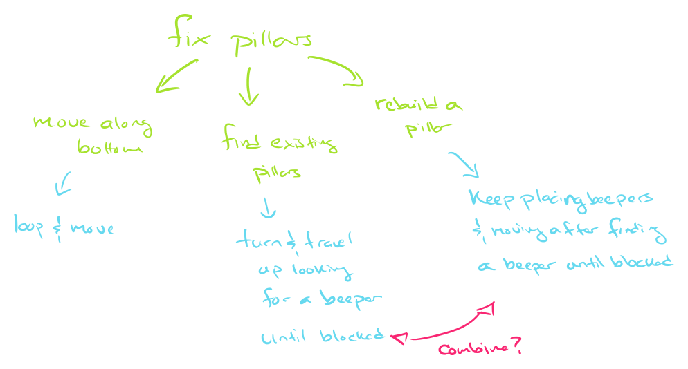

## Announcements
- Problem Set 1 posted and it's due on __Tuesday Jan. 27nd @ 10pm__!
	- You'll have basically all you need to solve it after today
- Small section meeting is starting next week 
    - watchout for an email from _Prof. Jed_ on when your section meets
	- If you did not recieve _Prof. Jed's_ email by Tuesday, you must not have filled out the availability poll.
	- Come see me after class and we can see about getting you placed into one.
- Polling today! Use this [link](https://www.polleverywhere.com/agbofred203)
	- Reminder: use your first name and be consistent to be able to uniquely identify you!

<!--  
-Welcome to TechByte event tomorrow __by 11:30 am @ Ford 102__. Talk will be on how to find and apply for internships 
- Welcome to Cookie Social at QUAD Center (Ford 224) __TUE Jan 30 @ 4:30pm__
- I've requested for ***relocation of lecture hall***. Stay tuned for the info soon!


## If Conditions
- Predicate functions can be used to control a kind of "switch": running one piece of code if the answer is yes and a different piece of code if the answer is no.
- Commonly called _if_ or _if-else_ statements, they take on the syntax of:

	```python
	if conditional_test:
		# Code to run if test answer is yes
	else:
		# Code to run if test answer is no
	```
- If you don't want the code to do anything special if the answer is no, you can ignore the "else" part of the statement:
	
	```python
	if conditional_test:
		# Code to run if test is true
	# Carrying on with code that will always run
	```

## Remember Predicate Functions?
Potential questions you can ask Karel include:

 | 
---|----
`front_is_clear()` | `front_is_blocked()`
`left_is_clear()` |  `left_is_blocked()`
`right_is_clear()` | `right_is_blocked()`
`beepers_present()` | `no_beepers_present()`
`beepers_in_bag()` | `no_beepers_in_bag()`
`facing_north()` | `not_facing_north()`
`facing_south()` | `not_facing_south()`
`facing_east()` | `not_facing_east()`
`facing_west()` | `not_facing_west()`

<!--
## Karel's Decisions Example
- Suppose we want Karel to move across the bottom of the world and fill in any gaps in the beepers
	- We want an even layer of beepers, no stacks
	- What questions should we have Karel ask?

\begin{tikzpicture}%%width=60%
\karelgrid[MGreen]{4}{2}
\karelbeeper[MBlue]{2}{1}
\karelbeeper[MBlue]{3}{1}
\karelmark[fill=MYellow]{1}{1}{0}
\end{tikzpicture}


## Iterative: while
- Another common use of predicate functions is in controlling a type of iterative function called a _while_ loop
- The structure of a while loop looks like:
  ```python
  while some_conditional_test:
  	  # Code to repeat as long as the answer
  	  # to the conditional_test is yes (true)
  # Code to run once the answer is no
  ```
- All of our predicate functions give yes-or-no answers though! So we can do something like

	```python
	while front_is_clear():
		move()
	```
	which will continually move Karel forward as long as there is not a wall in front of them!


## Smarty Karel
- Combining conditional statements with loops lets us write a program for Karel in which it can **react** to different situations in different ways, all using the same code
- Our pothole code from earlier could **only** handle two potholes, and they had to be perfectly spaced
- With one loop and one if statement, we can make the program fill any number of potholes with any manner of spacing!
- Key questions:
	- How do we know when we are done?
	- How do we know when we reach a pothole?

## Smart Potholes
```{.python style='max-height: 900px'}
def main():
	"""
	Main function to fill any number of
	potholes at any location!
	"""
	while front_is_clear():
		if right_is_clear():
			fill_pothole()
		move()

def fill_pothole():
	"""
	Fills a single pothole and returns 
	to where it started. 
	"""
	turn_right()
	move()
	put_beeper() #assuming infinite beepers available
	turn_around()
	move()
	turn_right()

def turn_right():
	""" Turns Karel 90 deg to the right. """
	turn_left()
	turn_left()
	turn_left()

def turn_around():
	""" Turns Karel 180 deg around. """
	turn_left()
	turn_left()
```
-->
## Inception: Loops in Loops
- Whenever a loop ends, you just return to the same indentation level as when that loop began
- For loops inside other loops then, this means that the "inner-most" loop runs from start to finish for _every_ step of the outer loop
  ```python
  while front_is_clear():
  	  move()
  	  while not_facing_north():
  		  turn_left()
  	  turn_left()
  put_beeper()
  ```


## Understanding Check

::::::cols
::::{.col style='flex-grow:1.5'}
Karel starts as shown to the right with 20 beepers in its bag. After executing the commands below, how many beepers are left in the bag upon the conclusion of the program?

```python
while left_is_clear():
	while front_is_clear():
		move()
		if no_beepers_present():
			put_beeper()
	turn_left()
```
::::

::::col
\begin{tikzpicture}%%width=90%
\karelgrid[MGreen]{5}{5}
\karelmark[fill=MYellow]{1}{1}{0}
\draw[very thick, MGreen] (.5,2.5) --++(1,0) --++(0,-1)--++(2,0)--++(0,1)--++(1,0)
						  (2.5,3.5) --++(0,-1)
						  (5.5,3.5) --++(-1,0) --++(0,1) --++(1,0)
						  (0.5,4.5) --++(2,0) --++(0,1)
						  (3.5,4.5) --++(0,1);
\karelbeeper[fill=MBlue]{3}{1}
\karelbeeper[fill=MBlue]{3}{4}
\karelbeeper[fill=MBlue]{1}{3}
\karelbeeper[fill=MBlue]{5}{3}
\node at (1,1) {20};
\end{tikzpicture}


::::
::::::

:::{.hpoll}
#. 12
#. 13
#. 15
#. 19
:::

:::notes
There should be 12 beepers left
:::

## Counting Loops
- Sometimes we **know** the number of times we want to loop
	- It is not dependent on some condition like a while loop
- In these circumstances, the iterative statement called a _for_ loop is best used
- Syntax looks like:

	```python
	for i in range(desired_count):
		# statements to be repeated
	```
   - `desired_count` is an _integer_ indicating the number of times you want the loop to repeat
   - The `i` is a name that we will later make more general, but for now you can always leave it as an `i`


## An Example `for` you 
::::::cols
::::col
- Suppose we want Karel to create a 6x6 square outline of beepers in a room
- Need to repeat making each side 4 times
- Need to repeat placing a beeper and moving 6 times for each side
	- Placing 6 beepers requires moving only 5 times. So not everything can be in the loop
::::
::::col
\begin{tikzpicture}%%width=100%
\karelgrid[MGreen]{10}{10}
\foreach \x in {3,4,5,6,7,8}{
	\karelbeeper[MBlue]{\x}{3};
	\karelbeeper[MBlue]{\x}{8};
	\karelbeeper[MBlue]{3}{\x};
	\karelbeeper[MBlue]{8}{\x};
}
\karelmark[MYellow]{3}{3}{0}
\end{tikzpicture}
::::
::::::

## A Potential Solution
```{.python style="max-height: 900px"}
import karel

def main():
    """Draw a 4x4 square in the world."""
    position()
    draw_box()

def position():
    """Move to starting corner of box."""
    move()
    move()
    turn_left()
    move()
    move()
    turn_right()

def turn_right():
    """Turns Karel 90 deg to the right."""
    turn_left()
    turn_left()
    turn_left()

def draw_box():
    """Draws a box with 4 equal sides in a CCW direction."""
    for i in range(4):
        draw_6_line()
        turn_left()

def draw_6_line():
    """Draws a straight line of 6 beepers, if space."""
    for i in range(5):
        if no_beepers_present():
            put_beeper()
        if front_is_clear():
            move()
    if no_beepers_present(): # Last beeper to make 6
        put_beeper()
```


## Summary So Far
::::::cols
::::col
:::{.block name="Karel Cmds"}
- Karel can only:
	- `move()`
	- `turn_left()`
	- `pick_beeper()`
	- `put_beeper()`
- Can get info about surroundings using predicate functions
	- Eg. `front_is_clear()`
	<!--- Inverse options exist as well-->
:::

:::{.block name="Functions"}
- Group code into bundles
  ```python
  def function_name():
  	  # Code to be grouped
  ```
:::
::::

::::{.col style='flex-grow:1.5'}
:::{.block name="Control Statements"}
- Conditional statements
	- Run certain code blocks only if a condition is true
	
	  ```python
	  if condition_test:
	  	  # Code if answer yes
	  else:
	  	  # Code if answer no
	  ```
- Iterative statements
	- `while` loop: repeat code block as long as condition is true
	
	  ```python
	  while condition_test:
	  	  # Code to repeat
	  ```
	- `for` loop: repeat set number of times
	
	  ```python
	  for i in range(desired_count):
	  	  # Code to repeat
	  ```
:::
::::
::::::


## Algorithms
- The process of designing a solution strategy to a problem is called _algorithmic design_
- An _algorithm_ is just an approach or recipe for a method to solve a particular problem
	- Frequently language agnostic
- Algorithms are not a new concept
	- Euclids algorithm to find greatest common denominators for instance
- A large part of computer science is focused on the study or analysis of algorithms

## Algorithm ⮕ Code
- You need to have an algorithm in place **before** you can write the code to tell the computer what you want to do
	- Imagine an alien asking me how to bake a cake. I need to understand the steps to baking the cake before I can even worry about the translation or communication
- Programming tools like conditional statements and loops will frequently play a role in your algorithm, but as general concepts
	- I can easily describe a loop to you without needing the exact syntax of Python
- The implementation of the algorithm is the act of translating it into Python (or whatever language you are using)

## An Amazing Algorithm
::::::cols
::::{.col style='font-size:.9em'}
- Consider a simple, loop-less, maze that we want to move through
    - Karel could start anywhere
    - The end of the maze is a beeper
- A common algorithm to get through the maze is to essentially always follow or touch the wall to your right
    - How could we phrase this in language Karel would understand?
- Let's take a few minutes to work with a neighbor(s) to sketch out your code

::::

::::col
\begin{tikzpicture}%%width=100%
\karelgrid[MGreen]{5}{5}
\karelmark[MYellow]{1}{1}{90}
\karelbeeper[MBlue]{5}{4}

\draw[very thick, MGreen]
    (1.5,0.5) -- ++(0,1) -- ++(1,0)
    (3.5,0.5) -- ++(0,1)
    (2.5,5.5) -- ++(0,-1) -- ++(-1,0) -- ++(0,-2)
    (1.5,3.5) -- ++(1,0)
    (2.5,4.5) -- ++(1,0) -- ++(0,-2) -- ++(-1,0) -- ++ (2,0) -- ++ (0,-1)
    (5.5,3.5) -- ++(-1,0) -- ++ (0,1);

\end{tikzpicture}


::::
::::::

## An Amazing Algorithm
::::::cols
::::col
- Practically speaking, this largely means to go forward unless a passage opens to your right, in which case you take that passage
- In Karel, since the exit is a beeper, we might implement the above algorithm as:

::::

::::col
```{.python .fragment style='max-height:900px; font-size: .75em;'}
while no_beepers_present():
	# if opening on right, we follow
	if right_is_clear():
		turn_right()
		move()
	else:
		# go forward if possible or turn
		if front_is_clear():
			move()
		else:
			turn_left()
```

::::
::::::

<!--
## Complications
- More complicated problems will generally result or require more complex and longer code
- _Stepwise Refinement_ is the process of starting with the biggest problem and breaking it into smaller and smaller pieces
	- Eventually, you should be able to solve one of those pieces with a fairly straightforward piece of code
- Taking some time to plan ahead will save you a lot of time coding!
	- Sketch out how you want to break the problem up, before you start coding
	- Things can always shift some later if you realize something while writing the code

## Example: Pillar Repair
- Suppose Karel comes across some arches which have broken pillars supporting them.
- Our goal is to have Karel repair the pillars by filling in the missing beepers

\begin{tikzpicture}%%width=60%
\karelgrid[MGreen]{13}{8}
\draw[very thick, MGreen] (0.5,5.5) \foreach \c in {1,2,3} {
									-| ++(1,1) -| ++(1,1) -| ++(1,-1) -| ++(1,-1)
									} --++(1,0);
\karelmark[fill=MYellow]{1}{1}{0}
\foreach \y in {4,5} \karelbeeper[fill=MBlue]{1}{\y};
\foreach \y in {1,2,4} \karelbeeper[fill=MBlue]{5}{\y};
\foreach \y in {4,5} \karelbeeper[fill=MBlue]{9}{\y};
\foreach \y in {1,3,5} \karelbeeper[fill=MBlue]{13}{\y};
\end{tikzpicture}

## Breaking it down


## A potential solution
```{.python style='max-height: 900px;'}
import karel


def rebuild_arches():
    while front_is_clear():
        repair_pillar()
        move()
    repair_pillar()


def repair_pillar():
    turn_left()
    # Beeper chain up
    create_beeper_chain()
    turn_around()
    # Beeper chain back down
    create_beeper_chain()
    turn_left()


def turn_around():
    turn_left()
    turn_left()


def create_beeper_chain():
    while front_is_clear():
        if beepers_present():
            move()
            if no_beepers_present():
                put_beeper()
        else:
            move()
```
-->

## Stepwise Refinement {.data-auto-animate}
::::::cols
::::col
- The most successful way to solve a complex problem is to break it down into progressively simpler problems
- Begin by breaking the whole problem into a few simpler parts
    - Some of these parts might then need further breaking down into even simpler parts
- The process is commonly called _stepwise refinement_ or _decomposition_
::::

::::col
\begin{tikzpicture}[box/.style={MGreen, draw, very thick, rounded corners, font=\Large\tt}]%%width=100%
\node[box] (prob) at (0,0) {Problem};
\node[box, MBlue] (sub1) at (-3,-3) {Subprob 1};
\node[box, MBlue] (sub2) at (0,-3) {Subprob 2};
\node[box, MBlue] (sub3) at (3,-3) {Subprob 3};
\draw[MGreen, very thick, -latex] (prob.south) -- (sub1.north);
\draw[MGreen, very thick, -latex] (prob.south) -- (sub2.north);
\draw[MGreen, very thick, -latex] (prob.south) -- (sub3.north);
\node[box, MRed] (ssub1) at (-2,-6) {Subprob 2a};
\node[box, MRed] (ssub2) at (2,-6) {Subprob 2b};
\draw[MGreen, very thick, -latex] (sub2.south) -- (ssub1.north);
\draw[MGreen, very thick, -latex] (sub2.south) -- (ssub2.north);

\end{tikzpicture}


::::
::::::

## Excellent Decomposing
- A good problem decomposition should mean:

  The proposed pieces should be easy to explain
    : One indication that you have succeeded is if it is easy to give them simple names

  The steps are as general as possible
    : Each piece of code you can reuse is one less piece of code you need to write! If your steps solve general tasks, they are much easier to reuse.

  The steps should make logical sense for the problem you are solving
    : If you have a function that will work to solve a step but was designed (and named) with something else entirely in mind, adopt it for the currently needed situation

## Enter the Winter
- Suppose we want Karel to usher in the Fall/Winter by removing the "leaves" from the tops of all the trees

\begin{tikzpicture}%%width=90%
\karelgrid[MGreen]{13}{6}
\karelmark[MYellow]{1}{1}{0}
\draw[MGreen, very thick] (2.5,0.5) --+ (0,2) (4.5,0.5) --+(0,4) (8.5,0.5) --+(0,2) (11.5,0.5) -- +(0,3);

\newcommand{\treetop}[2]{
    \foreach \x in {0,1} {
        \foreach \y in {0,1} {
            \karelbeeper[MBlue]{#1+\x}{#2+\y}
        }
    }
}
\treetop{2}{3}
\treetop{4}{5}
\treetop{8}{3}
\treetop{11}{4}
\end{tikzpicture}


## Understanding the Problem
- What are we guaranteed by the problem?
- How will we know when we are done?

\begin{tikzpicture}%%width=80%
\karelgrid[MGreen]{13}{6}
\karelmark[MYellow]{1}{1}{0}
\draw[MGreen, very thick] (2.5,0.5) --+ (0,2) (4.5,0.5) --+(0,4) (8.5,0.5) --+(0,2) (11.5,0.5) -- +(0,3);
\newcommand{\treetop}[2]{
    \foreach \x in {0,1} {
        \foreach \y in {0,1} {
            \karelbeeper[MBlue]{#1+\x}{#2+\y}
        }
    }
}

\treetop{2}{3}
\treetop{4}{5}
\treetop{8}{3}
\treetop{11}{4}
\end{tikzpicture}

## Understanding the Problem
- There are four trees in this problem
- We need to find a tree at a time
- We need to remove the leaves 
    - there are four leaves per tree

\begin{tikzpicture}%%width=80%
\karelgrid[MGreen]{13}{6}
\karelmark[MYellow]{1}{1}{0}
\draw[MGreen, very thick] (2.5,0.5) --+ (0,2) (4.5,0.5) --+(0,4) (8.5,0.5) --+(0,2) (11.5,0.5) -- +(0,3);
\newcommand{\treetop}[2]{
    \foreach \x in {0,1} {
        \foreach \y in {0,1} {
            \karelbeeper[MBlue]{#1+\x}{#2+\y}
        }
    }
}

\treetop{2}{3}
\treetop{4}{5}
\treetop{8}{3}
\treetop{11}{4}
\end{tikzpicture}


## Top-Level Decomposition {data-auto-animate=True}
- We could break this problem into two main subproblems:
  #. Find the next tree
  #. Strip the leaves off that tree

\begin{tikzpicture}%%width=80%
\karelgrid[MGreen]{13}{6}
\karelmark[MYellow]{1}{1}{0}
\draw[MGreen, very thick] (2.5,0.5) --+ (0,2) (4.5,0.5) --+(0,4) (8.5,0.5) --+(0,2) (11.5,0.5) -- +(0,3);
\newcommand{\treetop}[2]{
    \foreach \x in {0,1} {
        \foreach \y in {0,1} {
            \karelbeeper[MBlue]{#1+\x}{#2+\y}
        }
    }
}

\treetop{2}{3}
\treetop{4}{5}
\treetop{8}{3}
\treetop{11}{4}
\end{tikzpicture}

## Top-Level Decomposition {data-auto-animate=True}
- We could break this problem into two main subproblems:
  #. **Find the next tree**
  #. Strip the leaves off that tree

\begin{tikzpicture}%%width=80%
\karelgrid[MGreen]{13}{6}
\karelmark[MYellow]{2}{1}{0}
\draw[MGreen, very thick] (2.5,0.5) --+ (0,2) (4.5,0.5) --+(0,4) (8.5,0.5) --+(0,2) (11.5,0.5) -- +(0,3);
\newcommand{\treetop}[2]{
    \foreach \x in {0,1} {
        \foreach \y in {0,1} {
            \karelbeeper[MBlue]{#1+\x}{#2+\y}
        }
    }
}

\treetop{2}{3}
\treetop{4}{5}
\treetop{8}{3}
\treetop{11}{4}
\end{tikzpicture}

## Top-Level Decomposition {data-auto-animate=True}
- We could break this problem into two main subproblems:
  #. Find the next tree
  #. **Strip the leaves off that tree**

\begin{tikzpicture}%%width=80%
\karelgrid[MGreen]{13}{6}
\karelmark[MYellow]{3}{1}{0}
\draw[MGreen, very thick] (2.5,0.5) --+ (0,2) (4.5,0.5) --+(0,4) (8.5,0.5) --+(0,2) (11.5,0.5) -- +(0,3);
\newcommand{\treetop}[2]{
    \foreach \x in {0,1} {
        \foreach \y in {0,1} {
            \karelbeeper[MBlue]{#1+\x}{#2+\y}
        }
    }
}

\treetop{4}{5}
\treetop{8}{3}
\treetop{11}{4}
\end{tikzpicture}

## Top-Level Decomposition {data-auto-animate=True}
- We could break this problem into two main subproblems:
  #. **Find the next tree**
  #. Strip the leaves off that tree

\begin{tikzpicture}%%width=80%
\karelgrid[MGreen]{13}{6}
\karelmark[MYellow]{4}{1}{0}
\draw[MGreen, very thick] (2.5,0.5) --+ (0,2) (4.5,0.5) --+(0,4) (8.5,0.5) --+(0,2) (11.5,0.5) -- +(0,3);
\newcommand{\treetop}[2]{
    \foreach \x in {0,1} {
        \foreach \y in {0,1} {
            \karelbeeper[MBlue]{#1+\x}{#2+\y}
        }
    }
}

\treetop{4}{5}
\treetop{8}{3}
\treetop{11}{4}
\end{tikzpicture}

## Top-Level Decomposition {data-auto-animate=True}
- We could break this problem into two main subproblems:
  #. Find the next tree
  #. **Strip the leaves off that tree**

\begin{tikzpicture}%%width=80%
\karelgrid[MGreen]{13}{6}
\karelmark[MYellow]{5}{1}{0}
\draw[MGreen, very thick] (2.5,0.5) --+ (0,2) (4.5,0.5) --+(0,4) (8.5,0.5) --+(0,2) (11.5,0.5) -- +(0,3);
\newcommand{\treetop}[2]{
    \foreach \x in {0,1} {
        \foreach \y in {0,1} {
            \karelbeeper[MBlue]{#1+\x}{#2+\y}
        }
    }
}

\treetop{8}{3}
\treetop{11}{4}
\end{tikzpicture}

## Top-Level Decomposition {data-auto-animate=True}
- We could break this problem into two main subproblems:
  #. **Find the next tree**
  #. Strip the leaves off that tree

\begin{tikzpicture}%%width=80%
\karelgrid[MGreen]{13}{6}
\karelmark[MYellow]{8}{1}{0}
\draw[MGreen, very thick] (2.5,0.5) --+ (0,2) (4.5,0.5) --+(0,4) (8.5,0.5) --+(0,2) (11.5,0.5) -- +(0,3);
\newcommand{\treetop}[2]{
    \foreach \x in {0,1} {
        \foreach \y in {0,1} {
            \karelbeeper[MBlue]{#1+\x}{#2+\y}
        }
    }
}

\treetop{8}{3}
\treetop{11}{4}
\end{tikzpicture}

## Top-Level Decomposition {data-auto-animate=True}
- We could break this problem into two main subproblems:
  #. Find the next tree
  #. **Strip the leaves off that tree**

\begin{tikzpicture}%%width=80%
\karelgrid[MGreen]{13}{6}
\karelmark[MYellow]{9}{1}{0}
\draw[MGreen, very thick] (2.5,0.5) --+ (0,2) (4.5,0.5) --+(0,4) (8.5,0.5) --+(0,2) (11.5,0.5) -- +(0,3);
\newcommand{\treetop}[2]{
    \foreach \x in {0,1} {
        \foreach \y in {0,1} {
            \karelbeeper[MBlue]{#1+\x}{#2+\y}
        }
    }
}

\treetop{11}{4}
\end{tikzpicture}

## Top-Level Decomposition {data-auto-animate=True}
- We could break this problem into two main subproblems:
  #. **Find the next tree**
  #. Strip the leaves off that tree

\begin{tikzpicture}%%width=80%
\karelgrid[MGreen]{13}{6}
\karelmark[MYellow]{11}{1}{0}
\draw[MGreen, very thick] (2.5,0.5) --+ (0,2) (4.5,0.5) --+(0,4) (8.5,0.5) --+(0,2) (11.5,0.5) -- +(0,3);
\newcommand{\treetop}[2]{
    \foreach \x in {0,1} {
        \foreach \y in {0,1} {
            \karelbeeper[MBlue]{#1+\x}{#2+\y}
        }
    }
}

\treetop{11}{4}
\end{tikzpicture}

## Top-Level Decomposition {data-auto-animate=True}
- We could break this problem into two main subproblems:
  #. Find the next tree
  #. **Strip the leaves off that tree**

\begin{tikzpicture}%%width=80%
\karelgrid[MGreen]{13}{6}
\karelmark[MYellow]{12}{1}{0}
\draw[MGreen, very thick] (2.5,0.5) --+ (0,2) (4.5,0.5) --+(0,4) (8.5,0.5) --+(0,2) (11.5,0.5) -- +(0,3);

\end{tikzpicture}

## Remember Your Algorithms!
- _Algorithmic design_: The process of designing a solution strategy to a problem 
- An _algorithm_ is just an approach or recipe for a method to solve a particular problem
	- Frequently language agnostic
- Can you design algorithm to address the Fall/Winter problem?

## Algorithm ⮕ Code
::::::{.cols style='font-size:.95em'}
::::col
:::{.block name="General Algorithm"}
- for four iterations
    - find a tree
    - then remove leaves
:::

:::{.block name="Algorithm to find a tree"}
- while the front is clear
    - keep moving

:::
::::

::::{.col style='flex-grow:1.5'}
:::{.block name="Algorithm to remove leaves"}
- move up the tree
- remove each leaf
- move down the tree
	
:::
::::
::::::

## Algorithm ⮕ Code
::::::{.cols style='font-size:.85em'}
::::col
:::{.block name="Main Program"}
```python
import karel
def main():
    # Here is our general solution with higher level of decomposition
    for i in range(4):
        find_next_tree()
        remove_leaves()
```
:::

:::{.block name="Find next tree"}
```python
def find_next_tree():
    # the codes to find next tree
    while front_is_clear():
        move()
```
:::
::::

::::{.col style='flex-grow:1.4'}
:::{.block name="Remove leaves"}
```python
def remove_leaves():# codes to remove leaves
    move_up()
    deleaf()
    move_down()

def move_up(): # to move karel up the tree
    turn_left()
    while right_is_blocked():
        move()

def deleaf(): # function to deleaf
    pick_beeper()
    for i in range(3):
        move()
        pick_beeper()
        turn_right()
    turn_left()

def move_down(): # to move karel downward
    while front_is_clear():
        move()
    turn_left()
```
<!--
- moving up
```python
def move_up():
    turn_left()
    while right_is_blocked():
        move()
```
- deleafing
```python
def deleaf():
    pick_beeper()
    for i in range(3):
        move()
        pick_beeper()
        turn_right()
    turn_left()
```
- moving down
```python
def move_down():
    while front_is_clear():
        move()
    turn_left()
```
-->
:::
::::
::::::

## Class Activity?