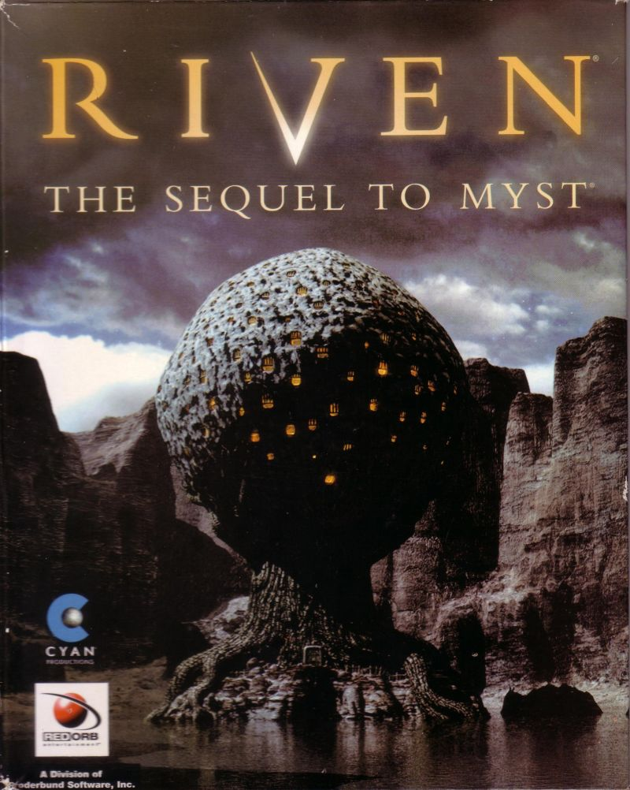
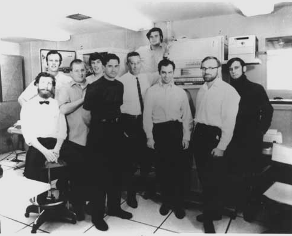
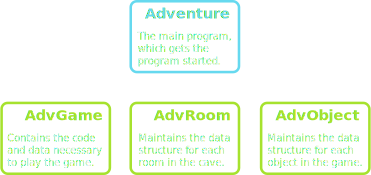

## Announcements
- Current Project is due ***today at 10:00pm***
	- Try not to ask for extension becuase the next project is a bit extensive
- Project 5 __Adventure__ guidelines will be posted during the class 
	- Due on ***Monday April 28th***  (i.e., 2 weeks)
	- You __Can__ work with a partner on this project. Both partners will earn the same grade. 
- No class on Wednesday this week! __Go to SSRD talks!__
- Polling: [here](https://www.polleverywhere.com/agbofred203)

<!-- - Graphics Contest result will be announced in class today
- I will dedicate next week to:
	- reviewing midterm exams 1 & 2
	- providing final exam practice and guidelines
- Final exam is 2 Mondays from now (exactly 2 weeks) -->

## Review Question {data-notes="Solution: {['A', 'B']: {1, 2}}"}
Three of the below expressions are valid; one is not. Which one would return an error?

:::{.poll}
#. `{'A': {'B': (1,2)}, 'C': 3}`
#. `{1, 2, (3,4), 5 }`
#. `[{'Alpha': 1, 'Omega': 26}, {2, 3, 4, 5}]`
#. `{['A', 'B']: {1, 2}}`
:::

## Introducing the Adventure Project
<!--- One of the first computer games I ever played was Riven: The Sequel to Myst

::::::cols
::::col
{width=75%}
::::

::::col
<video width='100%' controls src="../video/RivenOpening.webm"></video>
::::
::::::
-->

## Teaching the Adventure
- __Recall__, the TeachingMachine program can process and run _any_ data file that has the correct format
	- Does not need to technically be a series of educational questions
	- This is part of the strength of the data driven model: data is easy to change, programs less so
- Could make a sort of ***"Choose your own adventure"*** game out of it!

## Life among Wizards
- The history of the early internet has been told in several books. One relates the following story:

::::::cols

::::col

<figure class='r-stack'>
</img>
</img>
</figure>

::::

::::{.col style='font-size:.7em; flex-grow:2'}

> A small circle of friends at BBN had gotten hooked on Dungeons and Dragons, an elaborate fantasy role-playing game in which one player invents a setting and populates it with monsters and puzzles, and the other players then make their way through that setting. The game exists only in the minds of the players.
>
> Dave Walden got his introduction to the game one night when Eric Roberts, a student from a class he was teaching at Harvard, took him to a D&D session. Walden immediately rounded up a group of friends from the ARPANET team for continued sessions. Roberts created the Mirkwood Tales.
>
> One of the regulars was Will Crowther.

::::
::::::

## The Team
{class='stretch'}

## Willie Crowther's Adventure Game
<video class='stretch' data-autoplay loop src="../video/Adventure_Intro.webm"></video>

<!--## The Age of the Slow Machine-->
<!--<video class='stretch' data-autoplay loop src="../video/Adventure_SlowMachine.webm"></video>-->

## A Brief History of Adventure
- Eric Roberts begins the Mirkwood Tales in early 1975
- Will Crowther creates Adventure later that year
- Will moves to Xerox/PARC in 1976
- Stanford graduate student Don Woods released an expanded version of Adventure in early 1977
- Dave Lebling and others from MIT release the first version of Zork in 1977
	- Game later becomes the foundation of the computer game company Infocom
- Adventure is ported to wide variety of platforms by 1980
- Eric Roberts creates an expanded version in 1984 and uses it as the basis for his first Adventure Project/Contest at Wellesley

## Adventure Classes

## Milestone 1
- Adapt the code from the Teaching Machine application so that it uses the class and method names for Adventure
- Once you finish this milestone, you should be able to wander around a bit in the game

<video width='70%' data-autoplay loop src="../video/Adventure_M1.webm"></video>

## The `SmallRooms.txt` Data File
:::text
<pre>
OutsideBuilding
Outside building
You are standing at the end of a road before a small brick
building.  A small stream flows out of the building and
down a gully to the south.  A road runs up a small hill
to the west.
-----
WEST: EndOfRoad
UP: EndOfRoad
NORTH: InsideBuilding
IN: InsideBuilding
SOUTH: Valley
DOWN: Valley

EndOfRoad
End of road
You are at the end of a road at the top of a small hill.
You can see a small building in the valley to the east.
-----
EAST: OutsideBuilding
DOWN: OutsideBuilding
</pre>
:::

## Milestone 2
- Implement `set_visited` and `has_been_visited` to keep track of which rooms have been visited.
- Check this flag in the code that describes a room to know which description to show

<video width='70%' data-autoplay loop src="../video/Adventure_M2.webm"></video>

## Milestone 3
- Implement the `QUIT`, `HELP`, and `LOOK` commands
- Adds extra commands that let the player do more than just move

 
<video width='70%' data-autoplay loop src="../video/Adventure_M3.webm"></video>

## Milestone 4
- Implement the `AdvObject` class
- Implement the methods in the `AdvRoom` class that make it possible to keep track of the objects in a room
- In the `AdvGame` class, write the code to put each object in its initial room (ignoring the `"PLAYER"` room for now)
- Change the code for displaying a room so that it displays a list of the objects in the room as well

 
<video width='70%' data-autoplay loop src="../video/Adventure_M4.webm"></video>

## The `SmallObjects` data file
:::text
<pre>
KEYS
a set of keys
InsideBuilding

LAMP
a brightly shining brass lamp
BeneathGrate

ROD
a black rod with a rusty star
DebrisRoom

WATER
a bottle of water
PLAYER
</pre>
:::

## Milestone 5
- Implement the `TAKE`, `DROP`, and `INVENTORY` commands and any code you need to remember what the player is carrying

 
<video width='70%' data-autoplay loop src="../video/Adventure_M5.webm"></video>

## Milestone 6
- Implement synonym processing so that the player can use abbreviated forms of the directions and alternative names for the objects

 
<video width='70%' data-autoplay loop src="../video/Adventure_M6.webm"></video>

## The `SmallSynonyms.txt` data file
:::text
<pre>
N=NORTH
S=SOUTH
E=EAST
W=WEST
U=UP
D=DOWN
Q=QUIT
L=LOOK
I=INVENTORY
CATCH=TAKE
RELEASE=DROP
BOTTLE=WATER
</pre>
:::

## Milestone 7
- Implement _locked passages_, which are passages that require a particular object to use
- Making this change requires moving `get_next_room` from `AdvRoom` to `AdvGame` so that it can see the objects

 
<video width='70%' data-autoplay loop src="../video/Adventure_M7.webm"></video>

## The `SmallRooms.txt` data file
:::text
<pre>
OutsideGrate
Outside grate
You are in a 20-foot depression floored with bare dirt.
Set into the dirt is a strong steel grate mounted in
concrete.  A dry streambed leads into the depression from
the north.
-----
NORTH: SlitInRock
UP: SlitInRock
DOWN: BeneathGrate/KEYS
DOWN: MissingKeys

MissingKeys
-
The grate is locked and you don't have any keys.
-----
FORCED: OutsideGrate
</pre>
:::

## Milestone 8
- Implement _forced motion_, in which the player is forced to immediately move from a room to a new room without issuing a command
	- Indicated by the verb `FORCED`
- Implementation of forced motion needs to allow some forced passages to still be locked

 
<video width='70%' data-autoplay loop src="../video/Adventure_M8.webm"></video>
<!--
## Graphics Contest Grading
- 5 submissions from this class but 4 were eligible for grading
--><!--
|  #  |  Name of project |  Documentation | Workability | Aesthetic | Algorithmic sophistication | Final | 
|:---:|:----------------:|:--------------:|:-----------:|:---------:|:--------------------------:|:-----:|
|  1  | Alien spaceship  | 100            |  100        |  100      |  100                       |   400 | 
|  2  | Color Chaos      | 100            |  100        |  80       |  90                        |   370 | 
|  3  | Sudoku           |  70            |  100        |  60       |  100                       |   330 | 
|  4  | Winter Scene     |  100           |  100        |  100      |  20                        |   320 | 

-->

## Review Question
::::::cols
::::col
The data file to the right is read in and run using the TeachingMachine. What question do you end up at if you choose B 4 times in a row?

:::{.poll}
#. Q1
#. Q2
#. Q3
#. None of the above
:::

::::

::::col

:::{.text}
<pre style='font-size:0.5em;'>
Q1
What is the square root of 36?
	A) 0
	B) 6
	C) 10
-----
A: Q2
B: Q3
C: Q1

Q2
Are you happy?
	A) Yes
	B) No
	C) What kind of question is this?
-----
B: Q1
*: Q3

Q3
What is your age?
	A) Young
	B) Prime of my life
	C) Old
-----
A: Q1
*: Q2
</pre>
:::

::::
::::::
