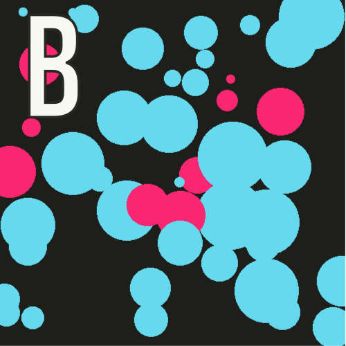
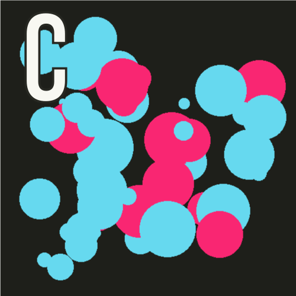

## Announcements
- Project Wordle is ***due today at 10 pm***.
- We are in Ch6 of the text this week, which is interactive graphics
- Remember the __1st midterm exam is this Friday__ in this hall
	- I will provide more information about the exam at the end of the class this morning
	- Practice question 1 is posted. My version of solution will be out after the class
	- one more practice question will follow with my version of solution. 
		- I hope the practice questions helps
	- Those with accommodations with **Testing Center** should contact them to make arrangement NOW!  and cc me in the email
- Polling continues [https://www.polleverywhere.com/agbofred203](https://www.polleverywhere.com/agbofred203)


<!--
## Mystery word
- Let us walk through this program and unravel what will be printed when the program complete execution.

```python
def mystery (x):
    def enigma (s, t):
        t -= 2
        return s [::6] + s[t]
    y = len(x)
    z = x[1 - y]
    z += enigma (x, y)
    z += enigma (x, y - 2)
    return z

if __name__ == '__main__':
    print(mystery ("abcdefgh"))


```

## Graphic function with default color
- You can return any type of variable from a function, including GObject graphical objects
- Can be useful to write simple functions that bundle together common tasks
    - For instance, to create a filled circle centered at some location:

```python
def make_filled_circ(x_cent, y_cent, radius, color='black'):
    circle = GOval(x_cent-radius, y_cent-radius, 2*radius, 2*radius)
    circle.set_color(color)
    circle.set_filled(True)
    return circle

```

## Summary of a Function Call 

:::{.incremental style='font-size:.8em'}
#. Evaluate the arguments in the context of the caller
#. Reserve space for the function in a new stack frame
#. Copy each positional argument to the corresponding parameter variable
#. Copy each keyword argument to the parameter with that name
#. For parameters with default values, if not already assigned, assign those values
#. Evaluate statements in the function body, using current stack frame to look up values of local variables
#. On encountering a `return`, compute the return value and substitute that value in place of the function call
#. Remove the stack frame
#. Return to the caller, continuing from just after the function call
:::


## Name Resolution and Scope
- When Python encounters a variable name in a program, it looks for where the variable was defined in an expanding search:
	1. **Local** - The local context is all the variables defined within the current function. This includes variables appearing as a parameter!
	2. **Enclosing** - The enclosing context consists of the names defined in a function enclosing the current one.
	3. **Global** - The global context consists of names defined outside of any function or imported into the current module.
	4. **Built-in** - The last place Python looks is in the names of any built-in functions, like `abs`, `str`, `print`, etc.
- The part of a program in which a name is defined in called its _scope_

## Scoping Example
```{.python data-line-numbers="" style='max-height:900px'}
def func1(x,y):
	return z + func2(x,y)

def func2(x,y):
	def func3(x):
		return (y + x) ** 2

	z = x - func3(y)
	return z - y

z = 1
print(func1(2,z))
```

## Local Variables
- In Python, assigning any value to a variable means that the variable is assumed to be _local_
	- This generally makes sense, as you would not want more specific functions overriding variables in other areas
- Can lead to issues though:
  ```{.python .badcode}
  def increment():
  	x = x + 1
  
  x = 0
  increment()
  ```
- The variable x in the fuction is local within that scope, and another ***global*** x with value 0 can cause issues -->


## Review Question! {data-notes="Answer is 27"}

::::::cols
::::col
What would be the printed value of z at the end of the code to the right?

:::{.poll}
#. 19
#. 25
#. 27
#. None of the above
:::

::::

::::col
```python
def f(x,y=0):
	z = (x + 3) ** 2
	return y + z

x = 1
z = x + f(y=x,x=2)
print(z)

```

::::
::::::
<!--
## Review Question
::::::cols
::::col
Which of the below images is the mostly likely output of the code to the right?

<div style="display: flex; flex-wrap: wrap; justify-content:center;">
<div></div>
<div></div>
<div></div>
<div></div>
</div>
::::

::::{.col style='flex-grow:1.2;'}
```{.python style='max-height:950px; font-size:.75em;'}
def make_circle(x,y,r):
    c = GOval(x-r, y-r, 2*r, 2*r)
    c.set_filled(True)
    if randint(1, 100) > 75:
        c.set_color("#F92672") #pink
    else:
        c.set_color("#66D9EF") #blue
    return c

gw = GWindow(500, 500)
for i in range(50):
    gw.add(make_circle(
            randint(50,450), 
            randint(50,450), 
            randint(5,50)
            )
          )
```
::::
::::::


## Understanding Check
::::cols
:::col
```python
def f(x,y):
	return x**2 + y

def g(z,n):
	x = 2
	for i in range(n):
		x += z(i,n)
	return x

print(g(f,2))
```
:::
:::col
What value will be printed to the screen when the code to the left is run?

:::::{.poll}
#. 2
#. 4
#. 7
#. This will give an error
:::::

:::
::::
## New Methods
:::{style='font-size:.9em'}
- A new method that acts on a `GWindow`:

 |
:---|:----
`get_element_at(x,y)`{.no-highlight} | Returns the frontmost object at (x,y) or `None`

- And more new methods that act on any `GObject`

 | 
:---|:---------
`set_location(x,y)`{.no-highlight} | Resets the location of the object to the specified point
`move(dx,dy)`{.no-highlight} | Moves the object `dx` and `dy` pixels from its current position
`move_polar(dr,theta)`{.no-highlight} | Moves the object `dr` pixel units in direction `theta`
`contains(x,y)`{.no-highlight} | Returns `True` if the object contains the specified point
`get_color()`{.no-highlight} | Returns the color currently assigned to the object

:::
-->
## The Python Event Model
- Graphical applications usually make it possible for the user to control the action of a program by using an input device such a mouse.
	- Programs supporting this type of control are called _interactive programs_.
- User actions such as clicking the mouse are called _events_.
- Programs that respond to events are said to be _event driven_.
- User input does not generally occur at predictable times. As the events are not controlled by the program, they are said to be _asynchronous_.
- In Python, you write a function that acts as a _listener_ for a particular event type. When the event happens, the listener is called.


## First Class Functions
- Functions in Python are treated as data values just like anything else!
	- We will need to take advantage of this to write listener functions.
- You can assign a function to a variable, pass it as a parameter, return it as a result, etc
- Functions treated like any other data value are called _first-class functions_
- To work with a function itself, you leave off the `()`. Including the parentheses is how you _call_ the function!


## A First Class Example
```{.python style='max-height:900px'}
import math

def evaluate_numbers(func):
	print(func)
	print(func(0))
	print(func(2))
	print(func(10))

A = evaluate_numbers

A(math.sqrt)
A(math.exp)
```


## Closures
::::cols
:::col
Consider the code to the right. 

::::: incremental
- Why does the line 12 not error?
    - Nothing named `a` should still exist when it is called!
- [Python Tutor](http://www.pythontutor.com/visualize.html#code=b%20%3D%201%0Adef%20f1%28a%29%3A%0A%20%20%20%20print%28a%29%0A%20%20%20%20print%28b%29%0A%20%20%20%20def%20f2%28%29%3A%0A%20%20%20%20%20%20%20%20c%20%3D%20a%20%2B%20b%0A%20%20%20%20%20%20%20%20return%20c%20*%203%0A%20%20%20%20return%20f2%20%0Af2%20%3D%20f1%2810%29%0Ac%20%3D%20f2%28%29&cumulative=false&curInstr=0&heapPrimitives=false&mode=display&origin=opt-frontend.js&py=3&rawInputLstJSON=%5B%5D&textReferences=false)
- `f2` must also keep track of any local variables!
- The local variables that are included as part of a function are called its _closure_
:::::

:::
:::col
```{.python style='max-height:800px' data-line-numbers=''}
b = 1
def f1(a):
    print(a)
	print(b)

	def f2():
		c = a + b
		return c * 3
	return f2 

f2 = f1(10) 
c = f2()
```
:::
::::


## Our First Interactive Example
:::{style='font-size:.9em'}
- Consider the simple program below, where we've imported the basics and some of our helper functions
  ```python
  def draw_dots():
      def click_action(event):
          c = create_filled_rect(
              event.get_x(), event.get_y(), 
              10,10, random_color())
          gw.add(c)
  
      gw = GWindow(500, 500)
      gw.add_event_listener("click", click_action)
  ```
- The `click_action` function specifies what to do when the mouse is clicked
	- Note that it has access to the `gw` variable since it is in the enclosing function and thus in the closure.
:::

## Registering a Listener
- The last line of our example function:

	```python
	gw.add_event_listener("click", click_action)
	```
	tells the graphics window (`gw`) to call the `click_action` function whenever a mouse "click" occurs within the window.
- When the user clicks the mouse, the graphics window, in essense, calls the client back to let them know that a click has occured. Thus, functions such as `click_action` are known as _callback functions_.
- The parameter `event` given to the callback function is a special data structure called a _mouse event_, which contains details about the specifics of the event that triggered the action.


## Mouse Events
- We have a fairly comprehensive list of mouse-events that we can trigger callbacks on:

| Name | Description
---:|:-----
`"click"` | The user clicks the mouse in the window
`"dblclick"` | The user double-clicks the mouse in the window
`"mousedown"` | The user presses the mouse button down
`"mouseup"` | The user releases the mouse button
`"mousemove"` | The user moves the mouse
`"drag"` | The user moves the mouse with the button down


## Event Details
- Certain actions can trigger more than one event
	- Clicking generates a "mousedown", "mouseup", and then "click" event, in that order
- Events trigger no action unless the window is listening for that event
	- If I drag my mouse in the `draw_dots()` function, you'll notice that nothing happens
- You can setup however many listeners you feel you need in order to make your program behave as desired
```python
gw.add_event_listener("click", click_action)
gw.add_event_listener("dblclk", dblclk_action)
```

## Line Drawing
- Say we wanted to write a simple program that allows the user to draw lines by clicking and dragging the mouse
- Using two event listeners would be useful:
	- "mousedown" could start drawing a zero-length line at the current mouse position (and add it to the window)
	- "drag" could update the end-point of that line
- The strategy would allow the user to have visual feedback as they drag around, helping them to position the line
	- Since the line stretches and contracts as you move the cursor around, the technique is commonly called _rubber-banding_

## Attempt #1
```{.python .badcode style="max-height:800px;"}
from pgl import GWindow, GLine

WIDTH = 500
HEIGHT = 500

def draw_lines():
	def mousedown_event(e):
		x = e.get_x()
		y = e.get_y()
		line = GLine(x,y,x,y)
		gw.add(line)

	def drag_action(e):
		line.set_end_point(e.get_x(), e.get_y())

	gw = GWindow(WIDTH, HEIGHT)
	line = None
	gw.add_event_listener("mousedown", mousedown_event)
	gw.add_event_listener("drag", drag_action)

if __name__ == '__main__':
	draw_lines()
```

## What Happened?
- Remember that if you define a variable in a function, that variable is assumed to be local!
	- Keeps you from accidentally overwriting variables you may not have meant to
	- It works against us here, since we WANT to override the original value
- We can't pass in the info as a parameter, since it is not part of the event information
- Python _does_ have a `nonlocal` keyword, which allows you to state that a specific variable is _not_ local, but it tends to just confuse students


## Midterm Exam #1 Instructions