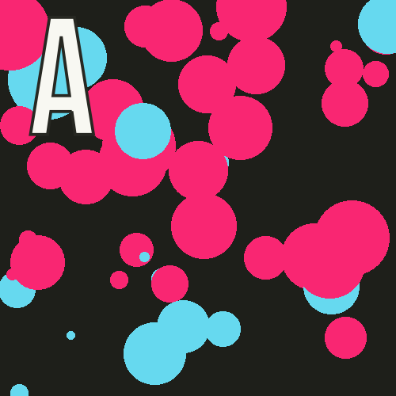

## Announcements
- Grading of midterm 1 is still ongoing
- We are in Ch6 of the text this week, which is interactive graphics
- Problem set #4 is being posted, __due next week Monday at 10 pm__
- Polling continues [here](https://www.polleverywhere.com/agbofred203)


<!-- 
## Review Question
::::::cols
::::col
Which of the below images is the mostly likely output of the code to the right?

<div style="display: flex; flex-wrap: wrap; justify-content:center;">
<div></div>
<div></div>
<div></div>
<div></div>
</div>
::::

::::{.col style='flex-grow:1.2;'}
```{.python style='max-height:950px; font-size:.75em;'}
def make_circle(x,y,r):
    c = GOval(x-r, y-r, 2*r, 2*r)
    c.set_filled(True)
    if randint(1, 100) > 75:
        c.set_color("#F92672") #pink
    else:
        c.set_color("#66D9EF") #blue
    return c

gw = GWindow(500, 500)
for i in range(50):
    gw.add(make_circle(
            randint(50,450), 
            randint(50,450), 
            randint(5,50)
            )
          )
```
::::
:::::: -->

## Bubble Event
```{.python style="max-height:800px;"}
from pgl import GWindow, GOval
import random
def do_buble():
    def make_circle(x,y,r):
        c = GOval(x-r, y-r, 2*r, 2*r)
        c.set_filled(True)
        if random.randint(1, 100) > 75:
            c.set_color("#F92672") #pink
        else:
            c.set_color("#66D9EF") #blue
        return c
    def make_buble_action(e):
        for i in range(50):
            gw.add(make_circle(
                    random.randint(50,450), 
                    random.randint(50,450), 
                    random.randint(5,50)
                    )
                )
    gw = GWindow(500, 500)
    gw.add_event_listener("dblclick",make_buble_action)
do_buble()

```

## Line Drawing
- Say we wanted to write a simple program that allows the user to draw lines by clicking and dragging the mouse
- Using two event listeners would be useful:
	- "mousedown" could start drawing a zero-length line at the current mouse position (and add it to the window)
	- "drag" could update the end-point of that line
- The strategy would allow the user to have visual feedback as they drag around, helping them to position the line
	- Since the line stretches and contracts as you move the cursor around, the technique is commonly called _rubber-banding_

## Attempt #1
```{.python .badcode style="max-height:800px;"}
from pgl import GWindow, GLine

WIDTH = 500
HEIGHT = 500

def draw_lines():
	def mousedown_event(e):
		x = e.get_x()
		y = e.get_y()
		line = GLine(x,y,x,y)
		gw.add(line)

	def drag_action(e):
		line.set_end_point(e.get_x(), e.get_y())

	gw = GWindow(WIDTH, HEIGHT)
	line = None
	gw.add_event_listener("mousedown", mousedown_event)
	gw.add_event_listener("drag", drag_action)

if __name__ == '__main__':
	draw_lines()
```

## What Happened?
- Remember that if you define a variable in a function, that variable is assumed to be local!
	- Keeps you from accidentally overwriting variables you may not have meant to
	- It works against us here, since we WANT to override the original value
- We can't pass in the info as a parameter, since it is not part of the event information
- Python _does_ have a `nonlocal` keyword, which allows you to state that a specific variable is _not_ local, but it tends to just confuse students


## In the Window
- A common tactic is to store all variables that need to be shared between two or more functions in a _state object_
- A state object is just a single object which serves as a storage space for a collection of values
- The object is created in such a location as to ensure it is in the closure of any functions that need to access its contents
- We will most often encounter this issue with graphics applications, where we actually already have an object that could serve as a state object
    - The `GWindow` object (mostly commonly named `gw`)!


## Storage and Retrieval
- Do you want to store a value in your state object?
    - We can store it as an _attribute_ to the `gw` object
    - Requires specifying the object name, followed by a dot and then your desired attribute name:
    
    ```python
    gw.my_attribute_name = some_cool_value
    ```
- Do you want to retrieve a value from your state object?
    - Just refer to the object and attribute name:
      
      ```python
      print(gw.my_attribute_name)
      ```


<!--
## Using `GState`
- The PGL library has a `GState` object type that we can import to use for sharing data between callback functions
- Create a variable, conventionally called `gs` immediately after creating the window:
```python
gw = GWindow(WIDTH, HEIGHT)
gs = GState()
```
- Value to be shared can be stored as part of the `gs` variable as an object attribute, which we will talk much more about in Ch 9
	- For now, shared variables should include `gs` and then a period before the variable name.
	- So `line` will become `gs.line` everywhere in our example
-->

## Fixed Line-Drawing
```{.python style="max-height:800px;"}
from pgl import GWindow, GLine

WIDTH = 500
HEIGHT = 500

def draw_lines():
	def mousedown_event(e):
		x = e.get_x()
		y = e.get_y()
		gw.line = GLine(x,y,x,y)
		gw.add(gw.line)

	def drag_action(e):
		gw.line.set_end_point(e.get_x(), e.get_y())

	gw = GWindow(WIDTH, HEIGHT)
	gw.line = None
	gw.add_event_listener("mousedown", mousedown_event)
	gw.add_event_listener("drag", drag_action)

if __name__ == '__main__':
	draw_lines()
```


## Timer Events
- Previously we looked at how our programs could react to mouse events
- Can also listen for _timer events_, which occur after a specific time interval
- You specify the listener for a timer event in the form of a callback function that is invoked at the end of the time interval
- Can add animation to our graphics by creating a timer whose callback makes small updates to the graphical objects in the window
	- If the time interval is short enough (usually sub 30 milliseconds), the animations will appear smooth to the human eye


## Timer Types
- PGL supports two kinds of timers:
	- A _one-shot timer_ invokes its callback **only once** after a specified delay
		- Created with

		  ```python
		  gw.set_timeout(function, delay)
		  ```
		  where `function` is the callback function and `delay` is the time interval in milliseconds
	- An _interval timer_ invokes its callback function **repeatedly** at regular intervals
		- Created with

			```python
			gw.set_interval(function, delay)
			```
- Both methods return a `GTimer` object that identifies the timer, and can be stopped by invoking the `.stop()` method on that timer


## Moving Square
```{.python style="max-height:900px"}
def moving_square():
    def step():
		square.move(dx, dy)
		if square.get_x() > 500:
			timer.stop()

	gw = GWindow(500, 200)
	dx = 1
	dy = 0
	square = create_filled_rect(12, 100, 24, 24, "red")
	gw.add(square)
	timer = gw.set_interval(step, 20)
```

## Growing Circles
{width=50%}


<!-- ## Mid-term test
- Test will take place during the **class time 0n Friday**.
- Those with accommodations should already contact the testing center and cc me.
- Practice questions are posted on this week's module
- Basic things to keep in mind:
	- The test contain detailed information to guide on what to expect. ***Read it carefully***
	- The exam is partially open, and thus you are free to utilize:
		- The text
		- Your notes
		- Class slides
		- Any past work you have done as part of sections, problem sets, or projects, provided it has been uploaded, and you access it through GitHub.

## Mid-term test 		
- You are allowed to use a computer for ease of typing and accessing the above resources, 
- You are **prohibited** from accessing and using any editor or terminal to run your code. 
	- Visual Studio Code or any similar editor should **never** be open on your computer during this exam. 
- Additionally, you are **prohibited** from accessing outside internet resources beyond the webpages described above.
- practice questions (2 at least) will be posted today and Wednesday
	- first practice questions would be sent in PDF
	- second practice questions would be on canvas -->

