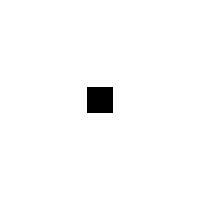
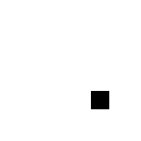
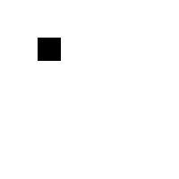
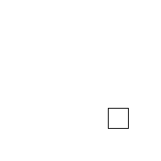
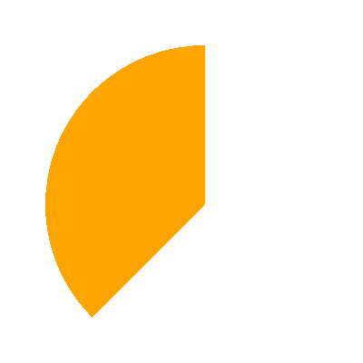
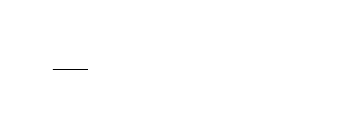

## Announcements
- Midterm #1 grading is posted:
    - On the average, less than half of the class did very well.
    - More effort is needed in program tracing/reading
    - Considering overall distribution of scores in the class, I might curve the grade across by certain percentage
- Section Leaders might submit the grade and feedback for Project 1 a bit late due to travels
- Problem set 4 will be due next week Monday
- Polling continues [here](https://www.polleverywhere.com/agbofred203)

<!--
## Quick General Poll
Comparatively speaking, how would you say you are doing in absorbing and keeping up with the material in this class?

:::{.poll}
#. "Probably better than the majority of my peers"
#. "Probably about the same as the majority of my peers"
#. "Probably worse than the majority of my peers"
#. "Probably way worse than the majority of my peers"
:::
-->

## Review Question! {data-notes="Answer: B, as step will run 50 times in 1 second"}
::::::cols
::::col
When the function to the right is run, what does the screen look like just after 1 second has passed?

::::::cols
::::col
{width=60%}

{width=60%}
::::

::::col
{width=60%}

{width=60%}

::::
::::::


::::

::::{.col style="flex-grow:1"}
```{.python style="max-height:900px; font-size:0.8em"}
def rev_q():
    def step():
        rect.move(1, 1)

    def once():
        rect.set_filled(True)

    gw = GWindow(200, 200)
    rect = GRect(0, 0, 25, 25)
    gw.add(rect)
    gw.set_interval(step, 20)
    gw.set_timeout(once, 1000)
```

::::
::::::
<!--
## Making those circles grow!
```{.python style='max-height:800px;' data-line-numbers=""}
from pgl import GWindow, GOval
import random

GWIDTH = 500
GHEIGHT = 400
N_CIRCLES = 20
MIN_RADIUS = 15
MAX_RADIUS = 100
DELTA_TIME = 10
DELTA_SIZE = 1

def random_color():
	color = "#"
	for i in range(6):
		color += random.choice("0123456789ABCDEF")
	return color

def create_filled_circle(x, y, r, color="black"):
	circ = Goval(x-r, y-r, 2*r, 2*r)
	circ.set_filled(True)
	circ.set_color(color)
	return circ

def growing_circles():
    def start_new_circle():
        r = random.uniform(MIN_RADIUS, MAX_RADIUS)
        x = random.uniform(r, GWIDTH - r)
        y = random.uniform(r, GHEIGHT - r)
        gw.circle = create_filled_circle(
							x, y, 
							0, random_color()
						)
        gw.desired_size = 2 * r
        gw.current_size = 0
        gw.circles_created += 1
        return gw.circle

    def step():
		# Grow a circle if needed
        if gw.current_size < gw.desired_size:
            gw.current_size += DELTA_SIZE
            x = gw.circle.get_x() - DELTA_SIZE / 2
            y = gw.circle.get_y() - DELTA_SIZE / 2
            gw.circle.set_bounds(
							x, y, 
							gw.current_size,
							gw.current_size
						)
		# or add a circle if you can
        elif gw.circles_created < N_CIRCLES:
            gw.add(start_new_circle())
		# or stop
        else:
            timer.stop()

    gw = GWindow(GWIDTH, GHEIGHT)
    gw.circles_created = 0
    gw.current_size = 0
    gw.desired_size = 0
    timer = gw.set_interval(step, DELTA_TIME)
```


## Simulation
- Our technique of piecing together many small movements to resemble motion is not limited to just making pretty animations!
- Physicists use similar techniques to break complex problems into simple pieces
	- "In this small time interval, the motion is simple"
	- Chain together many time intervals to construct the full motion
- There are many areas where this is the **only** way to solve a problem, as we can not write down equations to express the result otherwise!

## The Two Body Problem
```{.python style="max-height:800px;"}
from pgl import GWindow, GOval, GLine
from pgl_tools import create_filled_circle

def two_body():
    def step():
        # Compute forces and accelerations
        dx = planet1.get_x() - planet2.get_x()
        dy = planet1.get_y() - planet2.get_y()
        r3 = (dx ** 2 + dy ** 2) ** (3 / 2)
        ax = 1000 / r3 * dx
        ay = 1000 / r3 * dy

        # Update velocities
        gw.vx1 += -ax
        gw.vy1 += -ay
        gw.vx2 += ax
        gw.vy2 += ay

        # Augment history paths
        path1 = GLine(
            planet1.get_x() + 10,
            planet1.get_y() + 10,
            planet1.get_x() + 10 + gw.vx1,
            planet1.get_y() + 10 + gw.vy1,
        )
        path1.set_color("red")
        path1.set_line_width(3)

        path2 = GLine(
            planet2.get_x() + 10,
            planet2.get_y() + 10,
            planet2.get_x() + 10 + gw.vx2,
            planet2.get_y() + 10 + gw.vy2,
        )
        path2.set_color("cyan")
        path2.set_line_width(3)

        # Move planets
        planet1.move(gw.vx1, gw.vy1)
        planet2.move(gw.vx2, gw.vy2)

        gw.add(path1)
        gw.add(path2)

    gw = GWindow(600, 600)
    # Defining state variables
    gw.vx1, gw.vy1 = 0, 1
    gw.vx2, gw.vy2 = 0, -1

    planet1 = create_filled_circle(200, 200, 10, "red")
    planet2 = create_filled_circle(400, 200, 10, "cyan")

    gw.add(planet1)
    gw.add(planet2)

    gw.set_interval(step, 30)

if __name__ == '__main__':
    two_body()
```
-->
## Complex Graphics: GArcs

::::::cols
::::{.col style='font-size:.9em'}
<!--- Up until now, we haven't had a way to draw an arc!-->
- The `GArc` class represents an arc formed by taking a section of the perimeter of an oval.
- 3 things necessary:
	- The bounding rectangle geometry (upper left corner and width and height)
	- The _starting angle_ (in degrees)
	- The _sweep angle_ (in degrees) which is how far the arc extends
- Negative angles move in the clockwise direction
::::

::::col

\begin{tikzpicture}%%width=100%
\draw[MPurple] (-2,0) -- (2,0) (0,-2) -- (0,2);
\draw[dashed, MBlue] (-1.5,-1.5) rectangle (1.5, 1.5);
\draw[ultra thick, MRed, line cap=round] (45:1.5) arc (45:270:1.5);

\draw[MOrange, dashed] (0,0) -- (45:1.5);
\draw[MOrange, thick, -stealth] (0:1) arc (0:45:1) node[midway,right,font=\scriptsize\sf] {start};

\draw[MGreen, thick, -stealth] (45:0.5) arc (45:270:0.5) node[midway, left, font=\scriptsize\sf] {sweep};
\end{tikzpicture}

::::
::::::


## Fillable Arcs
- The `GArc` class is a `GFillableObject`, and so you can call `.set_filled()` on a `GArc` object
- Filled like a pie-shaped wedge formed between the center of the bounding box and the starting and end points of the arc

::::::cols
::::col
```python
def filled_arc():
    gw = GWindow(400, 400)
    arc = GArc(50, 50, 
			   350, 350, 
			   90, 135)
    arc.set_color("orange")
    arc.set_filled(True)
    gw.add(arc)
```
::::

::::col
{width=50%}
::::
::::::


<!-- Moving to a lab?
## Pacman Discussion
::::::cols
::::col
How to recreate the animation below? Each group has a question to answer on the right.
<br><br><br>

{width=100%}
::::
::::{.col style="flex-grow:1.5;"}


Group A
: How could we create the initial PacMan image?

Group B
: How can we move PacMan and bounce him off the edges?

Group C
: How can we make his mouth open and close?

Group D
: How can we make his mouth flip around when he bounces off the walls?


::::

::::::
-->


## The `GPolygon` class
- Used to represent graphical objects bounded by line segments
	- Polygons consist of several _vertices_ bounded by _edges_


- Location not fixed in upper left, but at some convenient reference point
- Often a convenient reference point is near the center of the object, but it doesn't need to be
- `GPolygon`s are `GFillableObject`s, so they can be filled


## Polygonal Construction
- The `GPolygon` function creates an **empty** polygon, to which you then can add vertexes
- Can create a vertex by calling `.add_vertex(x,y)` on the `GPolygon` object
	- `x` and `y` measured **relative to the reference point**
- Vertexes past the first can be defined in a few ways:
	- `.add_vertex(x,y)` adds another new vertex relative to the reference point
	- `.add_edge(dx,dy)` adds a new vertex relative to the preceding vertex
	- `.add_polar_edge(r, theta)` adds a new vertex relative to the previous using polar coordinates

## Triangle By Vertex
```{.python style='max-height:800px;'}
def triangle_by_vertex():
    def create_triangle(b, h):
        tri = GPolygon()
        tri.add_vertex(-b / 2, h / 2)
        tri.add_vertex(b / 2, h / 2)
        tri.add_vertex(0, -h / 2)
        return tri

    gw = GWindow(500, 500)
    triangle = create_triangle(200, 200)
    triangle.set_filled(True)
    triangle.set_color("red")
    gw.add(triangle, 250, 250)
```

## Triangle by Polar Edge
```{.python style='max-height:800px;'}
def triangle_by_polar_edge():
    def create_eq_triangle(side):
        tri = GPolygon()
        tri.add_vertex(0, 0)
        for i in range(0, 360, 120):
            tri.add_polar_edge(side, i)
        return tri

    gw = GWindow(500, 500)
    triangle = create_eq_triangle(100)
    triangle.set_filled(True)
    triangle.set_color("green")
    gw.add(triangle, 250, 250)
```

## Compound Objects
- The `GCompound` class makes it possible to combine several graphical objects so that the entire structure behaves as a single object
- Can be thought of as a combination of `GWindow` and `GObject`
	- You can add objects to it, but then you can also add it (and everything in it) to a window as a single unit
- Uses its own coordinate system relative to a reference point
	- When adding objects to the `GCompound`, you place them relative to the reference point
	- When adding the `GCompound` to a canvas, you set the location of the reference point


## And my Axe!
```{.python style='max-height:800px;'}
def my_axe():
    def create_axe():
        axe = GCompound()
        shaft = GRect(-15, 0, 30, 300)
        shaft.set_filled(True)
        shaft.set_color("brown")
        axe.add(shaft)

        blade = GPolygon()
        blade.add_vertex(0, 0)
        blade.add_vertex(200, -50)
        blade.add_vertex(200, 50)
        blade.set_filled(True)
        blade.set_color("gray")
        axe.add(blade, -80, 50)
        return axe

    gw = GWindow(500, 500)
    axe = create_axe()
    gw.add(axe, 250, 100)
```
