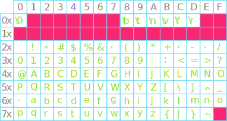
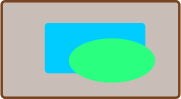

## Announcements
- Project 5 is due on ***Monday April 28th***. 
- Schedules for __finals__:
	- 10:20 – 11:20 M/W/F -> ***Friday 2nd May (8:00am – 11am)***
	- 12:00 – 1:00 M/W/F -> ***Wednesday 7th May (2:00pm - 5pm)***
    	- Venue is this same hall
		- More about the final on Monday next week
   	- For those concerned, arrange with testing center ASAP & cc me
    - If possible, arrange to take the exam within that same week
- Polling [here](https://www.polleverywhere.com/agbofred203)


## Review Question {data-notes="Solution: B"} 
- Consider this Bubble Sort algorithm implementation. What is it's asymptotic time complexity?
```python
def bubbleSort(arr):
    n = len(arr)
    for i in range(n):
        for j in range(0, n-i-1):
            if arr[j] > arr[j+1]:
                arr[j], arr[j+1] = arr[j+1], arr[j]
    return arr
test_array = [64, 34, 25, 12, 22, 11, 90]
sorted_array = bubbleSort(test_array)
print("Sorted array:", sorted_array)

```
:::{.hpoll}
#. O(n)
#. O(n<sup>2</sup>)
#. O(nlog<sub>2</sub>n)
#. O(n<sup>3</sup>)
:::

## CH-1: Data Types
- Generally, the data processed by computers can take on many forms
- A _data type_ defines the common characteristics of some data values that have a certain form or purpose.
	- Ex: a whole number or integer has certain characteristics common to all integers
- A data type has a _domain_, which is the set of all potential values that would belong to that type.
	- Ex: 0,1,2,3,4,5,6,7,...
- A data type has a _set of operations_ that define how those values can be manipulated
	- Ex: You can add two whole numbers (5+2)

## Example of question
- In the below expressions, what type of object would be the value of the expression? 
```python
7 / 3 >= 2 and not ord("A") > ord("Z") or 13 % 0 == 2
```
## Writing your own functions

- The general form of a function definition looks like:

	``` {.python}
	def name(parameter_list):
		#statements in function body
	```
	- `name` is your chosen name for the function
	- `parameter_list`{.no-highlight} is a comma-separated list of **variable names** that will hold each input value
- You can return or output a value from the function by including a return statement in the function body

	```python
	return expression
	```
	- `expression` is the value you want to return or output
	- If no `return` statement is included, Python will by default return `None`

## Built-in functions 
- All modern languages include a collection of pre-defined functions for convenience
- In Python, common build-in functions that operate on numbers include:

Function | Description
--- | ---
`abs(x)` | The absolute value of x
`max(x,y,...)` | The largest of all the arguments
`min(x,y,...)` | The smallest of all the arguments
`round(x)` | The value of x rounded to the nearest integer
`int(x)` | The value of x truncated to an integer
`float(x)` | The value of x as a decimal


- Other examples such as __print()__, __input()__ 

## CH-2: Boolean Expressions
- Python defines two types of operators that work with Boolean data: _relational operators_ and _logical operators_
- Relational operators compare values of other types and produce a `True`/`False` result:

	---- ----------------- - - - ---- --------------------
	`==` Equals                  `!=` Not equals
	 `<` Less than               `<=` Less than or equal too
	 `>` Greater than            `>=` Greater than or equal to
	---- ----------------- - - - ---- --------------------
- Be careful! `==` _compares_ two booleans. A single `=` _assigns_ a variable. 


## Boolean Operators Precedence 
- Logical operators act on Boolean pairings
	
	Operator | Description
	---|---
	`A and B` | True if both terms True, False otherwise
	`A or B` | True if _any_ term is True, False otherwise
	`not A` | True if A False, False if A True (opposite)
- Order of operations follows parentheses and then proceeds left to right
- Careful that `or` is still `True` if both options are `True` 
	- Similarly, careful with combining `not` with `and` and `or`
	- See the expressions below: `True ==1` and `False==0` 
```python
a,b,c= 2,True, False
print(a + b)   # >>>3
```

## Looping: The `range()` iterable
- Need an easy way to produce or describe a range of numeric values
- The built-in `range()` function handles this and produces the needed iterable object
- Takes 1, 2, or 3 arguments:
	- Start (default 0): where to start the sequence at
	- Stop (mandatory): the sequence ends just _below_ this value (does not include it!)
	- Step (default 1): what value the sequence counts by
<br><br>

:::{.block name='Warning!'}
Be careful, the `range` function will stop one step _before_ the final stop value.
:::


## For ranging examples
- Providing just a stop argument:

	```python
	for n in range(5):
		print(n)
	```
- Providing a start and stop:

	```python
	for n in range(1,11):
		print(n)
	```
- Providing a start, stop, and step:

	```python
	for n in range(10,0,-1):
		print(n)
	```
- 
<!--  --> 
  
## CH-3: Creating your own Algorithms
- Some useful hints to keep in mind when constructing your own algorithms:
	- Think about how you would solve the problem **without** a computer. You can't write code if you don't understand what you want the computer to do.
	- Computers are fast! Brute force methods are often very viable, or at least a good starting point.
	- Try to use tools and programming patterns you have already seen. It is often far easier to write programs by assembling pieces from code you have already seen than writing each program entirely from scratch.
		- Common patterns we have already seen include: looping over sequences, and using variables to track/control a loop
	- Recognize that the program you write is highly unlikely to work the first time
		- Errors can occasionally be in your algorithms
		- More often, early on, errors are in your translating of the algorithm into Python (the implementation)

## Example: Greatest Factor
- Suppose we wanted to write a function to compute the greatest factor of a provided number (not including the number itself)
- Algorithm:

  :::incremental
  - Brute force -- check all smaller values to see if factor
  - Start at top and work down, means first found is the greatest
  - Check if factor by seeing if remainder 0
  :::

```{.python .fragment style='margin:auto;'}
def greatest_factor(num):
	"""Finds the greatest factor of a number."""
	for i in range(num-1,0,-1):
		if num % i == 0:
			return i
```
## CH-7: Number Representation - Integers
- The number of symbols available to count with determines the _base_ of a number system
	- Decimal is base 10, as we have 10 symbols (0-9) to count with
		- Each new number counts for 10 times as much as the previous
	- Binary is base 2, as we only have 2 symbols (0 and 1) to count with
		- Each new number counts for twice as much as the previous
- Can always determine what number a representation corresponds to by adding up the individual contributions

<br>
\begin{tikzpicture}%%width=50%
[
every node/.style={draw, thick, MGreen, font=\Large}
]
\node(1) at (0,0) {0};
\node[right=0cm of 1](1) {0};
\node[right=0cm of 1](1) {1};
\node[right=0cm of 1](1) {0};
\node[right=0cm of 1](1) {1};
\node[right=0cm of 1](1) {0};
\node[right=0cm of 1](1) {1};
\node[right=0cm of 1](1) {0};
\end{tikzpicture}

## Specifying Bases
- So the binary number 00101010 is equivalent to the decimal number 42
- We distinguish by subsetting the bases:
	$$ 00101010_2 = 42_{10}$$
- **The number itself still is the same! All that changes is how we represent that number.**
	- Numbers do not have bases -- representations of numbers have bases

## Other Bases
- Binary is not a particularly compact representation to write out, so computer scientists will often use more compact representations as well
	- _Octal_ (base 8) uses the digits 0 to 7
	- _Hexadecimal_ (base 16) uses the digits 0 to 9 and then the letters A through F
<br>

::::::cols
::::col
\begin{tikzpicture}%%width=30%
[ boxed/.style={draw, very thick, MOrange, font=\Large, minimum size=1cm}]
\node[boxed] (1) at (0,0) {5};
\node[boxed, right=0cm of 1] (1) {2};
\node[MOrange,font=\scriptsize, above=1mm of 1.north west] {Octal};
\end{tikzpicture}
::::

::::col
\begin{tikzpicture}%%width=30%
[ boxed/.style={draw, very thick, MBlue, font=\Large, minimum size=1cm}]
\node[boxed] (1) at (0,0) {2};
\node[boxed, right=0cm of 1] (1) {A};
\node[MBlue,font=\scriptsize, above=1mm of 1.north west] {Hexadecimal};
\end{tikzpicture}

::::
::::::
<br>

:::incremental
- Why octal or hexadecimal over our trusty old decimal system?
	- Both are powers of 2, so it makes it easy to convert back to decimal
		- 1 octal digit = 3 binary digit, 1 hex digit = 4 binary digit
:::

## Strings
- A _string_ in Python represents textual data, in form of a sequence of individual characters
	- Domain: all possible sequences of characters
	- Operations: **Many!** We saw some of them
- Denoted by placing the desired sequence of characters between two quotation marks
	- `'I am a string'`
	- In Python, either single or double quotes can be used, but the ends must match
		- `"I am also a string!"`
		- `"I'm sad you've gone"`

## Sequences
- Both _strings_ and _lists_ are examples of a more general type called a _sequence_

- Sequences are _ordered_, so we can number off their elements, which we call their _index_
	- Counting in Python always starts with **0**, so the first element of the sequence has index 0
- Python defines operations that work on all sequences
	- Selecting an individual element out of a sequence
	- Concatenating two sequences together
	- Determing the number of elements in a sequence

## Selection
- You can select or "pluck out" just a single element from a sequence using square brackets `[` `]`
	- There are **no** commas between these square brackets, so they can't be confused with a list
	- The square brackets come after the sequence (or variable name representing a sequence)
	- Inside the square brackets, you place the index number of the element you want to select

:::::cols
::::{.col .fragment}
```python
>>> A = [2, 4, 6, 8]
>>> print(A[1])
4
```
::::
::::{.col .fragment}
```python
>>> B = "Spaghetti"
>>> print(B[6])
't'
```
::::
:::::

## Concatenation
- _Concatenation_ is the act of taking two separate objects and bringing them together to create a single object
- For sequences, concatenation takes the contents of one sequence and add them to the end of another sequence
- The `+` operator concatenates sequences
	- This is why it is important to keep track of your variable types! `+` will **add** two integers, but will **concatenate** two strings
  
  :::::cols
  ::::{.col .fragment}
  ```python
  >>> 'fish' + 'sticks'
  'fishsticks'
  ```
  ::::
  ::::{.col .fragment}
  ```python
  >>> A = [1, 'fish']
  >>> B = [2, 'fish']
  >>> print(A + B)
  [1, 'fish', 2, 'fish']
  ```
  ::::
  :::::

## Lengths
- The number of elements in a sequence is commonly called its _length_, and can be given by the `len( )` function
- Simply place the sequence you desire to know the length of between the parentheses:

  ```python
  >>> len("spaghetti")
  9
  ```
- You can have sequences of 0 length as well!
  
  ```python
  >>> A = ""
  >>> B = [ ]
  >>> print( len(A) + len(B) )
  0
  ```

## Representing Characters
- We use numeric encodings to represent character data inside the machine, where each character is assigned an integer value.
- Character codes are not very useful unless standardized though!
	- Competing encodings in the early years made it difficult to share data across machines
- First widely adopted character encoding was ASCII (American Standard Code for Information Interchange)


## ASCII

{width=100%}


## Meeting `chr` and `ord`
- Python includes two build in functions to simplify conversion between an integer and the corresponding Unicode character
- `chr` takes a base-10 integer and returns the corresponding Unicode character as a string
	- `chr(65)` gives `"A"` (capital A)
	- `chr(960)` gives `"π"` (Greek letter pi)
- `ord` goes the other direction, taking a single character string and returning the corresponding base-10 integer of that character in Unicode
	- `ord("B")` gives 66
	- `ord(" ")` gives 32
	- `ord("π")` gives 960

## String Slicing
- Often, you may want more than a single character
- Python allows you to specify a starting and an ending index through an operation known as _slicing_
- The syntax looks like:

	```python
	string_variable[start : limit]
	```
  where `start` is the first index to be included and everything up to but **not including** the `limit` is included
- `start` and `limit` are actually optional (but the `:` is not)
	- If `start` omitted, the slice will begin at the start of the string
	- If `limit` omitted, the slice will proceed to the end of the string


## String Dicing
- Can add a third component to the slice syntax, called a _stride_
  ```python
  string_variable[start : limit : stride]
  ```
- Specifies how large the steps are between each included index
- Can also make the stride negative to proceed backwards through a string
  ```python-repl
  >>> s = "spaghetti sauce"
  >>> s[4:8]
  hett
  >>> s[10:]
  sauce
  >>> s[:10:2]
  sahti
  ```

## Repeat again?
- We've already seen how we can use addition (`+`) in Python to concatenate strings
- In math, adding something many times is the same as multiplying

$$5+5+5+5+5+5 = 6 \times 5$$

- The same logic holds true for Python strings!
	- You multiply by a **integer**: the number of times you want the concatenation repeated
	- You can not multiply two strings together, Python will not understand what you are trying to do
```python
print("Betelguese, " * 3)
```

## Comparing Strings
- Python lets you use normal comparison operators to compare  strings

	```python
	string1 == string2
	```
	is true if `string1` and `string2` contain the same characters in the same order
- Comparisons involving greater than or less than are done similar to alphabetical ordering
	- Start at the beginning and compare a character. If they are the same, then compare the next character, etc
- All comparisons are done **according to their Unicode values**.
	- Called _lexicographic ordering_
	- `"cat" > "CAT"`


## Can't change a string's colors
- Strings are what we call _immutable_: they can not be modified in place by clients.
- You can "look" at different parts of the string, but you can not "change" those parts without making a whole new string
  ```{.python .badcode}
  s = "Cats!"
  s[0] = "R"   # THIS WILL ERROR!!
  ```
- You can of course create a new string object with the desired traits:
  ```python
  s = "R" + s[1:]
  ```
- This applies to all methods that act on strings as well: they return a **new** string, they do not modify the original


## Methods to find string patterns

:::{style='font-size:.9em'}

Method | Description
--- | -----
`string.find(pattern)` | Returns the first index of `pattern` in `string`, or `-1` if it does not appear
`string.find(pattern, k)` | Same as the one-argument version, but starts searching at index `k`
`string.rfind(pattern)` | Returns the last index of `pattern` is `string`, or `-1` if missing
`string.rfind(pattern, k)` | Same as the one-argument version, but searches backwards from index `k`
`string.startswith(prefix)` | Returns `True` if the string starts with `prefix`
`string.endswith(suffix)` | Returns `True` if the string ends with `suffix`

:::

## Transforming Methods
:::{style='font-size:.9em'}

Method | Description
---|----
`string.lower()` | Returns a copy of `string` with all letters converted to lowercase
`string.upper()` | Returns a copy of `string` with all letters converted to uppercase
`string.capitalize()` | Returns a copy of `string` with the first character capitalized and the rest lowercase
`string.strip()` | Returns a copy of `string` with whitespace and non-printing characters removed from both ends
`string.replace(old, new)` | Returns a copy of `string` with all instances of `old` replaced by `new`
:::

## Classifying Character Methods
:::{style='font-size:.9em'}

Method | Description
--- | -----
`char.isalpha()` | Returns `True` if `char` is a letter
`char.isdigit()` | Returns `True` if `char` is a digit
`char.isalnum()` | Returns `True` if `char` is letter or a digit
`char.islower()` | Returns `True` if `char` is a lowercase letter
`char.isupper()` | Returns `True` if `char` is an uppercase letter
`char.isspace()` | Returns `True` if `char` is a whitespace character (space, tab, or newline)
`char.isidentifier()` | Returns `True` if `char` is a legal Python identifier
:::

## CH-4: The Portable Graphics Library
- Built atop Tkinter
- The library (`pgl.py`) is available on the Canvas website [here](https://willamette.instructure.com/courses/3703/modules/items/160252)
	- Put it in the same folder as your code, and then you can import it
- Operates on the idea of a collage or cork-board



- Note that newer objects can obscure older objects. This layering arrangement is called the _stacking order_.
- The window (or felt-board/cork-board)
	- Created with the `GWindow` function
	- Takes two arguments: a width and a height in pixels

## Other Simple Objects
Functions to create simple geometric objects:
<br>

- Rectangles!
	- `GRect( x, y, width, height )`
	- Creates a rectangle whose upper left corner is at (x,y) of the specified size
- Circles/Ovals!
	- `GOval( x, y, width, height )`
	- Creates an oval that fits inside the rectangle with the same dimensions
	- Placement based on the upper left corner of that enclosing rectangle
- Lines!
	- `GLine( x1, y1, x2, y2 )`
	- Creates a line extending from (x1, y1) to (x2, y2)

## The `GObject` Hierarchy
- The types of graphical objects form a hierarchy:


- The `GObject` class represents the collection of all graphical objects
- The `GFillableObject` class represents those that have a fillable interior

## Interacting with the `GWindow`
- We've already shown creation:

```python
gw = GWindow(width, height)
```
- You have several more operations that you can apply to the `GWindow` object:

-------------------------------------- -------------------------------------
       `gw.add(object)`{.no-highlight} Adds an object to the window
 `gw.add(object, x, y)`{.no-highlight} Adds an object to the window after moving it to (x,y)
    `gw.remove(object)`{.no-highlight} Removes an object from the window
       `gw.get_width()`{.no-highlight} Returns the width of the graphics window in pixels
      `gw.get_height()`{.no-highlight} Returns the height of the graphics window in pixels
-------------------------------------- -------------------------------------


## Interacting with `GObject`s
- The following operations apply to all GObjects,  where `object`{.no-highlight} is the name of any specific instance.

---------------------------------------- ----------------------------
         `object.get_x()`{.no-highlight} Returns the x coordinate of this object
         `object.get_y()`{.no-highlight} Returns the y coordinate of this object
     `object.get_width()`{.no-highlight} Returns the width of this object
    `object.get_height()`{.no-highlight} Returns the height of this object
`object.set_color(color)`{.no-highlight} Sets the color of the object to the specified color
---------------------------------------- ----------------------------

- All coordinates and distances are measured in pixels


## Interacting with `GFillableObject`s
- Fillable GObjects have a smaller subset of commands that also apply to them.
- Initially the only fillable objects available to you are rectangles and ovals

--------------------------------------------- ----------------------------
     `object.set_filled(bool)`{.no-highlight} Sets the fill state of the object
`object.set_fill_color(color)`{.no-highlight} Sets the color to be used to fill the interior, otherwise same as the outer line
     `object.get_fill_color()`{.no-highlight} Gets the current color used to display the object interior
          `object.is_filled()`{.no-highlight} Returns True or False depending on whether the object is currently filled
--------------------------------------------- ----------------------------
