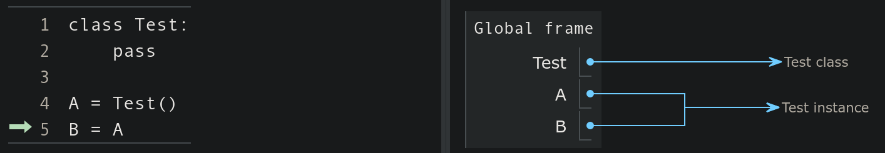

## Announcements
## Announcements
- Problem set 5 is due ***today at 10pm!***
- Withdrawal deadline for full-semester classes for this semester is __5:00 pm today
- Second midterm exam is ***this  Friday 21st***. 
	- During class period
	- __Totally opened__
		- Use VS code/any Python editor 
		- Can be taken from anywhere 
		- Last for ***an hour except for those with accommodations***
- Today' polls [here](https://www.polleverywhere.com/agbofred203)


## Review Question {data-notes="Solution: Error, can't add strings and tuples"}
::::::cols
::::col
What would be the output of the printed statement in the code to the right?

:::{.poll}
#. `(1, 'a', 'b')`{.no-highlight}
#. `(1, 'a')`{.no-highlight}
#. Error: can't add strings and tuples
#. Error: index out of range
:::

::::

::::col
```python
A = (1, 3, 5)
B = (2*A, ('a', ) )
C = B + ('b', 'c', 'd')
D = tuple()
for v in C[:3]:
	D += v[:1]
print(D)
```
::::
::::::


## Classes vs Objects
- When we introduced PGL early in the semester, we stressed the difference between types/classes and objects
	- A _class_ is the pattern or template that defines the structure and behavior of values with that particular type (the species of ant)
	- An _object_ is an individual value that belongs to a class (an individual ant)
		- A single class can be used to create any number of objects, each of which is said to be an _instance_ of that class
- PGL defines the `GRect` class.
	- In Breakout, you used that class to create **many** different rectangles, each of which was an instance of the `GRect` class


## Thinking about Objects


## An Object's Purpose
- Python uses the concepts of objects and classes to achieve at least three different goals:
	- __Aggregation__. Objects make it possible to represent collections of independent data as a single unit. Such collections are traditionally called _records_.
	- __Encapsulation__. Classes make it possible to store data together with the operations that manipulate that data.
		- In Python the data values are called _attributes_ and the operations are called _methods_
	- __Inheritance__. Class hierarchies make it possible for a class that shares some attributes and methods with a previously defined class to _inherit_ those definitions without rewriting them all
- We'll introduce many of these concepts in this course, but for more exposure and practice you'll want to take CS 152 (Data Structures)

## Classes as Templates
- Since they share the same attributes, it is natural to regard the two employees at Scrooge and Marley as two instances of the same class
- Could view the class as a template or empty form:
\begin{tikzpicture}%%width=40%
[record/.style={draw, minimum width=4cm, font=\tt},
lab/.style={font=\tt\small, anchor=south west},
]
\node[record, MBlue](n) at (0,0) {};
\node[lab, MBlue](nl) at (n.north west) {name};
\node[record, MBlue, below=.75cm of n](t){};
\node[lab, MBlue] at (t.north west) {title};
\node[record, MBlue, below=.75cm of t](s) {};
\node[lab, MBlue] at (s.north west) {salary};
\node[fit=(nl)(s), draw, very thick, MBlue] {};
\end{tikzpicture}

- Can help initially to just start with an empty template and then fill in the necessary fields

## Starting Empty
- Class definitions in Python start with a header line consisting of the keyword `class` and then the class name
- The body of the class will later contain definitions, but initially can just leave blank
	- Almost. Python does not allow an empty body, so need to include a docstring or use the `pass` keyword
  ```python
  class Employee:
  	"""This class is currently empty!"""
  ```
- Once the class is defined, you can create an object of this class type by calling the class as if it were a function:
  ```python
  clerk = Employee()
  ```

## More References
- Instances of custom Python classes are mutable
- Thus custom class instances are stored as _references_ to that information in memory
- Any code with access to this reference can manipulate the object
	- Can get or set the contents of any attributes or create new ones
<br><br>




## Selecting Object Attributes
- You can select an attribute from an object by writing out the object name, followed by a dot and then the attribute name.
	- As an example

		```python
		clerk.name
		```
		would select the `name` attribute for the `clerk` object
- Attributes are assignable, so

	```python
	clerk.salary *= 2
	```
	would double the clerk's current salary

- You can create a new attribute in Python by simply assigning a name and a value, just like you'd define a new variable

## Assigning Clerk Attributes
- We could, for instance, create a `clerk` in the following fashion:
  ```python
  def create_clerk():
  	clerk = Employee()
  	clerk.name = "Bob Cratchit"
  	clerk.title = "clerk"
  	clerk.salary = 15
	return clerk
  ```
- Note that none of these assigned attributes affect the `Employee` class in any way


## More Generally
- We could accomplish this more generally by passing arguments to our function:
  ```python
  def create_employee(name, title, salary):
	emp = Employee()
	emp.name = name
	emp.title = title
	emp.salary = salary
	return emp
  ```
- We could then use that as:
  ```python
  clerk = create_employee('Bob Cratchit', 'clerk', 15)
  boss = create_employee(
			'Ebeneezer Scrooge', 'founder', 1000
			)
  ```
