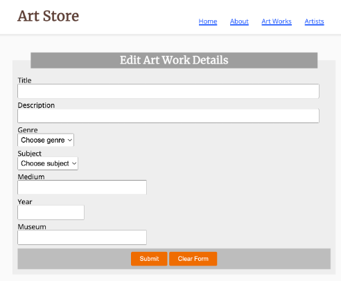

<!-- ## Announcements
- Welcome to the class today!
- A few persons are yet to indicate their mode of presentation.
- Next week Monday is the midterm presentation and review.
- Project concept note submission is due on Canvas on Wednesday 2/25 at 10 pm. -->

# `Vibe Coding`
[A term popularized by Andrej Karpathy ](https://karpathy.ai/)

## What is Vibe Coding?
:::{.sm style="font-size:20px;text-align:center;"}
 {width="45%"}

>  Attribution: most of the discussions are based of Neal W. writing on [Memberstack](https://www.memberstack.com/). 
:::

<!--  -->

## What is Vibe Coding?
:::{.sm style="font-size:33px;"}
- Key characteristics:
    - **Reduced manual coding:** AI handles most of the code.
    - **Acceptance of AI output:** Developers use AI-generated code, even if not fully understood.
    - **Iterative refinement:** Describe goals, test, and provide feedback to improve results.

> 25% of Y Combinator Winter 2025 startups had codebases 95% AI-generated.

[Learn more about Vibe Coding](https://www.memberstack.com/blog/what-is-vibe-coding)
:::
---

## Vibe Coding vs. Traditional Coding

### When to Use Vibe Coding

- **Rapid Prototyping & MVPs:** Build and test ideas quickly.
- **Personal/Side Projects:** Quick, disposable tools or experiments.
- **Learning & Exploration:** Try new tech or APIs with AI as your guide.
- **Internal Tools:** Fast utilities, dashboards, automations.

## Vibe Coding vs. Traditional Coding

### When Traditional Coding is Superior

- **High-stakes, complex projects**
    - Applications requiring deep customization, optimal performance, and sophisticated architecture
- **Performance-critical systems**
    - When every millisecond counts and resource optimization is paramount
- **Security-sensitive applications**
    - Projects handling sensitive data, financial transactions, or requiring strict compliance

# `9 Essential Vibe Coding Best Practices`

## 1. Start with Planning and Structure
:::{.sm style="font-size:35px;"}
 <!-- {width="25%"} -->

- Create a detailed project plan (markdown, paper, etc.)
- Break into manageable sections/user stories
- Define clear criteria and track progress
- Review plan with AI for feedback

> Without planning, AI can lead to scope creep and confusion.

:::

## 1. Start with Planning and Structure

 {width="85%"}

## 2. Effective Prompting and AI Guidance

 {width="85%"}

## 2. Effective Prompting and AI Guidance

- Use specific, context-rich prompts
- Define AI's expertise level
- Request plans and multiple options before coding
- Use AI as a Technology Consultant
- Set clear boundaries and constraints

> Poor prompting leads to unpredictable, low-quality code.

## 3. Use Version Control and Testing

- Save work frequently (Git/GitHub)
- Test after every AI change
- Use descriptive commit messages

> Skipping version control is risky—one bad AI suggestion can break everything.

## 4. Keep Your Tech Stack Simple

- Use mature, well-documented tech and frameworks (HTML, CSS, JS, React/Vue, Tailwind, PHP, ...)
- Avoid complex backends, Multiple databases, or Cutting-edge technologies with limited AI training data

> Simpler stacks reduce incompatibility and complexity.

## 5. Provide AI with Proper Context and Documentation

{width="95%"}

## 5. Provide AI with Proper Context and Documentation

- Share documentation, examples, and project rules
- Ask AI about its knowledge cutoffs
- Use a "context file" for consistency

> Insufficient context leads to AI making wrong assumptions.

## 6. Break Tasks into Small Pieces

{width="95%"}

## 6. Break Tasks into Small Pieces
- ***Example Task Breakdown***: Instead of "`Build a complete expense tracking application`" you should feed the following piecemeal to the AI.
    - "Create a basic HTML structure with navigation"
    - "Add a form for entering expense data with validation"
    - "Implement local storage to save and retrieve expenses"
    - "Create a list view showing saved expenses"

> Large tasks lead to overengineered, hard-to-debug code.

## 7. Embrace Iterative Testing and Refinement

{width="95%"}

## 7. Embrace Iterative Testing and Refinement
:::{.sm style="font-size:30px;"}
- Iterate: describe goal → generate code → test → give feedback → refine
- Test on multiple browsers/devices
- Give specific, actionable feedback

- ***Iteration Process - Refining Your Prompts***:

    - Describe the Goal: Clearly explain what you want to achieve
    - Generate Initial Code: Let AI create the first implementation
    - Test Thoroughly: Run the code and identify issues or improvements
    - Provide Specific Feedback: Tell AI exactly what needs to change
    - Refine: Ask for targeted improvements rather than complete rewrites

> Without iteration, subtle bugs and issues accumulate.
:::

## 8. Handle Errors Systematically and Effectively

{width="95%"}

## 8. Handle Errors Systematically and Effectively
- Paste error messages into AI for diagnosis
- Request multiple hypotheses
- Reset to last working state if stuck
- Add logging and try different AI models

> Without a system, debugging becomes frustrating and error-prone.

## 9. Prioritize Security

{width="95%"}

## 9. Prioritize Security
- Validate and sanitize inputs
- Never hardcode secrets
- Implement authentication/authorization
- Ask AI to review code for vulnerabilities
- Use HTTPS and proper error handling

> Security vulnerabilities in AI-generated code are common and dangerous.

## Conclusion

- Combine AI's speed with human judgment and best practices
- Use planning, prompting, testing, and security as guardrails
- Vibe coding is powerful—use it wisely!